# 深度学习的可解释性:来自物理学的提示

> 原文：<https://towardsdatascience.com/deep-learning-explainability-hints-from-physics-2f316dc07727?source=collection_archive---------7----------------------->

Image by [Ralf Kunze](https://pixabay.com/fr/users/realworkhard-23566/?utm_source=link-attribution&utm_medium=referral&utm_campaign=image&utm_content=199054) from [Pixabay](https://pixabay.com/fr/?utm_source=link-attribution&utm_medium=referral&utm_campaign=image&utm_content=199054).

## [内部 AI](https://medium.com/towards-data-science/inside-ai/home)

## 从物理学角度看深层神经网络

如今，人工智能几乎存在于我们生活的每一个部分。智能手机、社交媒体、推荐引擎、在线广告网络和导航工具是基于人工智能的应用的一些[例子](https://beebom.com/examples-of-artificial-intelligence/)，它们已经影响到我们的日常生活。在诸如[语音识别](https://en.wikipedia.org/wiki/Speech_recognition)、[自动驾驶](https://en.wikipedia.org/wiki/Self-driving_car)、[机器翻译](https://en.wikipedia.org/wiki/Machine_translation)、[视觉对象识别](https://en.wikipedia.org/wiki/Object_detection)等领域的深度学习已经系统地提高了艺术水平有一段时间了。

然而，使深度神经网络(DNN)如此强大的原因仅仅是[启发式地](https://www.technologyreview.com/s/604087/the-dark-secret-at-the-heart-of-ai/) [理解](https://arxiv.org/pdf/1608.08225.pdf\)，即我们仅从经验中知道，我们可以通过使用大型数据集并遵循特定的训练协议来实现出色的结果。最近，有人提出了一种可能的解释，这种解释基于一种基于物理学的概念框架，称为[重整化群](https://en.wikipedia.org/wiki/Renormalization) (RG)和一种被称为[受限玻尔兹曼机器](https://en.wikipedia.org/wiki/Restricted_Boltzmann_machine) (RBM)的神经网络之间的显著相似性。

## RG 和 RBMs 作为粗粒化过程

重正化是一种用于研究物理系统在微观部分信息不可用时的行为的技术。这是一种“粗粒化”的方法，它展示了当我们缩小并检查不同长度尺度的物体时，物理规律是如何变化的，“戴上模糊的眼镜”。

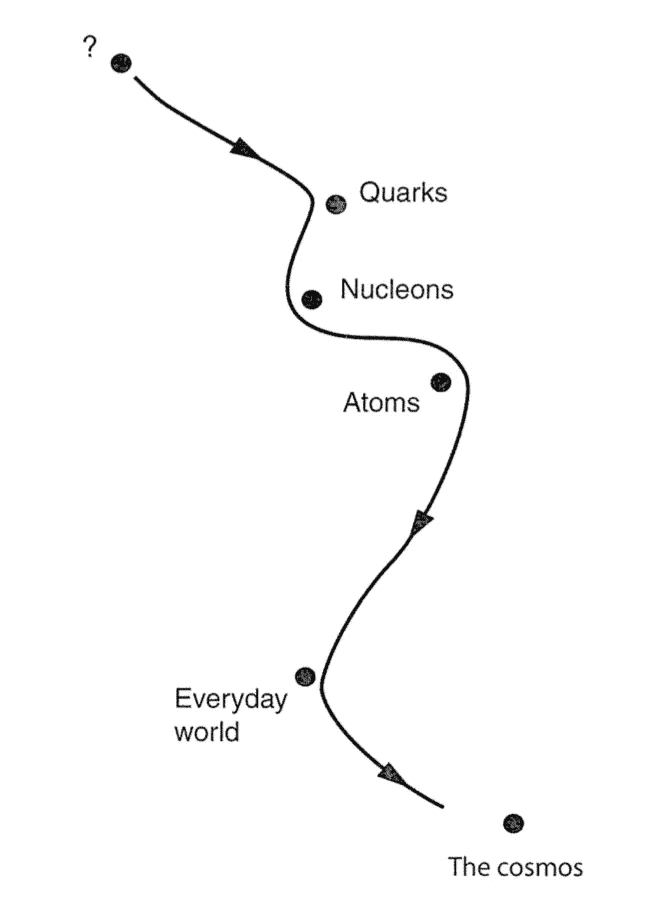

When we change the length scale with which we observe a physical system (when we “zoom in”), our theories “[navigate the space](https://books.google.com.br/books?id=oElbxFaL2dIC&printsec=frontcover&source=gbs_ge_summary_r&cad=0#v=onepage&q&f=false)” of all possible theories ([source](https://books.google.com.br/books?id=oElbxFaL2dIC&printsec=frontcover&source=gbs_ge_summary_r&cad=0#v=onepage&q&f=false)).

RG 理论的**巨大重要性**来自于它提供了一个强有力的框架，从本质上**解释了为什么物理学本身是可能的**。

To describe the motion of complex structures such as satellites, one does not need to take into account the motions of all its constituents. Picture by [3Dsculptor](https://www.shutterstock.com/g/3Dsculptor)/[Shutterstock.com](https://www.shutterstock.com).

> RG 理论提供了一个强有力的框架来解释为什么物理学本身是可能的。

例如，[要计算绕地球运行的卫星的轨道](https://books.google.com.br/books?id=oElbxFaL2dIC&printsec=frontcover&source=gbs_ge_summary_r&cad=0#v=onepage&q&f=false)，我们只需要运用牛顿运动定律。我们不需要考虑卫星微观成分极其复杂的行为来解释它的运动。我们在实践中所做的是对系统基本组件(在这种情况下是卫星)的详细行为进行某种“平均”。RG 理论解释了为什么这个过程如此有效。

此外，RG 理论似乎表明，我们目前关于物理世界的所有理论都只是一些未知的“[真实理论](https://books.google.com.br/books?id=oElbxFaL2dIC&printsec=frontcover&source=gbs_ge_summary_r&cad=0#v=onepage&q&f=false)的近似(用更专业的术语来说，这种真实理论“生活”在物理学家所谓的标度变换的[固定点](http://www.nyu.edu/classes/tuckerman/stat.mech/lectures/lecture_28/node1.html)附近)。

> RG 理论似乎表明，我们目前关于物理世界的所有理论都只是一些未知的“真实理论”的近似。

当被研究的系统处于[临界点](https://en.wikipedia.org/wiki/Critical_point_(thermodynamics))时，RG 工作良好，并表现出自相似性。一个自相似系统在它被观察的任何长度尺度下都是"[完全或近似地类似于它自身的一部分](https://en.wikipedia.org/wiki/Self-similarity)。显示自相似性的系统的例子有[分形](https://en.wikipedia.org/wiki/Fractal)。

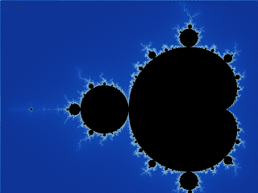

Wikipedia animation showing the Mandelbrot set and we zoom in ([source](https://en.wikipedia.org/wiki/Mandelbrot_set)).

处于临界点的系统在相距甚远的部分之间表现出很强的相关性。所有的子部分影响整个系统，系统的物理性质变得完全独立于其微观结构。

人工神经网络也可以被视为一个粗粒度的迭代过程。人工神经网络由几个层组成，如下图所示，早期的层仅从输入数据中学习较低级别的特征(如边缘和颜色)，而较深的层将这些较低级别的特征(由早期的特征提供)组合成较高级别的特征。用 [Geoffrey Hinton](https://en.wikipedia.org/wiki/Geoffrey_Hinton) 的[话来说，](https://www.quantamagazine.org/deep-learning-relies-on-renormalization-physicists-find-20141204/)[深度学习](https://en.wikipedia.org/wiki/Deep_learning)社区的领军人物之一:“你首先学习简单的特性，然后在此基础上学习更复杂的特性，这是分阶段进行的。”此外，与 RG 工艺的情况一样，更深的层[只保留被认为相关的特征，不强调不相关的特征](https://arxiv.org/abs/1410.3831)。

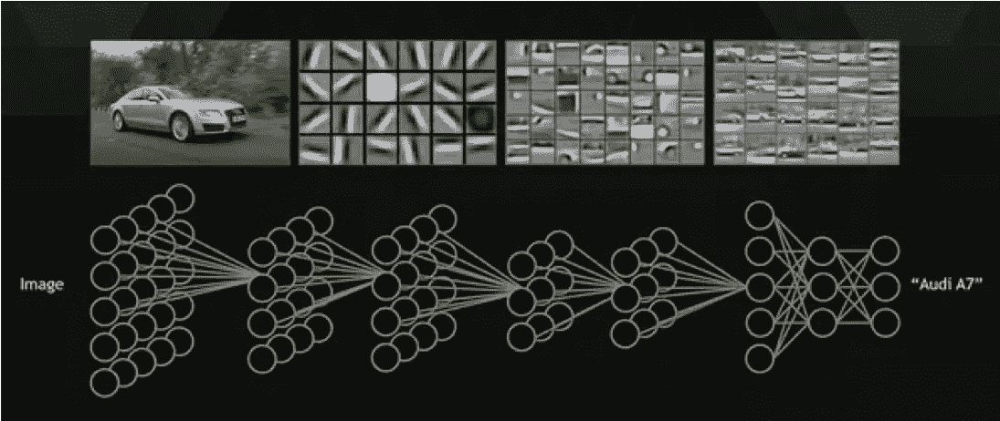

Convolutional neural network (CNN). The complexity level of the forms recognized by the CNN is higher in later layers ([source](http://web.eecs.umich.edu/~honglak/cacm2011-researchHighlights-convDBN.pdf)).

# 确切的联系

物理学和机器学习都处理具有许多成分的系统。物理学研究包含许多(相互作用的)物体的系统。机器学习研究包含大量维度的复杂数据。此外，类似于物理学中的 RG，神经网络设法对数据进行分类，例如动物的图片，而不管它们的组成部分(例如大小和颜色)。

在 2014 年发表的一篇[文章中，](https://arxiv.org/abs/1410.3831) [Pankaj Mehta](http://physics.bu.edu/~pankajm/) 和 [David Schwab](http://www.physics.northwestern.edu/people/personalpages/DavidSchwab.html) 两位物理学家基于重整化群理论对深度学习的性能进行了解释。他们表明 dnn 是如此强大的特征提取器，因为它们可以有效地“模仿”粗粒化过程，这是 RG 过程的特征。[用他们的话说](https://arxiv.org/abs/1410.3831)“DNN 架构[……]可以被视为一种迭代的粗粒度方案，其中神经网络的每个新的高级层从数据中学习越来越抽象的高级特征”。事实上，在他们的论文中，他们设法证明了在 RG 和[受限玻尔兹曼机器](https://en.wikipedia.org/wiki/Restricted_Boltzmann_machine) (RBM)之间确实有一个**精确的映射**，这是一个构成 DNN 积木的双层神经网络。

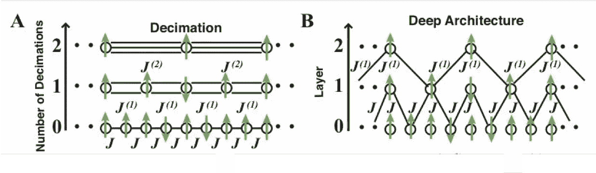

From the [2014 paper by Mehta and Schwab](https://arxiv.org/abs/1410.3831) where they introduced the map between RG and DNNs built by stacking RBMs. More details are provided in the remaining sections of the present article ([source](https://arxiv.org/abs/1410.3831)).

文献中还有许多其他工作将重正化和深度学习联系在一起，遵循不同的策略，具有不同的目标。尤其是基于[信息瓶颈方法](https://en.wikipedia.org/wiki/Information_bottleneck_method)的 [Naftali Tishby](http://naftali-tishby.strikingly.com/) 及其合作者的[工作](https://arxiv.org/abs/1503.02406)引人入胜。另外， [Mehta 和 Schwab](https://arxiv.org/abs/1410.3831) 只解释了一种神经网络的图谱，后续的工作已经[存在](https://arxiv.org/abs/1605.05775)。然而，为了简洁起见，我在这里将重点放在他们的[原始论文](https://arxiv.org/abs/1410.3831)上，因为他们的见解导致了该主题的大量相关后续工作。

在给出这种关系的一个相对详细的描述之前(参见[这篇文章](https://www.quantamagazine.org/deep-learning-relies-on-renormalization-physicists-find-20141204/)中一个很好的，虽然不太专业的描述),我将提供一些 RG 理论和 RBM 的一些事实。

# 重整化群理论:鸟瞰

如上所述，重正化包括将粗粒化技术应用于物理系统。RG 理论是一个通用的概念框架，因此人们需要方法来操作这些概念。变分重整化群(VRG)就是这样一种方案，由 [Kadanoff，Houghton 和 Yalabik](https://link.springer.com/article/10.1007/BF01011765) 于 1976 年提出。

为了阐述清楚，我选择集中在一个特定类型的系统来说明 RG 是如何工作的，即[量子自旋系统](https://www.springer.com/br/book/9783642132896)，而不是进行全面的概括。但在钻研数学机械之前，我要给出一个“[手挥动](https://en.wikipedia.org/wiki/Hand-waving)”的解释[自旋](https://en.wikipedia.org/wiki/Spin_(physics))在物理学中的意义。

## 物理学中的自旋概念

在物理学中，自旋可以被[定义为](https://en.wikipedia.org/wiki/Spin_(physics))“基本粒子、复合粒子和原子核所携带的角动量的一种内在形式。”尽管根据定义，自旋是一个没有经典对应物的**量子力学概念**，但具有自旋的粒子通常(尽管不正确)被描述为围绕自身轴旋转的小陀螺。自旋与[磁](https://en.wikipedia.org/wiki/Magnetism)现象密切相关。

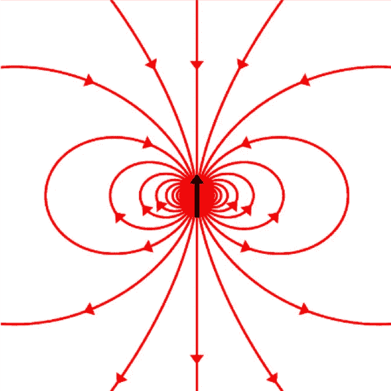

The particle spin (black arrow) and its associated magnetic field lines ([source](https://en.wikipedia.org/wiki/Spin_(physics))).

## 重整化的数学

让我们考虑一个由 N 个自旋组成的系统或系综。出于可视化的目的，假设它们可以放在一个网格上，如下图所示。

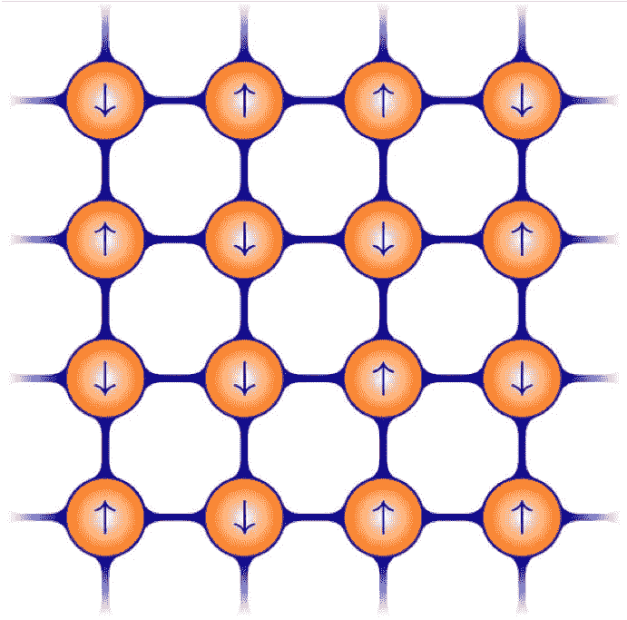

A 2-dimensional lattice of spins (represented by the little arrows). The spheres are charged atoms ([source](https://quantumoptics.at/en/research/2darrays.html)).

因为自旋可以向上或向下，所以它们与二进制变量相关联

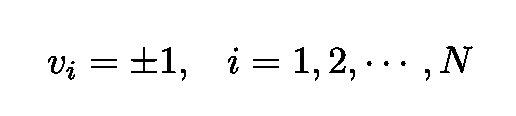

索引 *i* 可以用来标记晶格中自旋的位置。为了方便起见，我将用矢量 ***v.*** 来表示自旋的构型

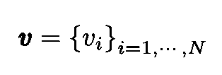

对于处于[热平衡](https://en.wikipedia.org/wiki/Thermal_equilibrium)的系统，与自旋组态 ***v*** 相关的概率分布具有以下形式:

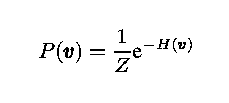

这就是无处不在的[玻尔兹曼分布](https://en.wikipedia.org/wiki/Boltzmann_distribution)(为方便起见，温度设为 1)。物体*H*(***v***)就是系统所谓的哈密顿量，其中[可以定义为](https://en.wikipedia.org/wiki/Hamiltonian_(quantum_mechanics))“系统中所有粒子的动能[和]势能之和对应的算符”。分母 *Z* 是一个归一化因子，称为[配分函数](https://en.wikipedia.org/wiki/Partition_function_(statistical_mechanics))

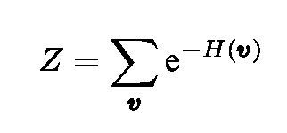

系统的哈密顿量可以表示为对应于自旋之间相互作用的项的总和:

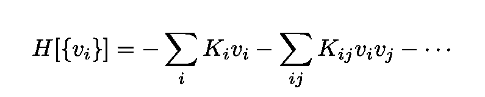

该组参数

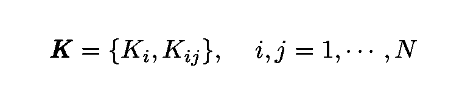

被称为[耦合常数](https://en.wikipedia.org/wiki/Coupling_constant)，它们决定了自旋之间(第二项)或自旋和外部磁场之间(第一项)的相互作用强度。

我们需要考虑的另一个重要的量是自由能。自由能是一个最初来自热力学的概念，在热力学中，自由能被定义为物理系统中可以被转换来做功的能量。数学上，在我们的情况下，它由下式给出:

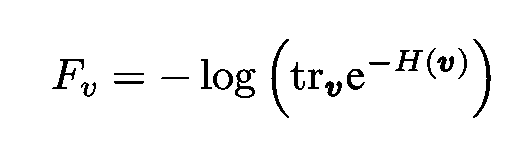

符号“tr”代表[迹](https://en.wikipedia.org/wiki/Trace_(linear_algebra))(来自线性代数)。在本上下文中，它表示可见自旋 ***v*** 的所有可能配置的总和。

在重正化过程的每一步，系统在小尺度下的行为被平均化。粗粒度系统的哈密顿量用新的耦合常数表示

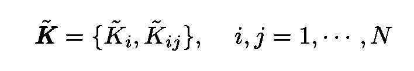

并且获得新的**粗粒度变量**。在我们的例子中，后者是块自旋 ***h*** 而新的哈密顿量是:

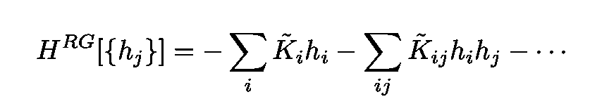

为了更好地理解什么是块自旋，考虑下面的二维晶格。每个箭头代表一次旋转。现在把晶格分成正方形块，每块包含 2×2 个自旋。块旋转是对应于这些块中的每一个的平均旋转。

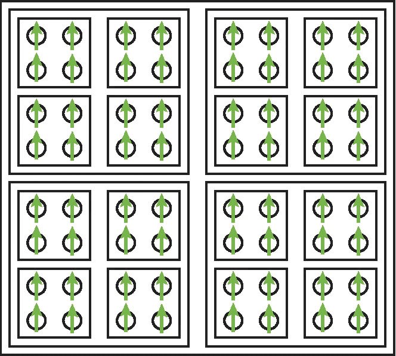

In block spin RG, the system is coarse-grained into new block variables describing the effective behavior of spin blocks ([source](https://arxiv.org/abs/1410.3831)).

注意，新的哈密顿量**与原来的哈密顿量**具有相同的结构，只是用自旋的*块的配置代替了物理自旋。*

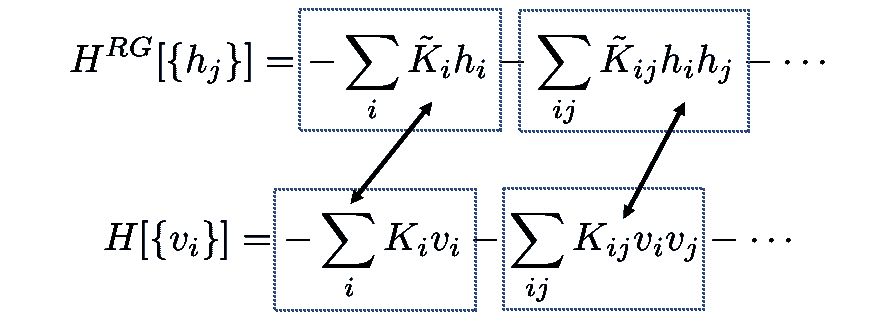

Both Hamiltonians have the same structure but with different variables and couplings.

换句话说，模型的形式不会改变，但是当我们缩小时，模型的参数会改变。通过系统地重复这些步骤，可以获得理论的完全重正化。在几次 RG 迭代之后，一些参数将被丢弃，一些将被保留。剩下的被称为[相关运营商](https://en.wikipedia.org/wiki/Renormalization_group#Relevant_and_irrelevant_operators_and_universality_classes)。

这些哈密顿量之间的联系是通过自由能(上面描述的几行)在 RG 变换后不变的要求获得的。

## 变分重整化群(VRG)

如上所述，为了实现 RG 映射，可以使用变分重整化群(VRG)方案。在这个方案中，映射是由一个操作符实现的

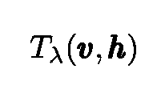

其中 *λ* 是一组参数。该算子对隐藏自旋和输入(可见)自旋之间的耦合进行编码，并满足以下关系:

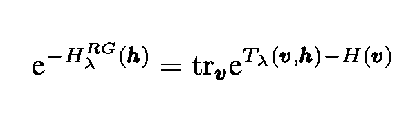

其定义了上面给出的新的哈密顿量。尽管在精确的 RG 变换中，粗粒度系统将具有与原始系统完全相同的自由能，即

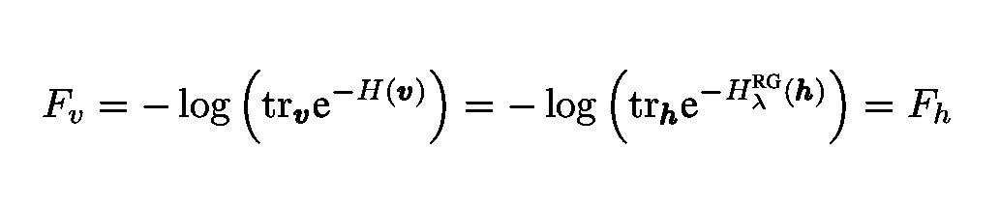

这相当于以下条件

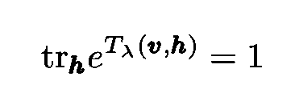

在实践中，这个条件不能完全满足，变分方案被用来寻找使自由能之间的差异最小化的 *λ*

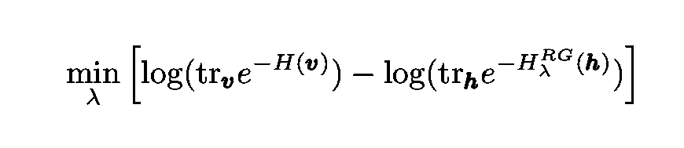

或者等效地，近似精确的 RG 变换。

# 成果管理制概述

我已经在[以前的文章](/neural-quantum-states-4793fdf67b13)中详细描述了受限玻尔兹曼机器的内部工作原理。这里我将提供一个更简洁的解释。

 [## 神经量子态

### 神经网络如何解决量子力学中高度复杂的问题

towardsdatascience.com](/neural-quantum-states-4793fdf67b13) 

受限玻尔兹曼机器(RBM)是生成式的，[基于能量的模型](http://www.iro.umontreal.ca/~bengioy/ift6266/H14/ftml-sec5.pdf)。用于[非线性无监督特征学习](https://scikit-learn.org/stable/modules/neural_networks_unsupervised.html')。它们最简单的版本只包含两层:

*   一层可见单元，用 ***v*** 表示
*   一个隐藏层，单位用 ***h*** 表示

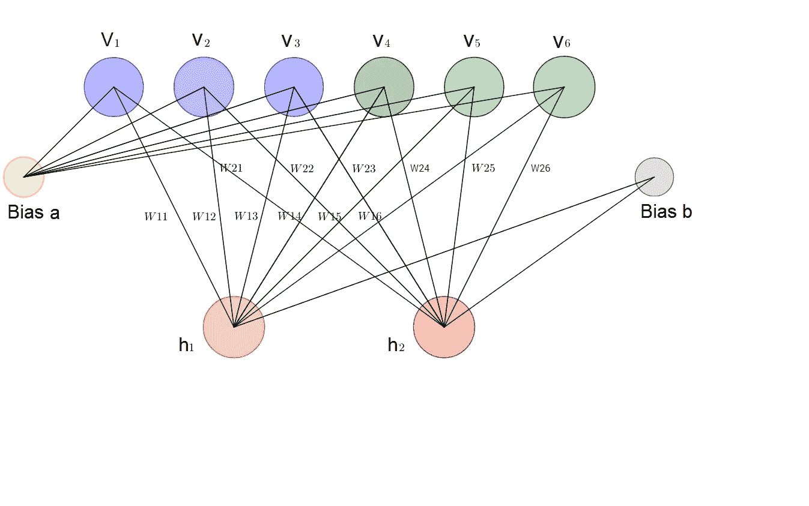

Illustration of a simple Restricted Boltzmann Machine ([source](/deep-learning-meets-physics-restricted-boltzmann-machines-part-i-6df5c4918c15)).

我将再次考虑一个二进制可见数据集 ***v*** 以及从一些概率分布中提取的 *n* 元素

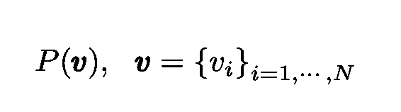

Eq. 9: Probability distribution of the input or visible data.

RBM 中的隐藏单元(由矢量 ***h*** 表示)耦合到可见单元，其相互作用能量由下式给出

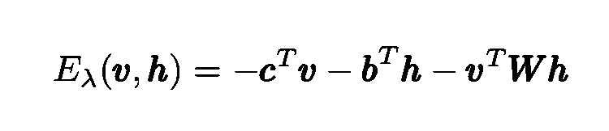

能量子指标 *λ* 代表*变分*参数的集合{ ***c*** ， ***b，W*** } ***。*** 其中前两个元素是矢量，第三个是矩阵。RBMs 的目标是输出一个依赖于 *λ-* 的概率分布，它尽可能接近输入数据*P*(***v***)的分布。

与配置( ***v*** ， ***h*** )和参数 *λ* 相关的概率是该能量泛函的函数:

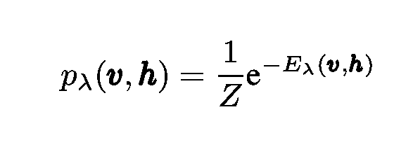

根据这个联合概率，通过对隐藏单元求和，可以容易地获得可见单元的变分(边缘化)分布。同样，隐藏单元的边缘化分布通过对可见单元求和来获得:

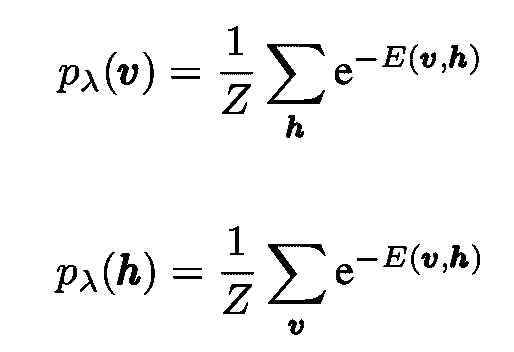

我们可以将 RBM 哈密顿量定义如下:

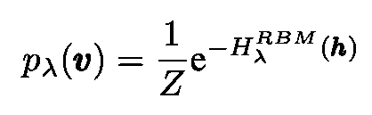

可以选择 *λ* 参数来优化所谓的 [Kullback-Leibler (KL)散度或相对熵](https://en.wikipedia.org/wiki/Kullback%E2%80%93Leibler_divergence)，其测量两个概率分布的不同程度。在目前的情况下，我们感兴趣的是真实数据分布和 RBM 产生的可见单位的变化分布之间的 KL 散度。更具体地说:

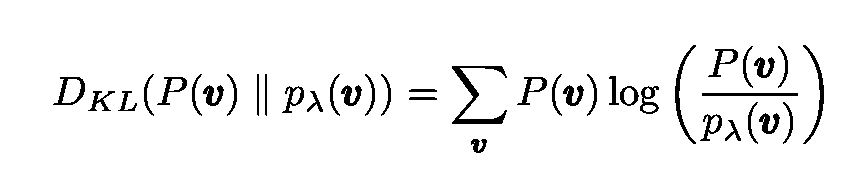

当两个分布相同时:

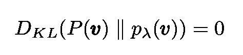

# 准确映射 RG 和 RBM

[Mehta 和 Schwab](https://arxiv.org/abs/1410.3831) 表明，为了建立 RG 和 RBMs 之间的精确映射，可以为变分算子选择以下表达式:

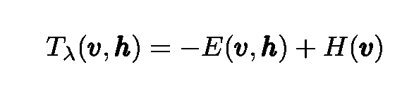

回想一下，哈密顿量 *H* ( ***v*** )包含编码在其中的输入数据的概率分布。通过这种变分算子的选择，可以[快速证明](https://arxiv.org/abs/1410.3831)隐藏层上的 RG 哈密顿量和 RBM 哈密顿量是相同的:

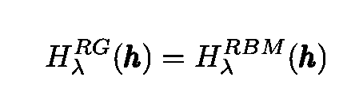

此外，当可以实现精确的 RG 变换时，真实的和变分的哈密顿量是相同的:

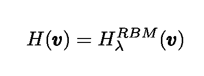

于是我们看到，具有自旋 ***v*** 和的重整化群的一步——块自旋*可以精确地映射成由可见单元 ***v*** 和隐藏单元*构成的双层 RBM。**

**随着我们堆叠越来越多的 RBM 层，我们实际上正在执行越来越多轮的 RG 转换。**

## **伊辛模型的应用**

**根据这个*原理，*我们得出结论，RBMs，一种无监督的深度学习算法，实现了变分 RG 过程。这是一个非凡的对应，[梅塔和施瓦布](https://arxiv.org/abs/1410.3831)通过在一个广为人知的[伊辛自旋模型](https://en.wikipedia.org/wiki/Ising_model)上实现堆叠 RBM 来展示他们的想法。他们将从伊辛模型中取样的自旋组态作为输入数据输入到 DNN 中。他们的结果表明，值得注意的是，DNNs 似乎正在执行(Kadanoff) 块自旋重正化。**

**用作者的话说，“令人惊讶的是，这种局部块自旋结构从训练过程中出现，表明 DNN 正在自组织实施块自旋重整化……我对我们感到震惊的是，你不用手动输入，它就会学习”。**

> **他们的结果表明，值得注意的是，DNNs 似乎正在执行块自旋重正化。**

**在他们的论文、**和**的下图[中，展示了 DNN 的建筑。在 **B** 中，学习参数 W 被绘制以显示隐藏和可见单元之间的交互。在 **D** 中，当我们沿着 DNN 层移动时，我们看到了块自旋的逐渐形成(图中的斑点)。在 **E** 中，显示了再现三个数据样本宏观结构的 RBM 重建。](https://arxiv.org/abs/1410.3831)**

**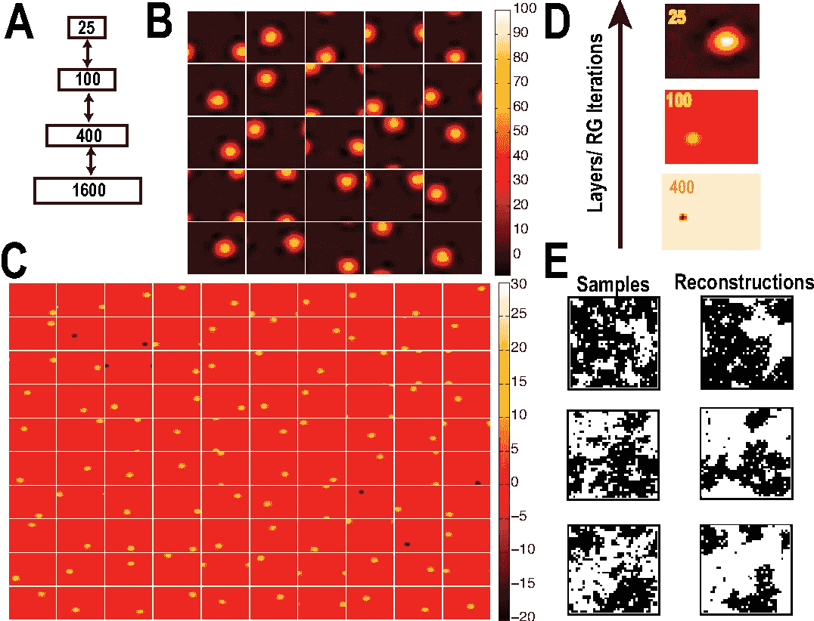**

**Deep neural networks applied to the 2D Ising model. See the main text for a detailed description of each of the figures ([source](https://arxiv.org/pdf/1410.3831.pdf)).**

# **结论和展望**

**2014 年 [Mehta 和 Schwab](https://arxiv.org/abs/1410.3831) 表明，一种受限玻尔兹曼机器(RBM)，一种神经网络，与重正化群有关，重正化群是一个最初来自物理学的概念。在本文中，我回顾了他们的部分分析。正如之前所认识到的，RG 和深度神经网络都具有显著的“哲学相似性”:都将复杂的系统提取为相关的部分。这种 RG-RBM 映射是这种相似性的一种形式化。**

**由于深度学习和生物学习过程有许多相似之处，因此假设我们的大脑也可能使用某种“类固醇上的重整化”来理解我们感知的现实并不算过分。**

**正如其中一位作者[建议](https://www.quantamagazine.org/deep-learning-relies-on-renormalization-physicists-find-20141204/)的那样，“也许对于如何从数据中挑选出相关的特征有一些普遍的逻辑，我会说这是一个暗示，也许有类似的东西存在。”**

> **假设我们的大脑也可能使用某种“类固醇上的重整化”来理解我们感知的现实，这并不是太夸张。**

**这方面的问题是，与 RG 工作良好的自相似系统(具有类似分形的行为)相比，自然界中的系统通常不是自相似的。正如神经科学家 Terrence Sejnowski 所指出的，突破这一限制的一种可能方式是，如果我们的大脑以某种方式在临界点运行，所有神经元都影响整个网络。但是那是另一篇文章的主题！**

**感谢您的阅读，再见！一如既往，我们随时欢迎建设性的批评和反馈！**

**我的 [Github](https://github.com/marcotav) 和个人网站 [www.marcotavora.me](https://marcotavora.me/) 有(希望)一些关于数据科学和物理学的其他有趣的东西。**