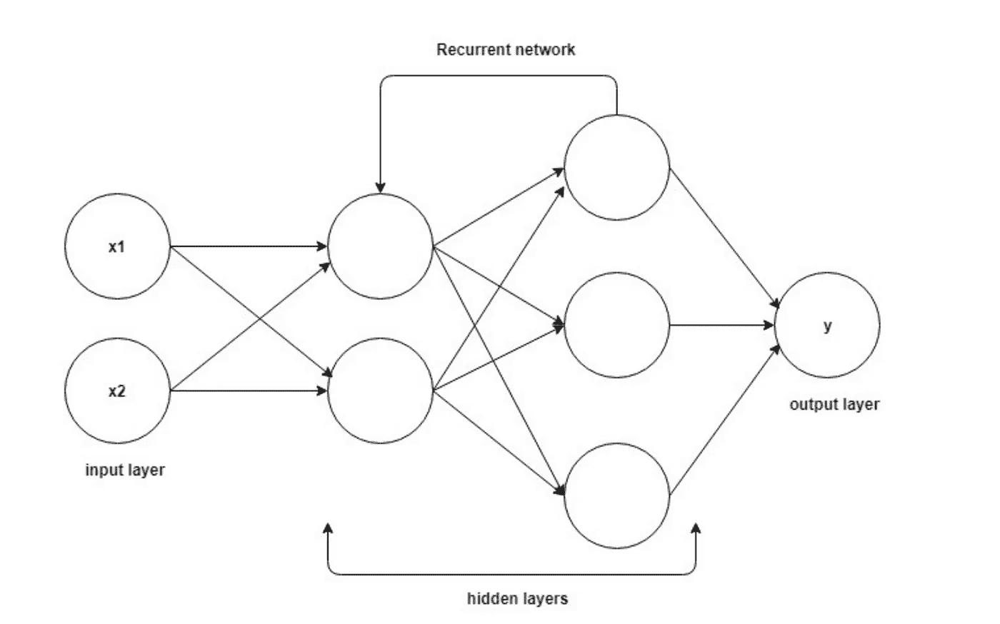
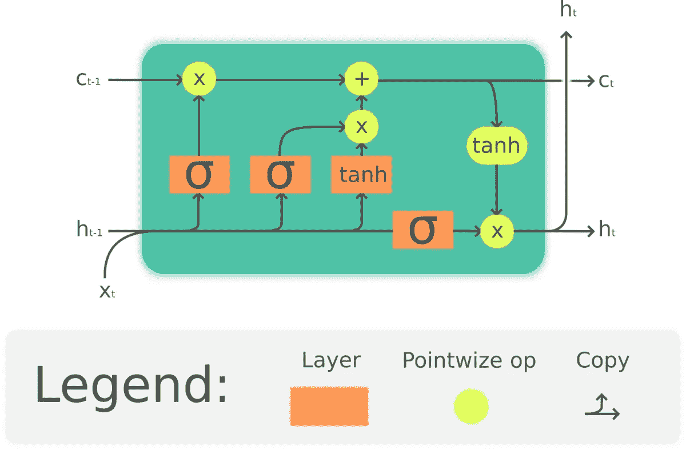
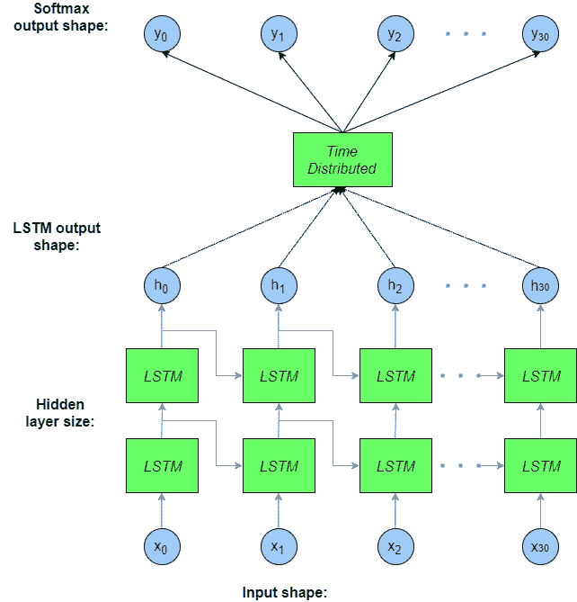
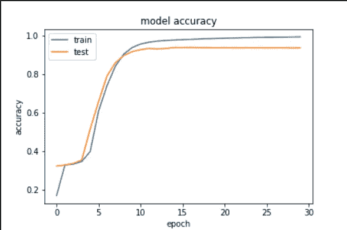
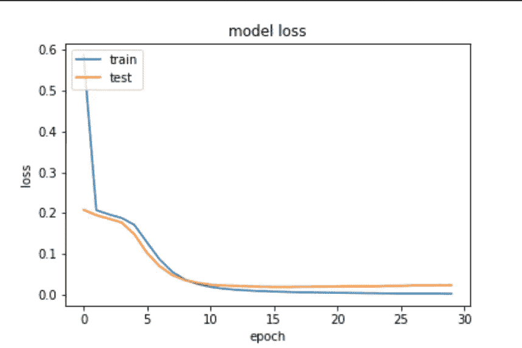

# 阿拉伯语词性标注的深度学习

> 原文：<https://towardsdatascience.com/deep-learning-for-arabic-part-of-speech-tagging-810be7278353?source=collection_archive---------21----------------------->

## 用 LSTM 和 Keras 构建 postagger 的一种简单方法


[Pixabay](https://pixabay.com/photos/books-students-library-university-1281581/)

# 介绍

在本帖中，我将解释 ***长短期记忆网络*** (又名。***【LSTM】***)以及如何将其用于*中解决 ***序列建模任务*** 同时建立基于 ***通用依存树库*** 的阿拉伯语词性标注器。本文是构建用于阿拉伯语自然语言处理的 python 包系列文章的一部分。你可以点击查看之前的帖子[。](https://adhaamehab.me/2019/02/01/gp-docs.html)*

# *问题*

## *语境无知*

*处理文本数据时，文本的上下文很重要，不能忽略。事实上，单词根据上下文有不同的意思。如果我们看看机器翻译的任务。上下文在这里很重要，而传统方法会忽略它。*

*如果我们要写一个翻译方法，把一个英语句子翻译成阿拉伯语再返回。天真的方法是从原句中提取每个单词，并将其转换为目标句。这种方法是可行的，但是它不考虑任何语法和上下文。*

## *词性标注*

*词性标注的任务是用标签来标记句子中的每个单词，该标签定义了该单词在该句子中的语法标注或词类消歧。*

*这里的问题是确定一个句子中一个单词的特定实例的 POS 标签。*

*这个标签可以用来解决 NLP 中更高级的问题，比如*

*   *语言理解，因为知道标签意味着帮助获得对文本的更好理解，因为不同的单词基于它们在句子中的位置可以具有不同的意思。*
*   *文本到语音和自动语音音调控制。*

*当标记单词时忽略上下文将仅导致接受的基线，因为该方法将使用与训练集中的单词相关联的最常见标签来标记每个单词。*

*因此，我们在这里试图完成的是克服这个问题，并找到一种不忽略数据背景的方法。*

# *深度学习方法*

## *序列建模和 RNNs*

*更具体地说，我们试图解决的问题被称为序列建模。我们试图对文本或声音等连续数据进行建模，并学习如何建模。*

*序列建模或序列到序列建模首先由 Google 翻译团队引入。*

*一般来说，神经网络是模式识别模型，它通过迭代数据集来学习和增强，并在识别数据中的模式方面变得更好。*

*递归神经网络被设计成通过使用反馈回路来防止神经网络衰退。正是这些反馈回路让 RNN 更擅长解决序列学习任务。*

*与前馈网络相比，RNNs 的工作方式更类似于人脑。因为人脑是坚持思考的。所以，当你读这篇文章的时候，每个单词都会影响你对文章的理解，你不会为了读一个新单词而抛弃以前的单词。*

## *递归神经网络的机理*

*rnn 通过使用存储单元来处理上下文的上下文。RNN 在步骤产生的输出受该步骤输出的影响。所以总的来说，RNN 有两个输入来源。一个是实际输入，两个是来自先前输入的上下文(内存)单元。*

*数学上，*

**前馈*网络由公式定义。*

*新状态是*权重矩阵*乘以*输入向量*的函数*

*该乘法的结果然后被传递给称为*激活函数*的方法。产生最终结果。*

*相同的过程应用于*循环网络*中，只需简单修改。*

*先前的状态首先乘以一个矩阵*

*名为 ***的隐藏状态到隐藏状态*** 矩阵然后添加到激活函数的输入端*

*所以不会只受之前所有隐藏状态的影响，这将确保记忆的持久性。*

**

*一个正常的 RNN 网络将包含一个*单神经网络层*，这使得它不能学习连接长信息。这个问题也被称为长期依赖。*

## *长短期记忆结构*

*rnn 很棒。他们在解决 NLP 中的许多任务时帮了大忙。然而，他们有长期依赖的问题。*

> *你可以在 Colah 的博客文章[中读到更多关于 LTD 的信息](http://colah.github.io/posts/2015-08-Understanding-LSTMs/)*

*LSTMs 通过比 RNN 记忆信息更长的时间来解决 LTD 问题。*

*RNN 和 LSTM 的唯一区别是 RNN 没有单一的神经网络层。我们在 LSTM 有 4 层以一种特殊的方式相互作用。*

## *循序渐进的 LSTM*

*LSTM 层由一系列单元状态组成，其中每个状态由 4 个主层和 3 个栅极组成。*

*现在让我们一步一步地走过一个 LSTM 细胞状态*

**

*Source: Google photos*

*一个*单元状态*的核心是连接和之间的水平线。这一行是数据流抛出*单元状态链*的地方。数据很容易以最小的线性运算或不变的方式流动，整个过程由*门*控制。*

**门*是控制数据变化的。他们用一个 *sigmoid 神经层*和一个*向量* *乘法运算*可选地改变数据。*

**Sigmoid layer*是一种生成浮点值的方法，该值控制有多少数据将通过 gate。表示*无*而$ 1 $表示*全部*。*

*第一步是 *sigmoid 层*决定从乘以的结果中传递什么信息。我们可以用数学方法表示这种操作，如下所示:*

*前一步确实决定了哪些数据将被遗忘，哪些数据将被保留。第二步，我们需要真正做到这一点。*

*我们将之前的结果乘以旧状态。*

*使用 *Tanh* 激活功能计算旧状态。用∑乘以∑将决定网络忘记了哪些信息，得到了哪些信息。数学上:*

*最后，我们需要决定的价值是什么*

*这些操作顺序应用于单元状态链。查看 LSTM 的数学模型可能会令人望而生畏，因此我们将转到应用部分，并使用 Keras 为阿拉伯语实现一个 LSTM 模型。*

# *构建阿拉伯语词性标记器*

*如我们所知，我们走过了序列建模的深度学习方法背后的想法。我们将应用它来构建一个阿拉伯语词性标记器。*

*对于英语来说，词性标注是一个已经解决的问题。像阿拉伯语这样的形态学语言。这个问题仍然存在，并且没有任何基于深度学习的开源阿拉伯语词性标注器。我们现在的目标是使用关于 LSTMs 的知识，并构建一个开源标记器。*

## *数据*

*缺少开源 tagger 是缺少阿拉伯语树库数据集的明显结果。*

*众所周知的 **Penn TreeBank** 成本约为**3000 美元**而**Quran tree bank**非常经典，在日常词汇上表现不佳。*

*[Universal Dependencies](https://universaldependencies.org/)(UD)是一个跨语言一致的语法注释框架，是一个开放的社区，有 200 多名贡献者，用 70 多种语言创建了 100 多个树库，其中包括**阿拉伯语***

*UD 提供了三种不同的树库。根据评论的建议，我们将使用 PADT 树木银行。*

## *数据预处理*

*UD 以 [CoNLL](http://universaldependencies.org/conll17/) 的形式提供数据集。我们可以使用 [pyconll](https://github.com/pyconll/pyconll) 将数据集从 conll 格式转换成 pandas 数据框架。*

*我们需要我们的数据按顺序组织。所以我们需要它的形状如下*

```
*[
    [(Word1, T1), (Word2, T2), ...., (WordN, TM)], # Sentence one
    [(Word1, T1), (Word2, T2), ...., (WordN, TM)], # Sentence two
    .
    .
    .
    [(Word1, T1), (Word2, T2), ...., (WordN, TM)] # Sentence M
]*
```

*现在数据集以一种有用的方式构建。我们希望将文本数据编码成数值。*

*这个过程就是所谓的 ***嵌入*** 。*

*这个想法很简单，我们给数据中的每个单词一个唯一的整数值。并用数据集中的这个值替换，这样我们就可以对数据进行逐点操作。*

*所以在实现这个模型之前，我们有两个单词嵌入`word2index`和`tag2index`。它们对单词和词性标签进行编码*

*因为我们正在做的任务要求输入和输出是固定的。应该转换数据，使得每个序列具有相同的长度。这种矢量化允许 LSTM 模型高效地执行批量矩阵运算。*

*在 Keras 中，我们可以通过在较短的句子中添加`0`来做到这一点，直到我们所有的句子都具有相同的长度。*

*问题是该模型将能够很容易地预测这些值。因此，即使模型没有正确预测任何标签，准确率也会非常高。*

*因此，我们需要编写自己的精确度指标，忽略那些 paddings 预测。*

# *LSTM 的 Keras 实施*

*在将数据转换成合适的形状之后。下一步是设计和实现实际的模型。*

## *模型*

**

*source: Google photos*

*模型结构*

*现在让我们彻底解释这个模型，*

*`InputLayer`是模型的第一层。如预处理部分所解释的，Keras 具有固定大小的层，所以我们用训练集中序列的最大长度来定义该层。*

*`Embedding`嵌入层要求对输入数据进行整数编码，使得每个单词都由一个唯一的整数表示。它用随机权重初始化，然后它将学习数据集中的每个单词*

*`LSTM`LSTM 编码器层是一个序列到序列层。它提供序列输出，而不是整数值。并且`return_sequences`强制该层为下一层进行前一序列输入。*

*`Bidirectional`双向包装器复制了 LSTM 层，因此我们有两个并排的层，将结果序列传输到输入序列。实际上，这种方法对长短期记忆有很大的影响。我为`Bidirectional`层使用了默认的合并模式【串联】。*

*`TimeDistributed Dense`层用于保持输入层和输出层的一一对应关系。它对 3D 张量的每个时间步长应用相同的密集(全连接)运算。*

*`Activation`激活`Dense`层的方法。我们可以将激活方法定义为`Dense`层中的一个参数，但第二个是更好的方法 [*](https://stackoverflow.com/a/40870126)*

*用 Keras 实现这种设计非常简单。*

*我们使用`categorical_cross_entropy`作为损失函数，因为我们有一个多对多的标记问题。*

*以及用于训练的`Adam`优化器(*自适应矩估计*)。*

*`ignore_class_accuracy`是忽略填充后重新计算精度的方法`<PAD>`*

# *结果*

*训练步骤在 2017 年的 MacBook Pro 上进行，耗时约 40 分钟，配有 2.5 GHz CPU 和 8 GB Ram。*

*在我们训练我们的模型之后，我们评估并可视化训练过程。*

**

*模型损失*

**

*模型已经到达`0.916`并在`30 epochs`后开始收敛*

*在评估中，我们使用了`stochastic gradient descnet`，因为它在评估 [*](https://shaoanlu.wordpress.com/2017/05/29/sgd-all-which-one-is-the-best-optimizer-dogs-vs-cats-toy-experiment/) 中比`Adam`表现得更好*

*尽管与斯坦福 CoreNLP 模型相比，结果看起来不错，但它还可以改进。但作为第一次尝试，还不错。*

*原帖放在[这里](https://adhaamehab.me/2019/03/01/lstm-for-pos-tagging.html)*

# *参考*

*   *[https://Shao anlu . WordPress . com/2017/05/29/SGD-all-the-one-is-the-best-optimizer-dogs-vs-cats-toy-experiment/](https://shaoanlu.wordpress.com/2017/05/29/sgd-all-which-one-is-the-best-optimizer-dogs-vs-cats-toy-experiment/)*
*   *[https://machine learning mastery . com/data-preparation-variable-length-input-sequences-sequence-prediction/](https://machinelearningmastery.com/data-preparation-variable-length-input-sequences-sequence-prediction/)*
*   *http://colah.github.io/posts/2015-08-Understanding-LSTMs/*
*   *【https://skymind.ai/wiki/lstm *
*   *[https://kevinzakka.github.io/2017/07/20/rnn/](https://kevinzakka.github.io/2017/07/20/rnn/)*
*   *[https://developer.nvidia.com/discover/lstm](https://developer.nvidia.com/discover/lstm)*
*   *[https://iamtrask.github.io/2015/11/15/anyone-can-code-lstm/](https://iamtrask.github.io/2015/11/15/anyone-can-code-lstm/)*
*   *[http://karpathy.github.io/2015/05/21/rnn-effectiveness/](http://karpathy.github.io/2015/05/21/rnn-effectiveness/)*
*   *[https://universaldependencies.org/](https://universaldependencies.org/)*