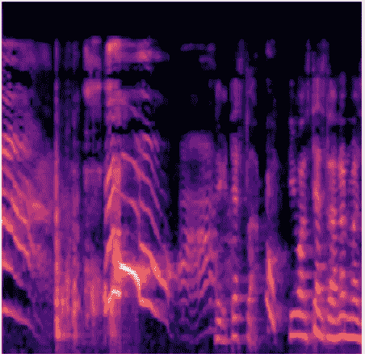
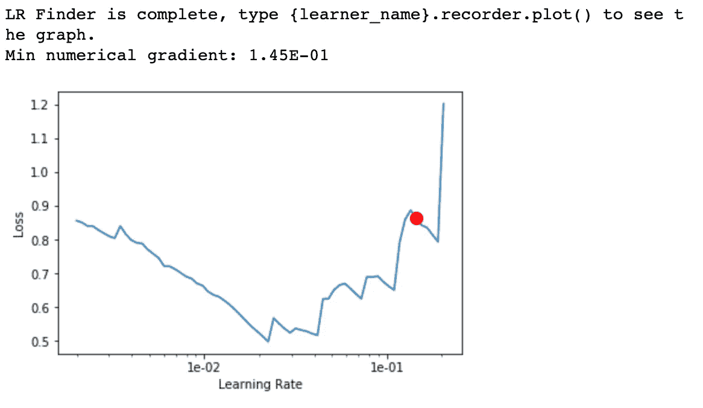
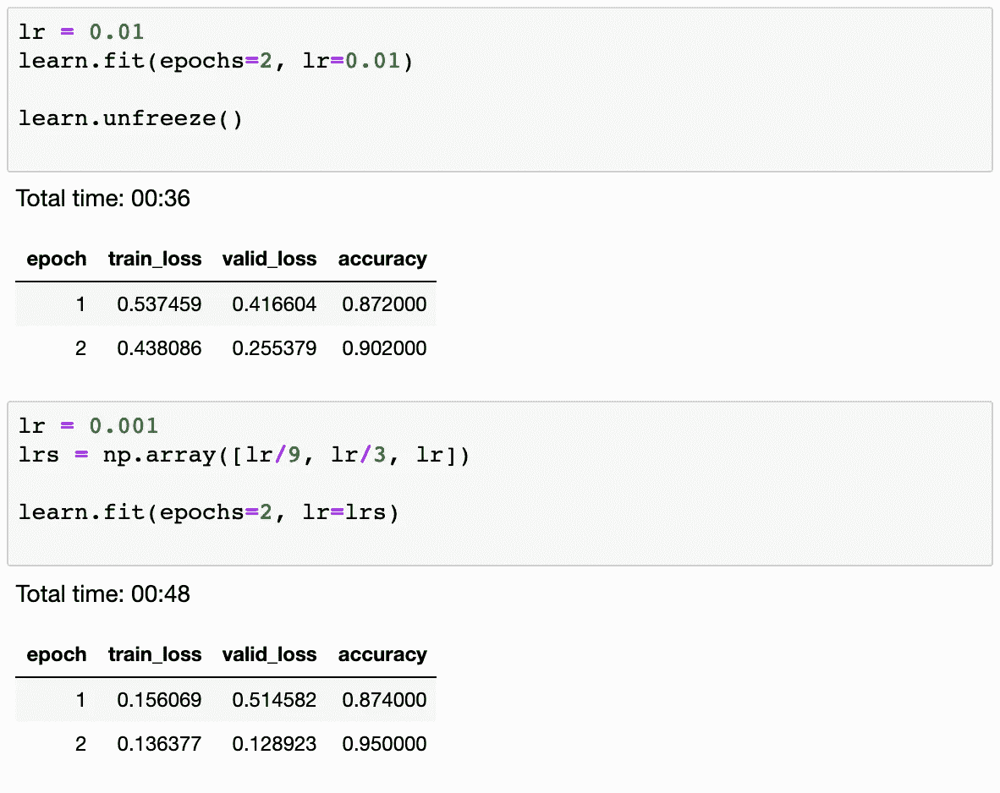

# 用于对婴儿啼哭的音频进行分类的深度学习

> 原文：<https://towardsdatascience.com/deep-learning-for-classifying-audio-of-babies-crying-9a29e057f7ca?source=collection_archive---------8----------------------->

(寻求项目合作)

在这篇文章中，我将谈论使用深度学习来帮助将音频分类。作为一个例子，我将尝试对婴儿的哭声进行分类。这不仅是一个使用 CNN 进行音频分类的有趣练习，它还可以实际用于构建一个监视器来通知父母他们的宝宝正在哭。

# 构建数据集

构建分类器的第一步是获得可用的数据集。我找不到现成的数据集来构建模型。所以我决定用我从网上收集的数据建一个。我使用了[捐赠哭泣语料库](https://github.com/gveres/donateacry-corpus)来收集婴儿哭声的积极样本。数据集有大约 1000 个 7 秒长的声音片段。语料库没有否定样本，所以我使用了[环境声音分类(ESC50)](https://github.com/karoldvl/ESC-50) 数据集，它有大约 2000 个 5 秒长的样本。ECS50 数据集还包含婴儿啼哭的声音，因此请确保从阴性样本中移除这些片段。将数据集分成测试和验证(90:10)两部分，放在各自的文件夹中。

# 建立模型

音频片段的采样速率为 16000 Hz，时间长度约为 7 秒。这意味着每秒大约有 16000*7 个数字代表音频数据。我们对 2048 个样本窗口进行快速傅立叶变换(FFT ),将其滑动 512 个样本，并重复 7 秒剪辑的过程。由此产生的表示可以显示为 2D 图像，并被称为短时傅立叶变换(STFT)。由于人类是以对数标度感知声音的，我们将把 STFT 转换成[梅尔标度](https://en.wikipedia.org/wiki/Mel_scale)。librosa 库让我们加载一个音频文件并将其转换成 melspectrogram

婴儿啼哭的 melspectrogram 看起来像下面的图像

我在用 FastAI v1 库训练神经网络。为了构建训练模型所需的音频样本的频谱图，我们将使用 Jason Hartquist 为 fastai v1 构建的奇妙的[音频加载器模块。](https://github.com/sevenfx/fastai_audio)

Fastai 的循环学习率查找器针对一小批训练样本运行模型，以找到一个好的学习率。

随着学习速率增加到 10e-2，您可以看到模型损失减少。然而，对于较高的学习率，损失开始增加。因此，我们选择 10e-2 作为训练模型的学习速率。

经过几个时期的模型训练后，我们看到验证集的准确率为 95%

# 通过实时音频样本进行预测

现在我们有了一个非常好的模型，为了在实际应用中使用它，我们需要能够实时预测音频流。

我们使用 [pyaudio](https://people.csail.mit.edu/hubert/pyaudio/docs/) 库从设备麦克风读取音频样本，然后将音频数据转换为 numpy 数组，并将其提供给模型。

上面的代码从麦克风中读取一个 7 秒的音频剪辑，并将其加载到内存中。它将其转换为 numpy 数组，并对其运行模型以获得预测。这段简单的代码现在可以部署到服务或嵌入式设备上，并在实际应用中使用！