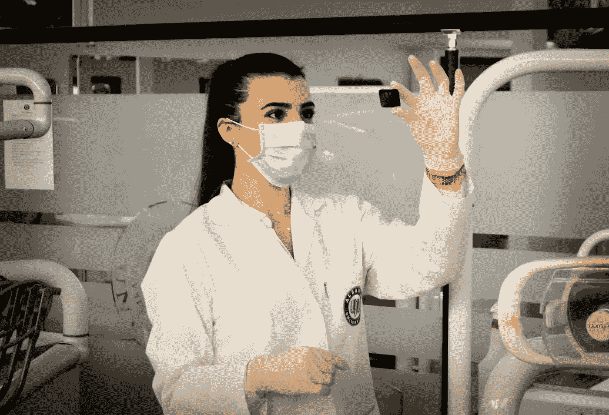
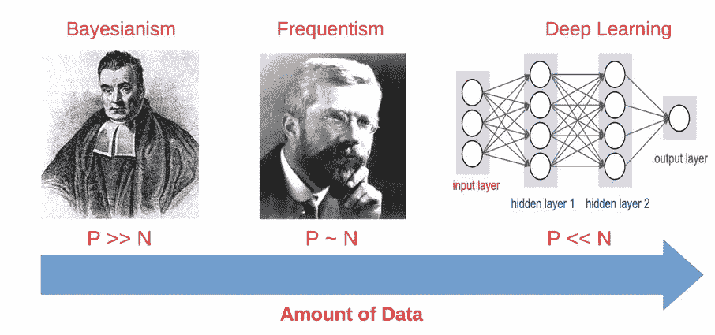
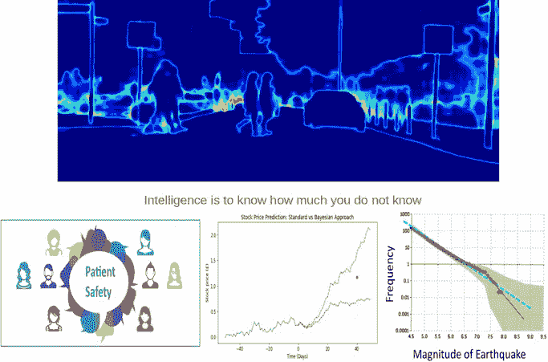
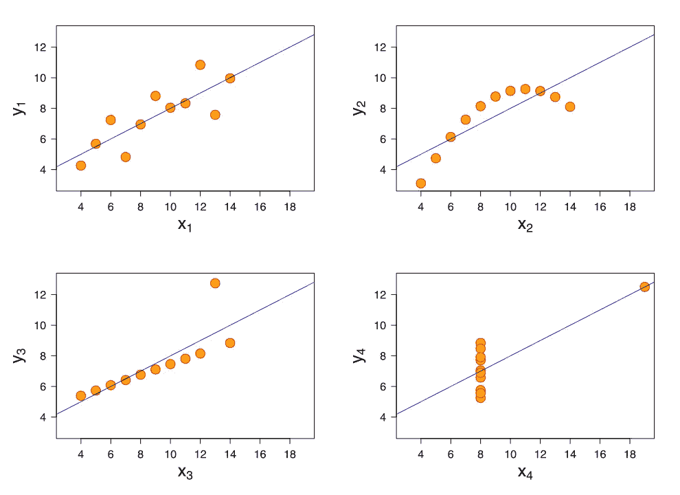
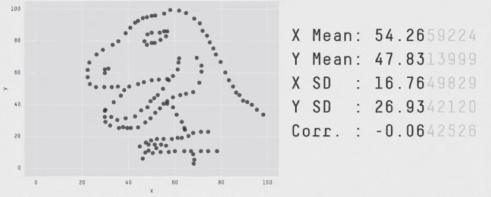
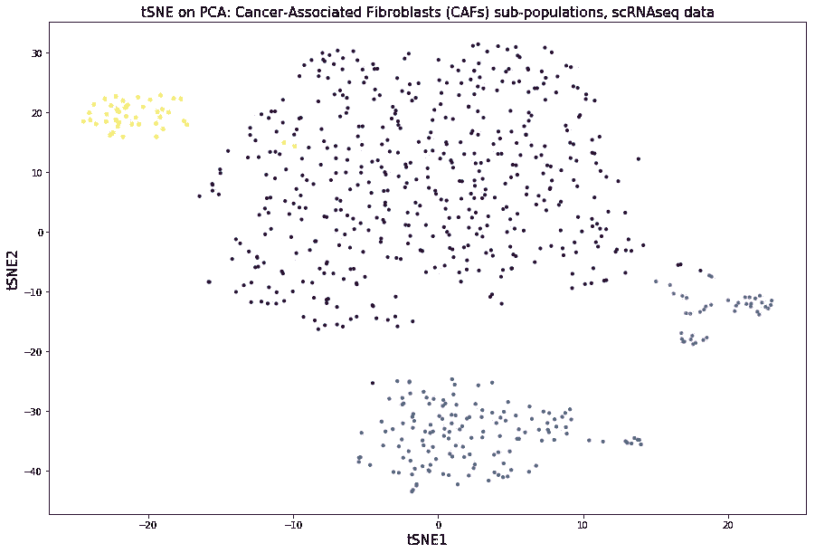
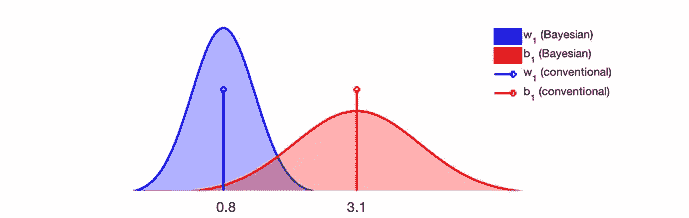
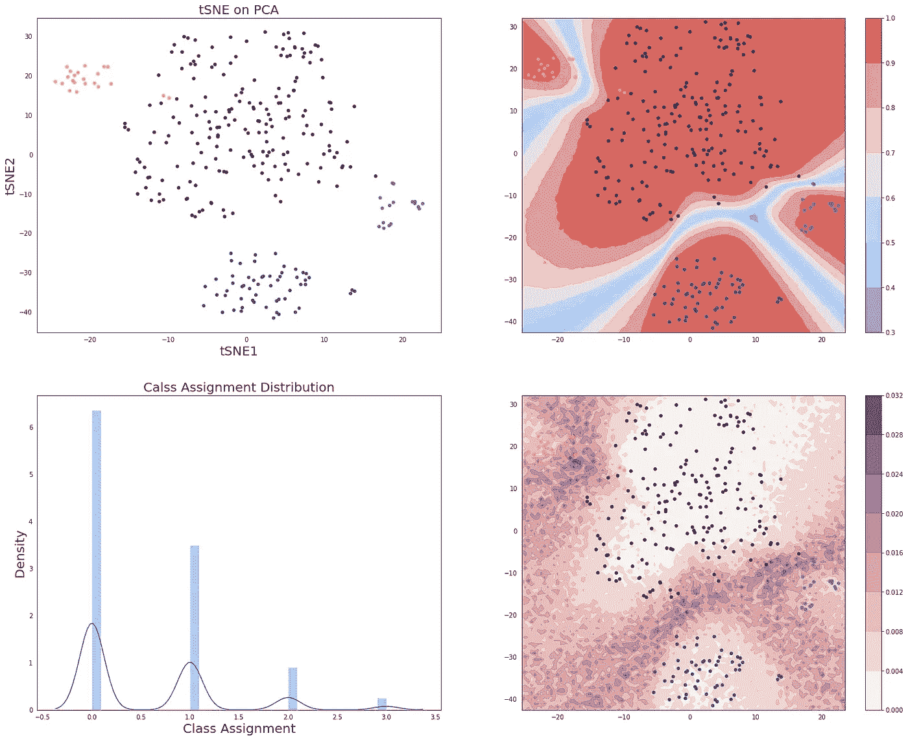

# 用于临床诊断的深度学习

> 原文：<https://towardsdatascience.com/deep-learning-for-clinical-diagnostics-ca7bc254e5ac?source=collection_archive---------17----------------------->

## [生命科学的深度学习](https://towardsdatascience.com/tagged/dl-for-life-sciences)

## 利用深度学习进行更安全的生物医学预测

[Image source](https://unsplash.com/photos/7jjnJ-QA9fY)

这是系列**生命科学深度学习**的第四篇文章。在之前的帖子中，我展示了如何使用[深度学习古 DNA](/deep-learning-on-ancient-dna-df042dc3c73d) [、深度学习单细胞生物学](/deep-learning-for-single-cell-biology-935d45064438)和[深度学习数据整合](/deep-learning-for-data-integration-46d51601f781)。现在，我们将深入生物医学，了解我们为什么以及如何将贝叶斯深度学习用于患者安全。

[下一代测序(NGS)](https://en.wikipedia.org/wiki/DNA_sequencing) 为我们理解导致常见人类疾病的致病机制提供了重大进展。然而，**数据量仍然是生物医学分析的瓶颈**。与数据科学相比，数百万个例子在生物医学中相当罕见，而高维数据却非常典型，因此**机器学习**在生物医学中的应用非常有限。数据的缺乏和高维参数空间阻碍了临床诊断的精确性，带来了许多在临床试验中不成立的**错误预测**。当数据稀疏/稀缺/嘈杂和高维时，**贝叶斯统计**有助于做出概化预测。

这里我们将讨论如何用 PyMC3 实现**贝叶斯深度学习**，以确保**患者安全**并为临床诊断提供更加准确和智能的预测。

# 运行深度学习时为什么要做贝叶斯？

在之前的[帖子](/deep-learning-for-single-cell-biology-935d45064438)中，我解释了在进行统计分析时，你应该特别注意统计观测值的数量 **N** 和你的空间的维度，即特征的数量 **P** 之间的平衡。根据数据量，您可以在**贝叶斯统计、频率统计和机器/深度学习**之间进行选择。

Deep Learning makes sense to use only when you have a lot of data

所以当你拥有大量数据时使用深度学习是有意义的，因为你可以放弃线性代数的枯燥世界，跳进**非线性数学**的兔子洞。相比之下，生物医学通常在相反的极限下工作，N < < P，需要**优于** **来弥补数据的不足。**这就是**生物医学分析为什么要贝叶斯的第一个理由**。

现在想象一下，你得到了一些生物医学大数据，这是不常见的，但不是不可能的，如果一个人从事成像或单细胞生物学工作，你可以而且应该进行深度学习。但在这种情况下你为什么要做贝叶斯呢？

Images are adapted from [Emtiyaz Khan](https://emtiyaz.github.io/papers/ukjapan2018.pdf) and [Alex Kendall](https://alexgkendall.com/computer_vision/bayesian_deep_learning_for_safe_ai/)

第二个原因**来了:通过将**不确定性**合并到模型中来生成**不太明确的**(与传统的基于频率主义者的深度学习相比)预测的必要性。这对错误预测代价非常高的领域非常重要，例如**自动驾驶汽车、模拟股票市场、地震，特别是** **临床诊断**。**

# 为什么不是生物医学的频率分析？

将频率统计应用于临床诊断时，有许多理由需要谨慎。它在很大程度上基于**正态假设**，因此**对异常值**敏感，它使用**描述性统计**进行操作，这些统计并不总是反映潜在的数据分布，因此无法正确捕捉 [Anscombe 四重奏](https://en.wikipedia.org/wiki/Anscombe%27s_quartet)中数据集之间的差异。

相比之下，Anscombe 数据集的贝叶斯概率模型将导致概率分布的巨大差异。

> 智慧就是知道你不知道多少

有几个通常被称为 **Data Saurus** 的著名例子，进一步证明了 Frequentist 统计无法捕捉具有相同**描述性统计(如均值、标准差或皮尔逊相关系数**)的样本组之间的差异。

[Image source](https://www.autodeskresearch.com/publications/samestats)

因此，**过于简单的频率分析不应用于临床诊断**，因为在临床诊断中，我们不能做出会损害人们生命的错误预测。

# 基于 PyMC3 的贝叶斯深度学习

这里，我将使用关于**癌症相关成纤维细胞的 scRNAseq 数据，并应用贝叶斯深度学习对它们在恶性和非恶性细胞类型之间进行分类。[以类似的方式](https://www.ncbi.nlm.nih.gov/pubmed/29503172)、**糖尿病患者**可以被分配到特定的疾病子类型，以获得精确的治疗处方。我们先从[这里](https://www.ncbi.nlm.nih.gov/geo/query/acc.cgi?acc=GSE111229)下载表达式数据，加载到 Python 中，拆分成训练和验证子集，用 [tSNE](https://en.wikipedia.org/wiki/T-distributed_stochastic_neighbor_embedding) 可视化。通常，表达式矩阵的行是样本/细胞，列是特征/基因，最后一列包含来自无偏 [DBSCAN](https://en.wikipedia.org/wiki/DBSCAN) 聚类的细胞标签。**

****

**在 tSNE 图中，四个聚类清晰可辨。接下来，我们将构建一个具有一个隐藏层和 16 个神经元的**贝叶斯神经网络(BNN)** 模型，这是通过向权重和偏差分配正常先验并用随机值初始化它们来完成的。**

****

**[Image source](https://medium.com/@joeDiHare/deep-bayesian-neural-networks-952763a9537)**

**为了构建 BNN，我将使用 PyMC3 并遵循 Thomas Wiecki 的博客中描述的方法。在模型中，我们还定义了一个**分类分布**的可能性，因为我们正在处理一个 scRNAseq 多类(4 类)分类问题。**

**通过赋予权重和偏差先验，我们让模型知道那些参数具有**不确定性**，因此 [**MCMC**](https://en.wikipedia.org/wiki/Markov_chain_Monte_Carlo) **采样器**将为它们建立后验分布。现在，我们将定义一个函数，该函数使用称为 NUTS 的 [**哈密顿蒙特卡罗**](https://en.wikipedia.org/wiki/Hamiltonian_Monte_Carlo) (与 Metropolis 相比，当可以计算参数的导数时，这是一个更快的采样器)算法之一，从贝叶斯神经网络的参数的后验中抽取样本。取样是 BNN 的训练。**

**现在，我们将使用[后验预测检查(PPC)](https://docs.pymc.io/notebooks/posterior_predictive.html) 程序来**验证**贝叶斯神经网络模型的预测。为此，我们将使用经过训练的模型，并在 tNSE 图上为测试子集绘制**决策边界**。决策边界是通过在 tSNE 图上构建 100 x 100 的网格并对网格的每个点运行模型预测来创建的。接下来，我们计算网格上每个点分配给 4 个单元子类型之一的概率的平均值和标准偏差，并可视化**平均概率和概率的不确定性**。**

****

**Probabilistic decision boundary together with uncertainty map for CAFs classification**

**上面的图对应于测试子集上的 tSNE(左上)；测试子集上的 tSNE，每个点分配到 4 个细胞亚型中的任何一个的平均概率(右上)，这基本上是**最大似然/频率主义神经网络**将预测的；和 tSNE 在测试子集上，每个点分配给 4 个细胞子类型(右下)的概率的不确定性，这是**贝叶斯神经网络**的特定输出。这里，红色和蓝色分别表示将 tSNE 点分配给任何单元子类型的高概率和低概率。不确定性热图中较暗的区域表示不确定性较高的区域。**

**我们可以立即看到，平均概率热图包含**来自黄色类别的两个单元，以 100%的概率分配给紫色聚类**。这是一个严重的错误分类，也是最大似然/频率主义神经网络失败的证明。相比之下，不确定性热图显示两个黄色单元落在相对较暗的区域，这意味着**贝叶斯神经网络根本不确定是否将这些单元分配到任何聚类**。这个例子展示了贝叶斯深度学习在进行更安全和更不激进的分类方面的能力，这对于临床诊断尤其重要。**

# **摘要**

**在这里，我们已经了解到贝叶斯深度学习是一种更加准确和安全的预测方式，这对于在临床诊断中使用非常有意义，在临床诊断中我们不允许被治疗处方所误导。我们使用了 **PyMC3 和 MCMC** 来构建贝叶斯神经网络模型，并从样本分配到恶性与非恶性类别的后验概率中取样。最后，我们证明了贝叶斯深度学习在利用不确定性信息避免样本错误分类方面优于频率主义方法。**

**像往常一样，如果你在生命科学中有特别喜欢的领域，想在深度学习框架中解决，请在评论中告诉我。在 twitter @NikolayOskolkov 的 Medium [Nikolay Oskolkov、](https://medium.com/u/8570b484f56c?source=post_page-----ca7bc254e5ac--------------------------------)关注我，并在我的 [github](https://github.com/NikolayOskolkov/DeepLearningClinicalDiagnostics) 上查看这篇文章的代码。我计划写下一篇关于**显微图像分析深度学习**的帖子，敬请关注。**