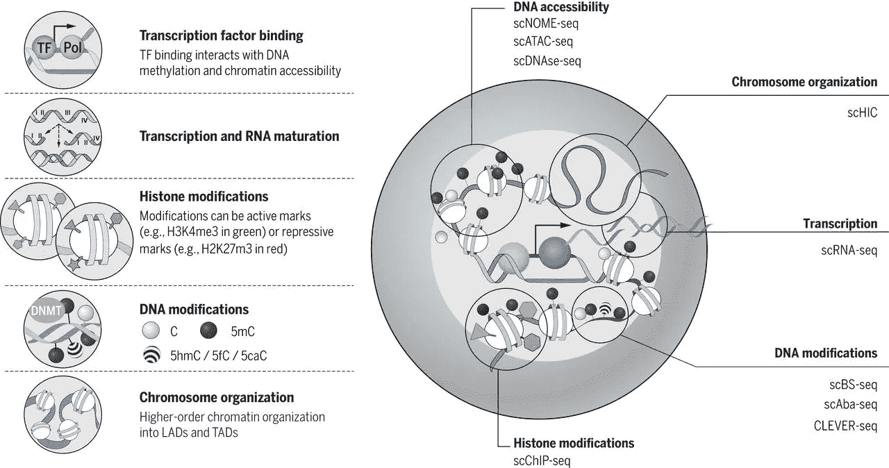

# 用于数据集成的深度学习

> 原文：<https://towardsdatascience.com/deep-learning-for-data-integration-46d51601f781?source=collection_archive---------15----------------------->

## [生命科学的深度学习](https://towardsdatascience.com/tagged/dl-for-life-sciences)

## 数据集成与深度学习的协同效应

[Image source](https://science.sciencemag.org/content/358/6359/69.long)

这是系列**生命科学深度学习**的第三篇文章。在前两篇帖子中，我展示了如何对古代 DNA 使用[深度学习](/deep-learning-on-ancient-dna-df042dc3c73d)和对单细胞生物学使用[深度学习](/deep-learning-for-single-cell-biology-935d45064438)。现在我们将讨论如何利用多种来源的生物信息，**组学数据**，以便通过深度学习实现生物系统的更准确建模。

生物和生物医学研究在过去十年中极大地受益于技术进步，提供了 DNA 序列(基因组学)、基因表达(转录组学*组学*)、蛋白质丰度(蛋白质组学*组学*)以及通常称为组学的许多其他水平的生物信息。尽管单个组学层能够回答许多重要的生物学问题，但它们的组合和随之而来的来自其互补性的协同效应为诸如细胞、组织和有机体等生物系统的行为提供了新的见解。因此**组学整合**代表了当代生物学和生物医学的挑战。

在这篇文章中，我将使用深度学习和 Keras，并展示整合多组学数据的****如何揭示在单个组学**中不可见的隐藏模式。**

# **单细胞产生大数据**

**数据集成的问题对于数据科学来说并不是全新的。想象一下，我们知道一个人看某些图像，读某些文本，听某些音乐。**图像、文本和声音**是非常不同类型的数据，但是我们可以尝试**组合**这些类型的数据，以便构建例如更好的推荐系统，该系统实现了捕捉个人兴趣的**更高的准确性**。至于生物学和生物医学，数据整合的想法最近才出现，但是它从生物学的角度积极发展，产生了一些有趣的方法，如[混合组学](http://mixomics.org/)、 [MOFA](http://msb.embopress.org/content/14/6/e8124) 、[相似性网络融合(SNF)](https://www.nature.com/articles/nmeth.2810) 、 [OnPLS/JIVE/DISCO](https://bmcbioinformatics.biomedcentral.com/articles/10.1186/s12859-016-1037-2) 、[贝叶斯网络](http://www.bnlearn.com/)等。**

****

**Integrative OMICs methods**

**以上列出的所有整合组学方法都面临的一个问题是 [**维数灾难**](https://en.wikipedia.org/wiki/Curse_of_dimensionality) ，即不能在具有有限数量的统计观测值的高维空间中工作，这是生物数据分析的典型设置。这就是单细胞组学技术非常有用的地方，因为正如我们在[上一篇文章](/deep-learning-for-single-cell-biology-935d45064438)中讨论的那样，它们提供了成千上万甚至数百万的统计观察值(细胞)，从而提供了真正的**大数据，用于整合**。**

****

**Single cell multi-OMICs technologies. [Image source](https://www.frontiersin.org/articles/10.3389/fcell.2018.00028/full)**

**非常令人兴奋的是，多组学单细胞技术如**[**CITEseq**](https://www.nature.com/articles/nmeth.4380)和 [**scNMTseq**](https://www.nature.com/articles/s41467-018-03149-4) 分别从完全相同的细胞中提供两个和三个水平的生物信息。****

# ****将 CITEseq 数据与深度学习相结合****

****在这里，我们将使用**自动编码器**对来自 CITEseq，8 617 个脐带血单核细胞(CBMC)的单细胞转录组学(scRNAseq)和蛋白质组学(scProteomics)数据进行无监督整合，自动编码器非常适合捕捉**高度非线性的单细胞组学**数据。我们在[之前的文章](/deep-learning-for-single-cell-biology-935d45064438)中介绍了使用自动编码器进行单细胞生物学的优势，但简单来说，它们与单细胞分析本质上是无人监管的事实有关。我们首先从[这里](https://satijalab.org/seurat/v3.0/multimodal_vignette.html)下载 CITEseq 数据，用 Pandas 读取它们并进行日志转换，这相当于一个温和的归一化。通常，行是细胞，列是 mRNA 或蛋白质特征，最后一列对应于细胞注释。****

****现在，我们将使用 Keras functional API 建立一个具有 4 个隐藏层的自动编码器模型。自动编码器有**两个输入**，每层信息一个，即 scRNAseq 和 scProteomics，以及相应的**两个输出**，旨在重建输入。两个输入层在第二个隐藏层中**连接**之前，在第一个隐藏层中分别进行线性变换(相当于 PCA 降维)。最后，通过自动编码器的**瓶颈**处理合并的组学，最后根据自动编码器典型的“蝴蝶”对称性将尺寸逐渐重建为初始尺寸。****

********

****Unsupervised integration of CITEseq data****

****在下面的 Autoencoder 代码中，重要的是要注意第一个隐藏层将 scRNAseq 的维数从 977 减少到 50 个基因，而它几乎不影响 scProteomics，即将维数从 11 减少到 10。瓶颈进一步将串联后的 60 个维度减少到 50 个潜在变量，这些变量代表 mRNA 和蛋白质特征的组合。****

****这里一个非常方便的事情是，我们可以将**不同的损失函数**分配给来自不同统计分布的组学，例如，结合分类和连续数据，我们可以分别应用分类交叉熵和均方误差。通过自动编码器进行数据整合的另一个好处是，**所有的组学都知道彼此**，因为每个节点/特征的权重通过**反向传播**在彼此的上下文中更新。最后，让我们训练自动编码器，并将瓶颈输入到 [tSNE](https://en.wikipedia.org/wiki/T-distributed_stochastic_neighbor_embedding) 中进行可视化:****

********

****Effect of CITEseq data integration: to see patterns invisible in individual OMICs****

****将使用单个组学获得的 tSNE 图与结合数据的自动编码器的瓶颈上的 tSNE 进行比较，我们可以立即看到整合在某种程度上平均并加强了单个组学。例如，单独使用 scRNAseq 数据很难发现**紫色簇**，因为它与蓝色细胞群没有明显区别，但是**整合后，紫色细胞群很容易区分**。这就是数据整合的力量！****

# ****将 scNMTseq 数据与深度学习相集成****

****CITEseq 包括两个单细胞水平的信息(转录组学和蛋白质组学)，另一项神奇的技术 scNMTseq 从相同的生物细胞中提供三个组学:1)转录组学(scRNAseq)，2) [甲基化模式](https://en.wikipedia.org/wiki/DNA_methylation) (scBSseq)，以及 3) [开放染色质区域](https://en.wikipedia.org/wiki/ATAC-seq) (scATACseq)。原始数据可以从[这里](https://www.ncbi.nlm.nih.gov/geo/query/acc.cgi?acc=GSE109262)下载。****

********

****scNMTseq data integration with Autoencoder****

****自动编码器的架构类似于 CITEseq 使用的架构，只有一个特点:**在输入层上使用了丢失正则化**。这是因为我们只有大约 120 个细胞被排序，而特征空间的维数是数万，因此我们需要应用正则化来克服维数灾难。请注意，这对于 CITEseq 是不必要的，因为我们有大约 8K 的单元和大约 1K 的特性，所以情况正好相反。然而，总的来说 **scNMTseq 并不是一个简单的数据整合案例**，尽管我坚信这只是单细胞多组学时代的开始，更多的细胞将很快从这项令人兴奋的技术中到来，所以最好做好准备。****

********

****Combining transcriptomics with epigenetics information for scNMTseq****

****出于好奇，我在这里提供了自动编码器的瓶颈，该编码器将三个 scNMTseq 组学组合成 [**【均匀流形近似和投影(UMAP)**](https://www.nature.com/articles/nbt.4314) 非线性维度缩减技术，该技术在大量数据的可伸缩性方面似乎优于 tSNE。我们可以立即看到，当 scRNAseq 与来自相同细胞(scBSseq 和 scATACseq)的 [**表观遗传学**](https://en.wikipedia.org/wiki/Epigenetics) **信息**结合时，基因表达意义上的**同质蓝色簇分裂成两个簇。因此，我们似乎捕捉到了一种**细胞间新的异质性**，这种异质性在仅观察基因表达 scRNAseq 数据时是隐藏的。这可能是一种利用细胞生物学的整体复杂性来对不同群体的细胞进行分类的新方法吗？如果是，那么问题来了:**什么是细胞群体或细胞类型？我不知道这个问题的答案。********

# **摘要**

**在这里，我们了解到，由于[最近的技术进步](https://en.wikipedia.org/wiki/DNA_sequencing)，分子和临床信息的多种来源在生物学和生物医学中越来越普遍。因此，数据整合是合乎逻辑的下一步，它通过利用数据的整体复杂性提供了对生物学过程的更全面的理解。深度学习框架非常适合数据集成，因为当**多种数据类型相互学习信息**时，它通过反向传播对参数进行真正的“综合”更新。我展示了数据集成可以导致**在数据中发现以前在单个数据类型**中没有发现的新模式。**

**像往常一样，如果你在生命科学中有特别喜欢的领域，想在深度学习框架中解决，请在评论中告诉我。在 twitter @NikolayOskolkov 上关注我，在我的 github 上查看这篇文章的代码。我计划写下一篇关于**贝叶斯深度学习用于临床诊断中患者安全的文章**，敬请关注。**