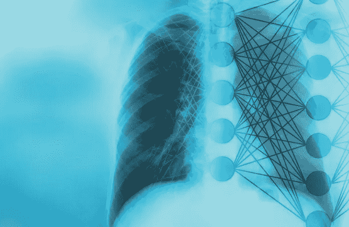
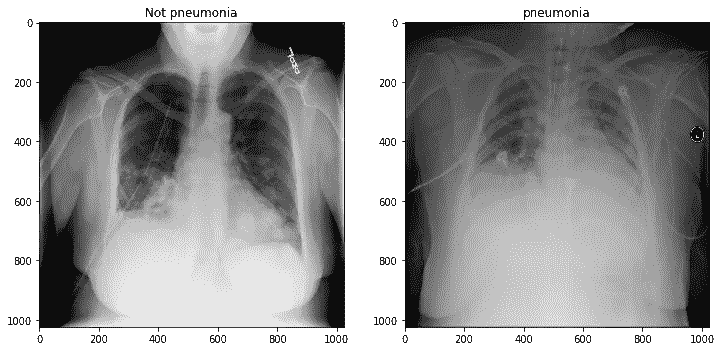
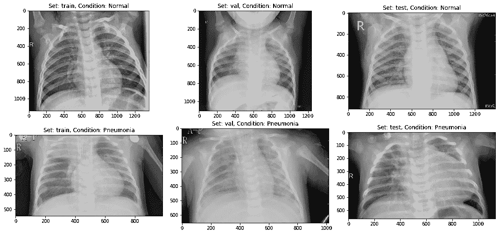
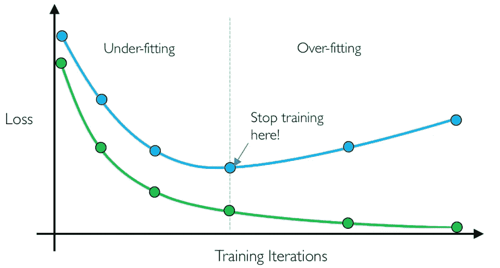
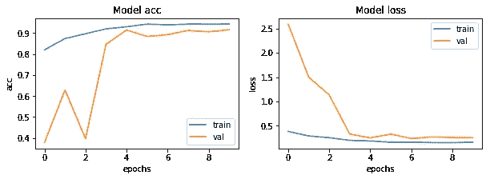

# 深度学习用于从 X 射线图像中检测肺炎

> 原文：<https://towardsdatascience.com/deep-learning-for-detecting-pneumonia-from-x-ray-images-fc9a3d9fdba8?source=collection_archive---------1----------------------->

## 用于从 X 射线图像检测肺炎的端到端管道



被困在付费墙后面？点击[这里](https://medium.com/p/deep-learning-for-detecting-pneumonia-from-x-ray-images-fc9a3d9fdba8?source=email-c3f5233f3441--writer.postDistributed&sk=fc89a046b5dcdda696aaeba7242b5e15)阅读完整故事与我的朋友链接！

对许多人来说，患肺炎的风险是巨大的，尤其是在发展中国家，那里有数十亿人面临能源匮乏，依赖污染型能源。世卫组织估计，每年有 400 多万人过早死于包括肺炎在内的家庭空气污染相关疾病。每年有超过 1 . 5 亿人感染肺炎，尤其是 5 岁以下的儿童。在这些地区，由于缺乏医疗资源和人员，这个问题可能会进一步恶化。例如，在非洲的 57 个国家中，存在着 230 万医生和护士的缺口。对于这些人群，准确快速的诊断意味着一切。它可以保证及时获得治疗，并为那些已经贫困的人节省急需的时间和金钱。

本项目是在 Kaggle 上举办的[胸部 x 光影像(肺炎)](https://www.kaggle.com/paultimothymooney/chest-xray-pneumonia)的一部分。

# 挑战

建立一种算法，通过查看胸部 x 光图像来自动识别患者是否患有肺炎。算法必须非常精确，因为人命关天。



# 环境和工具

1.  [scikit-learn](https://scikit-learn.org/stable/)
2.  [keras](https://keras.io/)
3.  [numpy](https://www.numpy.org/)
4.  [熊猫](https://pandas.pydata.org/)
5.  [matplotlib](https://matplotlib.org/)

# 数据

数据集可以从 kaggle 网站下载，该网站可以在[这里](https://www.kaggle.com/paultimothymooney/chest-xray-pneumonia)找到。

# 代码在哪里？

事不宜迟，让我们从代码开始吧。github 上的完整项目可以在这里找到[。](https://github.com/abhinavsagar/Kaggle-tutorial)

让我们从加载所有的库和依赖项开始。

接下来，我展示了一些正常和肺炎的图像，看看它们在肉眼看来有多大的不同。嗯不多！



Sample Images

然后，我将数据集分成三组——训练集、验证集和测试集。

接下来，我编写了一个函数，在这个函数中，我做了一些数据扩充，将训练和测试集图像输入到网络中。我还为图像创建了标签。

数据扩充的做法是增加训练集规模的有效方法。增加训练示例允许网络在训练期间“看到”更多样化但仍有代表性的数据点。

然后我定义了两个数据生成器:一个用于训练数据，另一个用于验证数据。数据发生器能够直接从源文件夹加载所需数量的数据(一个小批量的图像)，将它们转换成*训练数据*(输入到模型)和*训练目标*(一个属性向量——监督信号)。

> *对于我的实验，我通常设置* `*batch_size = 64*` *。一般来说，介于 32 和 128 之间的值应该可以。通常，您应该根据计算资源和模型的性能来增加/减少批量大小。*

之后我定义了一些常量以备后用。

下一步是构建模型。这可以用以下 5 个步骤来描述。

1.  我使用了五个卷积模块，包括卷积层、最大池和批量标准化。
2.  在它的顶部，我使用了一个扁平化层，然后是四个完全连接的层。
3.  此外，在此期间，我用辍学来减少过度拟合。
4.  激活函数除了最后一层是 Sigmoid，因为这是一个二元分类问题。
5.  我使用 Adam 作为优化器，交叉熵作为损失。

在训练之前，模型对于定义一个或多个回调是有用的。挺好用的一个，有:`ModelCheckpoint`和`EarlyStopping`。

*   **ModelCheckpoint** :当训练需要大量时间才能达到一个好的结果时，往往需要多次迭代。在这种情况下，最好仅在改善度量的时期结束时保存最佳执行模型的副本。
*   **提前停止**:有时，在训练过程中，我们可以注意到泛化差距(即训练和验证误差之间的差异)开始增大，而不是减小。这是过度拟合的症状，可以通过多种方式解决(*减少模型容量*、*增加训练数据*、*数据扩充*、*正规化*、*退出*等)。通常一个实用有效的解决方法是当泛化差距越来越大时停止训练。



Early stopping

接下来，我以 32 的批量为 10 个时期训练模型。请注意，通常较大的批量会产生较好的结果，但代价是较高的计算负担。一些研究还声称，通过在超参数调整上投入一些时间，可以找到获得最佳结果的最佳批量。

让我们来看一下损耗和精度图。



**Accuracy vs Epoch | Loss vs Epoch**

到目前为止一切顺利。该模型是收敛的，这可以从随着时期的损失和验证损失的减少中观察到。此外，它能够在短短 10 个时期内达到 90%的验证准确性。

让我们绘制混淆矩阵，并获得一些其他结果，如精确度、召回率、F1 分数和准确度。

```
CONFUSION MATRIX ------------------
[[191  43]
 [ 13 377]]

TEST METRICS ----------------------
Accuracy: 91.02564102564102%
Precision: 89.76190476190476%
Recall: 96.66666666666667%
F1-score: 93.08641975308642

TRAIN METRIC ----------------------
Train acc: 94.23
```

该模型能够达到 91.02%的准确度，考虑到所使用的数据量，这是相当好的。

# 结论

虽然这个项目还远未完成，但在如此多样的现实世界问题中看到深度学习的成功是令人瞩目的。我已经演示了如何从一组 X 射线图像中对阳性和阴性肺炎数据进行分类。该模型是从零开始的，这使它有别于其他严重依赖迁移学习方法的方法。将来，这项工作可以扩展到检测和分类由肺癌和肺炎组成的 X 射线图像。区分包含肺癌和肺炎的 X 射线图像一直是最近的一个大问题，我们的下一个方法应该是解决这个问题。

# 参考资料/进一步阅读

[](https://medium.com/datadriveninvestor/training-a-cnn-to-detect-pneumonia-c42a44101deb) [## 训练 CNN 检测肺炎

### 我清楚地记得那一天。我的祖父开始胡乱咳嗽，并开始呼吸困难。他是…

medium.com](https://medium.com/datadriveninvestor/training-a-cnn-to-detect-pneumonia-c42a44101deb) [](https://becominghuman.ai/detecting-pneumonia-with-deep-learning-3cf49b640c14) [## 用深度学习检测肺炎

### 肺炎是由病毒、细菌、真菌或其他病原体感染引起的肺部炎症。根据……

becominghuman.ai](https://becominghuman.ai/detecting-pneumonia-with-deep-learning-3cf49b640c14) [](https://stanfordmlgroup.github.io/projects/chexnet/) [## CheXNet:通过深度学习对胸部 X 射线进行放射科医生级别的肺炎检测

### 该数据集由美国国家卫生研究院发布，包含 30805 名不同患者的 112120 张正面 x 光图像，并附有注释…

stanfordmlgroup.github.io](https://stanfordmlgroup.github.io/projects/chexnet/) 

# 在你走之前

相应的源代码可以在这里找到。

[](https://github.com/abhinavsagar/Kaggle-tutorial) [## abhinavsagar/ka ggle-教程

### Kaggle 竞赛笔记本样本。显微图像的自动分割是医学图像处理中的一项重要任务

github.com](https://github.com/abhinavsagar/Kaggle-tutorial) 

快乐阅读，快乐学习，快乐编码！

# 联系人

如果你想了解我最新的文章和项目[，请关注我的媒体](https://medium.com/@abhinav.sagar)。以下是我的一些联系人详细信息:

*   [个人网站](https://abhinavsagar.github.io)
*   [领英](https://in.linkedin.com/in/abhinavsagar4)
*   [中等轮廓](https://medium.com/@abhinav.sagar)
*   [GitHub](https://github.com/abhinavsagar)
*   [卡格尔](https://www.kaggle.com/abhinavsagar)