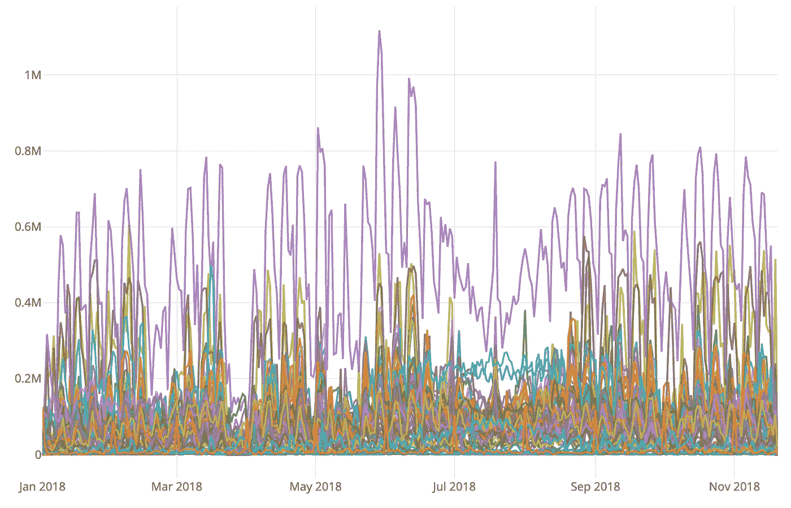
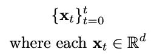
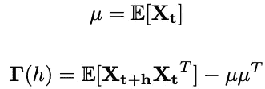
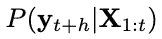
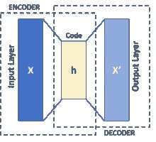
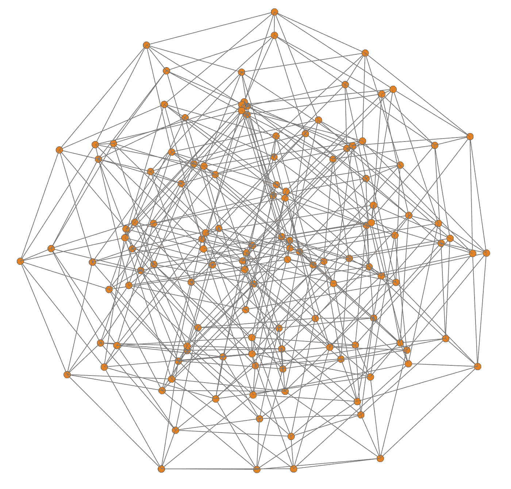
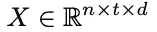

# 高维时间序列的深度学习

> 原文：<https://towardsdatascience.com/deep-learning-for-high-dimensional-time-series-7a72b033a7e0?source=collection_archive---------8----------------------->

Time series of some monitoring system

## 降维、嵌入、预测

ime 系列数据在机器人、金融、医疗保健和云监控等重要应用中非常普遍。在这些应用中，我们通常会遇到维数非常高的时间序列，其中 ML 任务是在强化学习代理中执行信号表征的分类、预测的回归或函数逼近。

尽管时间序列数据有很多重要的应用，但是对于这种输入类型，ML 的文献并不多。此外，大多数 ML 算法都有一个基本假设，即样本是独立同分布的(iid)，但对于大多数时间序列来说，情况并非如此。更令人沮丧的是，使用深度学习找到高维时间序列的研究或例子更是凤毛麟角。因此，**这篇文章讨论了当数据是高维时间序列时，可以应用于执行常见的无监督和有监督学习任务的技术。**它假设你有深度学习的经验，现在正在寻找涉及时间序列输入的问题的解决方案。

> 帖子的最后附有一个 Jupyter 笔记本中的例子，其中讨论了一些最重要的问题。

# 简而言之，时间序列基本原理

我们来复习一些基础知识。时间序列建模一直是不同研究社区的研究主题，包括统计学、信号处理、经济学、金融学、物理学、机器人学和在线机器学习。从根本上说，大部分工作都遵循对问题的概率处理。此外，应用社区有他们自己的技术，可能会使用深度学习来解决*你的*问题。 ***重要的方面是，在使用深度学习之前，你必须知道手头的时间序列问题的概率性质。***

形式上，我们将时间序列定义为时间序列中的一系列观察值，如下所示

这里 *d* 是尺寸(或特征的数量),而 *t* 是每个时间步的索引。

## 什么是高维时间序列？

高维输入是指 *d* 相对较大的输入。请注意，行空间 *t* 是时域中的样本数，并不表示高维度(这意味着您可以对小数据集使用高维度)。如此高的维数给 ML 带来了问题，因为维数灾难，也因为许多特征向量可能变成噪声。因此，如果我们不减少原始输入的维度，我们很可能会过度拟合。

## **统计时间序列建模:**

在经典范式中，时间序列被建模为随机变量序列{ **X** _t}(注意这不同于原始观察值{ **x** _t})，均值和协方差定义为

这种形式的模型被称为随机过程。此外，时间序列被分成几个部分:*趋势、季节性、周期和残差*。选择的统计模型是 ARMA 和 ARIMA 的变体，分别用于平稳过程和非平稳过程。

> 现在，一个重要的定义。**定义:**(弱)平稳时间序列是数据生成过程不随时间变化的序列。由此可见，非平稳过程违反了平稳性的定义，因此其概率分布会随时间而变化。ARMA 和 ARIMA 模型已经被广泛使用了几十年，但它们对线性度做了强有力的假设，这可能不会对复杂过程产生可接受的预测。这种经典统计处理的重要方面是认识到我们需要基于数据生成过程的不同概率模型，即在我们开始学习部分之前识别输入的平稳或非平稳程度。

**状态空间和马尔可夫模型**:这些模型最初是为控制应用开发的，比线性 ARMA 和 ARIMA 模型更强大。它们包括著名的卡尔曼滤波器和隐马尔可夫模型(hmm)。对于某些应用，hmm 及其变体仍然是深度神经网络的一个很好的替代方案。为了做出预测 **y** ，我们在距离*t:*h*的某个水平上寻找条件后验概率*

## 深度学习建模:

对于大多数时间序列，我们需要一些时间相关性来进行预测。在特殊情况下，我们可以简化时间序列，假设它满足马尔可夫性。这个假设意味着状态 **X** _t 是完整的——即，它编码了预测未来 **X** _{t+1}的所有必要信息，并且过去和未来的状态是独立的。我们将*违反*马尔可夫假设，而是假设我们具有长期的时间依赖性——其中我们需要状态的先前 *k* 步，即 **X** _{t-k:t}或某个重要的过去状态 **X** _q。现在，为了使用有区别的监督 ML 模型进行预测，我们寻求近似后验概率分布 P( **y** | **X** _)我们通过在训练期间最大化可能性来做到这一点——或者等效地最小化批量或随机机器学习框架中的损失。

> ML 中的非平稳性:当输入中存在认知不确定性或非平稳性时，会出现额外的困难。如果是这种情况，在训练之前需要进行额外的信号处理，并且/或者机器学习框架必须从[批处理变为在线](https://en.wikipedia.org/wiki/Online_machine_learning)。我将把信号处理部分排除在这篇文章之外，但是强调一下 [ML 批处理框架](https://www.cs.huji.ac.il/~shais/UnderstandingMachineLearning/understanding-machine-learning-theory-algorithms.pdf)中的假设。对于批量学习，我们假设训练集和测试集的分布属于同一个数据生成过程。因此，如果您有一个固定的过程，比如说一个云监控系统，那么就有 PAC 学习保证。另一方面，如果你有一个非平稳过程，比如说一个股票市场，那么就没有 PAC 学习保证。在后一种情况下，您无法使用批量 ML 框架进行良好的样本外预测。现在，许多人不知道，批量学习是 ML 的默认选项。另一方面，在线学习适合于顺序学习，因为它不对输入的概率分布做出假设——事实上，数据生成过程甚至可能是对抗性的。因此，对输入的概率不做任何假设的在线学习框架是非平稳过程的最佳选择，但即使如此也是一项重要的任务。(此处阅读后悔最小化[)。](https://www.amazon.com/gp/product/0521841089/qid=1147380532/sr=1-1/ref=sr_1_1/102-8626944-0281702?s=books&v=glance&n=283155)

**ML 中的顺序相关性:**在前向神经网络中，训练集中的每个样本都被认为是 iid。因此，如果输入是一个时间序列，数据的时间依赖性就会被打破。这个问题的解决方案直接通过在现代版的 LSTM(或 GRU)细胞中使用递归神经网络来解决。另一种不太用于时间序列的方法是 CNN，因为它们也被证明在对时间序列输入进行预测方面是成功的——毕竟，图像具有空间依赖性。

**转换:**现在，在用 LSTMs 或 CNN 进行预测之前，我们必须对我们的高维时间序列问题进行一些转换。首先，必须减少高维输入的大小。其次，它必须以预测器可接受的形式嵌入。对于第一个任务，一个常见的误解是，由于 CNN 对图像进行无监督的特征提取，我们可以对时间序列输入进行同样的处理。如果我们处理的是可能成千上万的额外的不相关和有噪声的特征，情况就不一样了。因此，无论是否使用 CNN，最好在训练模型之前进行降维。因此，我从降维技术开始。

# 降维

降维的任务是将一个高维空间投影到一个仍然可以解释数据的低维子空间中。从几何学上讲，将原始输入 ***X*** ∈ ℝ^{n × d}视为一个 *d* 维的超立方体，您希望将超立方体缩减为一个低维流形***x****'*∈ℝ^{n×p }，该流形对原始超立方体的信息进行编码。缩减后的维度 p<d<

如前所述，时间序列具有样本之间的时间相关性。然而，时间相关性对于维数约减通常无关紧要。因此，我们可以使用原始 2D 输入来降低维数。对于时间序列输入的降维，我们有几个选择。一些常见的选项，按难度排序如下:

## 基本:

*   奇异值分解、主成分分析、独立分量分析(无监督):

奇异值分解是一种经典的矩阵代数方法，是任何矩阵降维的基础。PCA 被定义为协方差矩阵的特征向量，但也可以被视为截断的 SVD。在 PCA 中，主成分是数据的一系列正交投影(即，相互不相关)，并根据它们的方差排序。在 ICA 中，我们找到了一个降维子空间，其中的分量在统计上是独立的。

## 适中:

中等方法适用于基本方法不太适用的非线性数据。

*   KPCA(非线性数据)

PCA 的内核化版本。

*   Isomaps

Isomaps 产生一个低维表示，保留数据流形上的测地线或“行走距离”。

## **高级:**

*   自动编码器:

对于自动编码器，我们通过使用具有编码器和解码器的深度神经网络来学习低维特征空间。这里，我们通过在逐渐减少和增加层的大小之后，强制神经网络再现相同的输入来压缩数据。

Autoencoders schematic representation (Wikipedia)

*   变分自动编码器

可变自动编码器是自动编码器的生成版本。Keras 中自动编码器和 VAEs 的一个例子是这里的。

Visualization of a multi-dimensional hypercube — although they cannot really be visualized beyond 3D.

我建议你至少采用两种方法，并与同一学习者比较样本外的准确性。在提供的示例中，维度从 2000 减少到 100。

# 特征选择

特征选择是一个优化问题，它寻求从原始空间中找到提高预测性能的重要特征的最小子集。这一过程有两个不同于降维的含义:(1)原始特征向量按某种重要性度量排序，所选子集保持与原始数据相同的形式；(2)一般涉及监督程序。对于高维时间序列数据，以下方法通常比过滤器或包装器方法更可行。

*   收缩方法(监督)

收缩方法通过对不太重要的特征施加权重惩罚来减少特征的数量。最常见的是套索和岭回归。如果这些方法在损失目标中包括 L1 或 L2 正则化，则通过神经网络的正则化隐含地包括这些方法。

*   树形方法(有监督的)

树方法，例如随机森林，使用熵度量来进行分类或回归的分割。这些分割进而可以给出关于如何对所选子集的特征进行排序的信息。

# 时间序列的嵌入

在本节中，我们讨论如何将每个 *序列*的*嵌入或编码到预测器*的适当表示中。* ***为了形象化这一点，把你的多变量时间序列序列 Q 想象成一个需要分类的图像。*** 现在，如果时间序列输入在每个时间步不包含实值向量(例如文本)，每个时间步必须首先嵌入到某个实值表示中(例如使用 Word2Vec)。所以在本节中，我们指的是*时序序列*的嵌入。然后，对于接下来的内容，我们假设每个时间步长已经是实值表示。*

## 转换成 LSTM 的三维张量

如果我们在回归设置中，我们试图预测未来的时间步长，或者作为 RL 代理的函数逼近器，LSTMs 工作得更好。如果我们使用 LSTM 作为预测器，我们不需要*嵌入*输入本身，但我们需要将其重新整形为 3D 张量。这很简单。

**输入形状和序列长度:**为了考虑输入矩阵 **X** 的顺序性质，需要将其整形为 3D 张量

其中 *n* 是序列的个数， *t* 是每个序列的时间步数， *d* 是序列的维数。

因此，我们需要通过领域专业知识、试错法或信号处理来先验地确定对预测很重要的序列长度(时间步数)。序列的长度可以是固定的或可变的。

## 嵌入图像

这种嵌入通常是:(a)将时间序列转换到频域，然后将其嵌入到图像中，或者(b)使用递归图。生成的图像稍后可以用基于 CNN 的架构进行分类。如果做得正确，我发现(b)是用 DL 对信号进行分类(或表征)的更好技术。

这方面的文献大多是把一个*单变量*时间序列嵌入到一个图像中(把单变量时间序列嵌入到一个图像中的好论文是[这里是](https://arxiv.org/pdf/1710.00886.pdf))。麻烦在于将多变量时间序列转换成等价的图像。我想到了一些想法。同样，我们可以采用频域方法，将多元时域输入转换为频谱图，然后将其嵌入图像。然而，转换到频域时，我们会丢失信息。因此，优选的方法是通过取每个单变量递归图的逐项乘积，将多变量输入转换成 2D 递归图。在此之前，将时间序列整形为 3D 张量，然后将每个 2D 序列转换为递归图。

## 嵌入到图中

在一些应用中，例如僵尸网络检测，输入由随时间变化的图形组成。一般来说，当您的时间序列输入中存在可以编码到图形中的关系时，您可以进行动态图形嵌入。然而，动态图嵌入必须与神经网络兼容，因为我们不能以简单的方式使用图作为神经网络的输入。幸运的是，最近有一些框架允许这样做，其中最好的一个是 [Structure2Vec](https://github.com/Hanjun-Dai/graphnn) ，它允许端到端的培训。有关信息论方法，请参见有向信息图。

# 具有时间序列输入的深度学习预测

第一步是决定你是否需要 DL。如果你的时间序列问题相对简单(即，不是高维、平稳、线性的)，那么使用 ARMA 或 ARIMA 可能会产生良好的预测(见脸书的[预言家](https://facebook.github.io/prophet/))。如果不是，你很幸运，我们现在有函数逼近器(DL！)可用于时间序列输入。请记住，如前所述，时间序列输入依赖于几个先前的时间步长。同样，第一个任务是减少输入的维数，然后我们执行嵌入。之后，我们准备使用一个 DL 模型来进行预测。

## LSTM 模型

LSTM 模型是最流行的时间序列输入模型。这是因为 LSTMs 被设计成*记住*长期依赖关系，并且在多个应用中显示出巨大的成功，最重要的是在 NLP 中。它们是回归的首选模型，也适用于分类。至此，您已经知道，对于高维时间序列，我们首先降低其维度，然后对于 LSTMs，我们将输入重塑为 3D 张量。

## CNN 模型

CNN 模型是图像分类的首选机器。当序列作为图像嵌入时，它们已经被证明是时间序列输入的良好预测器。如果我们想对每个序列进行分类，而不是对未来进行预测，那么 CNN 是一个很好的选择。在降低原始输入的维数后，我们将它嵌入到一个图像或一个兼容的图形中。你要避免的事情是获取原始时间序列输入，然后执行 2D 卷积。

> W 注意:对**原始**时间序列输入应用 2D 卷积是没有意义的。

# 结论

我们看到高维时间序列不同于深度学习文献中常见的其他输入类型。为了使用深度学习模型进行回归或分类，第一步是采用适当的技术来降低输入的高维度。第二步是对序列使用合适的嵌入，以便 LSTM 或 CNN 可以处理时间相关性。最后，我们必须知道数据生成过程的性质，以便选择正确的学习模型和范例。如果过程是非平稳的，使用批量 ML 将不能很好地推广，在线 ML 方法是更可行的选择。将在线机器学习范式用于深度神经网络是另一篇文章的主题。

## [这里有一个 Jupyter 笔记本上的例子](https://github.com/david10e10/High-Dim-TS-Medium)，它使用了我们讨论过的一些方法。