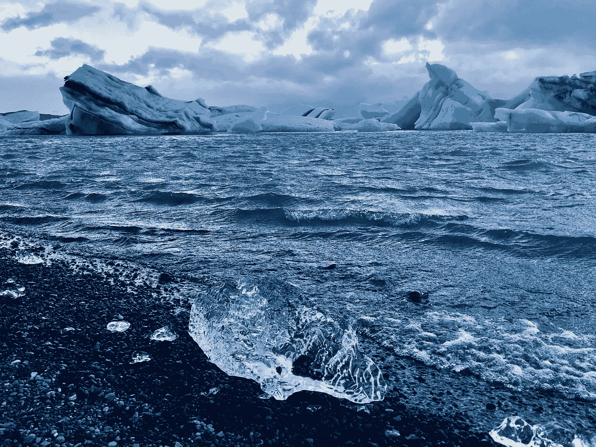
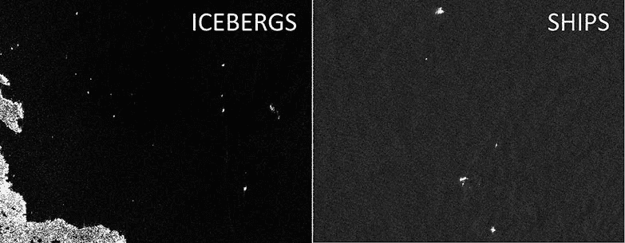
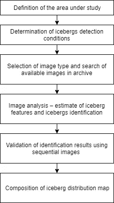
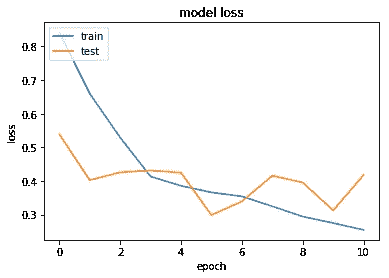
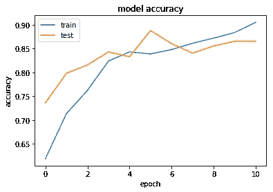

# 深度学习在卫星图像冰山检测中的应用

> 原文：<https://towardsdatascience.com/deep-learning-for-iceberg-detection-in-satellite-images-c667acf4bad0?source=collection_archive---------19----------------------->

## 卫星图像的深度学习

Photo by [Agnieszka Mordaunt](https://unsplash.com/@agnieszkam?utm_source=unsplash&utm_medium=referral&utm_content=creditCopyText) on [Unsplash](https://unsplash.com/search/photos/iceberg?utm_source=unsplash&utm_medium=referral&utm_content=creditCopyText)

被困在付费墙后面？点击[这里](/deep-learning-for-iceberg-detection-in-satellite-images-c667acf4bad0?source=friends_link&sk=f9013927a78d6851bc49adb12c2bf9c5)阅读完整故事与我的朋友链接！

本博客的主要目的是开发利用卫星雷达数据和可见光谱范围内的高空间分辨率图像探测冰山的方法。卫星监测危险冰结构的方法，如北冰洋的冰山，对航行安全和北极大陆架的经济活动构成了威胁。

开发的冰山探测方法是基于在卫星图像的二维场分析中寻找梯度带的统计标准。所提出的从卫星数据探测冰山的方法可以提高为广大用户提供服务的质量和效率，同时确保北极航行和北极大陆架活动的效率和安全。

该项目是在 Kaggle 举行的 [Statoil/C-CORE 冰山分类器挑战赛](https://www.kaggle.com/c/statoil-iceberg-classifier-challenge/data)的一部分。

# **挑战**

建立自动识别遥感目标是否为冰山的算法。冰山经常被误认为是一艘船。该算法必须非常精确，因为生命和数十亿美元的能源基础设施正处于危险之中。

# 环境和工具

1.  sci kit-学习
2.  numpy
3.  克拉斯
4.  熊猫
5.  matplotlib

# 数据

数据集可以从 kaggle 网站下载，可以在[这里](https://www.kaggle.com/c/statoil-iceberg-classifier-challenge/data)找到。

# 三种情况

1.  **开阔水域中的冰山:**在光学图像中，冰山会在黑暗的背景下显示出亮点，较高的风力会降低开阔水域和冰山之间的对比度。
2.  **漂流冰中的冰山:**如果有更大的固结冰，冰山会在漂流冰中留下痕迹。如果只有反向散射信息，在光学图像中很难区分冰山和背景。
3.  **冰解区域附近的快速冰中的冰山:**光学数据显示背景上的阴影，静止的冰意味着可以在更长的时间内识别冰山。

# 方法学

Methodology of iceberg detection in satellite images

# 代码在哪里？

事不宜迟，让我们从代码开始吧。github 上的完整项目可以在这里找到[。](https://github.com/abhinavsagar/Kaggle-tutorial)

让我们从加载所有的库和依赖项开始。

接下来，我加载了 json 格式的训练和测试集图像。

然后我定义了训练和测试集数据。我将数据分成 3:1，即 75%作为训练集，其余作为测试集。

# 适合的

在训练之前，模型对于定义一个或多个回调是有用的。相当好用的一个，有:`ModelCheckpoint`和`EarlyStopping`。

*   **ModelCheckpoint** :当训练需要大量时间来达到一个好的结果时，通常需要多次迭代。在这种情况下，最好仅在改善度量的时期结束时保存最佳执行模型的副本。
*   **提前停止**:有时，在训练过程中，我们可以注意到泛化差距(即训练和验证误差之间的差异)开始增大，而不是减小。这是过拟合的症状，可以通过多种方式解决(*减少模型容量*、*增加训练数据*、*数据扩充*、*正则化*、*放弃*等)。通常，一个实用而有效的解决方案是在泛化差距越来越大时停止训练。

Early stopping

让我们继续定义模型。这可以总结为以下 5 个步骤-

1.  我使用了两个卷积层，后面是一个最大池层，再后面是另一个卷积层。我在中间使用了 20%的压降来减少过度拟合。
2.  为了更好地概括结果，我对四个堆栈重复了同样的操作。
3.  此外，我还使用了 globalmaxpooling 和批处理规范化层来规范化从前面的层中得出的权重。
4.  最后一层是致密层，以 sigmoid 为激活函数。
5.  最后，我使用 Adam 作为优化器，使用二元交叉熵作为损失函数。

让我们以 32 的批量为 20 个时期训练模型。请随意使用超参数以获得更好的效果。

最后，让我们来看看结果。

# 结果

loss vs epoch

accuracy vs epoch

训练集和测试集的损失值收敛得相当好。此外，该模型能够在仅仅 10 个时期内分别实现 90%和 85%的训练和测试集精度。

# 结论

我认为这是深度学习可以用来解决具有挑战性的现实世界问题的一个很好的例子。如果我们能够检测和分割图像中的冰山，这将对瑞典、挪威和加拿大等北方国家的物流和运输团队有很大的帮助。它可以通过实时跟踪卫星图像和视频中的冰山，为集装箱船和船只带来全新的运输方式。

# 参考资料/进一步阅读

 [## 应用于阿蒙森海的基于目标的 SAR 图像冰山检测算法

### 提出了一种基于对象的高级合成孔径雷达(ASAR)图像冰山自动检测方法

www.sciencedirect.com](https://www.sciencedirect.com/science/article/pii/S0034425716304527)  [## 南极威德尔海两个试验区合成孔径雷达图像中的冰山特征和探测

### 南极威德尔海两个试验区域合成孔径雷达图像中的冰山特征和探测

www.cambridge.org](https://www.cambridge.org/core/journals/journal-of-glaciology/article/iceberg-signatures-and-detection-in-sar-images-in-two-test-regions-of-the-weddell-sea-antarctica/963162FAE7965080AD5E8827C8FDCF6C)  [## 用于监测南极冰川融化的哨兵 1 号图像

### 全球变暖对地球的寒带并不友好，导致极地冰盖加速融化。的…

eos.com](https://eos.com/blog/sentinel-1-imagery-for-monitoring-the-antarctic-glaciers-melting/)  [## 在英特尔架构上使用深度学习进行冰山分类

### 探测不力和漂流冰山是海洋安全和物理海洋学的主要威胁。为了监控和…

software.intel.com](https://software.intel.com/en-us/articles/iceberg-classification-using-deep-learning-on-intel-architecture) 

# 在你走之前

相应的源代码可以在这里找到。

 [## abhinavsagar/ka ggle-教程

### Kaggle 竞赛笔记本样本。显微图像的自动分割是医学图像处理中的一项重要任务

github.com](https://github.com/abhinavsagar/Kaggle-tutorial) 

# 联系人

如果你想了解我最新的文章和项目[，请关注我的媒体](https://medium.com/@abhinav.sagar)。以下是我的一些联系人详细信息:

*   [个人网站](https://abhinavsagar.github.io)
*   [领英](https://in.linkedin.com/in/abhinavsagar4)
*   [中等轮廓](https://medium.com/@abhinav.sagar)
*   [GitHub](https://github.com/abhinavsagar)
*   [卡格尔](https://www.kaggle.com/abhinavsagar)

快乐阅读，快乐学习，快乐编码。