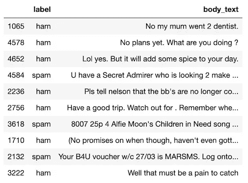
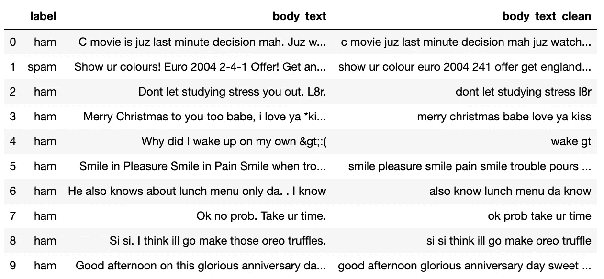
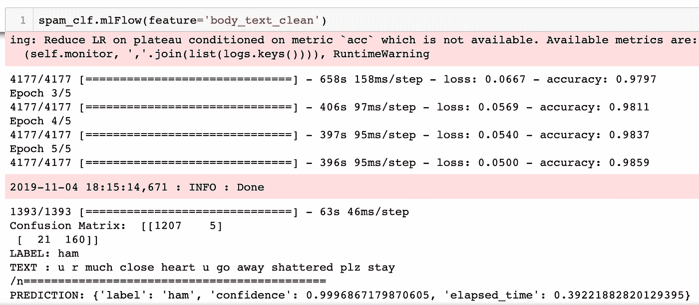
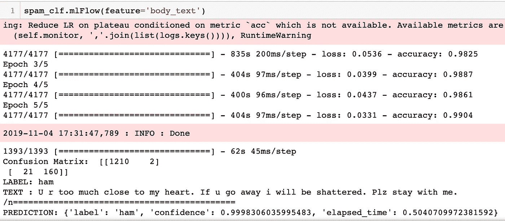
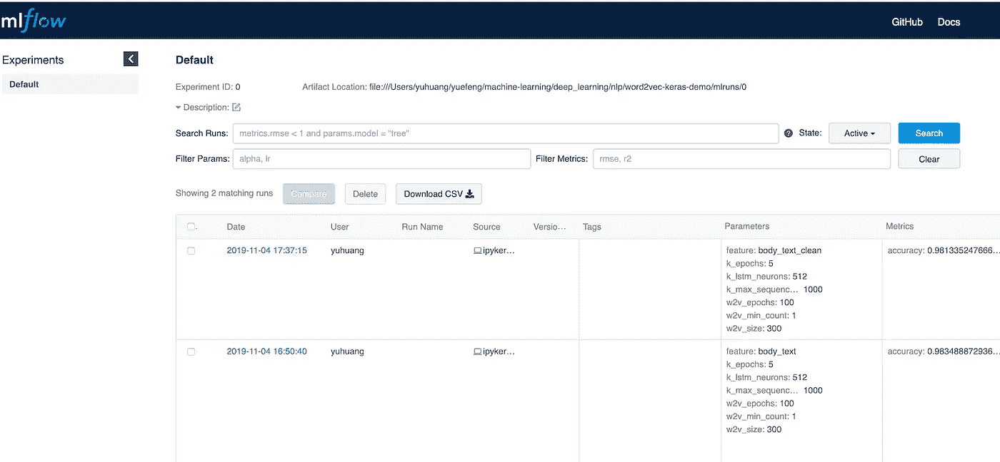

# 使用 word2vec-keras 进行自然语言处理的深度学习

> 原文：<https://towardsdatascience.com/deep-learning-for-natural-language-processing-using-word2vec-keras-d9a240c7bb9d?source=collection_archive---------16----------------------->

## 结合 Word2Vec 和 Keras LSTM 的自然语言处理深度学习方法


[自然语言处理(NLP)](https://en.wikipedia.org/wiki/Natural_language_processing) 是语言学、计算机科学、信息工程、人工智能等多个研究领域共有的研究子领域。NLP 通常关注计算机和人类自然语言之间的交互，特别是如何使用计算机来处理和分析自然语言数据(例如，文本、语音等)。).NLP 中的一些主要挑战包括语音识别、自然语言理解和自然语言生成。

文本是自然语言处理数据最广泛的形式之一。它可以被视为字符序列或单词序列，但随着深度学习的进步，趋势是在单词级别上工作。给定一个单词序列，在它能够被机器学习或深度学习算法/模型(如 LSTM)理解之前，它必须以某种方式转换成数字。一种直接的方法是使用[一键编码](https://en.wikipedia.org/wiki/One-hot)将每个单词映射到词汇长度的稀疏向量。另一种方法(例如， [Word2vec](https://en.wikipedia.org/wiki/Word2vec) )使用[单词嵌入](https://en.wikipedia.org/wiki/Word_embedding)将单词转换成可配置长度的紧凑向量。

在传统机器学习的 NLP 中[1]，文本数据预处理和特征工程都是必需的。最近发布了一个新的深度学习模型 [Word2Vec-Keras 文本分类器](https://pypi.org/project/word2vec-keras/)【2】，用于无特征工程的文本分类。它通过一个嵌入层将[Gensim](https://pypi.org/project/gensim/)【3】的 *Word2Vec* 模型(一个用于大型语料库的主题建模、文档索引和相似性检索的 Python 库)与 Keras LSTM 结合起来作为输入。

在本文中，与[1]类似，我使用公开的 [Kaggle 垃圾短信收集数据集](https://www.kaggle.com/uciml/sms-spam-collection-dataset) [4]来评估 *Word2VecKeras* 模型在没有特征工程的情况下在垃圾短信分类中的性能。涵盖了以下两种情况:

*   基于数据预处理的垃圾短信分类
*   无需数据预处理的垃圾短信分类

以下代码用于导入所有必需的 Python 库:

```
from word2vec_keras import Word2VecKeras
from pprint import pprint
import pandas as pd
import matplotlib.pyplot as plt
import itertools
import numpy as np
import nltk
import string
import re
import ast # abstract syntax tree: [https://docs.python.org/3/library/ast.html](https://docs.python.org/3/library/ast.html)
from sklearn.model_selection import train_test_split
import mlflow
import mlflow.sklearn%matplotlib inline
```

一旦 SMS 数据集文件 *spam.csv* 被下载到计算机上，下面的代码可以将本地数据集文件加载到 Pandas DataFrame 中，如下所示:

```
column_names = ['label', 'body_text', 'missing_1', 'missing_2', 'missing_3']
        raw_data = pd.read_csv('./data/spam.csv', encoding = "ISO-8859-1")
        raw_data.columns = column_names
        raw_data.drop(['missing_1', 'missing_2', 'missing_3'], axis=1, inplace=True)
        raw_data = raw_data.sample(frac=1.0)
        raw_data.head()
```



请注意，加载此数据集需要使用编码格式 ISO-8859–1，而不是默认的编码格式 UTF-8。

# 1.带有数据预处理的垃圾邮件分类

在本节中，首先，应用类似于[1]的数据预处理程序来清理 SMS 数据集。然后，生成的干净数据集被输入到 *Word2VecKeras* 模型中，用于垃圾短信的模型训练和预测。mlflow [5][6]用于追踪模型执行的历史。

## 1.1 数据预处理

*预处理*类的*预处理*()方法对短信原始数据进行如下预处理:

*   删除标点符号
*   标记化
*   删除停用词
*   应用词干
*   应用词汇化
*   将标记加入句子
*   删除中间数据列

```
class Preprocessing(object):
    def __init__(self, data, target_column_name='body_text_clean'):
        self.data = data
        self.feature_name = target_column_name

    def remove_punctuation(self, text):
        text_nopunct = "".join([char for char in text if char not in string.punctuation])# It will discard all punctuations
        return text_nopunct

    def tokenize(self, text):
        # Match one or more characters which are not word character
        tokens = re.split('\W+', text) 
        return tokens

    def remove_stopwords(self, tokenized_list):
        # Remove all English Stopwords
        stopword = nltk.corpus.stopwords.words('english')
        text = [word for word in tokenized_list if word not in stopword]
        return text def stemming(self, tokenized_text):
        ps = nltk.PorterStemmer()
        text = [ps.stem(word) for word in tokenized_text]
        return text

    def lemmatizing(self, tokenized_text):
        wn = nltk.WordNetLemmatizer()
        text = [wn.lemmatize(word) for word in tokenized_text]
        return text

    def tokens_to_string(self, tokens_string):
        try:
            list_obj = ast.literal_eval(tokens_string)
            text = " ".join(list_obj)
        except:
            text = None
        return text

    def dropna(self):
        feature_name = self.feature_name
        if self.data[feature_name].isnull().sum() > 0:
            column_list=[feature_name]
            self.data = self.data.dropna(subset=column_list)
            return self.data

    def preprocessing(self):
        self.data['body_text_nopunc'] = self.data['body_text'].apply(lambda x: self.remove_punctuation(x))
        self.data['body_text_tokenized'] = self.data['body_text_nopunc'].apply(lambda x: self.tokenize(x.lower())) 
        self.data['body_text_nostop'] = self.data['body_text_tokenized'].apply(lambda x: self.remove_stopwords(x))
        self.data['body_text_stemmed'] = self.data['body_text_nostop'].apply(lambda x: self.stemming(x))
        self.data['body_text_lemmatized'] = self.data['body_text_nostop'].apply(lambda x: self.lemmatizing(x))

        # save cleaned dataset into csv file and load back
        self.save()
        self.load()

        self.data[self.feature_name] = self.data['body_text_lemmatized'].apply(lambda x: self.tokens_to_string(x))

        self.dropna()

        drop_columns = ['body_text_nopunc', 'body_text_tokenized', 'body_text_nostop', 'body_text_stemmed', 'body_text_lemmatized'] 
        self.data.drop(drop_columns, axis=1, inplace=True)
        return self.data

    def save(self, filepath="./data/spam_cleaned.csv"):
        self.data.to_csv(filepath, index=False, sep=',')  

    def load(self, filepath="./data/spam_cleaned.csv"):
        self.data = pd.read_csv(filepath)
        return self.data
```

结果数据保存在新列 *body_text_clean* 中，如下所示:



在上述数据预处理中，[自然语言工具包(NLTK)](https://www.nltk.org/) 的*停用词*和 *wordnet* 数据文件都是必需的，需要在 Mac 上手动下载(此处[可用](http://www.nltk.org/nltk_data/))。 *nltk.download()* 方法无法正常工作。

## 1.2 建模

*SpamClassifier* 类的 *prepare_data* ()方法是获取准备建模的短信数据，如下所示:

*   将数据集文件 *spam.csv* 加载到 Pandas DataFrame
*   使用*预处理*类预处理原始数据(参见 *body_text_clean* 列)
*   将数据预处理后的干净数据分成训练和测试数据集
*   将训练和测试数据集重新格式化为 Python 列表，以与模型 *Word2VecKeras* API [2]保持一致

一旦数据为建模做好准备，就可以调用 *train_model* ()方法来训练 *Word2VecKeras* 模型。然后可以调用方法 *evaluate* ()和 *predict* ()来获得模型性能度量(例如，准确性)并分别执行预测。

*mlFlow* ()方法将上述方法调用、模型执行结果跟踪、将训练好的模型记录到文件中组合成一个工作流。

注意，超参数 *w2v_min_count* 的值是忽略总频率低于该值的所有单词。因此，需要根据特定的数据集进行调整。如果它设置得太高(例如，本文中使用的 SMS spam 数据集的值为 5)，则会由于空句而出现词汇错误。

```
class SpamClassifier(object):
    def __init__(self):
        self.model = Word2VecKeras()

    def load_data(self):
        column_names = ['label', 'body_text', 'missing_1', 'missing_2', 'missing_3']
        data = pd.read_csv('./data/spam.csv', encoding = "ISO-8859-1")
        data.columns = column_names
        data.drop(['missing_1', 'missing_2', 'missing_3'], axis=1, inplace=True)
        self.raw_data = data.sample(frac=1.0) 

        return self.raw_data

    def split_data(self):
        self.x_train, self.x_test, self.y_train, self.y_test = train_test_split(self.x, self.y, test_size=0.25, random_state=42)

    def numpy_to_list(self):
        self.x_train = self.x_train.tolist()
        self.y_train = self.y_train.tolist()
        self.x_test  = self.x_test.tolist()
        self.y_test  = self.y_test.tolist()

    def prepare_data(self, feature, label='label'):
        self.load_data()
        pp = Preprocessing(self.raw_data)
        self.data = pp.preprocessing()
        self.x = self.data[feature].values
        self.y = self.data[label].values
        self.split_data()
        self.numpy_to_list()

        return self.data

    def train_model(self):
        self.w2v_size = 300
        self.w2v_min_count = 1 # 5
        self.w2v_epochs = 100
        self.k_epochs = 5 # 32
        self.k_lstm_neurons = 512
        self.k_max_sequence_len = 1000

        self.model.train(self.x_train, self.y_train, 
            w2v_size=self.w2v_size, 
            w2v_min_count=self.w2v_min_count, 
            w2v_epochs=self.w2v_epochs, 
            k_epochs=self.k_epochs, 
            k_lstm_neurons=self.k_lstm_neurons, 
            k_max_sequence_len=self.k_max_sequence_len, 
            k_hidden_layer_neurons=[])

    def evaluate(self):
        self.result = self.model.evaluate(self.x_test, self.y_test)
        self.accuracy = self.result["ACCURACY"]
        self.clf_report_df = pd.DataFrame(self.result["CLASSIFICATION_REPORT"])
        self.cnf_matrix = self.result["CONFUSION_MATRIX"]
        return self.result

    def predict(self, idx=1):
        print("LABEL:", self.y_test[idx])
        print("TEXT :", self.x_test[idx])
        print("/n============================================")
        print("PREDICTION:", self.model.predict(self.x_test[idx]))

    def mlFlow(self, feature='body_text_clean'):
        np.random.seed(40)  
        with mlflow.start_run():
            self.prepare_data(feature=feature) # feature should be 'body_text' if no need to preprocessing
            self.train_model()
            self.evaluate()
            self.predict()
            mlflow.log_param("feature", feature) 
            mlflow.log_param("w2v_size", self.w2v_size)  
            mlflow.log_param("w2v_min_count", self.w2v_min_count)
            mlflow.log_param("w2v_epochs", self.w2v_epochs)
            mlflow.log_param("k_lstm_neurons", self.k_lstm_neurons)
            mlflow.log_param("k_max_sequence_len", self.k_max_sequence_len)
            mlflow.log_metric("accuracy", self.accuracy)
            mlflow.sklearn.log_model(self.model, "Word2Vec-Keras")
```

下面的代码展示了如何实例化一个 *SpamClassifier* 对象，并调用 *mlFlow* ()方法进行数据预处理建模和预测:

```
spam_clf = SpamClassifier()
spam_clf.mlFlow(feature='body_text_clean')
```

## 1.3 比较

一种简单的基线分类算法是预测类别(垃圾邮件或 ham)的大多数(即 ham)。任何有用的监督机器学习分类模型都必须在性能上打败它。在 Kaggle 垃圾短信收集数据集中，共有 5572 个样本，其中 747 个是垃圾短信，4825 个是火腿短信。因此，基准算法性能的准确率约为 86.6%。

在[1]中，首先将类似的数据预处理过程应用于相同的 Kaggle 垃圾短信数据集。然后对预处理后的数据集进行特征工程，以获得建模特征，如*文本消息长度*和*文本中标点符号的百分比。*然后 sci kit-learn*RandomForestClassifier*模型被训练用于预测。获得的准确度约为 97.7%。

在本文中，数据预处理后， *Word2VecKeras* 模型直接在预处理后的数据集上训练进行预测，不需要任何特征工程。5 个历元达到的精度约为 98.5%。



结果表明，无论是传统的机器学习方法[1]还是本文提出的新的深度学习方法，其准确率都明显优于基线算法。

# 2.无需数据预处理的垃圾邮件分类

在这一部分中，一旦 Kaggle 垃圾短信收集数据集被加载，原始数据(参见 *body_text* 列)就被直接馈送到 *Word2Vec-Keras* 模型中，用于垃圾短信的模型训练和预测。既不使用数据预处理也不使用特征工程。与上一节类似， *mlflow* [5][6】用于跟踪模型执行的历史。这是通过以下方式实现的:

```
spam_clf = SpamClassifier()
spam_clf.mlFlow(feature='body_text')
```

如下图所示，获得的 5 个历元的准确率约为 99.0%，与前一节中数据预处理的垃圾邮件分类准确率的 *Word2VecKeras* 模型性能相当。



mlflow UI 的以下快照显示了模型执行的历史:



# 摘要

在本文中，使用公开的 [Kaggle 垃圾短信收集数据集](https://www.kaggle.com/uciml/sms-spam-collection-dataset) [4]来评估新的 *Word2VecKeras* 模型在没有特征工程的情况下在垃圾短信分类中的性能。

涵盖了两个场景。一种是应用通用的文本数据预处理来清理原始数据集，然后使用清理后的数据集来训练预测模型。另一种方法直接使用未经任何数据预处理的原始数据集进行模型训练和预测。

模型在准确性方面的性能结果表明, *Word2VecKeras* 模型的性能优于传统的 NLP 方法[1],并且在上述两种情况下的性能相似。这表明新的 *Word2VecKeras* 模型具有直接应用于原始文本数据进行文本分类的潜力，而无需文本数据预处理或特征工程。

本文中的所有源代码都可以在 Github [7]中找到。

# 参考

[1].b .谢蒂，[机器学习的自然语言处理](/natural-language-processing-nlp-for-machine-learning-d44498845d5b)

[2]. [Word2Vec-Keras 文本分类器](https://pypi.org/project/word2vec-keras/)

[3]. [Gensim](https://pypi.org/project/gensim/)

[4]. [Kaggle 垃圾短信收集数据集](https://www.kaggle.com/uciml/sms-spam-collection-dataset)

[5]. [mlflow](https://www.mlflow.org/)

[6].张，[面向对象的机器学习流水线与 mlflow 熊猫和考拉数据框架](/object-oriented-machine-learning-pipeline-with-mlflow-for-pandas-and-koalas-dataframes-ef8517d39a12)

[7].[Github](https://github.com/yzzhang/machine-learning/tree/master/deep_learning/nlp/spam-classification-with-word2vec-keras)Jupyter 笔记本 Y. Zhang

披露声明:2019 首创一。观点是作者个人的观点。除非本帖中另有说明，否则 Capital One 不隶属于所提及的任何公司，也不被这些公司认可。使用或展示的所有商标和其他知识产权是其各自所有者的财产。