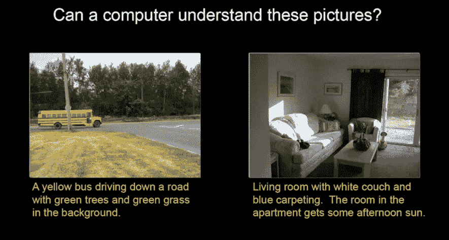
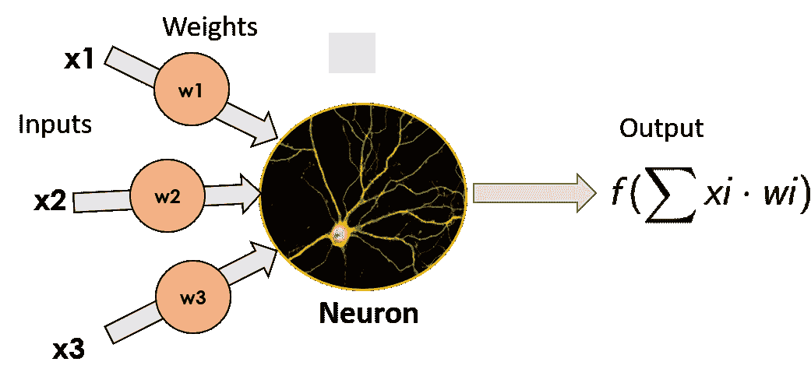
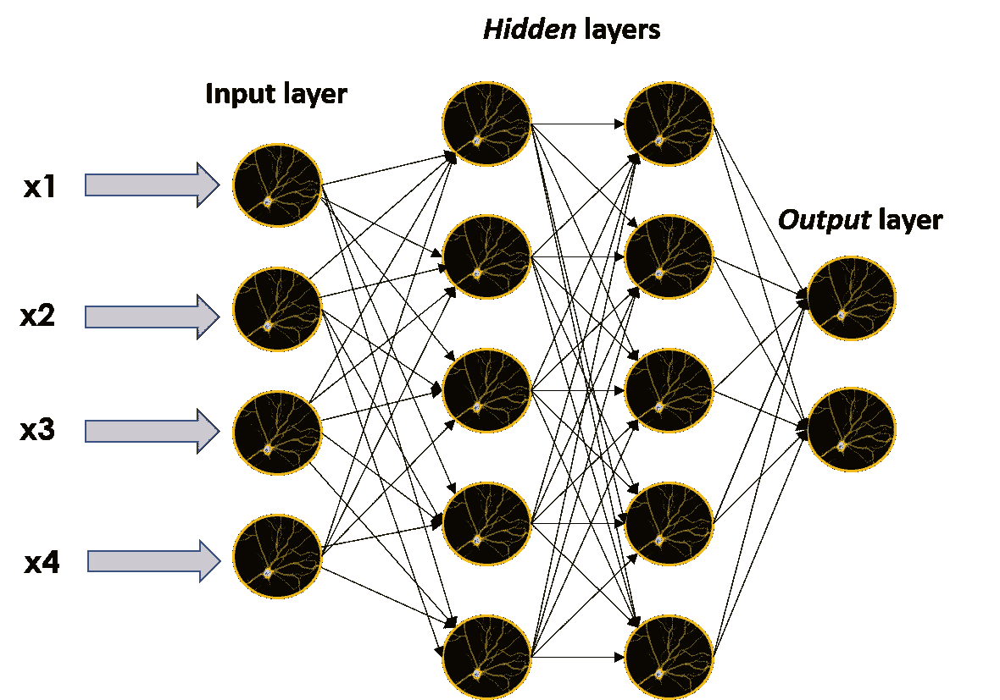
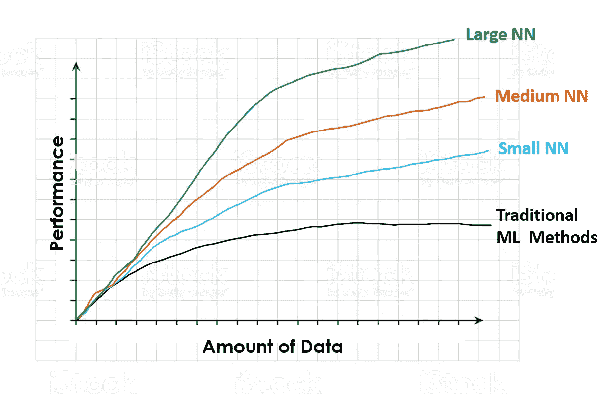
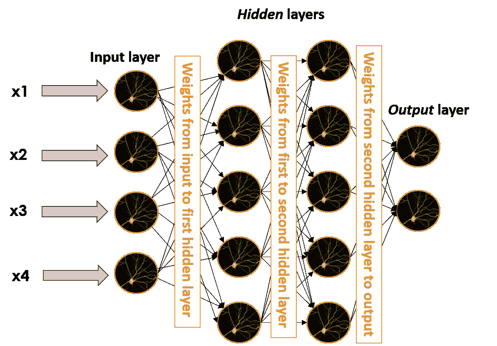
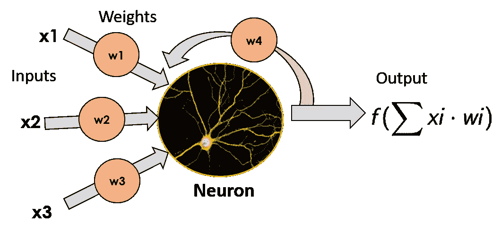
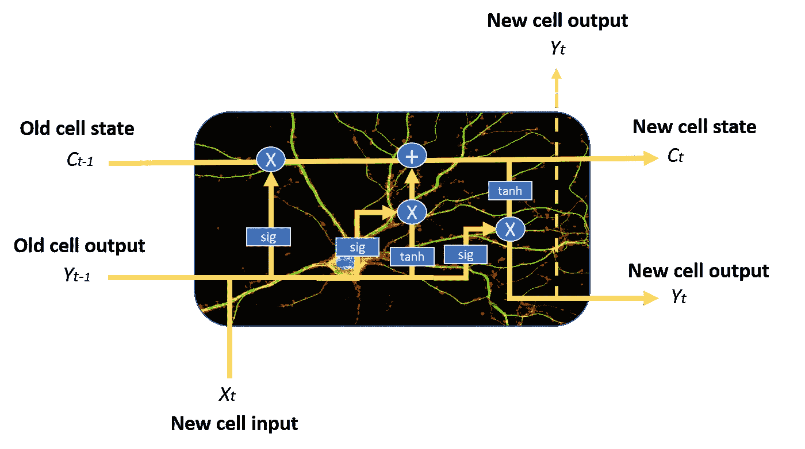

# NLP 深度学习:ANNs、rnn 和 LSTMs 解释！

> 原文：<https://towardsdatascience.com/deep-learning-for-nlp-anns-rnns-and-lstms-explained-95866c1db2e4?source=collection_archive---------9----------------------->

## 了解前所未有的人工神经网络、深度学习、递归神经网络和 LSTMs，并使用 NLP 构建一个聊天机器人！

曾经幻想过有一个自己的私人助理来回答你能问的任何问题，或者和你交谈吗？嗯，多亏了机器学习和**深层神经网络**，这一切才刚刚开始。想想苹果的 Siri 或亚马逊的 Alexa 展示的惊人功能。

不要太激动，在接下来的一系列帖子中，我们不会创建一个无所不能的人工智能，相反，我们将**创建一个简单的聊天机器人**给定一些输入信息和一个关于这些信息的问题，回答关于它被告知什么的是/否问题。

它远不及 Siri 或 Alexa 的能力，但它很好地说明了即使使用非常简单的深层神经网络结构，也可以获得惊人的结果。在本文中，我们将学习**人工神经网络，深度学习，递归神经网络和长短期记忆网络。**在下一篇文章中，我们将在一个真实的项目中使用它们来制作一个问答机器人。

在我们开始讨论神经网络的所有乐趣之前，我希望你先仔细看看**后面的图像**。里面有两幅画；一辆校车驶过一条道路，一个普通的客厅，上面有**人类注释者**的描述。

Figure with two different images with a text description made by human annotators.

完成了吗？那我们就继续吧！

# 开端——人工神经网络

为了构建用于创建聊天机器人的神经网络模型，将使用非常流行的神经网络 Python 库 **Keras** 。然而，在进一步讨论之前，我们首先必须了解什么是人工神经网络。

人工神经网络是试图模仿人脑功能的机器学习模型，人脑的结构由大量连接在其间的**神经元**构建而成，因此得名“人工神经网络

## 感知器

最简单的人工神经网络模型由一个单一的神经元组成，被称为《星际迷航》发音名称 ***感知器*** 。它是由弗兰克·罗森布拉特在 1957 年发明的，它由一个简单的神经元组成，这个神经元获取其输入的加权和(在生物神经元中是树突)对其应用数学函数，并输出其结果(输出相当于生物神经元的轴突)。我们不会深入探讨可在此应用的不同功能的细节，因为该职位的目的不是成为专家，而是获得对神经网络如何工作的基本理解。

Image of a single neuron, with the inputs on the left, the weights that multiply each input, and the neuron itself, that applies a function to the weighted sum of the inputs and outputs the result.

这些单独的神经元可以相互堆叠，形成我们想要的大小的层，然后这些层可以顺序地彼此相邻，使网络更深。

当网络以这种方式建立时，不属于输入或输出层的神经元被认为是*隐藏层的一部分，*用它们的名字描述了 ANN 的主要特征之一:它们几乎是黑盒模型；我们理解所发生的事情背后的数学原理，并对黑盒内部发生的事情有一种直觉，但如果我们获取一个隐藏层的输出并试图理解它，我们可能会绞尽脑汁，而不会获得任何积极的结果。

尽管如此，它们产生了惊人的结果，所以没有人抱怨它们缺乏可解释性。

Image of a larger neural network, composed of many individual neurons and layers: an input layer, 2 hidden layers and an output layer.

二十多年来，人们已经知道了神经网络结构以及如何训练它们。那么，是什么导致了现在正在进行的关于 ANN 和深度学习的所有大惊小怪和大肆宣传呢？这个问题的答案就在下面，但是在我们必须了解深度学习到底是什么之前。

## 那么什么是深度学习呢？

*深度学习*，正如你可能从名字中猜到的，只是使用许多层来从我们提供给神经网络的数据中逐步提取更高层次的特征。事情就是这么简单；使用多个隐藏层来增强我们的神经模型的性能。

既然我们知道了这一点，上面问题的答案就很简单了:**音阶**。在过去的二十年里，各种可用数据的数量，以及我们的数据存储和处理机器(是的，计算机)的能力，都呈指数级增长。

这些计算能力和用于训练我们模型的可用数据量的大规模增加，使我们能够创建更大、更深的神经网络，这些网络的表现优于较小的网络。

世界领先的深度学习专家之一吴恩达在这个视频[中阐明了这一点](https://www.youtube.com/watch?v=O0VN0pGgBZM&t=576s)。在其中，他展示了与下图类似的图像，并解释了拥有更多数据来训练我们的模型的好处，以及大型神经网络相对于其他机器学习模型的优势。

Image showing the evolution of the performance of different algorithms as we feed them more training data

对于传统的机器学习算法(线性或逻辑回归、SMV、随机森林等)，随着我们用更多的数据训练模型，性能会提高，直到某个点，当我们向模型提供更多数据时，性能会停止提高。当达到这一点时，就好像模型不知道如何处理额外的数据，并且不能通过输入更多的数据来提高性能。

另一方面，有了神经网络，这种情况就不会发生了。性能几乎总是随着数据的增加而提高(当然，前提是数据质量好)，并且随着网络规模的增大，性能会以更快的速度提高。因此，如果我们想要获得**的最佳性能**，我们将需要在绿线上的某个地方(**大型神经网络**)并且朝向 X 轴的右侧(**高数据量**)。

除此之外，也有一些算法上的改进，但导致深度学习和人工神经网络宏伟崛起的主要事实只是规模:**计算规模和数据规模。**

该领域的另一位重要人物**杰夫·迪恩**(谷歌采用**深度学习的发起人之一)，对深度学习有如下看法:**

> 当你听到深度学习这个词的时候，只要想到一个大型的深度神经网络就可以了。深度指的是典型的层数，所以这是一个在媒体中流行的术语。我一般认为它们是深度神经网络。

当谈到深度学习时，他强调了神经网络的**可扩展性**表明随着数据和模型的增加，结果会变得更好，这反过来需要更多的计算来训练，就像我们以前看到的那样。

## 好的，很好，我都明白了，但是神经网络实际上是如何学习的呢？

嗯，你可能已经猜到了:他们从数据中学习。

还记得在单个*感知器*中乘以我们输入的权重吗？这些权重也包含在任何连接两个不同神经元的边上。这意味着在一个更大的神经网络的图像中，它们存在于每一个单独的黑色边缘，获取一个神经元的输出，乘以它，然后将其作为输入提供给与该边缘相连的另一个神经元。

Image of a neural network with two hidden layers and the weights in between each of the layers

当我们训练神经网络(训练神经网络是让它学习的 ML 表达式)时，我们给它输入一组已知数据(在 ML 中，这称为标记数据)，让它预测我们知道的关于这些数据的特征(例如，如果一幅图像代表一只狗或一只猫)，然后将预测结果与实际结果进行比较。

随着这个过程的进行，网络会出错，它会调整神经元之间连接的权重，以减少出错的次数。正因为如此，如前所述，如果我们在大部分时间里给网络提供越来越多的数据，就会提高网络的性能。

# 从序列数据中学习——递归神经网络

现在我们知道了什么是人工神经网络和深度学习，并且对神经网络如何学习有了一点了解，让我们开始看看我们将用来构建聊天机器人的网络类型:**递归神经网络，简称 RNNs。**

递归神经网络是一种特殊的神经网络，设计用于有效处理**序列数据**。这类数据包括**时间序列**(某段时间内某些参数的值的列表)**文本文档**，可以看做是文字的序列，或者**音频，**可以看做是声音频率的序列。

RNNs 实现这一点的方法是，获取每个神经元的输出，并将其作为输入反馈给它。通过这样做，它不仅在每个时间步接收新的信息片段，而且还向这些新的信息片段添加了**先前输出**的加权版本。这使得这些神经元对之前的输入有一种*的“记忆”，因为它们以某种方式被反馈给神经元的输出量化。*

**

*A recurrent neuron, where the output data is multiplied by a weight and fed back into the input*

*作为来自先前时间步长的输入的函数的单元也被称为 ***存储单元*** 。*

*RNNs 的问题是，久而久之通过和他们获得越来越多的新数据，**他们开始“*忘记*”**他们已经看到的关于以前的数据，因为它在新数据之间得到**稀释**，从激活函数转换，和权重相乘。这意味着他们有很好的短期记忆，但在试图记住不久前发生的事情时会有一点问题(他们在过去的许多时间步骤中看到过的数据)。*

*我们需要某种长期记忆，这正是 LSTMs 所能提供的。*

# *增强我们的记忆——长短期记忆网络*

*长短期记忆网络是 RNN 的一种变体，它解决了前者的长期记忆问题。在这篇文章的最后，我们将简要解释它们是如何工作的。*

*它们拥有比普通递归神经元更复杂的细胞结构，这使得它们能够更好地调节如何从不同的输入源中学习或忘记。*

**

*Representation of an LSTM cell. Dont play attention to the blue circles and boxes, as you can see it has a way more complex structure than a normal RNN unit, and we wont go into it in this post.*

*一个 LSTM 神经元可以通过结合一个 ***细胞状态*** 和三个不同的门来做到这一点:输入门、遗忘门和输出门。在每一个时间步骤中，细胞可以决定如何处理状态向量:读取、写入或删除，这要归功于明确的门控机制。通过**输入门**，单元可以决定是否更新单元状态。通过**遗忘门**，单元可以擦除其存储器，通过**输出门**，单元可以决定是否提供输出信息。*

*LSTMs 也减轻了**爆炸和消失渐变**的问题，但那是另外一个故事了。*

***就这样**！现在我们对这些不同种类的神经网络如何工作有了一个肤浅的理解，我们可以用它来构建我们的第一个**深度学习项目！***

# ***结论***

***神经网络牛逼**。正如我们将在下一篇文章中看到的，即使只有几层的非常简单的结构也能**创建一个非常有能力的聊天机器人**。*

*哦，对了，还记得这张照片吗？*

**

*Figure with two different images with a short text description made by a neural network.*

*好吧，为了证明深度神经网络有多酷，我必须承认一些事情。我对图片的描述是如何产生的撒了谎。*

*在帖子的开始，我说过这些描述是由人类注释者做出的，然而，**事实是，这些描述每个图像上可以看到的内容的短文实际上是由人工神经网络产生的。***

***精神错乱对吗？***

*如果你想学习如何使用深度学习来创建一个令人敬畏的聊天机器人，**请关注我的 Medium** ，并关注我的下一篇帖子！*

*在那之前，保重，享受 AI！*

# *其他资源:*

*由于这篇文章中对不同概念的解释非常肤浅，如果你们中有人想更进一步继续学习，这里有一些很棒的附加资源。*

*   *[***神经网络如何端到端工作***](https://end-to-end-machine-learning.teachable.com/courses/how-deep-neural-networks-work/lectures/9533963)*
*   *[***Youtube 视频系列解释了关于神经网络如何被训练的主要概念***](https://www.youtube.com/watch?v=sZAlS3_dnk0)*
*   *[***深度学习&人工神经网络***](https://machinelearningmastery.com/what-is-deep-learning/)*

*好了，就这些，我希望你喜欢这篇文章。请随时在 LinkedIn 上与我联系，或者在 Twitter 上关注我，地址是 T2 @ jaimezorno。此外，你可以看看我在数据科学和机器学习方面的其他帖子[这里](https://medium.com/@jaimezornoza)。好好读！*

*最后，看看我关于 NLP 深度学习的其他文章:*

* [## NLP 的深度学习:用 Keras 创建聊天机器人！

### 了解如何使用 Keras 构建递归神经网络并创建聊天机器人！谁不喜欢友好的机器人…

towardsdatascience.com](/deep-learning-for-nlp-creating-a-chatbot-with-keras-da5ca051e051)  [## 自然语言处理的深度学习:单词嵌入

### 简单直观的单词嵌入

towardsdatascience.com](/deep-learning-for-nlp-word-embeddings-4f5c90bcdab5) 

此外，要获得更多学习机器学习和人工智能的资源，请查看以下 repo:

 [## 如何学习机器学习——进入 ML 的资源库

### lost 试图发现如何学习机器学习？现在是学习这项技术的大好时机，但是…

howtolearnmachinelearning.com](https://howtolearnmachinelearning.com/)*