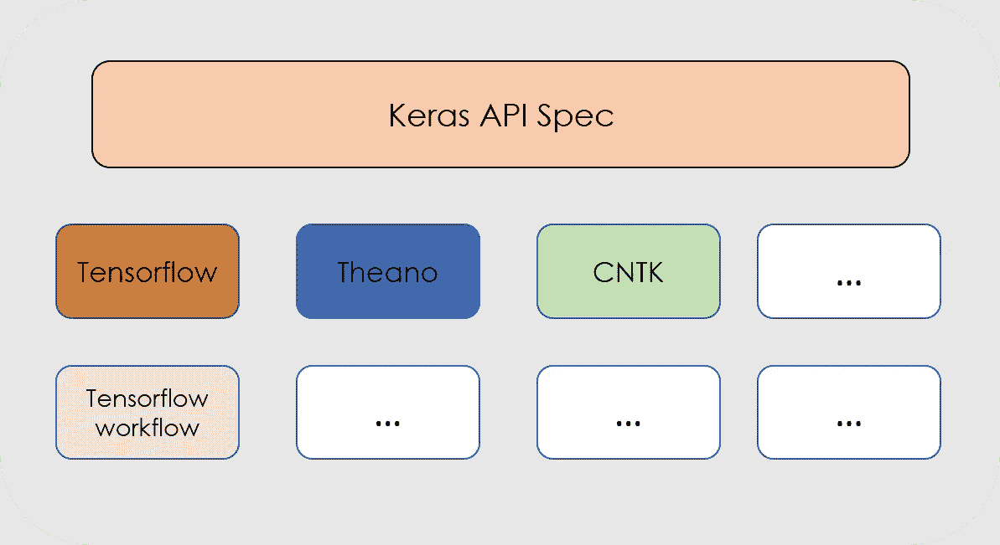
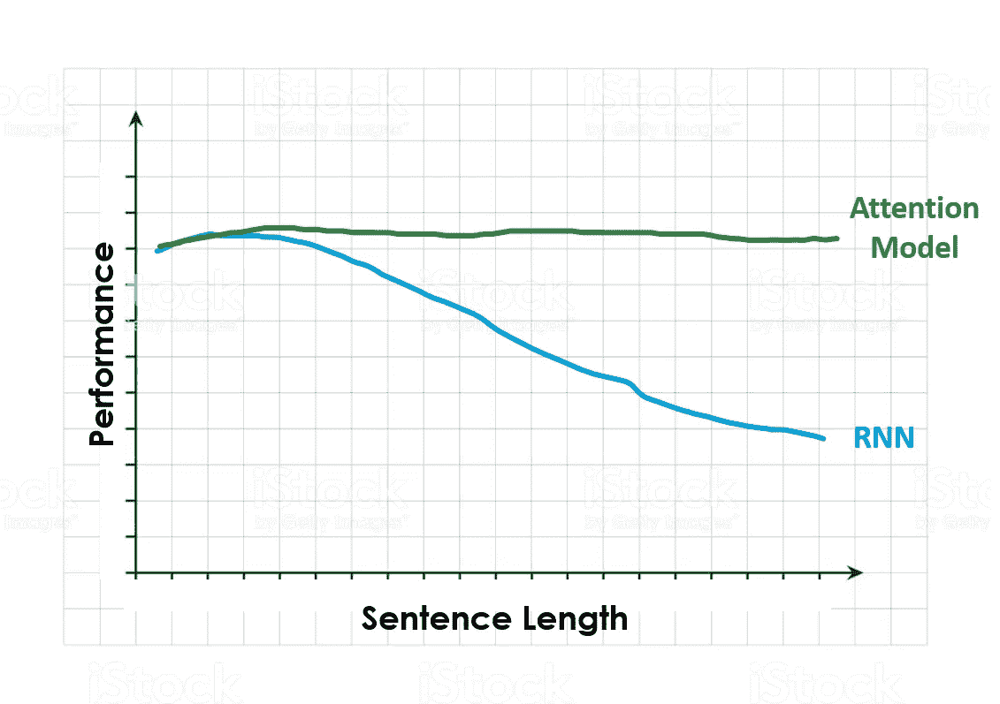
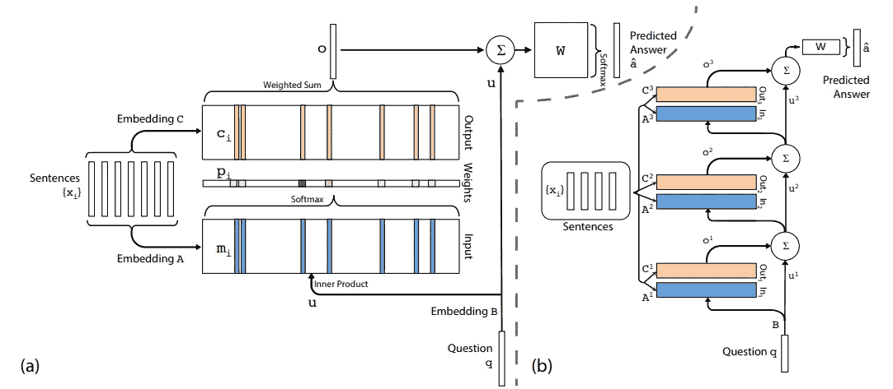

# NLP 的深度学习:用 Keras 创建聊天机器人！

> 原文：<https://towardsdatascience.com/deep-learning-for-nlp-creating-a-chatbot-with-keras-da5ca051e051?source=collection_archive---------2----------------------->

## 了解如何使用 Keras 构建递归神经网络并创建聊天机器人！谁不喜欢友好的机器人私人助理呢？


在之前的帖子中，我们了解了什么是**人工神经网络和深度学习**。此外，还介绍了一些利用文本或音频等序列数据的神经网络结构。如果你还没有看过那篇文章，你应该坐下来，喝杯咖啡，慢慢地享受它。**这里可以找到**[](/deep-learning-for-nlp-anns-rnns-and-lstms-explained-95866c1db2e4?source=friends_link&sk=3f07244ea80a8ceaf23ee8a4e8a4beea)****。****

**这篇新帖将讲述如何使用 Keras ，一个非常流行的神经网络库来构建聊天机器人。将解释这个库的主要概念，然后我们将逐步指导如何使用它来创建 Python 中的是/否**回答机器人。我们将利用 Keras 的易用性来实现 Sukhbaatar 等人的论文“*端到端存储网络*”中的 RNN 结构(你可以在这里找到)。****

**这很有趣，因为定义了一个任务或应用程序(创建一个是/否聊天机器人来回答特定的问题)，我们将学习如何**将研究工作中的见解转化为实际模型**，然后我们可以使用该模型来实现我们的应用程序目标。**

**如果这是你第一次**实现 NLP 模型**，不要害怕；我会仔细检查每一步，并在最后添加一个代码链接。对于**最佳学习体验**，我建议你首先阅读帖子，然后浏览代码，同时浏览帖子中的相关部分。**

***最后，在我们开始之前，这里有一些额外的资源可以让你的机器学习生涯突飞猛进:***

```
*Awesome Machine Learning Resources:**- For* ***learning resources*** *go to* [***How to Learn Machine Learning***](https://howtolearnmachinelearning.com/books/machine-learning-books/)*! 
- For* ***professional******resources*** *(jobs, events, skill tests) go to* [***AIgents.co — A career community for Data Scientists & Machine Learning Engineers***](https://aigents.co/)***.***
```

**让我们开始吧！**

# ****Keras:Python 中的简易神经网络****

**Keras 是一个用于开发神经网络模型的**开源高级库**。它是由谷歌的深度学习研究员弗朗索瓦·乔莱(Franç ois Chollet)开发的。它的核心原则是使构建神经网络、训练神经网络、然后使用神经网络进行预测的过程**对任何具有基本编程知识的人来说都是容易和可访问的**，同时仍然允许开发人员完全定制人工神经网络的参数。**

**基本上，Keras 实际上只是一个可以运行在不同深度学习框架之上的接口，例如 **CNTK、Tensorflow 或 Theano** 。它的工作方式是一样的，与所使用的后端无关。**

****

**Layered structure of the Keras API. As it can be seen, it can run on top of different frameworks seamlessly.**

**正如我们在上一篇文章中提到的，在神经网络中，特定层中的每个节点都采用前一层输出的加权和，对它们应用数学函数，然后将结果传递给下一层。**

**使用 Keras，我们可以创建一个表示每一层的块，其中可以轻松定义这些数学运算和层中的节点数。这些不同的层可以通过输入一行直观的**代码来创建。****

**创建 Keras 模型的**步骤如下:****

****第一步:**首先我们必须定义一个网络模型，这个模型在大多数情况下是**S*S*模型:**网络将被定义为一系列的层，每个层都有自己可定制的大小和激活功能。在这些模型中，第一层将是**输入层**，这需要我们定义我们将馈送给网络的输入的大小。之后，越来越多的层可以添加和定制，直到我们达到最终的输出层。**

```
#Define Sequential Model
model = Sequential() 
#Create input layer
model.add(Dense(32, input_dim=784))
#Create hidden layer 
model.add(Activation('relu')) 
#Create Output layer
model.add(Activation('sigmoid')) 
```

****步骤 2:** 以这种方式创建网络结构后，我们必须**对其进行编译**，这将我们之前定义的简单层序列转换为一组复杂的矩阵运算，这些运算决定了网络的行为方式。在这里，我们必须定义将用于训练网络的优化算法，并选择将被最小化的损失函数。**

```
#Compiling the model with a mean squared error loss and RMSProp #optimizer
model.compile(optimizer='rmsprop',loss='mse')
```

****第三步:**一旦完成，我们可以*训练*或 ***拟合*** 网络，这是使用前一篇文章中提到的反向传播算法完成的。**

```
*# Train the model, iterating on the data in batches of 32 samples* model.fit(data, labels, epochs=10, batch_size=32)
```

****第四步:**万岁！我们的网络训练有素。现在我们可以用它对新数据进行预测。**

**正如你所看到的，**使用 Keras 建立一个网络是相当容易的，**所以让我们使用它来创建我们的聊天机器人！上面使用的代码块并不代表实际的具体神经网络模型，它们只是帮助说明使用 Keras API 构建神经网络有多简单的每个步骤的示例。**

**你可以在它的[官方网页](https://keras.io/)找到所有关于 Keras 以及如何安装的文档。**

# **该项目:使用递归神经网络建立一个聊天机器人**

**现在我们知道了所有这些不同类型的神经网络是什么，让我们用它们来建立一个可以回答我们一些问题的聊天室。**

**大多数时候，神经网络结构比标准的输入-隐藏层-输出更复杂。有时我们可能想**发明一个我们自己的神经网络**并尝试不同的节点或层组合。此外，在某些场合，我们可能希望**实现一个我们在某处见过的模型**，比如在一篇科学论文中。**

**在这篇文章中，我们将通过第二种情况的一个例子，**从 Sukhbaatar 等人的论文"*端到端记忆网络* "** (你可以在这里找到)中构建神经模型。**

**此外，我们还将了解如何保存训练好的模型，这样我们就不必在每次想要使用我们建立的模型进行预测时训练网络。那我们走吧！**

## **模型:灵感**

**如前所述，本文中使用的 RNN 摘自论文 [" *端到端内存网络* "](https://arxiv.org/pdf/1503.08895.pdf) ，因此我建议您在继续之前先看一下，尽管我将在下面几行解释最相关的部分。**

**本文实现了一个类似 RNN 的结构，它使用一个**注意力模型**来补偿我们在上一篇文章中讨论过的关于 RNNs 的长期记忆问题。**

**不知道什么是注意力模型？不要担心，我会用简单的语言解释给你听。注意力模型吸引了很多人的兴趣，因为它们在像机器翻译这样的任务中表现非常好。他们解决了前面提到的 RNNs 的**长序列**和短期记忆的问题。**

**为了收集注意力做什么的直觉，想想人类如何将一个长句从一种语言翻译成另一种语言。**不是**拿起**whooooole**的句子，然后一口气翻译出来，而是把句子分成小块，然后一个一个地翻译这些小块。我们一部分一部分地学习这个句子，因为很难完全记住它，然后马上翻译它。**

****

**How a human would translate the text on the top from English to Spanish**

**注意力机制就是这样做的。在每个时间步中，模型在输出中给输入句子中与我们试图完成的任务更相关的部分更高的权重。这就是这个名字的来源: **it *把注意力*放在更重要的**上。上面的例子很好地说明了这一点；要翻译句子的第一部分，看整个句子或句子的最后一部分没有什么意义。**

**下图显示了当我们增加输入句子的长度时，RNN 与注意力模型的**表现。当面对一个很长的句子，并要求执行一个特定的任务时，RNN 在处理完所有的句子后，可能会忘记它最初的输入。****

****

**Performance vs Sentence Length for RNNs and Attention models.**

**好了，现在我们知道了什么是注意力模型，让我们仔细看看我们将要使用的模型的结构。这个模型接受一个**输入*Xi*(一个句子)，一个**查询 *q*** 关于这样的句子，并输出一个是/否**回答** ***一个*** 。****

****

**On the left (a) a representation of a single layer of the model. On the right (b) 3 of these layers stacked together.**

**在上一个图像的左边部分，我们可以看到这个模型的一个**单层的表示。每个句子计算两个不同的嵌入， ***A*** 和 ***C*** 。同样，使用 ***B*** 嵌入来嵌入查询或问题 q。****

**A 嵌入 ***mi*** ，然后使用内积计算问题嵌入*(这是**注意力发生的部分**，因为通过计算这些嵌入之间的**内积**，我们正在做的是从查询和句子中寻找词语的**匹配，然后使用*soft max***赋予这些匹配更多的重要性***

***最后，我们使用来自 C***【ci】***的嵌入以及从点积获得的权重或概率***【pi】***来计算输出向量*。有了这个输出向量 ***o*** ，权重矩阵 ***W*** ，以及问题*的嵌入，我们就可以最终算出预测答案 ***一个帽子*** 。*****

****为了构建**整个网络**，我们只需在不同的层上重复这些过程，使用其中一层的预测输出作为下一层的输入。这显示在上一个图像的右边部分。****

****如果这些对你来说太快了，不要担心，希望当我们通过不同的步骤**用 Python** 实现这个模型时，你会得到更好和完整的理解。****

## ****数据:故事、问题和答案****

****2015 年，脸书在 bAbI 项目中提出了一个 **bAbI 数据集**和 20 个测试文本理解和推理的任务。**文中详细描述了** [**这里**](https://arxiv.org/abs/1502.05698#) **。******

****每个任务的目标是**挑战机器文本相关活动的一个独特方面**，测试学习模型的不同能力。在这篇文章中，我们将面对这些任务中的一个，特别是“*带有单一支持事实*的 QA”。****

****下图显示了这种 QA 机器人的预期行为示例:****

```
**FACT: Sandra went back to the hallway. Sandra moved to the office. QUESTION: Is Sandra in the office?ANSWER: yes**
```

****数据集已经被分成**训练数据(10k 实例)**和**测试数据(1k 实例)**，其中每个实例都有一个**事实**，一个**问题**，以及对该问题的一个是/否**答案**。****

****现在我们已经看到了数据的结构，我们需要从数据中建立一个词汇表。在一个自然语言处理模型上，一个词汇表基本上是一组模型知道并能理解的单词。如果在构建词汇表之后，模型在句子中发现了一个不在词汇表中的单词，它要么在其句子向量中给它一个 0 值，要么将其表示为未知。****

```
**VOCABULARY:
'.', '?', 'Daniel', 'Is', 'John', 'Mary', 'Sandra', 'apple','back','bathroom', 'bedroom', 'discarded', 'down','dropped','football', 'garden', 'got', 'grabbed', 'hallway','in', 'journeyed', 'kitchen', 'left', 'milk', 'moved','no', 'office', 'picked', 'put', 'the', 'there', 'to','took', 'travelled', 'up', 'went', 'yes'**
```

****由于我们的**训练数据变化不大**(大多数问题使用相同的动词和名词，但有不同的组合)，我们的词汇量不是很大，但在**中等规模的 NLP 项目**中，词汇量可以很大。****

****考虑到为了建立一个词汇表，我们应该在大多数时候只使用**训练数据**；在机器学习项目的最开始，**测试数据应该从训练数据中分离出来**，并且在**评估已经选择和调整的模型的性能**之前不要接触。****

****构建词汇后，我们需要 ***矢量化*** 我们的数据。由于我们使用普通的单词作为模型的输入，而**计算机只能在引擎盖下处理数字**，我们需要一种方式来**表示**我们的句子，即词组，**作为数字的向量。矢量化就是这么做的**。****

****有许多向量化我们的句子的方法，像 ***单词包*** 模型，或者 ***Tf-Idf*** ，但是，为了简单起见，我们将只使用一种索引向量化技术，其中我们给词汇表中的每个单词一个从 1 到词汇表长度的唯一索引。****

```
**VECTORIZATION INDEX:
'the': 1, 'bedroom': 2, 'bathroom': 3, 'took': 4, 'no': 5, 'hallway': 6, '.': 7, 'went': 8, 'is': 9, 'picked': 10, 'yes': 11, 'journeyed': 12, 'back': 13, 'down': 14, 'discarded': 15, 'office': 16, 'football': 17, 'daniel': 18, 'travelled': 19, 'mary': 20, 'sandra': 21, 'up': 22, 'dropped': 23, 'to': 24, '?': 25, 'milk': 26, 'got': 27, 'in': 28, 'there': 29, 'moved': 30, 'garden': 31, 'apple': 32, 'grabbed': 33, 'kitchen': 34, 'put': 35, 'left': 36, 'john': 37}**
```

****考虑到这种矢量化是使用随机种子开始的，所以即使你使用和我一样的数据，**你也可能为每个单词得到不同的索引**。不用担心；这不会影响项目的结果。此外，我们的词汇表中的单词有大写和小写；在进行这种矢量化时，为了统一，所有的单词都将**小写**。****

****在此之后，**由于 Keras 的工作方式**，我们**需要填充**句子。这是什么意思？这意味着我们需要搜索最长句子的长度，将每个句子转换为该长度的向量，并用零填充每个句子的字数和最长句子的字数之间的差距。****

****这样做之后，数据集的一个随机句子应该看起来像这样:****

```
**FIRST TRAINING SENTENCE VECTORIZED AND PADDED:
array([ 0,  0,  0,  0,  0,  0,  0,  0,  0,  0,  0,  0,  0,  0,  0,  0,  0,
        0,  0,  0,  0,  0,  0,  0,  0,  0,  0,  0,  0,  0,  0,  0,  0,  0,
        0,  0,  0,  0,  0,  0,  0,  0,  0,  0,  0,  0,  0,  0,  0,  0,  0,
        0,  0,  0,  0,  0,  0,  0,  0,  0,  0,  0,  0,  0,  0,  0,  0,  0,
        0,  0,  0,  0,  0,  0,  0,  0,  0,  0,  0,  0,  0,  0,  0,  0,  0,
        0,  0,  0,  0,  0,  0,  0,  0,  0,  0,  0,  0,  0,  0,  0,  0,  0,
        0,  0,  0,  0,  0,  0,  0,  0,  0,  0,  0,  0,  0,  0,  0,  0,  0,
        0,  0,  0,  0,  0,  0,  0,  0,  0,  0,  0,  0,  0,  0,  0,  0,  0,
        0,  0,  0,  0,  0,  0,  0,  0, 20, 30, 24,  1,  3,  7, 21, 12, 24, 1,  2,  7])**
```

****正如我们所见，除了结尾(这个句子比最长的句子短很多)有一些数字之外，它到处都有零。这些数字是什么？嗯，它们是代表句子不同单词的索引:20 是代表单词 ***玛丽*** *，* 30 *是* ***移动了*** *，* 24 是 ***到*** ，1 是*，3 代表 ***浴室***实际的句子是:*****

```
**FIRST TRAINING SENTENCE: 
"Mary moved to the bathroom . Sandra journeyed to the bedroom ."**
```

****好了，现在我们已经准备好了数据，我们准备建立我们的神经网络！****

## ****神经网络:建立模型****

****创建网络的第一步是为输入创建 Keras 中所谓的 ***占位符*** ，在我们的例子中是**故事**和**问题**。简单地说，这些占位符是容器，在将我们的训练数据馈送到模型之前，将在其中放置这些数据。****

```
***#Example of a Placeholder
question = Input((max_question_len,batch_size))***
```

****它们必须与将要输入的数据具有相同的尺寸，并且还可以定义一个批量大小，尽管如果我们在创建占位符时不知道，可以将其留空。****

****现在我们必须创建论文中提到的**嵌入**、 **A、C 和 b、**一个嵌入将一个整数(在这种情况下是一个单词的索引)变成一个 ***d*** 维向量，其中**上下文被考虑到**。单词嵌入在自然语言处理中被广泛使用，并且是近年来使该领域取得巨大进步的技术之一。****

```
**#Create input encoder A:
input_encoder_m = Sequential()
input_encoder_m.add(Embedding(input_dim=vocab_len,output_dim = 64)) 
input_encoder_m.add(Dropout(0.3))#Outputs: (Samples, story_maxlen,embedding_dim) -- Gives a list of #the lenght of the samples where each item has the
#lenght of the max story lenght and every word is embedded in the embbeding dimension**
```

****上面的代码是论文中嵌入的一个例子(一个嵌入)。像在 **Keras** 中一样，我们首先定义模型(顺序的)，然后添加嵌入层和丢弃层，通过触发网络的节点来减少模型过拟合的机会。****

****一旦我们为输入句子创建了两个嵌入，并为问题创建了嵌入，我们就可以开始定义模型中发生的操作。如前所述，我们通过在问题嵌入和故事嵌入之间做**点积**来计算关注度，然后做一个 softmax。下面的程序块显示了这是如何实现的:****

```
**match = dot([input_encoded_m,question_encoded], axes = (2,2))
match = Activation('softmax')(match)**
```

****在此之后，我们需要计算将匹配矩阵与第二个输入向量序列相加的输出 ***o*** ，然后使用该输出和编码的问题计算**响应**。****

```
**response = add([match,input_encoded_c])
response = Permute((2,1))(response)
answer = concatenate([response, question_encoded])**
```

****最后，一旦完成，我们添加模型的其余层，添加一个 **LSTM** 层(而不是论文中的 RNN)，一个 dropout 层和一个最终的 softmax 来计算输出。****

```
**answer = LSTM(32)(answer)
answer = Dropout(0.5)(answer)
#Output layer:
answer = Dense(vocab_len)(answer) 
#Output shape: (Samples, Vocab_size) #Yes or no and all 0s
answer = Activation('softmax')(answer)**
```

****这里注意，输出是一个词汇量大小的向量(即模型已知的单词数的长度)，其中除了索引**‘yes’和‘no’处的位置外，所有位置都应该为零。******

## ****从数据中学习:训练模型****

****现在我们准备编译模型，并训练它！****

```
**model = Model([input_sequence,question], answer)
model.compile(optimizer='rmsprop', loss = 'categorical_crossentropy', metrics = ['accuracy'])**
```

****有了这两行，我们**构建最终模型**，并编译它，也就是说，通过指定一个**优化器**、一个**损失函数**和一个**度量**来优化，定义所有将在后台进行的数学运算。****

****现在是训练模型的**时间，这里我们需要定义训练**的**输入(输入故事、问题和答案)、我们将向模型提供的**批量**(即，一次有多少输入)，以及我们将训练模型的**时期数**(即，模型将经历多少次训练数据以更新权重)。我使用了 1000 个历元，获得了 98%的准确率，但即使使用 100 到 200 个历元，你也应该得到一些相当好的结果。******

****请注意，根据您的硬件，此培训可能需要一段时间。放松，坐好，继续阅读，直到完成。****

****完成培训后，你可能会疑惑*“我每次想用这个模型时都要等这么久吗？”*很明显我朋友的答案是， ***没有*** 。Keras 允许开发者**保存它已经训练好的某个模型**，以及权重和所有配置。下面的代码块显示了这是如何实现的。****

```
**filename = 'medium_chatbot_1000_epochs.h5'
model.save(filename)**
```

****现在，当我们想使用这个模型时就像**加载**一样简单，就像这样:****

```
**model.load_weights('medium_chatbot_1000_epochs.h5')**
```

****酷酷。现在我们已经训练好了我们的模型，让我们看看它在新数据上的表现，然后**用它玩一会儿！******

## ****查看结果:测试和播放****

****让我们看看我们的模型在测试数据上表现如何！****

```
**pred_results = model.predict(([inputs_test,questions_test]))**
```

****这些结果是**一个数组**，如前所述，它在每个位置包含词汇表中每个单词成为问题答案的概率。如果我们看这个数组的第一个元素，我们会看到一个**词汇**大小的向量，其中除了对应**是或否**的时间以外，所有时间都接近 0。****

****在这些中，如果我们选择数组的最高值的**索引，然后查看它对应于哪个单词，我们应该**找出答案**是肯定的还是否定的。******

****我们现在可以做的一件有趣的事情是**创造我们自己的故事和问题**，并把它们喂给机器人看他说什么！****

```
**my_story = 'Sandra picked up the milk . Mary travelled left . '
my_story.split()
my_question = 'Sandra got the milk ?'
my_question.split()**
```

****我以某种方式创造了一个故事和一个问题**类似于我们的小 bot 在**之前看过的，在改编成神经网络想要的格式后 bot 回答了' ***YES*** '(小写 tough，他没有我热情)。****

****让我们尝试一些不同的东西:****

```
**my_story = 'Medium is cool . Jaime really likes it. '
my_story.split()
my_question = 'Does Jaime like Medium ?'
my_question.split()**
```

****这次的回答是:' ***当然有，谁没有呢？***’****

****开个玩笑，我没有尝试故事/问题的组合，因为其中的许多单词不在我们的小答录机的词汇中。此外，他只知道如何说“是”和“不是”，通常不会给出任何其他答案。**然而，有了更多的训练数据和一些变通办法，这很容易实现。******

****今天到此为止！我希望你们能像我喜欢写这篇文章一样喜欢读这篇文章。祝你愉快，保重，享受人工智能！****

****你可以在我的 [Github](https://github.com/jaimezorno/Deep-Learning-for-NLP-Creating-a-Chatbot/blob/master/Deep%20Learning%20for%20NLP-%20Creating%20a%20chatbot.ipynb) 页面找到代码和数据。****

## ****其他资源:****

****如果你想更深入地了解注意力模型，或者理解我提到的一些单词矢量化技术，请查看我为你整理的这些额外资源。尽情享受吧！****

****注意力机制和记忆网络初学者指南****

****[Andrew 的 Ng 视频与对注意力模式的直觉。](https://www.youtube.com/watch?v=SysgYptB198&t=486s)****

****[Tf-Idf 入门指南和文字袋](https://skymind.ai/wiki/bagofwords-tf-idf)。****

****[Keras 构建相同模型的指南。](https://keras.io/examples/babi_memnn/)****

******好好读！******

****有关机器学习和数据科学的更多资源，请查看以下资源库: [**如何学习机器学习**](https://howtolearnmachinelearning.com/books/machine-learning-books/) ！有关职业资源(工作、事件、技能测试)，请访问 AIgents.co[**——一个数据科学家&机器学习工程师**](https://aigents.co/) 的职业社区。****

****最后，看看我关于 NLP 深度学习的其他文章:****

****[](/deep-learning-for-nlp-anns-rnns-and-lstms-explained-95866c1db2e4) [## NLP 的深度学习:ann，RNNs 和 LSTMs 解释！

### 了解人工神经网络，深度学习，循环神经网络和 LSTMs 前所未有地使用…

towardsdatascience.com](/deep-learning-for-nlp-anns-rnns-and-lstms-explained-95866c1db2e4) [](/deep-learning-for-nlp-word-embeddings-4f5c90bcdab5) [## 自然语言处理的深度学习:单词嵌入

### 简单直观的单词嵌入

towardsdatascience.com](/deep-learning-for-nlp-word-embeddings-4f5c90bcdab5) 

尽情享受吧！

此外，要获得更多学习机器学习和人工智能的资源，请查看以下 repo:

[](https://howtolearnmachinelearning.com/) [## 如何学习机器学习——进入 ML 的资源库

### lost 试图发现如何学习机器学习？现在是学习这项技术的大好时机，但是…

howtolearnmachinelearning.com](https://howtolearnmachinelearning.com/)****