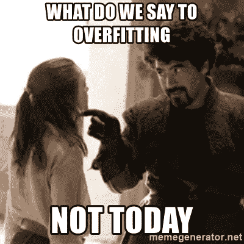
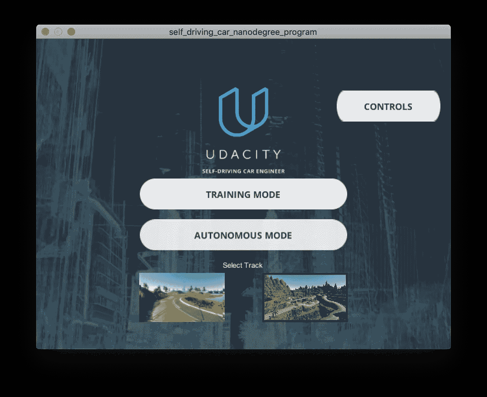
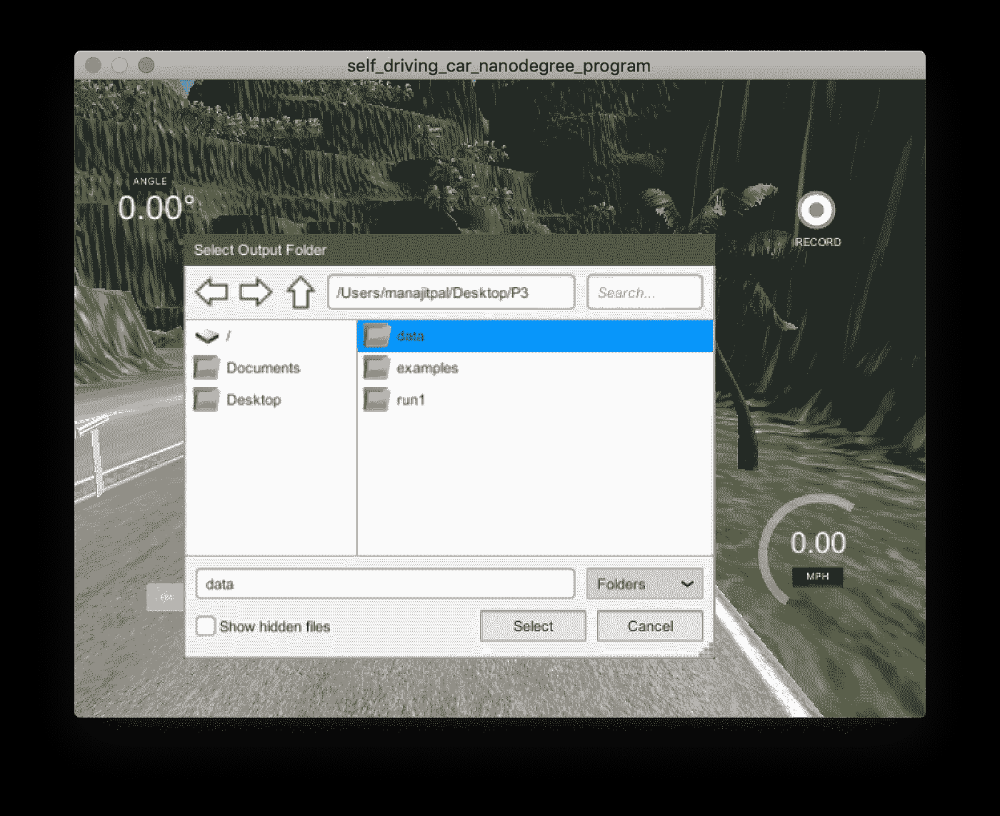
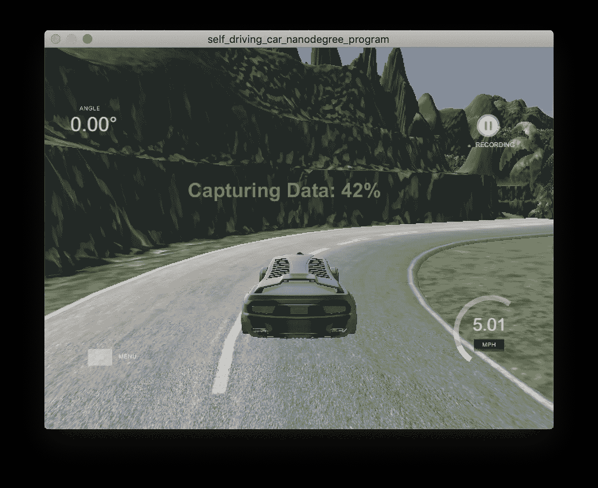
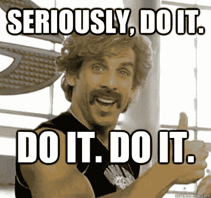
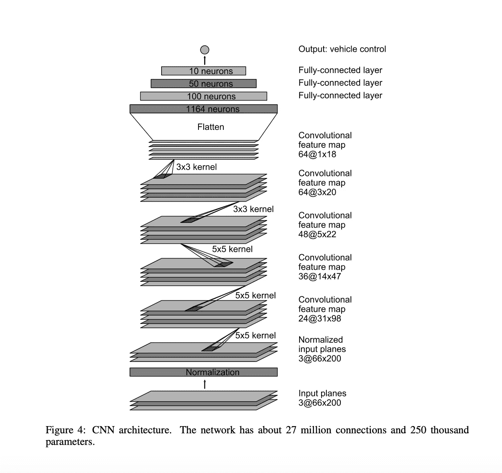

# 自动驾驶汽车的深度学习

> 原文：<https://towardsdatascience.com/deep-learning-for-self-driving-cars-7f198ef4cfa2?source=collection_archive---------3----------------------->

## 利用英伟达的研究在 Pytorch 建立自动驾驶的 CNN

# 更新 2:

这篇文章是很多年前写的，我已经不在这个领域工作了，所以如果下面的代码不起作用，我提前道歉。😅

# 更新:

非常感谢 [Valohai](https://valohai.com/) 使用我的 rusty 教程作为他们令人敬畏的机器学习平台的介绍😍。我建议你们都去看看[他们的例子](https://blog.valohai.com/self-driving-with-valohai)关于如何使用 Valohai 机器学习平台([www.valohai.com](https://valohai.com/))在云上用完全版本控制训练网络。

我们都知道自动驾驶汽车是科技巨头最热门的研究和商业领域之一。几年前看起来像科幻小说的东西，现在看起来更像是即将成为生活一部分的东西。我说“很快”的原因是因为即使像特斯拉、日产、凯迪拉克这样的公司确实有自动驾驶汽车辅助软件，但是，它们仍然需要人盯着道路，并在需要时进行控制。然而，看到我们在创新方面走了多远，技术进步有多快，这是令人着迷的。以至于现在，在基本的深度学习、神经网络魔法的帮助下，我们可以为自动驾驶建立自己的管道！激动吗？我当然是！那我们就直接进入正题吧…

**先决条件:** *1。本文假设对卷积神经网络及其工作有一个基本的了解。
2。这里提到的代码是使用 Pytorch 框架用 Python 编写的，因此建议您具备该语言和框架的基础知识。*

如果以上对你来说是胡言乱语，不要惊慌！[这个由 Udacity 提供的免费课程](https://in.udacity.com/course/deep-learning-pytorch--ud188)将为你提供你需要了解的关于深度学习和 Pytorch 基础知识的一切。

我的背景
我从脸书赞助的 Udacity 奖学金项目开始了我的深度学习之旅，通过这个项目，我从上面提到的课程中学到了 Pytorch 的基础知识。与此同时，我还参加了由 KPIT 赞助的 Udacity 自动驾驶汽车工程师纳米学位课程，在那里，作为我的项目之一，我在 Keras 为自动驾驶汽车编写了一个[端到端深度学习模型。因此，我决定用 Pytorch 重写代码，并分享我在这个过程中学到的东西。好了，我说的够多了，让我们用一件事来设置我们的机器——对过度合身说不！](https://github.com/ManajitPal/BehavioralCloning/)



**项目资源** 1。 [Udacity 的自动驾驶汽车模拟器](https://github.com/udacity/self-driving-car-sim)
2。当然还有 [Python](https://www.python.org/) 和 [Pytorch 框架](https://pytorch.org/)
3。如果你的机器不支持 GPU，那么我会推荐使用 [Google Colab](https://colab.research.google.com/) 来训练你的网络。它免费提供 GPU 和 TPU 时间！
4。如果你在收集训练数据时遇到问题，你可以使用 Udacity 提供的[来训练你的网络。
5。完整代码](https://d17h27t6h515a5.cloudfront.net/topher/2016/December/584f6edd_data/data.zip)[可在此处](https://github.com/ManajitPal/DeepLearningForSelfDrivingCars)获得，Colab 笔记本[可在此处](https://colab.research.google.com/drive/1W5I8NYsavde4iy-1uiztNKwwYw7_Pfs_)获得。6。本文提到的 Nvidia 研究论文可以在这里找到[。](https://arxiv.org/pdf/1604.07316v1.pdf)

**收集数据** Udacity 提供的数据集工作良好，但不足以让汽车在复杂的地形中行驶(就像 uda city 模拟器中的第二条赛道)。为了从 track 2 收集数据，我们首先需要在我们的项目目录中创建一个文件夹。我们姑且称这个文件夹——*数据*。现在，启动我们的模拟器。从菜单中选择第二个轨道，并转到*训练模式*选项。



The simulator main menu

一旦进入训练模式，您将在屏幕的右上角看到一个录制选项。点击图标，浏览到*数据*文件夹。按选择。



Browsing to the data folder

再次按下录制图标后，您就可以开始录制您的骑行了！现在，如果你像我一样是一个游戏新手，我会建议慢慢来，尽量确保你的车尽可能停在路中央，即使是在转弯的时候。这将有助于获得更好的训练数据，最终形成一个好的模型。我们将记录在赛道的一个方向上行驶 2 圈，以及在相反方向上行驶 2 圈，以确保转弯是反向的。这将确保我们的模型不会过度拟合，使更好的左转弯和右转弯。我们开始吧！



Capturing training data

训练数据现在存储在*数据*文件夹中。里面一个文件夹一个文件: *IMG* 和 *driving_log.csv* 。我们的下一个工作是从 CSV 文件中读取图像的名称及其相关的导向数据，并从 Python 中的 *IMG* 文件夹中加载相应的图像。

**编码时间到了！**

如果你不想在本地机器上安装不同的库和框架，或者你想利用免费的 GPU 时间，那么使用 Colab 会更好。另外，如果您不喜欢收集数据，那么您可以使用`!wget URL`导入 Udacity 的数据集，并使用`!unzip`解压缩文件。最重要的是。导入邮件头:

**读取和分割数据**

上面的代码从日志文件中读取所有内容，并将其存储到`sample` 数组中。行`next(reader, None)`带走包含列名的第一行。我们将使用这个数组将我们的数据分成训练和验证。据我所知，一个很好的实践是将 20–30%的训练数据作为验证集来比较验证损失和训练损失，这样我们可以避免过度拟合。让我们这样做:

**在数据加载器中加载图像** 现在我们已经制作了样本，是时候读取图像并对其进行扩充了。这是重要的一步，因为这将有助于推广我们的模型。但是即使对于 GPU 来说，这个过程也是计算量大且耗时的。诀窍是通过批量获取数据、扩充数据并将其发送到模型进行训练来并行化这一过程。Keras 使用 python `generators`和`fit_generator`函数实现了这个过程。在 Pytorch 中，我们将使用`Dataset`类和`Dataloader`函数来实现这个功能。为了实现这一点，我们必须重载这个类的一些函数，即`__getitem__`、 `__len__`和`__init__`函数。我们还必须定义一些扩充过程。我编写了一个基本的函数，它将拍摄一张图像，随机裁剪它，水平翻转它，同时拍摄转向数据的负片。基本上，裁剪有助于模型通过去除图像中的天空和其他分散注意力的东西来专注于道路，翻转是为了确保图像被推广到左转弯和右转弯，本质上是将汽车保持在道路的中心。其他技术可以是添加随机亮度来模拟一天的不同持续时间，在图像上叠加一层失真和噪声来模拟下雨，在道路上添加随机阴影等。但是我们现在只关注最基本的。

接下来，我们定义`Dataloader`类，并将这个`augment`函数传递给输入批量样本，连接操纵数据和图像并返回它。

注意还有一个论点叫做`transform`。我们的转换将使用一个`lambda`函数将图像数组值归一化到范围*0–1*。接下来，我们使用`Dataloader`函数将所有内容添加到一个生成器中，该生成器将在训练期间被批量调用。我们定义一个 32 的批处理大小，并在将它传递给 `DataLoader`时对它们进行洗牌。`num_workers`定义了多少工人将并行创建批处理。

**模型架构**
是时候建立我们的模型了。让我们仔细看看 Nvidia 的研究论文。继续并在新标签页中打开它。链接在上面的参考资料部分。



如果你向下滚动到 pdf 的第 5 页，你会看到他们建造的 CNN 的架构。



好吧，你这个懒人，这就是我说的形象😝。如果你看这些数字，你会看到卷积层的深度和全连接层的输入和输出特征。现在，每个特征地图都有一些提到过的内核。正如论文中提到的，Nvidia 的人使用 YUV 图像作为输入，并在前三个卷积层中使用 2×2 步幅和 5×5 内核的步长卷积，在最后两个卷积层中使用 3×3 内核大小的非步长卷积。不过有趣的是，并没有提到 maxpool 层。我试图虔诚地遵循上述架构，建立 CNN。这是我想到的:

不幸的是，这种方法有问题。也许是缺少数据，也许是缺少最大池层，网络表现得很糟糕。即使在直道上，汽车也总是偏离道路。经过谷歌搜索，我发现了这个回购协议。这里使用的模型是 Nvidia 架构的简化版本。我试过了，当用足够多的纪元训练时，效果非常好。所以对我来说，最后的架构是这样的:

但是，您可以随意试用带有 maxpool 层的第一个模型。它需要一些计算填充和输出的高度和宽度。让我们花点时间来看看这里的一些东西-
*a)*`*nn.Module*`*-*py torch 中使用了`nn.Module`类来创建 CNN。我们必须过载`__init__()`和`forward()`功能来构建网络。为了避免编写重复的代码，我使用了`nn.Sequential()`。无论`nn.Sequential()`函数中有什么，都会被顺序应用于输入。很漂亮，是吧？ *a) elu 激活-* 这里使用的激活函数是 elu(指数线性单位)。与 relu(校正线性单元)不同，elu 加快了训练过程，还解决了消失梯度问题。更多细节和 elu 函数的方程式可在此处找到[。](http://image-net.org/challenges/posters/JKU_EN_RGB_Schwarz_poster.pdf)
*b)图像展平-* 卷积层的输出在传递到全连接层之前的展平用下面的行完成:`output.view(output.size(0), -1)`。

**优化器和标准**
接着，本文还讨论了使用均方误差损失作为标准和 Adam 优化器。让我们把它编码出来！我把学习率设为 0.0001。可以做相应的调整。

嗯，我们有进展了。在我们编写最后的训练和验证部分之前，让我们进入 GPU 的世界吧！

**Pytorch 和 CUDA** Pytorch 提供了与支持 CUDA 的 GPU(对不起 AMD)的轻松集成。这是通过一个简单的`device()`函数完成的。它可以极大地加快训练过程，比普通 CPU 快 10 倍。为什么不利用这一点呢？为此，我们需要将数据和模型传输到 GPU 进行处理。这确实比听起来容易。我们定义了一个函数，它将对所有接收到的输入执行此操作。

请注意，我已经将它转换为`float()`,以便模型能够计算输入。

**训练**
是时候训练我们的杰作了！我们首先将模型传输到 GPU，然后，使用生成器获取数据，并将数据传输到 GPU。接下来，我们使用`optimizer.zero_grad()`函数设置优化器在反向传播过程中不累积梯度。最后，我们计算总训练损失，并除以批量大小，以获得每个时期的平均训练损失。非常简单。

**验证** 验证也是一样，但这次我们将确保我们的模型处于评估模式，这样我们就不会错误地更新梯度和反向传播错误。我们使用`model.eval()`来改变模式，并使用`torch.set_grad_enabled(False)`来确保模型不会跟踪。损失的计算方法相同。

**保存模型** 代码的最后一步到了！训练完成后，我们保存模型，以便在模拟器中自动驾驶汽车。我们制作一个`state`字典，并使用`torch.save()`将模型保存为 *.h5* 格式。

**有趣的事情开始了** 在我们开始测试我们的模型之前，我们需要一个文件来加载我们的模型，从模拟器中获取轨道的帧来处理我们的模型，并将转向预测发送回模拟器。不要害怕！我做了一个`drive.py`文件，基本上是我在项目中使用的 [Udacity 的](https://github.com/ManajitPal/BehavioralCloning/blob/master/model.py) `[drive.py](https://github.com/ManajitPal/BehavioralCloning/blob/master/model.py)` [文件](https://github.com/ManajitPal/BehavioralCloning/blob/master/model.py)的 Pytorch 版本。如果你想要不同的节流等，你可以通过代码和实验。现在，让我们复制粘贴以下代码的内容。

[](https://github.com/ManajitPal/DeepLearningForSelfDrivingCars/blob/master/drive.py) [## ManajitPal/deeplearningforself 驾驶汽车

### 这是 Nvidia 的模型在 Pytorch 中的一个实现，用于为自动驾驶汽车构建深度学习神经网络。…

github.com](https://github.com/ManajitPal/DeepLearningForSelfDrivingCars/blob/master/drive.py) 

此外，我们需要一个包含模型架构的`model.py`文件。创建文件并粘贴您的网络架构。如果你面临任何问题，可以随意看看我在回购中的`model.py`文件。

如果你一直在使用 Google Colab 编写你的代码，在同一个目录下下载`model.h5`文件。启动终端，`cd`到您的目录，用我们的模型运行脚本:

```
python drive.py model.h5 
```

如果您机器上安装了两个不同的 python 版本，请使用`python3`而不是`python`。当您看到任何弹出窗口时，单击允许。

再次打开模拟器，现在选择*自主模式*。车要像老板一样自己开！

这就对了。你自己的无人驾驶汽车管道。多酷啊！😁

这里有一个你可能会期待的小演示:

**故障排除** 你可能会看到汽车摇晃得很厉害，或者它被限制在道路的一边。这可能意味着数据没有被适当地扩充和概括。尝试获取更多的训练数据或增加更多的随机性。

你也可能看到汽车根本不动。在这种情况下，请在运行期间检查终端是否有任何错误。大多数错误应该通过安装适当的库依赖项来解决。

**结论** 非常感谢您花时间阅读我的文章。我真的希望这能帮助到想学习一些关于深度学习在自动驾驶汽车中使用的概念的人。此外，这是我第一篇与人工智能相关的文章，我是一个完全的初学者，所以如果你能在下面的评论中留下任何积极或消极的反馈，你的想法或其他你可能认为是为自动驾驶汽车构建人工智能的更好方式的资源，我将非常感激。干杯伙计们！