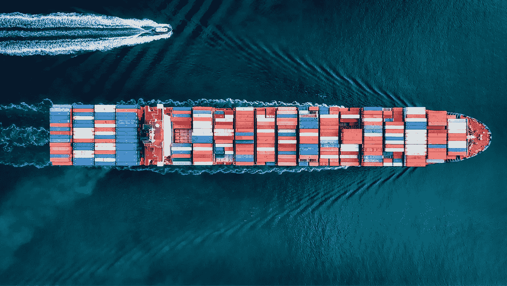
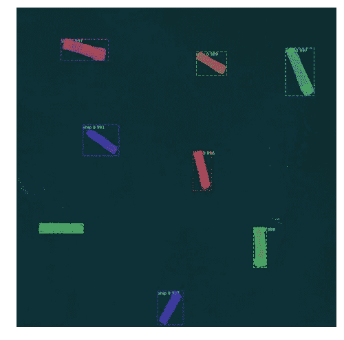
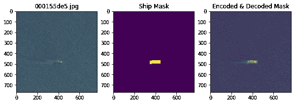
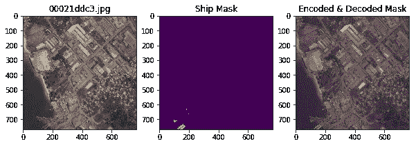
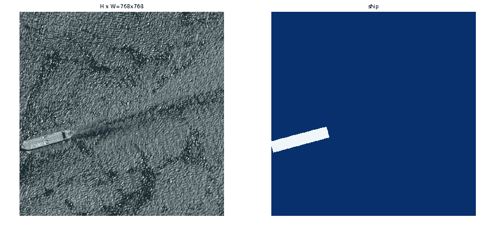
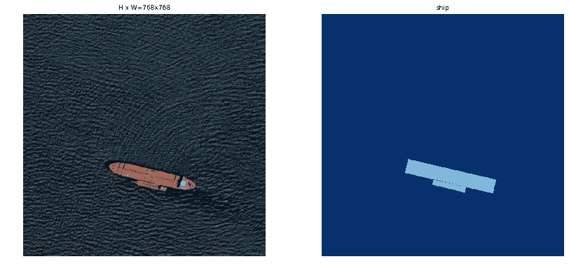
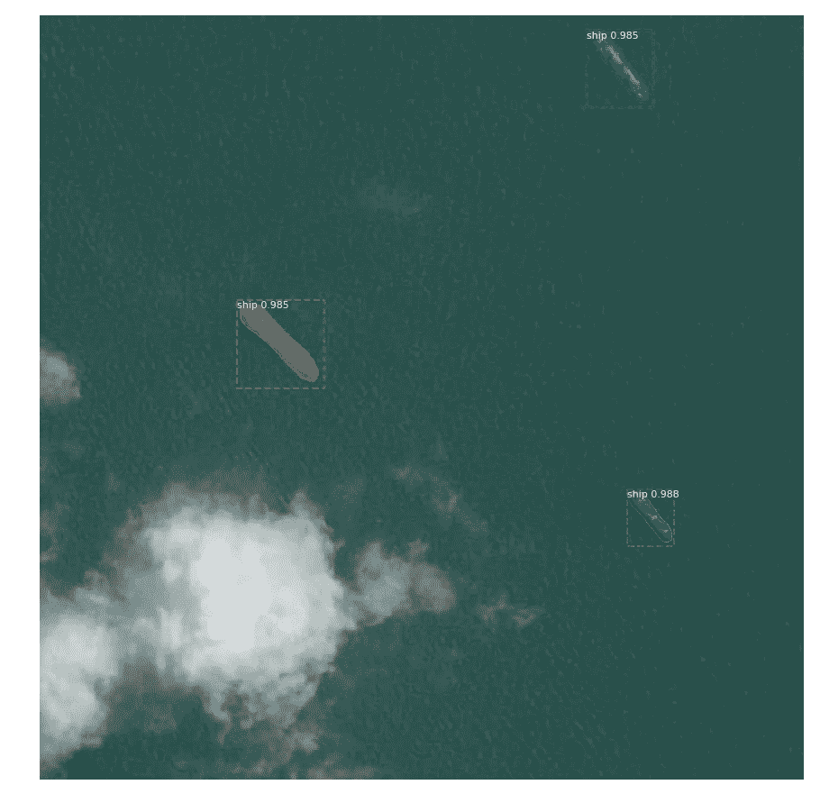
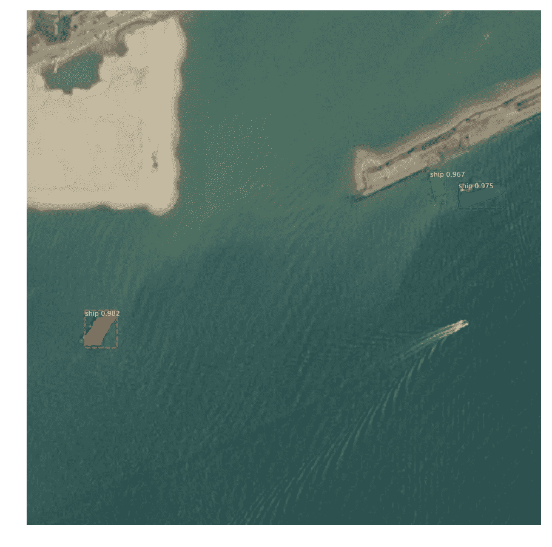
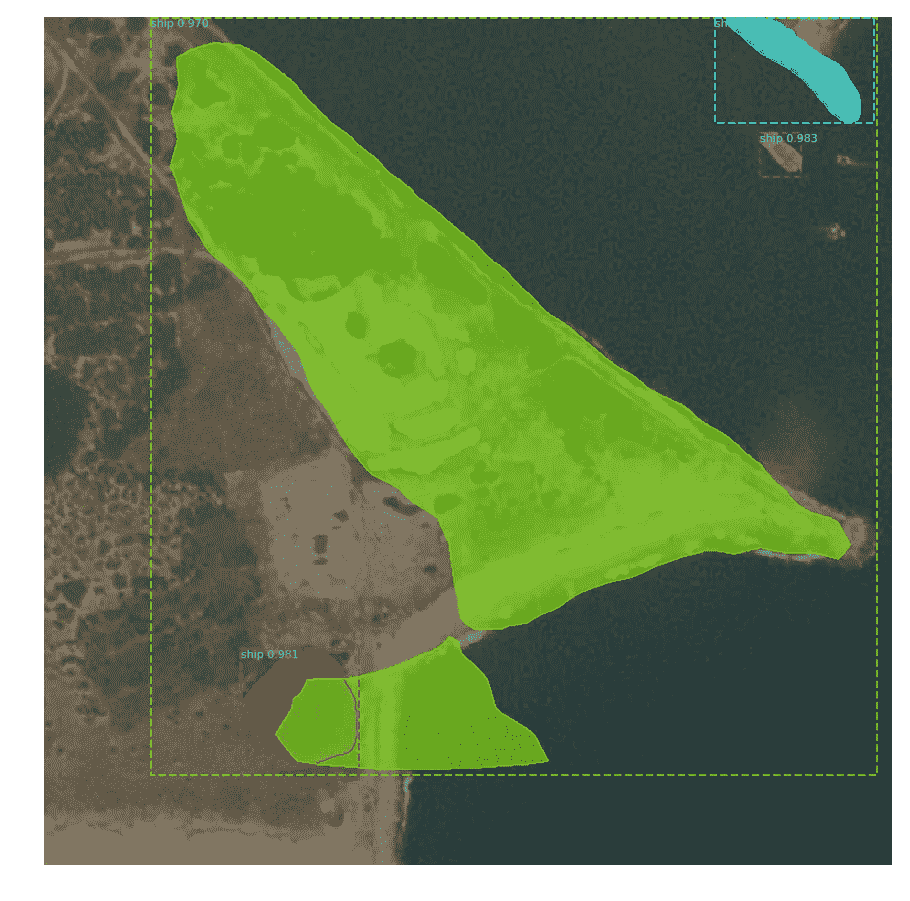
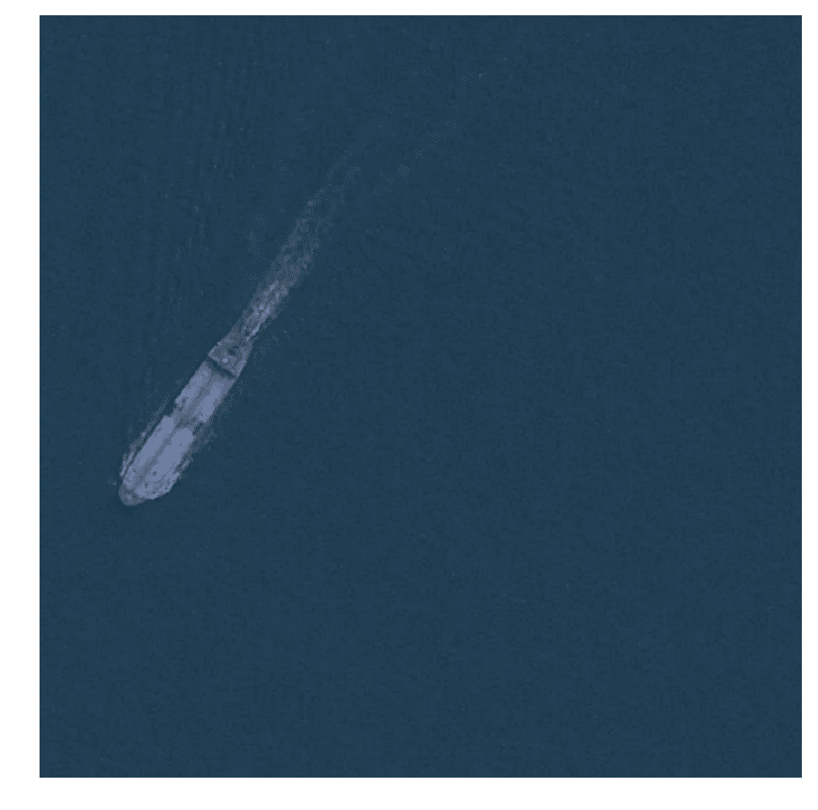

# 用于船只检测和分割的深度学习

> 原文：<https://towardsdatascience.com/deep-learning-for-ship-detection-and-segmentation-71d223aca649?source=collection_archive---------4----------------------->

## 卫星图像深度学习的端到端管道

Photo by [Cameron Venti](https://unsplash.com/@cmventi20?utm_source=unsplash&utm_medium=referral&utm_content=creditCopyText) on [Unsplash](https://unsplash.com/search/photos/ship?utm_source=unsplash&utm_medium=referral&utm_content=creditCopyText)

被困在付费墙后面？点击[这里](/deep-learning-for-ship-detection-and-segmentation-71d223aca649?source=friends_link&sk=2ce4302f0dc2ba0554a29aa13c3c5093)阅读完整故事与我的朋友链接！

从遥感图像中检测船舶是海事安全的一个重要应用，海事安全包括交通监视、防止非法捕鱼、石油排放控制和海洋污染监测等。这通常是通过使用自动识别系统(AIS)来完成的，该系统使用甚高频无线电频率向附近其他船只和陆基系统上的接收装置无线广播船只的位置、目的地和身份。

自动识别系统在监测法律要求安装甚高频应答器的船只方面非常有效，但无法检测到没有安装的船只和断开应答器的船只。那么如何检测这些不合作的船呢？这就是卫星图像可以发挥作用的地方。合成孔径雷达(SAR)图像使用无线电波对地球表面进行成像。与光学成像不同，这些仪器使用的波长不受时间或气象条件的影响，因此无论是白天还是晚上，无论是多云还是晴朗的天空，都可以获得图像。卫星正在收集这些图像，这些图像可用于制作船只检测和分割算法。

这个项目是在卡格尔举行的[空中客车船只探测挑战赛](https://www.kaggle.com/c/airbus-ship-detection/overview)的一部分。

# 挑战

建立自动识别遥感目标是否为船只的算法。该算法必须非常精确，因为生命和数十亿美元的能源基础设施正处于危险之中。

Ship detection and segmentation

# 环境和工具

1.  sci kit-学习
2.  sci kit-图像
3.  numpy
4.  熊猫
5.  matplotlib

# 数据

数据集可以从 kaggle 网站下载，可以在[这里](https://www.kaggle.com/c/airbus-ship-detection/data)找到。

# 基础

这是一个典型的实例分割问题。我在这个项目中使用过 Mask-R-CNN。

*   **图像分类**:对图像中的主要物体类别进行分类。
*   **对象检测**:识别对象类别，并使用图像中每个已知对象的边界框定位位置。
*   **语义分割**:为图像中的每个已知对象识别每个像素的对象类别。**标签是类感知的。**
*   **实例分割**:识别图像中每个已知对象的每个像素的每个对象实例。**标签是实例感知的。**

# 代码在哪里？

事不宜迟，让我们从代码开始吧。github 上的完整项目可以在这里找到[。](https://github.com/abhinavsagar/Kaggle-tutorial)

我从加载所有需要的库和依赖项开始。

接下来，我设置工作目录和文件。

我继续定义函数来显示一些带有船只遮罩和编码解码遮罩的样本图像。这里面具被用作地面真实图像。

Sample-1

Sample-3

接下来，我将图像分成两组，即训练集和验证集。

之后，我从我的分叉存储库中加载 Mask-R-CNN 模型。原来的储存库可以在这里找到[。](https://github.com/matterport/Mask_RCNN)

然后我创建了一个类，它有三个函数，分别用于加载数据集、加载蒙版和将图像作为参考。

我还为类似的工作创建了另一个启用 gpu 的类。由于巨大的数据集大小，在这种情况下使用 gpu 是必须的。作为一个额外的信息，google colab 和 kaggle 内核目前是免费的基于云的 gpu 提供商。

我继续编写脚本来加载训练数据集。

让我们想象一下到目前为止我们得到了什么。

到目前为止一切顺利。我继续从我分叉的 github 存储库中加载预训练的 coco 权重。

接下来我训练了模型。为了更快的结果，我只训练了两个时期。为了适当的融合和良好的结果，需要做的远不止这些。请随意使用这里的超参数。

# 结果

Sample Result 1

Sample Result 2

在某些情况下，当该模型检测到一个小岛或海岸岩石作为船只时，它会失败。换句话说，这个模型正在产生假阳性。

False positive

而在其他时候，该模型未能检测到船只，如下图所示。换句话说，这个模型正在产生假阴性。

False negative

# 结论

虽然这个项目还远未完成，但在如此多样的现实世界问题中看到深度学习的成功是令人瞩目的。如果我们能够检测和分割图像中的船只，这将对瑞典、挪威和加拿大等北方国家的物流和运输团队有很大的帮助。通过从卫星图像中实时跟踪船只，它可以为集装箱船和船只带来一个全新的运输层面。

# 参考资料/进一步阅读

 [## 在卫星图像中检测船只

### 使用行星卫星图像对旧金山湾的船只进行分类

medium.com](https://medium.com/dataseries/detecting-ships-in-satellite-imagery-7f0ca04e7964)  [## 使用高分辨率卫星图像和天基 AIS - IEEE 会议

### 本文介绍了 9 月在挪威北部特罗姆瑟市附近的马兰根地区进行的一项试验…

ieeexplore.ieee.org](https://ieeexplore.ieee.org/abstract/document/5730248/)  [## 大卫电视/卡格尔-空中客车-船舶-检测

### 空中客车船只探测挑战(Kaggle) -尽快在卫星图像上找到船只…

github.com](https://github.com/davidtvs/kaggle-airbus-ship-detection) 

# 在你走之前

相应的源代码可以在这里找到。

 [## abhinavsagar/ka ggle-解决方案

### Kaggle 竞赛笔记本样本。查看相应的媒体博客文章细胞核分割使用…

github.com](https://github.com/abhinavsagar/Kaggle-Solutions) 

快乐阅读，快乐学习，快乐编码。

# 联系人

如果你想了解我最新的文章和项目[，请关注我的媒体](https://medium.com/@abhinav.sagar)。以下是我的一些联系人详细信息:

*   [个人网站](https://abhinavsagar.github.io)
*   [领英](https://in.linkedin.com/in/abhinavsagar4)
*   [中等轮廓](https://medium.com/@abhinav.sagar)
*   [GitHub](https://github.com/abhinavsagar)
*   [卡格尔](https://www.kaggle.com/abhinavsagar)