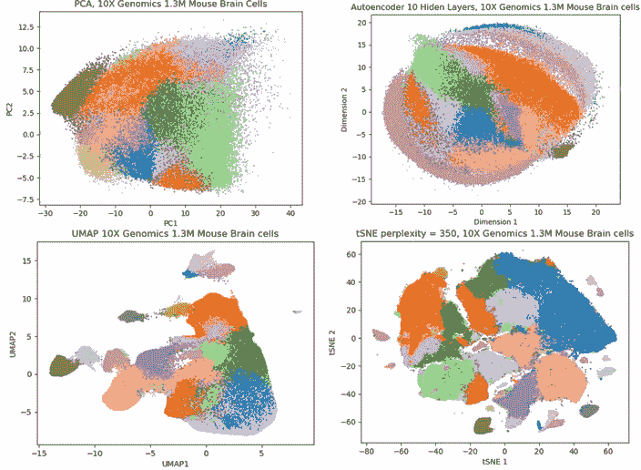

# 单细胞生物学的深度学习

> 原文：<https://towardsdatascience.com/deep-learning-for-single-cell-biology-935d45064438?source=collection_archive---------7----------------------->

## [生命科学的深度学习](https://towardsdatascience.com/tagged/dl-for-life-sciences)

## 通过深度学习解析细胞架构

[Image source](https://www.broadinstitute.org/research-highlights-human-cell-atlas)

这是系列**生命科学深度学习**的第二篇文章。在前一篇中，我展示了如何在古代 DNA 上使用[深度学习。今天是时候谈谈深度学习如何帮助细胞生物学捕捉细胞群体的多样性和复杂性了。](/deep-learning-on-ancient-dna-df042dc3c73d)

[**单细胞 RNA 测序(scRNAseq)**](https://en.wikipedia.org/wiki/Single_cell_sequencing) 几年前带来了[生命科学](https://en.wikipedia.org/wiki/List_of_life_sciences)的革命，带来了**前所未有的分辨率**来研究细胞群体中的**异质性**。影响如此巨大，以至于《科学》杂志宣布 scRNAseq 技术为 2018 年的[突破。主要的进步是认识到尽管生物细胞在显微镜下看起来形态相似，但它们表达的基因可能非常不同，这反过来导致细胞之间的功能差异。为了捕捉这种细胞多样性，](https://vis.sciencemag.org/breakthrough2018/finalists/#cell-development)[人类细胞图谱](https://www.humancellatlas.org/)社区宣布了一个雄心勃勃的目标，要建立一个人体内存在的数万亿个细胞的综合图谱。

随着 [**10X 基因组学**](https://www.10xgenomics.com/solutions/single-cell/) 单细胞基因表达平台的发展，从几十万甚至**百万个单个细胞**中获取完整的[转录组](https://en.wikipedia.org/wiki/Transcriptome)信息几乎成为一种常规。因此，scRNAseq(连同[生物医学成像](https://en.wikipedia.org/wiki/Medical_imaging)和[基因组学](https://en.wikipedia.org/wiki/Genomics))代表了目前真正的大数据，它具有卓越的统计能力，并为应用**机器和深度学习进行单细胞数据分析**打开了新的视野。

在这里，我将简要概述该领域，阐述主要的分析挑战，并展示如何将**深度学习与 Keras 和 TensorFlow** 一起用于单细胞 RNA 测序数据分析中的无监督学习问题。

# 为什么单细胞生物学非常适合深度学习？

对一些数据进行统计分析，我们通常需要了解 a) **特征数量 p** (基因、蛋白质、遗传变异、图像像素等)之间的平衡。)，以及 b) **观察次数 n** (样本、细胞、序列等)。).人类基因组大约有 **p=20K** 蛋白质编码基因，而最近发表的 10X scRNAseq 数据集包括 [**n~1.3M**](https://community.10xgenomics.com/t5/10x-Blog/Our-1-3-million-single-cell-dataset-is-ready-to-download/ba-p/276) **和** [**n~2M**](https://www.nature.com/articles/s41586-019-0969-x?WT.ec_id=NATURE-201902&sap-outbound-id=3D6B78CB95C498488E0AB2A140F1B7A311607DA1) 个体细胞。这意味着对于 scRNAseq 来说 **n > > p** 这是一个典型的深度学习限制，即在这个限制下工作，我们可以远远超出基于线性代数的分析，并捕获 scRNAseq 数据中的高度非线性结构。

Recent studies report unprecedented scRNAseq sample sizes which is ideal setup for Deep Learning

对于其他限制，即当 n << p or n ~ p, Bayesian and Frequentist statistical frameworks, respectively, are more appropriate. In other words, working with scRNAseq data we have a luxury problem: while [过拟合](https://en.wikipedia.org/wiki/Overfitting)和缺乏可推广性是计算生物学中常见的问题时，这里对于 scRNAseq，我们必须注意**欠拟合**，即如何使用大多数数据。

不仅 scRNAseq 目前在生命科学领域蓬勃发展，而且在单细胞水平上传递其他类型信息(生物信息学术语中的组学)的技术也变得越来越普遍。研究**染色质可及区域(scATACseq)** 的最新进展产生了[具有> 100K 单细胞的数据集](https://www.ncbi.nlm.nih.gov/pubmed/30078704)。虽然单独的 scATACseq 可能无法保证发现稀有细胞群体的新方法(单细胞数据分析的主要目标)，但它为 [**与 scRNAseq**](https://www.nature.com/articles/nbt.4096) 的集成提供了巨大的潜力，从而提高了将细胞分配到特定群体的准确性。

Chromatin accessibility regions (ATACseq) is complementary for scRNAseq analysis

最后，单细胞**多组学技术** ( [CITE-seq](https://www.nature.com/articles/nmeth.4380) ， [scNMTseq](https://www.nature.com/articles/s41467-018-03149-4) 等。)，即来自相同生物细胞的多个信息来源，尚未达到 scRNAseq 典型的巨大样本量，但对于未来与深度学习的数据整合挑战而言非常有希望。

# 通过深度学习降低维度

由于 scRNAseq 分析的主要目标是发现新的细胞群体，因此在机器学习术语中，它是一种**无监督分析**。因此，用于 scRNAseq 的两个最重要的分析技术是**维度缩减和聚类**。Autoencoder 是一种无监督的人工神经网络(ANN ),具有有趣的“蝴蝶”结构，通常用于降维。与诸如主成分分析(PCA)、多维标度(MDS)、因子分析(FA)等线性技术相反。，**自动编码器执行非线性降维**，因此可以捕获单细胞数据的高度非线性结构。

Autoencoder is an Artificial Neural Network (ANN) with the “butterfly” architecture

在这里，我将使用约 8K 脐带血单核细胞(CBMCs) [CITEseq scRNAseq](https://satijalab.org/seurat/v3.0/multimodal_vignette.html) 数据集为例，展示**线性(PCA)和非线性(Autoencoder)维数缩减**技术之间单细胞分辨率的差异。请注意，下面的代码假设输入文件为表格格式，基因为列，细胞为行，文件的最后一列必须是使用您最喜欢的 scRNAseq 聚类技术获得的细胞注释。我推荐使用基于图的聚类和 [Louvaine 社区检测，](https://www.rdocumentation.org/packages/Seurat/versions/1.4.0/topics/FindClusters)这对于高维数据是健壮的，在流行的[**seura**](https://satijalab.org/seurat/get_started.html)scrna seq 工作流中实现。

为了比较，我在这里也要加上**t-分布式随机邻居嵌入(tSNE)** 图，这是 scRNAseq 领域目前的金标准非线性降维技术。tSNE 的一个问题是它[不能处理高维数据](https://blog.keras.io/building-autoencoders-in-keras.html)，比如 scRNAseq。因此，通常的做法是执行 PCA(线性！)作为**预降维**，并将输出馈入 tSNE。然而，我们可以通过使用自动编码器以非线性方式执行预降维步骤来做得更好。让我们展示两种策略的 tSNE 图:

如果你不习惯看这种图，这里一个点是一个细胞，颜色对应不同的细胞类型。你应该观察 12 个细胞群体，但是你基本上不能从 PCA 图中看到它们(细胞严重重叠),因为**线性维数减少不能解析单个细胞结构**。Autoencoder 图片看起来更好，不同的细胞群体是明显可检测的。tSNE 通常提供更清晰的小区斑点。然而，在这种特殊情况下，**自动编码器上的 tSNE 似乎提供了更密集和透明的集群**，尤其是在 PCA 图的 tSNE 中，紫色细胞群遍布蓝色集群。因此，深度学习有望提高检测新细胞群体的分辨率。

# 寻找可扩展的维度缩减

除了难以处理高维数据之外，**当细胞数量达到数十万甚至数百万时，tSNE 的伸缩性很差**。FItSNE 是 Barnes-Hut tSNE 的一个新的有前途的修改，它似乎对大量数据有更好的伸缩性。然而，在 130 万小鼠脑细胞上运行 FItSNE 时，我很难将它放入内存。特别是，我想获得高度复杂的 tSNE 图，以便检查数据的全局结构。然而，困惑= 350 是我在一个计算机集群上使用一个 256GB RAM 的节点所能达到的最大困惑。运行 FItSNE 非常简单，类似于他们在 R 中执行 tSNE 的方式(同样，Cluster 列包含单元格注释):

[**均匀流形逼近和投影(UMAP**](https://www.nature.com/articles/nbt.4314) **)** 是另一种非常有趣的非线性降维技术，目前似乎在许多方面优于 tSNE。它比 tSNE 快，与 FItSNE 一样快，但不需要那么多内存，并且它似乎可以捕获 scRNAseq 数据的局部和全局结构。也许我看到的唯一缺点是我目前正在经历的 UMAP 背后的一点不透明的数学。

最近发布了一些基于 [**变型自动编码器**](https://github.com/keras-team/keras/blob/master/examples/variational_autoencoder.py) 的有趣方法。其中之一是**[**SCVIS**](https://www.nature.com/articles/s41467-018-04368-5)这是一种神经网络，它捕捉并可视化单细胞基因表达数据中的低维结构，此外还保留了局部和全局邻居结构。为了在 130 万小鼠脑细胞上运行 SCVIS，我使用了以下命令行:**

**下面，我使用来自 10X Genomics 的 130 万小鼠脑细胞，对上述 4 种降维技术(即 PCA、tSNE / FItSNE、UMAP 和 SCVIS)进行了比较:**

****

**Comparison of dimensionality reduction techniques on 1.3M 10X mouse brain data set**

**对于上述 CITEseq 的情况，我们可以看到，与 PCA 相比，非线性维度减少技术(SCVIS、UMAP 和 tSNE / FItSNE)能够分辨 scRNAseq 数据中的所有细胞群体。在这三种技术中，UMAP 是最快的，并且提供了相当好的数据低维表示。为了更精确地计算时间，SCVIS 用了大约 6 小时，FItSNE 用了 3 小时和大量内存，UMAP 在我的笔记本电脑上用了大约 3 小时。**

**考虑到不断增长的 scRNAseq 数据量，我预测 **UMAP 和自动编码器将在未来取代 tSNE** 。**

# **带 Keras 的 scRNAseq 深度自动编码器**

**最后，在这里我将演示如何使用 Keras 从头实现并运行一个深度自动编码器。正如你将看到的，这并不难。为了避免将整个数据集加载到内存中的困难，我选择了前 19 个主成分，通过重采样，即改组基因表达矩阵并检查由置换矩阵(零假设)解释的方差百分比，我发现它们是显著的。自动编码器逐渐将维数从 19 减少到 2(自动编码器的瓶颈)，每个隐藏层减少一个维数。**

****

**Deep Autoencoder for dimensionality reduction of 1.3M 10X mouse brain cell, Keras implementation**

**我们可以看到，尽管我没有特别试图找到一个可能提供更好分辨率的神经网络的最佳配置，但细胞群体是完全可以区分的。 **Deep Autoencoder** 的一个巨大优势是，它看起来**非常快，因此可伸缩**对于大量的 scRNAseq 数据，我的笔记本电脑只花了几分钟就让模型收敛并获得了上面的图。**

# **带 TensorFlow 的 scRNAseq 深度自动编码器**

**Keras 很棒，很快，很容易，但有时我觉得我用 TensorFlow 控制神经网络要好得多。例如，使用 Keras，人们永远不会有“手动”连接节点的感觉，这是我很欣赏使用 TensorFlow 实现的理解深度。后者的一个小缺点是，像小批量学习这样有用的技巧必须在 TensorFlow 中手工编码，而在 Keras 中是自动包含的。总之，下面是 TensorFlow Deep Autoencoder 的代码和降维图:**

****

**Deep Autoencoder for dimensionality reduction of 1.3M 10X mouse brain cells, TensorFlow implementation**

**同样，低维表示看起来很有希望。通过对配置和其他超参数的一些调整，人们有可能获得更好的分辨率。同样，对于 Keras 来说，TensorFlow **自动编码器的实现速度非常快**，与 FItSNE、UMAP 和 SCVIS 制作这种降维图所用的时间相比，只需几分钟。如果出于某种原因，你的分析需要**重采样过程**，这对于 FItSNE、UMAP 和 SCVIS 来说不太可行，但对于深度学习来说应该非常简单。**

# **摘要**

**在这里，我们了解到单细胞 RNA 测序(scRNAseq)正在迅速提高我们对生物细胞中**功能多样性的理解。维度缩减**可能是典型 scRNAseq 分析背后最重要的分析工具。金标准降维技术 **tSNE** 由于 scRNAseq technologies 提供的大量数据，目前在可扩展性方面遇到了困难。**通过自动编码器和 UMAP 的深度学习**提供了目前最灵活和可扩展的方式来获得 scRNAseq 数据的低维表示，并且**很可能在未来取代 tSNE**。最后，我们已经学会了如何使用 Keras 和 TensorFlow 为巨大的 10X Genomics 1.3M 小鼠脑细胞 scRNAseq 数据集实现深度自动编码器。**

**希望你喜欢阅读这篇文章，让我在评论中知道你对人工智能和深度学习感兴趣的生命科学方向，我希望听到你的反馈。在媒体[关注我，在推特](https://medium.com/u/8570b484f56c?source=post_page-----935d45064438--------------------------------) [@NikolayOskolkov，](https://twitter.com/NikolayOskolkov)关注我，在我的 github 上查看这个帖子的完整 [Jupyter 笔记本](https://github.com/NikolayOskolkov/DeepLearningSingleCellBiology)。下一篇文章将是关于使用深度学习进行多组学生物医学数据集成，敬请关注。**