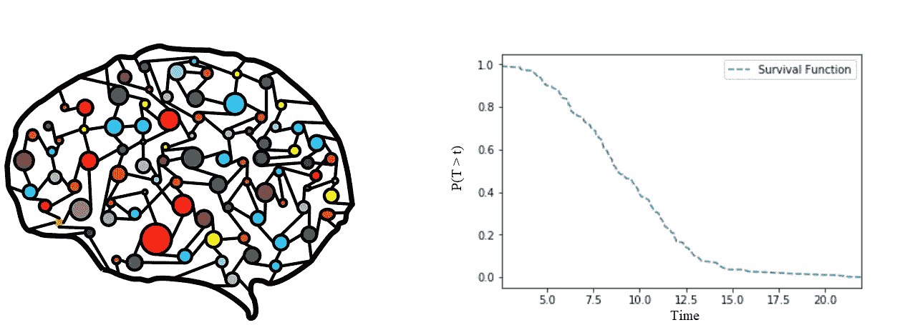
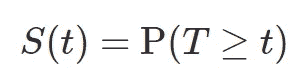
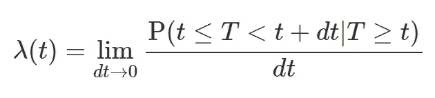
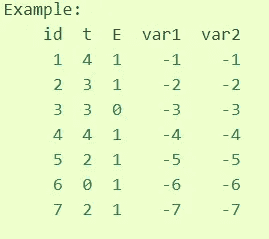
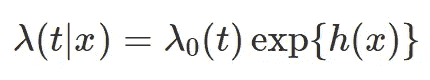
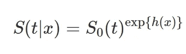
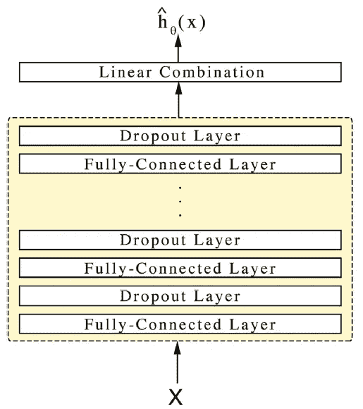
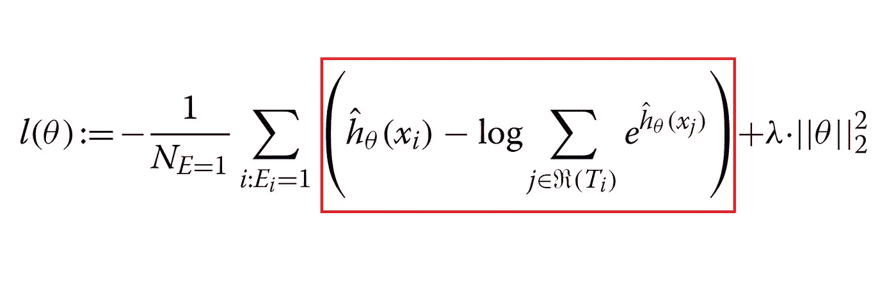

# 用于生存分析的深度学习

> 原文：<https://towardsdatascience.com/deep-learning-for-survival-analysis-fdd1505293c9?source=collection_archive---------6----------------------->

最近我得到了一个从事生存分析的机会。像任何其他项目一样，我很兴奋，并开始探索更多关于生存分析的内容。根据维基百科，

> 生存分析是统计学的一个分支，用于分析一个或多个事件发生前的预期持续时间，如生物有机体的死亡和机械系统的故障

简而言之，这是一个**时间事件分析**，它关注于感兴趣的事件发生的时间。事件可以是死亡、传感器故障或疾病的发生等。生存分析是一个热门领域，在医学、流行病学、工程学等领域有广泛的应用。

**你想知道深度学习是如何改变如此重要的领域的吗？**如果是的话，那么你来对地方了。

当我开始看一看深度学习如何被用于生存分析时，令我惊讶的是，我找不到任何好文章。我接触到的所有材料和教程都只使用了统计方法。但是当我稍微深入挖掘时，我发现涉及神经网络的生存分析的重要研究最初是由 Faraggi 和 Simon 在 1995 年发表的[5]。

## 生存分析简介

将通过理解生存分析中的关键定义从基础开始。

设 ***T*** 为随机变量，表示事件发生前的等待时间。除了通常的概率函数，我们还可以定义一些与生存分析相关的基本函数，如**生存函数**、**风险函数**等。

生存函数 ***S(t)*** 是到时间 *t* 感兴趣的事件没有发生的概率。属性包括 *S(0) = 1* 、 *S(∞) = 0* 、 *S(t)* 为非递增*。*

并且危险函数 ***λ(t)*** 可以被视为事件在时间 *t* 瞬间发生的概率，假设事件在时间 *t* 之前没有发生。

## 生存分析数据集

需要注意的一个关键点是，我们不是在处理一个通常带有标签的数据集。**生存分析的数据不同于标准回归或分类问题**。在生存分析中，我们处理的是删失数据。删失是一种缺失数据问题。

每当我们进行生存分析时，都会得到一个学习周期内的训练数据。**如果被研究对象在研究期内没有经历该事件会怎样？**。则称之为右删失数据。类似地，我们的数据集中也可以有左删失和区间删失样本。通常，我们将处理具有右删失样本的数据集。

Example dataset — `**lifelines.datasets.load_static_test**`

在上面的示例数据集中，列 *id* 标识所研究的单个对象。列 *E* 将*告诉我们数据是否被审查。换句话说，如果列 *E* 的值为 *1，*则相应的对象在研究期间经历了感兴趣的事件。这里，除了 id 为 3* 的对象外，所有对象都经历了该事件。对象 *id 3* 被右删。列 *t* 是事件发生所用的时间，在删失数据的情况下，是研究时间。列 *var1* ， *var2* 这里是对象的特征或协变量。例如，协变量可以是性别、年龄等。同时预测患者器官衰竭或心脏病发作的概率。

## 标准方法

在使用神经网络解决生存分析问题之前，我们现在将简要地研究传统的统计方法。我们可以把标准方法大致分为非参数方法、半参数方法和参数方法。

用于估计生存函数的最流行的非参数方法是**Kaplan–Meier 估计法**。最大的限制是它不能估计考虑协变量的存活率。

考虑协变量的生存数据的基本模型是**比例风险模型**。该模型由 D. Cox 教授(1972 年)提出，也被称为 **Cox 回归模型**。

Cox 比例风险模型(CoxPH)假设风险函数由两个非负函数组成:基线风险函数*【λ₀(t】*和风险比或风险得分 *r(x) = exp{h(x)}* 。风险分值被定义为对象的观察协变量对基线危害的影响。Cox 模型**使用线性函数**和潜在基线风险函数来估计对数风险函数 *h(x)* ，而不采用任何特定形式。这种半参数方法比参数方法更灵活，成为更受欢迎的选择。

这种比例风险假设也可以用生存函数来表示，如下所示。这里的 *S₀(t)* 是基线生存函数*。*

## CoxPH 适应神经网络

许多人已经尝试使用神经网络进行生存分析。随着深度学习领域的进步，最近的结果很有希望。

当涉及到用于生存分析的深度学习时，我们有两种主要的综合方法。一种方法可以看作是对 Cox 比例风险假设的修改，另一种方法使用完全参数化的生存模型。**deep surv**【1】，**Cox-Nnet**【2】将属于 CoxPH 适应方法，而**Nnet-survival**【3】，**RNN-SURV**【4】将属于第二种方法。我们将更加关注 CoxPH 适应方法，因为 Cox 模型已被证明非常有用，并且为大多数医学研究人员所熟悉[3]。

在 Cox 模型中，除了比例风险假设，我们在估计对数风险函数 *h(x)* 时还有另一个假设。我们用一个线性函数来估计 *h(x)* 。在许多情况下，例如，建模非线性基因相互作用，我们不能假设数据满足线性比例风险条件[1]。我们需要一个更复杂的非线性模型来预测对数风险函数*h(x)*，而神经网络可以满足我们的要求。

## DeepSurv

在本节中，我们将详细讨论 DeepSurv，以了解深度学习如何准确地用于生存分析。DeepSurv 是一个深度前馈神经网络，它预测由网络权重 *θ* 参数化的对数风险函数 *h(x)* 。

DeepSurv Architecture

对象的观测协变量或称为特征作为网络的输入给出。网络的隐藏层包括一个完全连接的节点层，后面是一个断开层。输出层有一个线性激活的节点，用于估计 Cox 模型中的对数风险函数。网络的损失函数如下所示。

这是损失函数背后的直觉。为了最小化损失函数，我们需要最大化每个具有可观测事件 *(E = 1)* 的对象在红框内的部分。为了最大化该部分，我们需要增加具有可观察事件的对象 *i* 的风险因子，并降低直到时间 *Ti* 之前没有经历该事件的对象 *j* 的风险因子，其中 *Ti* 是对象 *i* 经历该事件的时间。

现代深度学习技术，如缩放指数单元、Adam 优化器等。用于 DeepSurv 以获得更好的性能。Cox-nnet 与 DeepSurv 非常相似，但 Cox-nnet 和 DeepSurv 都只输出风险系数。他们没有估计基线函数。我们可以使用 Breslow 估计器等方法来生成基线函数[3]。

我前面说过，从 90 年代中期开始，人们就在尝试使用深度学习方法进行生存分析。鉴于深度学习的最新进展，在生存分析中使用深度学习的结果很有希望。当一个对象的协变量与其危险之间存在复杂关系时，深度学习技术的表现与其他最先进的生存模型一样好，甚至更好[1]。仍有很大的改进和研究空间。对于像我这样相信人工智能可以积极重塑许多重要领域的人来说，这个话题非常有趣。

这是我的第一篇文章，我希望这将是有益的。谢谢:)

## **参考文献**

[1]卡兹曼·JL、沙哈姆·U、克洛宁格·A、贝茨·J、江·T 和克鲁格·Y、 [DeepSurv](https://bmcmedresmethodol.biomedcentral.com/articles/10.1186/s12874-018-0482-1) :使用 Cox 比例风险深度神经网络的个性化治疗推荐系统(2018)，BMC 医学研究方法学

[2]程婷，朱 X，加米尔 LX， [Cox-nnet](https://journals.plos.org/ploscompbiol/article?id=10.1371/journal.pcbi.1006076) :高通量组学数据预后预测的人工神经网络方法(2018)，计算生物学

[3] Michael F. Gensheimer 和 Balasubramanian Narasimhan，[神经网络的可扩展离散时间生存模型](https://arxiv.org/abs/1805.00917) (2019)，arXiv:1805.00917

[4]埃莉诺拉·久奇利亚、安东·涅姆琴科和米哈埃拉·范德沙尔， [RNN-SURV](http://medianetlab.ee.ucla.edu/papers/RNN_SURV.pdf) :生存分析的深度循环模型(2018)，LNCS 11139–11141

[5] Faraggi D，和 Simon R，[生存数据的神经网络模型](https://onlinelibrary.wiley.com/doi/abs/10.1002/sim.4780140108) (1995)，医学统计学