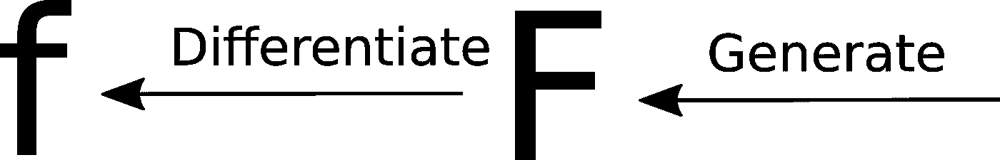

# 符号数学的深度学习

> 原文：<https://towardsdatascience.com/deep-learning-for-symbolic-mathematics-5830b22063d0?source=collection_archive---------25----------------------->

## 用于绝对精确任务的神经网络。

# 介绍

本文试图描述 Guillaume Lample 和 Franç ois Charton 的论文[“符号数学的深度学习”的主要内容。](https://arxiv.org/abs/1912.01412)

深度学习方法已经成功地用于许多任务，最常见的是大幅度提高当前的艺术水平。例子包括:

*   图像分类。(80%的把握图片显示的是一只狗)
*   翻译。(将文本从一种语言翻译成另一种语言)
*   自动驾驶。(给定当前传感器输入，向右转向 5.785 度)

Different applications of DeepLearning. Sources: Cat ([pascualamaia](https://pixabay.com/de/users/pascualamaia-4708629/?utm_source=link-attribution&amp;)), Car ( [Paul Sableman](https://www.flickr.com/photos/pasa/))

所有这些场景的共同点是，对于任何给定的输入，一定范围的输出都是可接受的:

*   图像分类。“高信心”表示为 80%还是 83%都没关系。
*   翻译。一个句子有多个有效的翻译。
*   自动驾驶。准确的转向角度并不重要，只要方向正确，幅度可以接受。

[上面提到的论文](https://arxiv.org/abs/1912.01412)探索了一种不同的场景。一种输出要么 100%正确，要么 100%不正确:求解数学表达式。

更具体地说，本文探讨了两项任务:

*   对函数进行积分
*   求解一阶或二阶常微分方程(ODE)

在本文中，我将只描述函数集成的过程。通常使用以下符号:

*   *f* 是任意函数，其积分为 *F*
*   *F* 是任意函数，它的导数是 *f*

对于积分的任务，给定一个函数 *f* 并且它的积分 *F* 是期望的答案。这个答案有多种正确的表达方式，但每种方式都是 100%正确的。其他任何表述都是 100%不正确。

# 深度学习模型:Seq2Seq

用来解决这个问题的深度学习架构被称为 [Seq2Seq](https://google.github.io/seq2seq/) 。关于它是什么以及如何工作的详细解释可以在[这里](/understanding-encoder-decoder-sequence-to-sequence-model-679e04af4346)找到。

现在您需要知道的是，Seq2Seq 模型接受任意长度的输入序列，并将其转换为任意长度的输出序列。

Input sequence in german, Output sequence translated to english.

对于功能集成任务，该模型最重要的特性是:

*   输入和输出序列可以具有任意长度，且这些长度可以不同
*   从输入序列中的项目到输出序列中的项目的一对一关系是不必要的

这两个特性使得这种模型非常适合当前的任务。输入序列是定义输入函数的符号，输出序列是定义积分的符号。

但是，我们究竟如何将数学表达式输入到这个模型中呢？

# 作为序列的数学表达式

通常数学表达式已经是序列形式，即所谓的[中缀符号](https://en.wikipedia.org/wiki/Infix_notation)。这样称呼是因为二元运算符写在它们所引用的两个参数之间。

但是，这种表示法不太适合在 seq2seq 模型中进行处理。这是因为为了使运算的顺序明确，需要大量的括号:

Top: Commonly used infix-notation. Bottom: Parenthesis for unambiguous order of operations

为了避免这个问题，本文使用了所谓的[前缀符号](https://en.wikipedia.org/wiki/Polish_notation)。要从中缀符号表达式构建前缀符号表达式，请使用以下步骤:

首先，构建一个树来捕获表达式中操作的顺序和值。

第二，按照以下规则从上到下从左到右遍历树:

*   如果当前节点是一个原始值(一个数字)，则将其添加到序列字符串中
*   如果当前节点是二元运算，则将运算符号添加到序列字符串中。然后，添加左侧子节点的表示(可以是递归的)。然后，添加右子节点的表示。

在上面的例子中，这个过程将导致表达式:

# 数据生成

每个深度学习应用程序都需要大量数据进行训练，集成符号表达式也不例外。幸运的是，有一些方法可以自动生成任意数量的训练数据。论文提出了 3 种不同的生成函数->积分对的方法。

## 向前一代

这个很简单。随机生成一个符号函数 f，然后使用外部工具计算符号整数 f。外部工具可以是像 [SymPy](https://www.sympy.org/en/index.html) 这样的库。然后将对(F，F)用作训练样本。

这种方法有两个主要缺点:

*   它依赖于一些其他的库，这些库实现了我们试图解决的完全相同的任务
*   即使使用第三方库，自动符号集成也不总是有效。这意味着在训练集中只有对(F，F)存在，对于这些对，存在可以求解 F 的积分的库，因此限制了多样性。

此外，由这种方法产生的对(F，F)具有这样的性质，即 F 通常由比 F 少得多的符号组成。这是自动符号积分如何工作的结果。

## 落后一代(BWD)

利用微分容易，积分难的事实。随机生成一个函数 F，然后将其自动微分得到函数 F。然后将(F，F)对作为训练样本。

由这种方法产生的对(F，F)具有这样的性质，即 F 通常比 F 包含更少的符号。这是自动符号微分如何工作的结果。

## 零件集成(IBP)

这种方法利用了被相乘的函数的积分的数学性质。该属性如下所示:

用这个技巧生成函数的算法:

1.  随机生成函数 F 和 G
2.  自动微分得到 f 和 g
3.  如果 Fg 已经是训练集的一部分，我们就知道它的积分。使用上面的公式计算 fG 的积分。
4.  如果 fG 已经是训练集的一部分，我们就知道它的积分。使用上面的公式计算 Fg 的积分。

## 附加步骤

在用上述方法中的一种或组合建立训练集之后，执行这两个附加步骤:

*   **简化**。表达式被简化，以强制模型也输出简化的表达式。

Simplifiying expressions

*   **删除无效表达式**。由于表达式的随机生成性质，它们可能包含无效的子术语。如果有，从表达式树中删除这些术语。

Invalid expressions are trimmed from the expression trees

# 结果

现在基础工作已经完成，让我们看看[纪尧姆·兰普尔和弗朗索瓦·查顿](https://arxiv.org/abs/1912.01412)取得的成果。

## 单台发电机的培训/测试

使用仅来自 FWD、BWD 或 IBP 中的一个的训练数据，并根据从相同方法产生的数据评估模型，产生非常好的结果:

*   前进:96.2%的准确性
*   BWD:99.7%的准确率
*   IBP:99.5%的准确率

## 与流行的数学框架相比

接下来，作者将他们的精确度与 Mathematica 、 [Maple](https://de.maplesoft.com/products/Maple/) 和 [Matlab](https://www.mathworks.com/products/matlab.html) 产生的结果进行了比较。仅评估了 BWD 发生器。结果很明显:

*   Mathematica(超时 30 秒):84.0%
*   Matlab: 65.2%
*   枫叶:67.4%
*   seq 2 序列:99.6%

seq2seq 模型明显优于 BWD 方法生成的方程的数学框架。

这是一个 Mathematica 无法解决的方程的例子。如果分母简化，Mathematica 就能成功求解积分:

Example failure case from the [original paper](https://arxiv.org/abs/1912.01412).

## 跨生成器比较

最后，作者评估了在一个生成器上使用另一个生成器的方程训练的模型。

*   接受过 FWD 培训:17.2%(BWD)，88.9%(IBP)
*   在 BWD 接受培训:27.5%(前进)，59.2%(IBP)
*   在 BWD+IBP 接受培训:56.1%(前进)

仅在一个生成器上训练模型似乎不能很好地推广到其他生成器。这可能是由于来自每个生成器的训练对(F，F)在长度方面具有不同的特性。例如长 F 和短 F，或者短 F 和长 F。

然而，根据来自所有 3 个发生器的方程训练模型工作良好:

*   接受过 FWD+BWD+IBP 培训:94.3%(FWD)，99.7%(BWD)，99.7%(IBP)

# 结论

总而言之，作者证明了神经网络方法甚至可以用于要求输出绝对精确的任务。在某些情况下，它们甚至超越了流行的数学框架。

如果你有时间，你应该读一下[原文](https://arxiv.org/abs/1912.01412)。它写得很好，很容易理解，即使没有太多的数学背景！