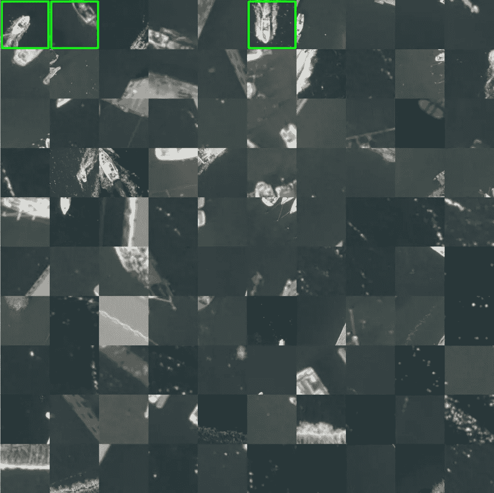
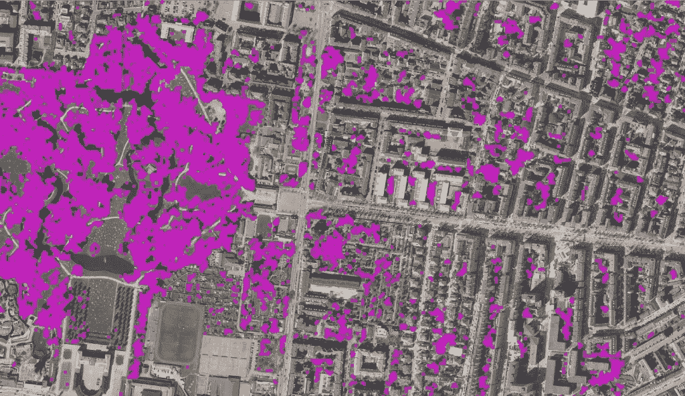

# 视觉搜索和绘图的深度学习

> 原文：<https://towardsdatascience.com/deep-learning-for-visual-searches-and-mapping-89b85061ef9e?source=collection_archive---------11----------------------->

## 通过使用预训练的神经网络减少遥感应用中对训练数据注释的需要

*深度学习是一种出色的方法，可用于卫星或航空照片等遥感数据集中的对象检测和分割/映射应用。然而，就像深度学习的许多其他用途一样，获得足够的带注释的训练数据可能非常耗时。在这篇文章中，我将介绍我们的一些工作，使用预训练的网络，以消除在注释遥感数据中的目标检测的大型训练数据集的繁琐工作。*

【2019 年 9 月中旬我参加了[北欧遥感会议](https://aias.au.dk/events/aias-conference-nordic-remote-sensing-2019-norsc19/)。从许多演讲中可以清楚地看到，深度学习已经进入了许多遥感专家的工具箱。观众对这个话题的兴趣似乎很大，并且对深度学习技术在各种应用中的影响和适用性进行了一些讨论。

讨论的一个问题是使用为一种数据(通常是自然图像)开发和训练的神经网络，并将其应用于其他类型的(遥感)数据源。例如，挪威计算中心的 ivind Due Trier 介绍了他的工作，在该工作中，为计算机视觉应用而开发的标准物体探测网络被应用于过滤后的高程图，以确定挪威考古遗址的位置。这里，来自观众的反对意见是，使用这种模型没有意义。对此我坚决不同意；尽管神经网络是为自然图像开发的，但在其他数据源上测试它也是有意义的。在这种情况下，演示者可以证明它是有效的！在我看来，甚至尝试在数据源之间进行迁移学习也是有意义的——为什么用在另一种数据集上训练的过滤器来初始化网络比随机初始化更糟糕呢？开发的模型可能太大，容易过度拟合，但是用现有的代码库和预先训练的模型做一个快速实验的好处通常是如此之大，以至于尝试一下很有意义。

在这篇文章的其余部分，我想介绍一些我们在实验室中所做的工作，应用在一个领域(ImageNet 自然图像)中训练的网络，在另一个领域(航空正射影像)中执行基于图像的搜索。希望我能让你相信这种方法是有意义的。我并不是说 ImageNet 网络可以带来最佳的结果，而是说，考虑到原本需要的注释工作量，使用跨域网络*确实有意义。*

# 视觉搜索和对训练数据的需求

深度学习或其他机器学习技术可以用于开发用于识别图像中的对象的鲁棒方法。利用飞机的正射影像或高分辨率卫星照片，这将能够对不同类型的物体进行测绘、计数或分割。然而，使用深度学习需要大量的训练数据，除非你已经有了所需对象类型的可用注册表数据(可用于从数据集中剪切训练图像的多边形数据)，否则创建这样的训练数据集是一个非常耗时的过程，因此成本也很高。

因此，在与哥本哈根市的合作中，我们向一种工具迈进了一步，这种工具可用于映射所需的对象类型**，而不需要提前创建训练数据。该工具基于亚历山德拉研究所先前的地理视觉搜索项目[背后的技术。这个在线演示的灵感很大程度上来自笛卡尔实验室开发的](https://denmark3d.alexandra.dk/geosearch/)[类似技术](https://www.descarteslabs.com/search.html)，它可以让你点击丹麦正射影像数据集上的一个地方，查看丹麦 100 个看起来最相似的地方。相似性度量是基于被训练来区分不同对象类型的神经网络来计算的。例如，单击码头或风力涡轮机将导致以下结果:**

基本上，该技术的工作原理是将数据集分成一大堆小片段(在这种情况下有 4800 万个片段)，并为每个片段运行一个经过训练的 Resnet-34 网络，以区分 ImageNet 数据集中的 1000 个不同对象。我们不使用最终分类(1000 个类别中的一个)，而是从网络中为每个切出提取一个所谓的描述符，由 2048 个数字组成。为了节省内存和减少计算负担，我们训练了一个自动编码器神经网络来将 2048 个数字压缩到 512 位。之后，来自正射影像数据集的 4800 万个图像裁剪部分可以在不到 80 毫秒的时间内与新的裁剪部分进行比较！自动编码器是为这个特定数据集训练的，这意味着它以自我监督的方式适应相关特征。

从一开始，该解决方案就有一些弱点，为了使技术更加强大，我们解决了这些弱点:

*   我们通过将提取的描述符基于具有旋转了 0、90、180 和 270 度的剪切的网络的输出来改进旋转不变性。
*   我们根据不同尺度的截断点计算了描述符。这允许你寻找不同大小的物体。
*   我们开发了一种交互式的方法来“提炼”搜索，这样映射就不仅仅是基于一个单一的参考剪裁，而是基于几个剪裁。

根据 2016 年公开发布的 12.5 厘米分辨率的丹麦春季正射影像数据集，我们计算了哥本哈根周围以下地区 3 种不同比例的 8，838，984 个裁剪图的描述符:

# 交互式映射

交互式地图目前处于原型阶段，最好用一个例子来解释:假设我们想要绘制在一个区域航行的所有船只的地图。我们首先选择包含一艘船的裁剪图:

基于存储的描述符，系统计算所选剪切部分和所有其它剪切部分之间的“距离”(相似性)。然后，进行分类，并向用户显示 100 个最相似的剪切部分:

可以看到，其中一些切口包含船只，但结果远远不够好。用户现在可以选择一些他或她满意的裁剪图:

此后，在所有选定的剪切部分和数据库中所有剪切部分的描述符之间进行比较，并再次基于它们的平均相似性距离进行分类。这就产生了以下 100 强:

可以看到显著的改善。我们可以选择运行另一次迭代搜索，方法是选择更多我们满意的裁剪部分，然后再次运行排序:

船只仍然在前 100 名之列，这是一个好现象。请注意，我们之前标记为满意的裁剪不再出现在交互式优化中。

# 从排序到映射

该迭代方法基于与在交互改进过程中选择的切出区的平均相似性距离，对所有 880 万个切出区进行排序。理想情况下，包含船只的前 N 个切口和不包含船只的其余切口之间应存在边界。然而，在实践中，更确切的情况是，前 M 个切口包含船，之后在切口 M 和切口 N 之间有一个间隔，其中一些切口而不是所有切口包含船。为了避免误报，在分类中 M 之后的截断点被假定为不包含船。我们已经创建了一个快捷的用户界面，用户可以在其中检查已排序的裁剪部分，并为 M 和 n 建立一些有用的值。

如果排序很好，并且 M 和 N 设置得很合理，那么您现在就有了由包含船只的裁剪部分组成的干净的训练数据(排序等级 <m and="" cut-outs="" that="" do="" not="" contain="" boats="" rank="">N)。这可用于训练分类网络(或可能的目标检测网络)来识别船只。然而，在我们的例子中，我们选择了测试一个更简单的用于绘制船只的启发式方法:我们从排序中的 M 之前选择了 100 个随机切出(正面例子)并且在 N 之后选择了 100 个随机切出(负面例子)。这些切口形成了 200 个例子的对比组。对于 M 和 N 之间的每个剪切点，我们已经找到了比较集中的 2 个剪切点，它们的描述符是最相似的。如果这两个切口都是正例，则切口被接受为船，切口的轮廓被保存为形状文件中的多边形。对于所有正面的例子(排序等级</m>

Zoomed in, you can see something like this (the different boxes are missing a side in the visualization for some reason):

Mapping is not perfect, but in less than a quarter of an hour the technique can give an overview of the situation. And at the same time you have also created a really good starting point for a training dataset that can be used to train a neural network or another machine learning methodology.

# Mapping trees

Repeating the same process with trees instead of boats gives a mapping that looks like this:

Zoomed in, it looks like this:

Again, the mapping is not perfect, but it provides a good starting point for further work.

I hope this post has sparked some inspiration on how objects can be localized using a pre-trained neural network, e.g. for extracting training data from maps. I am very interested in hearing about more potential use cases, so if you have ever had a need for finding certain objects in large images such as maps, please leave a comment!

Also, I am very eager to hear your ideas on how to use self-supervised methods to create an even better embedding/representation of the image patches.

*我在亚历山德拉研究所的视觉计算实验室工作；丹麦的一家非营利公司，帮助公司应用最新的 it 研究。我的实验室专注于高级计算机图形学和计算机视觉研究。我们永远欢迎合作！*