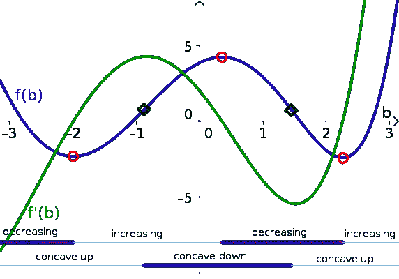

# 从程序员的角度看深度学习(又名可区分编程)

> 原文：<https://towardsdatascience.com/deep-learning-from-a-programmers-perspective-aka-differentiable-programming-ec6e8d1b7c60?source=collection_archive---------14----------------------->

## 或者为什么神经网络不再那么神经化了

2018 年的主要教训:**深度学习很“酷”**。其中一个主要原因是，DL 面临的基本问题**非常普遍**会引起大量学科的兴趣，从计算机视觉到神经机器翻译再到语音接口。更重要的是，DL 概念还可以从广泛的观点中衍生和研究**，这就是为什么你可以找到机器学习书籍和文章，它们来自[统计](https://web.stanford.edu/~hastie/Papers/ESLII.pdf)、[信息论](https://www.amazon.com/Prediction-Learning-Games-Nicolo-Cesa-Bianchi/dp/0521841089)、信号处理、数学和许多其他领域。**

神经网络本身，DL 中的关键工具，在第二次世界大战后从一种独特的混合中诞生，涉及神经生理学、控制论、行为主义心理学、电学和后来的计算工程，然后以一种或另一种形式通过多次更名幸存下来，最著名的形式是今天的“连接主义”和“深度学习”。

Source: [https://twitter.com/benblume/status/932226883764342784](https://twitter.com/benblume/status/932226883764342784).

**从业者在过去几年见证了进一步的品牌重塑**，这始于高度灵活的编程库的传播，如 [PyTorch](http://pytorch.org) 、 [Chainer](https://chainer.org/) 等等。尽管存在差异，所有这些库都有两个基本特征:(I)反向传播对于用户来说是完全自动和透明的(通过使用[自动微分](http://www.jmlr.org/papers/volume18/17-468/17-468.pdf))；以及(ii)网络和模型逻辑的代码与其他编程结构(如条件分支和循环)无缝集成。

因此，尽管它们在生物学上同名，**神经网络今天更适合程序员的思维，**及其模块化和封装的知识，而不是例如生物学家及其突触适应和化学神经递质的知识。

这种观点的转变有很多名字，最著名的是“[可微分编程](https://www.nature.com/articles/nphys3272)”(一年前由 [Yann LeCun 推广的一个更老的想法](https://www.facebook.com/yann.lecun/posts/10155722686332143))和“[软件 2.0](https://medium.com/@karpathy/software-2-0-a64152b37c35) ”。可微分程序(DP)是使用“可微分”操作符(也称为神经网络)实现的一段代码，其内部逻辑由一个或多个优化例程以数据驱动的方式进行调整。与“标准”神经网络的概念差异在于可使用的可微分算子的多样性(例如，[可微分读/写操作](https://en.wikipedia.org/wiki/Differentiable_neural_computer)、[神经算术单元](https://arxiv.org/abs/1808.00508)等)。)，以及这些操作符与各种各样的标准结构和“软件 1.0”部分混合在一起的事实。

> 可微分编程只不过是对[现代]深度学习技术的重塑[……]，但重要的一点是，人们现在正在通过组装参数化功能块的网络，并通过使用某种形式的基于梯度的优化从示例中训练它们，来构建一种新的软件。(来源: [Yann LeCun 论脸书](https://www.facebook.com/yann.lecun/posts/10155722686332143))。

作为推论，所有的软件设计问题，从[调试](https://medium.com/@jonathan_hui/debug-a-deep-learning-network-part-5-1123c20f960d)到[安全](https://en.wikipedia.org/wiki/Adversarial_machine_learning)、[隐私](https://github.com/tensorflow/privacy)和[模糊化](https://arxiv.org/abs/1807.10875)，都可以在新扩展的“可区分软件”堆栈中找到扩展及其位置。

## 这篇文章的目的

DP 不仅仅是一个品牌重塑，还可以被视为一种思维模式的改变:深度网络不再是像我们的大脑一样以某种方式“学习”的生物学启发的工具*—**它们是编程结构**。按照这种推理，在这篇文章中我想展示当从纯编程开始时，有多少机器学习/深度学习概念可以自然产生，即单元测试、封装、模块化等思想。这不是另一篇“*深度学习向程序员解释”*的文章——或者至少我希望如此！这更像是一篇“**深度学习来自程序员**的文章的梗概:迈向差异化编程的自然步骤。*

> 注意:这是一个正在进行的工作。非常感谢任何评论或反馈。

# 单元测试和“软”断言

DP 就像它们的标准对应物一样，由*函数*组成。函数是(最好是小的)代码片段，它接受一些输入参数 *x* ，并返回一些输出值 *y* :

Source: [https://tectrick.org/programming-function-definition/function/](https://tectrick.org/programming-function-definition/function/).

任何程序都可以表示为一系列基本操作，[与基本控制](https://en.wikipedia.org/wiki/Structured_program_theorem) [流程和循环](https://en.wikipedia.org/wiki/Structured_program_theorem)交错。任何有经验的程序员都知道，编写函数比确保函数正确要简单得多。这就是为什么在现代编程实践中，任何函数都应该带有一个或多个**单元测试**，这些测试评估它在一系列用例上的正确行为:

An abstract example of unit test.

在机器学习术语中，这组用例被称为**测试集**。单元测试的一个有趣的特性是，它们通常比它们测试的功能更容易设计和实现(这就是为什么整个编程哲学都建立在它们之上)。

例如，考虑一家银行的程序员编写一个函数来确定给定的客户 *x* 是否应该获得贷款( *y=1* )或不获得贷款( *y=0* )。这个函数的整个主体将(可能)是一个混乱的东西，充满了他/她的内部知识、嵌套的 if-else 分支、判断性评估等等。**然而，测试功能是很简单的**:人们可以简单地选择一系列已知的客户端，并在这些客户端上评估功能。

在一个标准的单元测试中，给我们测试集中的一个客户打分很低将会导致整个程序失败。然而，没有什么可以阻止我们编写 [**软测试断言**](https://automationrhapsody.com/soft-assertions-not-fail-junit-test/) 来评估而不一定失败。例如，如果测试集中超过 75%的客户端从我们的例程中被正确分类，我们可能认为我们的测试在这个场景中是成功的。

# 软单元测试允许优化？

如上所述的软测试方法带来了**优化**我们的程序的想法:一个得分 80%的函数可能比一个得分 77%的函数更好，同时仍然有改进的空间。遗憾的是，我们缺乏一种结构化的方法来决定如何修改函数。

> 注意:我们可以决定随机改变函数中的每一条指令(例如，将“如果 a > 0”子句改为“如果 a ≤ 0”子句)，并测试新的函数集，也称为[遗传编程](https://en.wikipedia.org/wiki/Genetic_programming)。然而，我们不能保证这些可能的 ***成千上万*** 变异函数中的任何一个会比我们原来的函数更好！

DPs 之外的见解是，如果我们适当地限制我们在程序中使用的基本操作的类型，那么就有可能从我们的数据中设计出一个更好的程序来优化它。顾名思义，DP 要求所有初等函数都是**可微的**，即:

1.  根据输入参数连续改变*和*；
2.  允许**关于相同的参数。**

**让我们来看一个有单个输入参数的可微函数的例子， *b* :**

****

**Source: [https://mathinsight.org/image/derivative_example_function_3_derivative](https://mathinsight.org/image/derivative_example_function_3_derivative).**

**蓝线是**连续的**:其输入参数的任何值与直接接近的值之间没有不连续。该函数还允许**求导**(绿线)，我们可以检查该求导，以查看当我们增加或减少输入 *b* 时，该函数是否会*增加*或*减少*。可微函数的例子有和、积、平方根…**

> **将我们自己局限于可微函数看起来是一个巨大的挑战，因为任何“清晰”的决定，导致我们的图中明显的不连续，**将永远超出我们的算法**的掌握。即使是简单的 0/1 二进制决策，或者决定从数据库中读取单个条目，都是无法以这种方式编码的指令。在人工智能领域，[这被称为**符号对抗子符号**挑战](http://futureai.media.mit.edu/wp-content/uploads/sites/40/2016/02/Symbolic-vs.-Subsymbolic.pptx_.pdf):基于连续函数的方法无法以直接的方式操纵离散的符号，如单词或心理类别。**

**除了 f(x)的可微性，我们还需要确保 ***测试*过程是可微的**。如果这两个约束都满足了，我们就获得了一个非常强大的工具，以数字优化的形式来交换我们缺乏的表现力。使用导数的信息，我们可以设计自动迭代算法，能够通过最大化测试度量来*自动*学习函数的“形状”。您可以将此视为编译器的扩展，除了生成可执行代码之外，它还“校准”函数的内部参数，这些参数决定组成基本函数如何变化。**

# **“信息泄漏”和过度拟合**

**到目前为止，我们的讨论有一个我们没有提到的“房间里的大象”:对我们想要测试的相同性能度量进行数值优化是一个相当糟糕的想法。为了看到这一点，考虑通过查看单元测试，我们总是可以实现一个简单的模拟其测试用例的查找表，这将**总是**在测试中达到 100%的准确性。另一种说法是"*学习不是记忆*":银行只有在能够了解到一些迄今为止还没有看到的*未来*客户的情况下，才会对其客户的历史信息感兴趣。**

**在机器学习中，一个过度适应其测试数据的函数被称为**过度适应**。这个问题的解决方案很简单:我们只需要确保**我们用于优化的数据不同于我们用于测试的数据**。回到我们的编程例子，任何同时编写函数和单元测试的程序员都容易“信息泄露”并可能作弊，但是如果我们使用[两个不同的程序员](https://www.testuff.com/why-developers-shouldnt-test-their-own-code/)(又名，黑盒测试)，那么我们完全有信心我们的测试例程告诉我们一些有意义的东西。**

****

**Black-box unit testing requires the tester to have no knowledge of the underlying program. In DPs, this is achieved trivially by using separate datasets for the optimization phase and the testing phase (source: [http://softwaretestingfundamentals.com/black-box-testing/](http://softwaretestingfundamentals.com/black-box-testing/)).**

**训练/测试分离还有另一个优点:虽然训练标准必须是可微分的，但是测试标准没有这样的要求。再次考虑对用户分类的问题:即使是一个非常简单的目标如“f(x1)= = y1”(ML 术语中称之为**0/1 损失**)也无法区分，更不用说直接优化了。然而，我们可以优化一个合适的**代理**项(比如[交叉熵](https://en.wikipedia.org/wiki/Cross_entropy))，并且仍然能够在准确性方面测试我们的应用程序。**

# **差异化程序员的角色**

**在“软件 1.0”中，程序员为功能选择一系列操作，然后为单元测试选择一系列用例。在一个 DP 中，测试用例更适合**收集**而不是**选择**，因为它们代表了我们想要从中提取一些洞察力的历史信息。因为 DPs 在他们的优化阶段也需要数据，并且因为这些数据通常需要比测试用例大至少一个数量级，可区分编程是一个*数据饥渴的*学科:寻找数据，标记它，确保它正确地描述我们的问题域，消除偏见都是解决“2.0”版本软件问题的先决条件。**

**接下来，程序员需要选择一个正确的度量来优化(损耗**和 f(x)的具体形状)。正如目前在世界各地执行的所有程序都是从相对少量的原语中派生出来的一样，**少量的可微运算符**允许我们为 f(x)定义指数数量的可能“程序结构”，而直观地做到这一点的能力是具有多年经验的深度学习工程师与初学者的区别。****

**许多营销活动倡导深度学习作为一种工具，通过向问题扔越来越多的数据来自动解决任务。显然，**这与真相**相去甚远。程序员的精神角色正在从定义一个非常精确的符号运算序列转移到指定一个可微分运算的模板，其细节应该从数据中学习。这不是一个简单的任务，因为我们的结构不适合用次符号术语进行推理，而且我们发现很难在头脑中想象一系列次符号操作。结果，**构建一个 DP 变成了直觉、经验、技巧和聪明调试的迷人组合**。**

****

**It looks cool, but only until it doesn’t work and you have no idea what to do with these bunches of numbers (source: [https://bdtechtalks.com/2018/02/27/limits-challenges-deep-learning-gary-marcus/](https://bdtechtalks.com/2018/02/27/limits-challenges-deep-learning-gary-marcus/)).**

**更一般地说，将“编译器”(优化例程)与程序的其余部分完全隔离也是困难的，因此人们不得不修改优化参数和标志，甚至修改模型本身以使它们更容易优化。**

# **可微分例程**

**原型可微运算是一个**线性组合**。例如，两个输入 *a* 和 *b* 的线性组合为:**

****

***a* 和 *b* 同时决定 c 的值，每一个都具有可以通过算法找到的特定权重。线性组合是所有 DPs 的构建块，因为它们代表了在我们的程序中插入对象之间的参数关系的最简单的可能方式。 *c* 可以是我们计算的中间步骤，甚至是最终的输出值。**

**数学上，线性组合**不能堆叠**:线性组合的一个线性组合和参数不同的单个线性组合是一样的(这个你大概需要读两遍)。如果我们想要线性操作的序列，我们需要用一个或多个非线性*T21 来交错它们。在深度网络的术语中，这些被称为**激活功能。**线性组合和激活函数是经典神经网络的基础，松散地表示“突触”(上图中的连接线)，以及阈值。***

**然而，DPs 并不局限于具有生物学相似性的手术。今天的“DP 工具包”非常广泛，我们可以只提到几个有代表性的例子。**

## ****可微分支和注意****

**考虑"*形式的一般条件指令，如果满足条件 a，则执行 f(x)，否则执行 g(x)* 。只要条件 *a* 不是我们程序的可微部分的一部分，那么我们就没有问题。然而，当我们还想学习(优化)子句时，事情就变得更难了，因为如上所述，我们不能对二元决策进行区分。**

**分支的可微版本有两个组成部分。第一个是用所谓的**s 形函数**对条件 *a* 进行预处理:**

****

**The sigmoid function ([taken from Wikipedia](https://en.wikipedia.org/wiki/Sigmoid_function)).**

**从图中可以看出，不管 *a* 的值如何，*σ(a)*(sigmoid 的输出)的值将是 0 到 1 之间的一个数字，可能更接近两个极端值中的一个。不是简单地选择两个分支中的一个，然后，一个“*可微 if* 取由条件本身加权的两个分支*的组合:***

****

**A differentiable equivalent of branching.**

**这样，条件 *a* 就可以和其余的一起作为另一个 DP 的输出。由于之前表达的形式，这个想法在深度学习文献中也被冠以**门控**的名称。一个类似的机制，**注意**，允许实现不同的例程，给[或多或少的权重](https://lilianweng.github.io/lil-log/2018/06/24/attention-attention.html)给程序的不同组件。**

## **可区分的阅读和写作**

**从内存中读写是大多数程序的另一个关键组成部分。然而，如果这些操作需要成为 DP 的一部分，它们需要被“平滑”以使它们可区分(因为在存储器中选择一个*单个*地址是一个不可区分的操作)。有趣的是，人们可以使用与以前相同的逻辑来设计可区分的读/写操作:我们让程序通过元素的适当线性组合来读/写所有的位置。**

****

**Source: [https://distill.pub/2016/augmented-rnns/](https://distill.pub/2016/augmented-rnns/).**

## **可微分算法**

**经典算术也超出了 DPs 的范围，因为我们没有简单的方法来强制程序的权重为精确的整数。尽管如此，我们可以尝试让我们的架构偏向于进行类似算术的计算。最近的 [**神经算术逻辑单元**](https://arxiv.org/pdf/1808.00508.pdf) 就是这种情况，它利用非线性和注意力机制的巧妙结合，迫使权重接近-1、0 或+1。**

****

**Source: [https://arxiv.org/pdf/1808.00508.pdf](https://arxiv.org/pdf/1808.00508.pdf).**

## **可微分循环**

**现在考虑一个通用的循环机制，其中我们迭代数组 *a* 的元素，并通过应用函数 *f* 收集结果:**

**这种运算在可微世界中不需要任何修改！事实上，如果 *f* 是一个 DP，我们获得一个已知的对象，称为**递归神经网络**，一个具有小内存(以中间值 *z* 的形式)的网络，它可以学习处理元素序列:**

****

**Source: [http://colah.github.io/posts/2015-08-Understanding-LSTMs/](http://colah.github.io/posts/2015-08-Understanding-LSTMs/).**

**递归网络也可以与 gates 结合来提高它们的能力，或者与小的注意机制结合来自动学习[何时停止迭代](https://distill.pub/2016/augmented-rnns/)。**

## **其他可微分运算**

**显然，还有更多可微的操作符！如果您正在处理特殊类型的数据(例如，图像、图表)，您可以为它们定义特定的操作，例如卷积或扩散运算符。类似地，如果您需要一个更结构化的输出(例如，序列)，您可以结合其他操作符来使您的 DP 偏向这些特殊情况。**

# **最后得出结论**

**如果一个人真的想将深度学习推向可区分的编程，为程序员提供数学教程是不够的:**我们需要用编程术语重新表述/重新思考整个领域**。这篇文章是我对这种重新措辞的“心理草图”。**

**用“从数据中学习”来描述深度学习是很常见的。然而，使程序适应手边的数据对程序员来说并不一定是陌生的概念:一个通过从数据库中读取摘要来微调其内部逻辑的软件可以说是执行了一个非常粗糙的版本。对于一个有经验的程序员来说，很难从概念上想到一个混合了“crisp”和*可微*的程序，以及一个人如何能够对**如何用一组原始可微操作符**解决一个问题产生直觉。我相信，这将是全面采用软件 2.0 堆栈的主要“心理障碍”。**