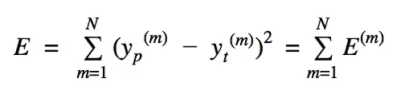

# 从零开始深度学习并在 Python 中使用 Tensorflow

> 原文：<https://towardsdatascience.com/deep-learning-from-scratch-and-using-tensorflow-in-python-34aad75f939?source=collection_archive---------11----------------------->

深度学习是目前在现实世界、数据科学应用中使用的最流行的模型之一。在从图像到文本到语音/音乐的各个领域，这都是一个有效的模式。随着其使用的增加，快速和可扩展地实现深度学习的能力变得至关重要。Tensorflow 等深度学习平台的兴起，帮助开发者以更简单的方式实现他们需要的东西。

在本文中，我们将了解深度学习是如何工作的，并熟悉它的术语——如反向传播和批量大小。我们将为 Python 中预定义的输入和输出实现一个简单的深度学习模型——从理论到零实现——然后使用 Keras 和 Tensorflow 等深度学习平台做同样的事情。我们使用 Keras 和 tensor flow 1 . x 版和 2.0 版编写了这个简单的深度学习模型，具有三个不同的复杂程度和易于编码的程度。

## **深度学习从无到有的实现**

考虑一个简单的多层感知器，它有四个输入神经元，一个隐藏层有三个神经元，一个输出层有一个神经元。我们有三个数据样本用于表示为 X 的输入，三个数据样本用于表示为 yt 的期望输出。因此，每个输入数据样本有四个特征。

```
# Inputs and outputs of the neural net:
import numpy as npX=np.array([[1.0, 0.0, 1.0, 0.0],[1.0, 0.0, 1.0, 1.0],[0.0, 1.0, 0.0, 1.0]])
yt=np.array([[1.0],[1.0],[0.0]])
```


Neural Network with four input neurons, one hidden layer with three neurons and an output layer with one neuron

图中的 ***x*** *(m)* 为 **X** ， ***h*** (m)为输入***X****(m)**W***I*和 **W** *h**

神经网络(NN)的目标是获得权重和偏差，以便对于给定的输入，NN 提供期望的输出。但是，我们事先不知道适当的权重和偏差，所以我们更新权重和偏差，使得 NN、 *yp(m)* 和期望的输出、 *yt(m)* 之间的误差最小。这个迭代最小化过程被称为 NN 训练。

假设隐藏层和输出层的激活函数都是 sigmoid 函数。因此，


The size of weights, biases and the relationships between input and outputs of the neural net

其中激活函数是 sigmoid， *m* 是第 *m* 个数据样本， *yp(m)* 是 NN 输出。

误差函数测量神经网络的输出与期望输出之间的差异，可以用数学方法表示为:



The Error defined for the neural net which is squared error

上述 NN 的伪代码总结如下:


pseudocode for the neural net training

从我们的伪代码中，我们认识到应该计算误差(E)相对于参数(权重和偏差)的偏导数。使用微积分中的[链式法则](https://en.wikipedia.org/wiki/Chain_rule),我们可以写出:


Derivative of Error function with respect to the weights

这里我们有两个选项来更新反向路径中的权重和偏差(反向路径意味着更新权重和偏差，使得误差最小化):

1.  使用训练数据的所有 *N* 个样本
2.  使用一个样本(或几个样本)

对于第一个，我们说批量大小是 *N* 。对于第二种情况，如果使用一个样本来更新参数，我们说批量大小为 1。因此，批量意味着有多少数据样本被用于更新权重和偏差。

你可以找到上述神经网络的实现，其中误差相对于参数的梯度被象征性地计算，具有不同的批量大小[这里是](https://github.com/miladtoutounchian/Deep-Learning-/blob/master/NN_from_scratch_different_batch.ipynb)。

从上面的例子可以看出，从头开始创建一个简单的深度学习模型涉及到非常复杂的方法。在下一节中，我们将看到深度学习框架如何帮助我们的模型实现可扩展性和更大的易用性。

## **使用 Keras、Tensorflow 1.x 和 2.0 的深度学习实现**

在上一节中，我们使用链式法则计算了误差 w.r.t .参数的梯度。我们亲眼看到这不是一个简单或可扩展的方法。此外，请记住，我们在每次迭代中计算偏导数，因此不需要符号梯度，尽管它的值很重要。这就是深度学习框架如 [Keras](https://keras.io/) 和 [Tensorflow](https://www.tensorflow.org/) 可以发挥作用的地方。深度学习框架使用自动 Diff 方法进行部分梯度的数值计算。如果你不熟悉 AutoDiff，StackExchange 有一个很好的例子[来介绍一下。](https://stats.stackexchange.com/questions/224140/step-by-step-example-of-reverse-mode-automatic-differentiation)

自动 Diff 将复杂的表达式分解成一组原始表达式，即最多由单个函数调用组成的表达式。由于每个单独表达式的微分规则都是已知的，所以可以用有效的方式计算出最终结果。

我们在 Keras、Tensorflow 1.x 和 Tensorflow 2.0 中实现了具有三个不同级别的 NN 模型:

**1-高级(Keras 和 Tensorflow 2.0):** [批量为 1 的高级 tensor flow 2.0](https://github.com/miladtoutounchian/Deep-Learning-/blob/master/TF_v2_HighLevel_batchsize1_train_on_batch.py)

**2-中级(Tensorflow 1.x 和 2.0):** [中级 Tensorflow 1.x 批量 1](https://github.com/miladtoutounchian/Deep-Learning-/blob/master/TF_v1_MediumLevel_batchsize1.py) ，[中级 Tensorflow 1.x 批量 N](https://github.com/miladtoutounchian/Deep-Learning-/blob/master/TF_v1_MediumLevel_batchsizeN.py) ，[中级 Tensorflow 2.0 批量 1](https://github.com/miladtoutounchian/Deep-Learning-/blob/master/TF_v2_MediumLevel_batchsize1.py) ，[中级 Tensorflow v 2.0 批量 N](https://github.com/miladtoutounchian/Deep-Learning-/blob/master/TF_v2_MediumLevel_batchsizeN.py)

**3-低级(Tensorflow 1.x):** [批量为 N 的低级 tensor flow 1 . x](https://github.com/miladtoutounchian/Deep-Learning-/blob/master/TF_v1_LowLevel_batchsizeN.py)

## 代码片段:

对于高层，我们使用 Keras 和 Tensorflow v 2.0 通过 *model.train_on_batch* 完成了实现:

```
# High-Level implementation of the neural net in Tensorflow:
model.compile(loss=mse, optimizer=optimizer)
**for** _ **in** range(2000):
    **for** step, (x, y) **in** enumerate(zip(X_data, y_data)):
        model.train_on_batch(np.array([x]), np.array([y]))
```

在使用 Tensorflow 1.x 的中级中，我们定义了:

```
E = tf.reduce_sum(tf.pow(ypred - Y, 2))
optimizer = tf.train.GradientDescentOptimizer(0.1)
grads = optimizer.compute_gradients(E, [W_h, b_h, W_o, b_o])
updates = optimizer.apply_gradients(grads)
```

这确保了在循环的*中，更新变量将被更新。对于中级，梯度和它们的更新在 for_loop 外部定义，而在 for_loop 更新内部迭代更新。在中级使用 Tensorflow v 2.x 中，我们使用了:*

```
# Medium-Level implementation of the neural net in Tensorflow**#** In for_loop**with** tf.GradientTape() **as** tape:
   x = tf.convert_to_tensor(np.array([x]), dtype=tf.float64)
   y = tf.convert_to_tensor(np.array([y]), dtype=tf.float64)
   ypred = model(x)
   loss = mse(y, ypred)
gradients = tape.gradient(loss, model.trainable_weights)
optimizer.apply_gradients(zip(gradients, model.trainable_weights))
```

在低级实现中，每个权重和偏差被单独更新。在使用 Tensorflow v 1.x 的低级中，我们定义了:

```
# Low-Level implementation of the neural net in Tensorflow:
E = tf.reduce_sum(tf.pow(ypred - Y, 2))
dE_dW_h = tf.gradients(E, [W_h])[0]
dE_db_h = tf.gradients(E, [b_h])[0]
dE_dW_o = tf.gradients(E, [W_o])[0]
dE_db_o = tf.gradients(E, [b_o])[0]
# In for_loop:
evaluated_dE_dW_h = sess.run(dE_dW_h,
                                     feed_dict={W_h: W_h_i, b_h: b_h_i, W_o: W_o_i, b_o: b_o_i, X: X_data.T, Y: y_data.T})
        W_h_i = W_h_i - 0.1 * evaluated_dE_dW_h
        evaluated_dE_db_h = sess.run(dE_db_h,
                                     feed_dict={W_h: W_h_i, b_h: b_h_i, W_o: W_o_i, b_o: b_o_i, X: X_data.T, Y: y_data.T})
        b_h_i = b_h_i - 0.1 * evaluated_dE_db_h
        evaluated_dE_dW_o = sess.run(dE_dW_o,
                                     feed_dict={W_h: W_h_i, b_h: b_h_i, W_o: W_o_i, b_o: b_o_i, X: X_data.T, Y: y_data.T})
        W_o_i = W_o_i - 0.1 * evaluated_dE_dW_o
        evaluated_dE_db_o = sess.run(dE_db_o,
                                     feed_dict={W_h: W_h_i, b_h: b_h_i, W_o: W_o_i, b_o: b_o_i, X: X_data.T, Y: y_data.T})
        b_o_i = b_o_i - 0.1 * evaluated_dE_db_o
```

正如你在上面的低级实现中看到的，开发者对数字操作和计算的每一步都有更多的控制。

# **结论**

我们现在已经表明，通过使用用于权重和偏差更新的符号梯度计算，从零开始实现即使是简单的深度学习模型也不是一种容易或可扩展的方法。由于使用了 AutoDiff，使用深度学习框架加速了这一过程，AutoDiff 基本上是用于更新权重和偏差的稳定的数值梯度计算。