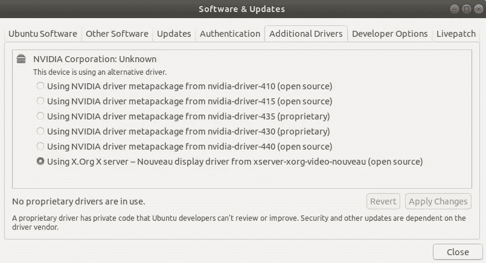
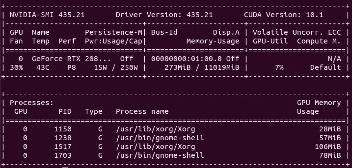
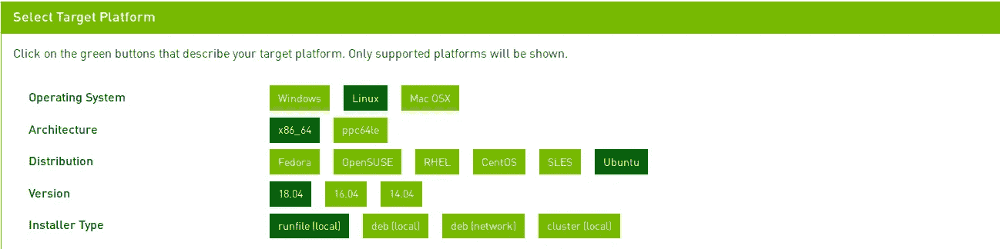
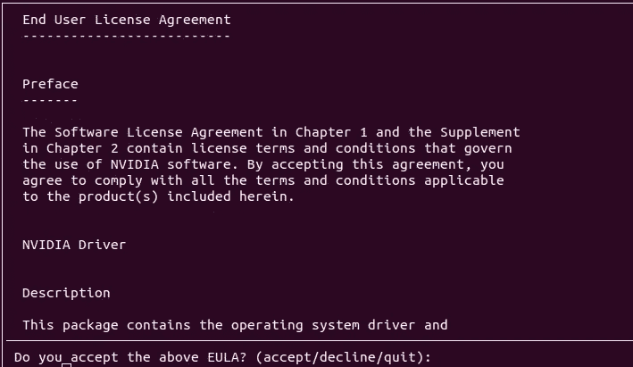
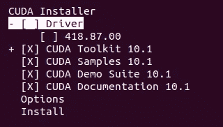
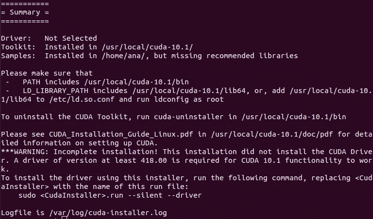
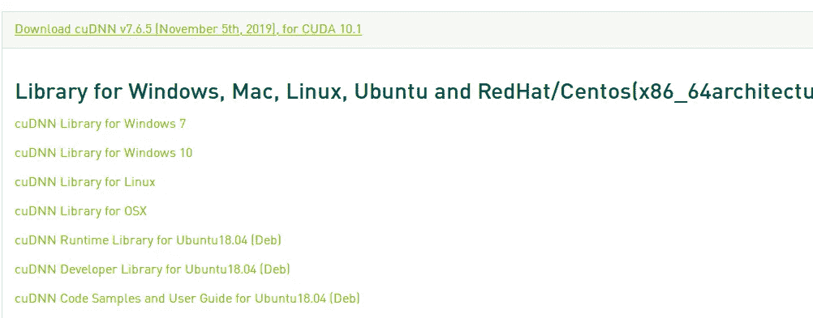
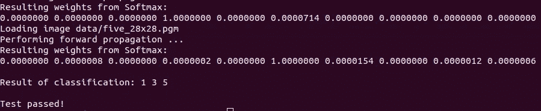

# Ubuntu 18.4 上的深度学习 GPU 安装

> 原文：<https://towardsdatascience.com/deep-learning-gpu-installation-on-ubuntu-18-4-9b12230a1d31?source=collection_archive---------5----------------------->

在安装了几次驱动程序、CUDA 等之后，为了让我的深度学习库与我的 GPU 对话，我决定编写适用于 Ubuntu18.04 的安装步骤。

# 1.NVIDIA 驱动程序安装

## **第一步:确保你的 GPU 是英伟达 GPU**

首先需要做的是，使用以下命令确保 GPU 是 NVIDIA GPU:

```
$ ubuntu-drivers devices
```

## **第二步:移除 NVIDIA 驱动**

首先要做的是运行以下命令，以确保清除任何预安装的驱动程序:

```
$ sudo apt-get autoremove$ sudo apt-get remove nvidia*$ sudo apt-get purge cuda*
```

## 步骤 3:禁用新的 NVIDIA 驱动程序

上一步之后这一步有时候就没必要了，但是我还是强烈建议去做(做了不疼！).

首先，您需要打开*黑名单-nouveau.conf* 文件(我使用 gedit，但也可以随意使用任何其他类型的编辑器)。我使用的命令如下:

```
$ sudo gedit /etc/modprobe.d/blacklist-nouveau.conf
```

现在，将下面几行添加到文件中。

```
blacklist nouveau
blacklist lbm-nouveau
options nouveau modeset=0
alias nouveau off
alias lbm-nouveau off
```

保存并关闭文件。

禁用内核新功能:

```
$ echo options nouveau modeset=0 | sudo tee -a /etc/modprobe.d/nouveau-kms.conf
```

## 步骤 4:添加 PPA 驱动程序库

要将`ppa:graphics-drivers/ppa`存储库添加到您的系统中，请键入以下命令:

```
$ sudo add-apt-repository ppa:graphics-drivers/ppa
```

## 步骤 5:安装 NVIDIA 驱动程序

过去，我常常从英伟达下载网站([https://www.nvidia.co.uk/Download/index.aspx?lang=en-uk](https://www.nvidia.co.uk/Download/index.aspx?lang=en-uk))下载驱动程序。

最简单和最可靠的方法是直接从终端安装它(这是我在 NVIDIA 论坛上的一篇帖子中来自 NVIDIA 的直接建议)。安装驱动程序的命令应该是(确保您安装了正确的驱动程序！):

```
$ sudo apt install nvidia-driver-435
```

另一个选择是直接从 Ubuntu 的软件和更新设置中安装它:



现在，选择正确的驱动程序(这是一个棘手的问题，如果这一步没有成功，你可能不得不回来测试一个新的驱动程序)。点击*应用更改*，一切就绪！

## 第六步:重启电脑

别忘了这一步！

## 步骤 7:检查驱动程序是否正常工作

通过键入以下命令，您将知道安装已经成功:

```
$ nvidia-smi
```

您应该会看到类似于



如果你在这里得到一个 NVIDIA 错误，从头开始尝试所有的步骤，但是这次选择一个新的驱动程序！

# 2.CUDA 安装

在安装 CUDA 的时候，我一般都是按照 CUDA 安装指南来的，这个指南非常完整([https://docs . NVIDIA . com/CUDA/CUDA-installation-guide-Linux/index . html](https://docs.nvidia.com/cuda/cuda-installation-guide-linux/index.html))。

## 步骤 1:预安装检查

*   首先检查你的 GPU 是否可以处理 CUDA:

```
$ lspci | grep -i nvidia
```

*   检查您是否有受支持的 Linux 版本:

```
$ uname -m && cat /etc/*release
```

这应该会返回类似于

```
x86_64
DISTRIB_ID=Ubuntu
DISTRIB_RELEASE=18.04
DISTRIB_CODENAME=bionic
DISTRIB_DESCRIPTION=”Ubuntu 18.04.3 LTS”
NAME=”Ubuntu”
VERSION=”18.04.3 LTS (Bionic Beaver)”
ID=ubuntu
ID_LIKE=debian
PRETTY_NAME=”Ubuntu 18.04.3 LTS”
VERSION_ID=”18.04"
HOME_URL=”[https://www.ubuntu.com/](https://www.ubuntu.com/)"
SUPPORT_URL=”[https://help.ubuntu.com/](https://help.ubuntu.com/)"
BUG_REPORT_URL=”[https://bugs.launchpad.net/ubuntu/](https://bugs.launchpad.net/ubuntu/)"
PRIVACY_POLICY_URL=”[https://www.ubuntu.com/legal/terms-and-policies/privacy-policy](https://www.ubuntu.com/legal/terms-and-policies/privacy-policy)"
VERSION_CODENAME=bionic
UBUNTU_CODENAME=bionic
```

*   检查 gcc 是否已安装

```
$ gcc --version
```

*   检查您的内核头文件是否与 CUDA 兼容(您可以在 CUDA 安装指南中找到兼容性表):

```
$ uname -r
```

*   使用以下命令安装内核头文件和包:

```
$ sudo apt-get install linux-headers-$(uname -r)
```

## 步骤 2:下载 CUDA

您可以通过以下链接下载 CUDA 工具包:

[](https://developer.nvidia.com/cuda-downloads) [## CUDA 工具包 10.1 更新 2 下载

### 编辑描述

developer.nvidia.com](https://developer.nvidia.com/cuda-downloads) 

对于 Ubuntu 18.04，您需要下载以下内容



现在，你只需要等待，这个下载可能需要一段时间！

## 步骤 3:安装 CUDA

安装 CUDA 的步骤非常简单。只需在您的终端上键入以下命令:

```
$ wget [http://developer.download.nvidia.com/compute/cuda/10.1/Prod/local_installers/cuda_10.1.243_418.87.00_linux.run](http://developer.download.nvidia.com/compute/cuda/10.1/Prod/local_installers/cuda_10.1.243_418.87.00_linux.run)
$ sudo sh cuda_10.1.243_418.87.00_linux.run
```

您应该会看到以下屏幕:



确保此次安装不会安装新的驱动程序！！！！！



Unselect Driver when installing CUDA

如果安装成功，您应该会看到以下屏幕:



# 3.安装 cuDNN

这是您可以开始使用 GPU 进行深度学习之前的最后几个步骤！

## 第一步:下载 cuDNN

以下链接将带您进入 cuDNN 下载网站:

https://developer.nvidia.com/rdp/form/cudnn-download-survey

你必须先登录才能下载任何东西。进入后，下载:

*   cuDNN 图书馆
*   cuDNN 运行时库(Deb)
*   cuDNN 开发者库(Deb)
*   cuDNN 代码示例(Deb)



## 步骤 2:安装 cuDNN

这些步骤主要遵循 cuDNN 安装网站[https://docs . NVIDIA . com/deep learning/SDK/cud nn-install/index . html](https://docs.nvidia.com/deeplearning/sdk/cudnn-install/index.html)中的说明

*   cd 到你的*下载*文件夹(或者下载文件所在的地方)
*   使用以下命令解包归档文件:

```
$ tar -zxvf cudnn-10.1-linux-x64-v7.6.5.32.tgz
```

*   将文件复制到 CUDA 工具包目录中，并更改权限

```
$ sudo cp cuda/include/cudnn.h /usr/local/cuda/include
$ sudo cp cuda/lib64/libcudnn* /usr/local/cuda/lib64
$ sudo chmod a+r /usr/local/cuda/include/cudnn.h /usr/local/cuda/lib64/libcudnn*
```

*   使用以下命令安装这三个库

```
$ sudo dpkg -i libcudnn7_7.6.5.32–1+cuda10.1_amd64.deb
$ sudo dpkg -i libcudnn7-dev_7.6.5.32-1+cuda10.1_amd64.deb
$ sudo dpkg -i libcudnn7-doc_7.6.5.32-1+cuda10.1_amd64.deb
```

# 4.检查一切是否正常！

为了做到这一点，cuDNN 创建了一个样本代码，它将使用您的 GPU 在 MNIST 数据集上运行一些计算。为此，您需要遵循以下步骤:

```
$ cp -r /usr/src/cudnn_samples_v7/ $HOME
$ cd  $HOME/cudnn_samples_v7/mnistCUDNN
$ make clean && make
$ ./mnistCUDNN
```

如果一切正常，您应该会看到如下内容:



现在你可以很好地使用你的 GPU 了！