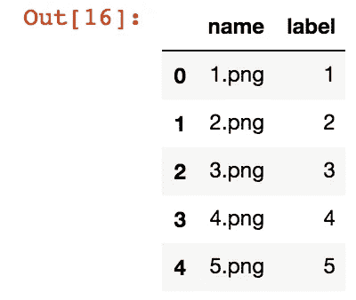
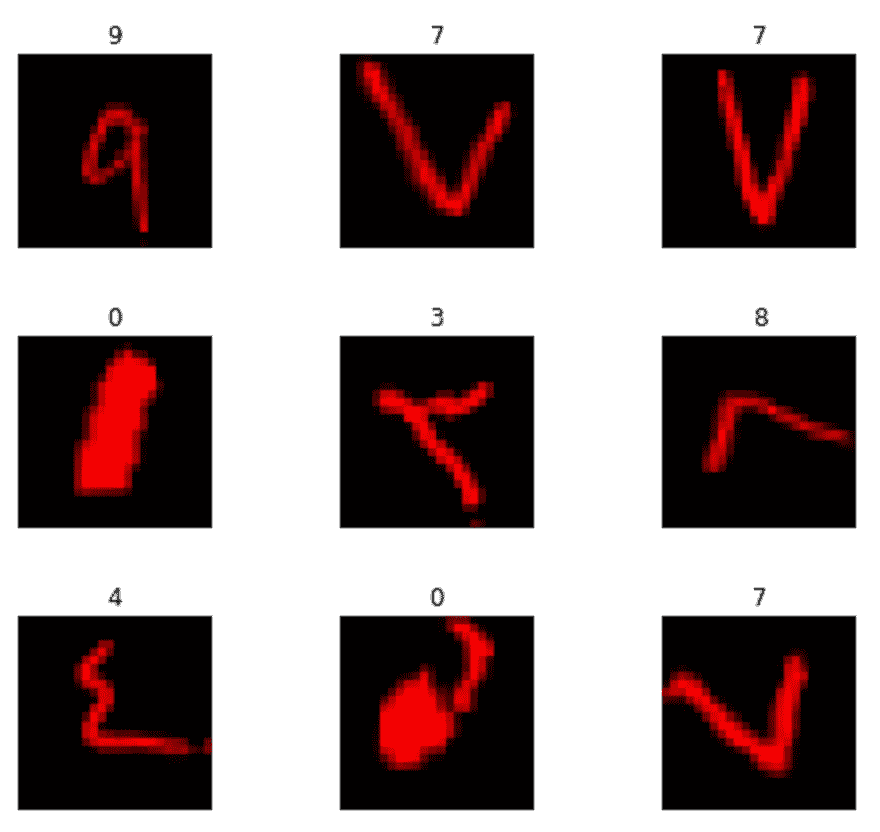
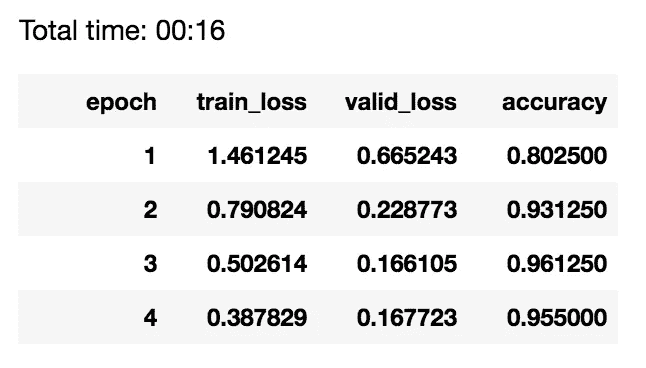
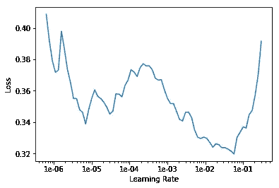
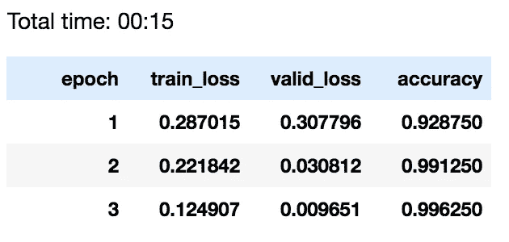

# 深度学习&手写阿拉伯数字

> 原文：<https://towardsdatascience.com/deep-learning-handwritten-arabic-digits-5c7abc3c0580?source=collection_archive---------20----------------------->

## 使用 fast.ai 库以 99%的准确率对 AHCD 进行分类！


photo: Morocco, 2000

深度学习的“hello world”通常是 MNIST 手写数字数据集，我想将同样的技术应用到一个更有趣的应用程序中:阿拉伯语手写字符数据集(AHCD)，由美国大学开发的数据集。

在这个例子中，我使用 fast.ai 库来训练一个卷积神经网络(CNN ),以 99+%的准确率对 AHCD 进行正确分类。方法如下:

首先，导入我们需要的库，并设置我们的 GPU 使用 cuda:

```
%reload_ext autoreload
%autoreload 2
%matplotlib inline**from** **fastai.vision** **import** *
**from** **fastai.metrics** **import** error_rate
**import** **csv**
**import** **numpy** **as** **np**
**import** **PIL** 
**import** **pandas** **as** **pd**defaults.device = torch.device('cuda')
```

与许多数据科学工作流一样，数据预处理是最重要的组成部分。以下是为我们的卷积神经网络准备数据的步骤:

## 1 —从 csv 摄取

与 MNIST 拉丁字母版本一样，AHCD 也是一个 784 列的 csv，其中每行包含一个 28x28 的图像，该图像被展平为一行数值。

第一个任务是将它加载到内存中，由于数据集有 60k 行，为了加速这个过程，我设置了一个任意的 4k 训练集限制。我们将 Pandas 作为 pd 导入，所以这使用了内置的 Pandas read_csv 函数:

```
trainrows = 4000
train = pd.read_csv('csvtrain.csv', nrows=trainrows)
```

## 2-转换为 3D 数据结构以进行图像处理

我们在内存中有数据，但是每个要生成的图像仍然是平面的(1 高 784 宽),我们希望它是正方形和多维的，这样我们可以使用 matplotlib 将其转换为 RGB 图像。为什么是 RGB？我们将使用基于 RGB 图像开发的预训练 restnet34 模型。

这个简单的函数获取我们的 Pandas `train`数据帧并提取一行(作为变量传递)，将该行重新整形为一个正方形结构，将数字规范化为范围[0，1]，添加两个全零的额外维度，并使用 matplotlib.plot 库将图像作为 png 保存在我们的`path/digits/`文件夹中。

注意:最后，我将添加逻辑来将文件夹作为变量传递。目前，它是硬编码的。

```
**def** pdMakePlot(row):
    pixels = np.array(train.iloc[[row]], dtype='uint8')
    pixels = pixels.reshape((28, 28)).T
    pixels = np.true_divide(pixels, 255)
    dim2 = np.zeros((28,28))
    dim3 = np.zeros((28,28))
    pix = np.stack((pixels, dim2,dim3), axis=2)
    row += 1
    filename = "digits/**%s**.png" % row
    plt.imsave(filename, pix)
    plt.close('all')
    **return**
```

## 3-准备我们的事实来源数据框架

我们正在使用 fast.ai `ImageDataBunch.from_df`方法为这个卷积神经网络摄取图像数据，因此我们需要一个 Pandas 数据帧，其中包含我们的训练文件名&和有效标签。

```
#import training labels into numpy arraycsv = np.genfromtxt ('csvtrainlabel.csv', delimiter=",")
csv = csv[0:trainrows]
csv = csv.astype('int32')
csv = np.add(csv,1)
csv[csv == 10] = 0*#np array that we'll make into the filenames*
*#from 1 to trainrows*
trainrange = trainrows +1
files = np.arange(1,trainrange)
files = files.astype(str)*#convert to filenames*
i = 0;
j = 1;
**for** file **in** files:
    files[i] = "**%s**.png" % j
    i += 1
    j += 1
    **if** i >= trainrange: **break***#combine two arrays into dataframe and add header*
df = pd.DataFrame({'name':files, 'label':csv})
df.head()
```



our dataframe

同样，我将再次讨论 ETL 过程的一部分。

## 4 —处理并保存我们的培训图像

有了这些，我们可以使用我们之前定义的`pdMakePlot()`函数来处理训练图像。处理的图像数量也由我们之前设置的`trainrange`变量设置。

```
i = 0
max = trainrange-1
for x in range(i,max):
    pdMakePlot(i)
    i += 1
```

现在我们已经准备好进行深度学习了！只有几行代码:

```
#define our transforms
tfms = get_transforms(do_flip=False)#define our DataBunch
data = ImageDataBunch.from_df(path=path, df = df, ds_tfms=tfms, size=24)#define our learner
learn = create_cnn(data, models.resnet34, metrics=accuracy)
```

在我们训练之前，我们可以从我们的数据集中查看一小部分选择，以确认我们已经正确处理了所有内容:

```
data.show_batch(rows=3, figsize=(7,6))
```



9 handwritten characters & labels

一切都好！我们还可以运行`learn.model`来详细了解学习者架构。如果你感兴趣，它是可用的。不管怎样，我们训练吧！

## 初步训练

```
learn.fit_one_cycle(4)
```



transfer learning from resnet34, 95% accuracy in 16 seconds

我认为我们可以做得更好。让我们找到最佳的学习率，重新训练。

```
learn.lr_find()LR Finder is complete, type {learner_name}.recorder.plot() to see the graph.learn.recorder.plot()
```



learning rate against loss

我们看到最优学习率确实很高。让我们试着获得一个比最小化损失的学习率低一点的学习率，比如 0.05？然后我们会解冻 CNN 的一些层，重新训练。

```
learn.unfreeze()
learn.fit_one_cycle(3, max_lr=slice(.006, .004))
```



much better

15 秒钟后，我们有了一个模型，它对我们留在一边进行验证的训练数据子集有 99.6%的准确性。

## 使用模型

既然有了模型，那就用起来吧！使用上面的函数从测试 csv 中读取一些测试数据后:

```
img = open_image('/path/3.png')pred_class,pred_idx,outputs = learn.predict(img)
pred_class**Category 4  <--- that is correct**
```

## 然后

现在我们有了一个工作模型，而且是一个准确的模型，我想更新管道代码，使它更加优雅。我还想对全套测试数据运行模型，看看它如何与最先进的技术相比较。更多来了！

## 也

附加代码在我的 github 上:[www.github.com/matthewarthur](http://www.github.com/matthewarthur)。我的 LinkedIn 是 https://www.linkedin.com/in/matt-a-8208aaa/的。打个招呼。

## 笔记

https://www.kaggle.com/mloey1/ahcd1&[http://datacenter.aucegypt.edu/shazeem/](https://www.kaggle.com/mloey1/ahcd1)

[2][https://docs . fast . ai/vision . data . html # imagedata bunch . from _ df](https://docs.fast.ai/vision.data.html#ImageDataBunch.from_df)