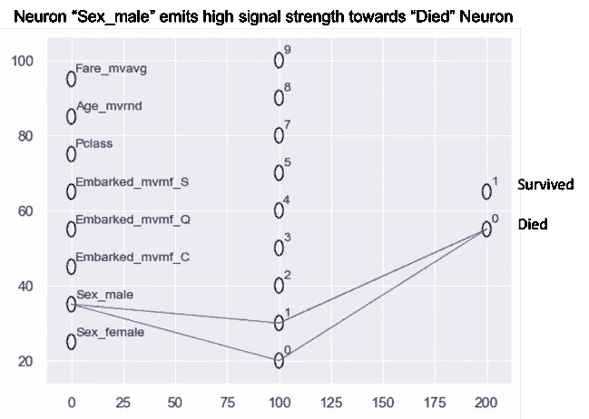

# 深度学习有了一个新朋友——表格数据集

> 原文：<https://towardsdatascience.com/deep-learning-has-a-new-friend-tabular-datasets-f34169b9ea79?source=collection_archive---------24----------------------->

## 超越图像数据集的深度学习

当你想到深度学习时，我们首先想到的不是表格数据集。我们首先想到的是图像数据集。这是因为深度学习和图像数据集有一种特殊的关系。深度学习变得流行主要是因为它能够在图像上创造奇迹。几年前，当深度学习能够区分狗的图像和猫的图像，或者马和斑马时，我们都很兴奋。当深度学习进入图像中的对象检测领域时，兴奋感才增加。图像中不同物体周围各种颜色的边框看起来很酷

图像和深度学习的这种特殊关系也推动了几乎所有围绕深度学习教程的文献。对于许多技术，如理解黑盒模型，使用的例子是图像数据集。MNIST 数字图像数据集已经成为深度学习教程的“Hello World”。图像数据集已经成为理解深度学习的一个很好的来源。

但是好的旧表格数据呢？大多数企业数据以及我们的个人数据都是表格数据的形式。将深度学习用于表格数据将有巨大的价值。然而，将深度学习应用于表格数据的文献很少

通过这个故事，我试图展示深度学习如何对表格数据集非常有用。

为了说明这一点，让我们举一个非常简单的泰坦尼克号生存数据的例子。许多数据科学家已经从 Kaggle 那里知道了这个非常著名的数据集。对于那些不知道这个数据集的人来说，它是致命的泰坦尼克号事故中乘客的数据。为了便于说明，下面是该数据集的样本摘录

Sample extract of Titanic passenger data

现在让我们将深度学习应用于这个表格数据集。深度学习是基于受我们大脑工作方式启发的神经网络。你有“输入”神经元，它接收信号并将它们发送给“输出”神经元

在我们的例子中，输入是像家庭(父母+兄弟)、费用、年龄、乘客级别(Pclass)、登机港口、性别这样的字段。输出是乘客是否幸存。

我们的深度学习架构，如图所示，有输入神经元，后面是 10 个中间神经元和 2 个输出神经元。输入神经元向中间神经元发送信号，中间神经元再向输出神经元发送信号。这个神经元网络，也称为神经网络，为了可视化的目的显示如下。“蓝色”线表示“正”信号，“红色”线表示“负”信号

Feed Forward Neural Network on Titanic dataset

看起来很乱，不是吗？然而，让我们探索不同的部分，看看我们能解释什么

# 查找表格数据集中列的重要性

表格数据集主要是行和列的集合。我们总是有兴趣知道这些列的重要性。在泰坦尼克号数据集的情况下，检查列的重要性的一种方法是看它是否对人是否幸存有影响。

表格数据上的神经网络可以告知哪些输入列会影响输出列。下图所示为仅用于神经元“Sex_Male”发出的高强度信号的神经网络。信号被传递到“死亡”的神经元。这意味着大多数男性乘客没有生还

因此，深度学习可以帮助我们进行这样的分析，而不必浏览每一篇专栏文章

# 自动查找重要的列组合

与图像相比，表格数据集更加丰富和复杂。假设有许多列，找出哪些是重要的列组合总是有用的。通常，我们习惯于手动查找任何表格数据集中的重要列。为了找到重要的列组合，我们倾向于制作数据透视表、排序、应用公式。

如果我告诉你深度学习会自动为你做到这一点呢？这听起来很神奇，但却是真的。也正因为如此，它被称为“深度”学习。神经网络的中间层将试图找到对输出有影响的所有输入组合。

titanic 数据集中的一个这样的例子如下所示。“红色”表示“负面”信号。我们看到神经元“Age”和神经元“Pclass”(乘客类)的组合向神经元“Died”传递了一个负信号。这意味着 ***少了*** 这个年龄(负信号)而 ***少了*** 这个乘客阶层(负信号)，这个乘客没有死亡(幸存)

泰坦尼克号上的乘客分为一等舱、二等舱和三等舱。所以从数字的角度来看，更小的等级值意味着第一等级。

为了证实这一点，我们可以制作一个乘客等级和年龄的散点图，如下所示。点的颜色显示乘客是否幸存。该散点图分析表明头等舱或二等舱中年龄较小乘客(儿童)幸存。

现在，如果没有深度学习，您将不得不手动绘制所有列组合的散点图。但是深度学习能够自动从数据中学习数据中的重要组合

# 对表格数据进行简短总结

假设你被要求对表格数据做一个简短的总结。你怎么能只看一堆行和列？深度学习可以帮助你。由于深度学习受到“大脑”架构的启发，它试图“理解”表格数据的底层结构。

这样做的方法是观察每个神经元“学习”或“理解”数据的内容。出于说明的目的，下面显示的是影响“存活”神经元的所有神经元。正如我们从可视化中看到的，神经元 7 和神经元 8 对“存活”的神经元有影响。

我们可以看到，神经元 7 具有朝向神经元“存活”的“正”(蓝色)信号，而神经元 8 具有朝向神经元“存活”(意味着死亡)的“负”(红色)信号。

现在我们可以分析神经元 7 和 8 的“内部”是什么。这将向我们展示这些神经元从数据中学到了什么。我们可以“窥视”神经元内部来看到这一点。每个神经元可以用从输入神经元接收的强度来表示。我们可以用雷达图来显示神经元的“内部”

Peeking inside the neurons to see what it has learned

所以在 neuron7 内部，我们看到它在女性、车费、年龄上的价值高，在 Pclass 上的价值低。而 neuron7 则向存活下来的神经元发出正(蓝色)信号。

同样，neuron8 在 Pclass 上的价值较高，在 Fare 上的价值较低，女性。这个神经元正在向存活下来的神经元发送一个负(红色)信号

所以我们可以做以下两行总结

女性乘客，支付高价，乘坐头等舱的乘客生还的可能性很高。

*男性乘客，支付较低的票价，在二等或三等舱，生还的可能性较小*

这太神奇了。这就像你身边有一个专家分析师，他会查看行和列，并试图理解数据的含义。感觉你是钢铁侠，深度学习是贾维斯，他在协助你进行所有的分析

这就是我们如何使用深度学习来分析表格数据的简要概述。还有很多其他有趣的方式。所以朋友们，让我们打破深度学习和图像数据集之间的这种紧密联系。

现在深度学习有了一个新朋友——表格数据集。

# 额外资源

# 网站(全球资讯网的主机站)

你可以访问我的网站进行零编码分析。【https://experiencedatascience.com 

请**订阅**每当我发布一个新的故事时，请随时关注。

 [## 每当 Pranay Dave 发表文章时，您都会收到电子邮件。

### 每当 Pranay Dave 发表文章时，您都会收到电子邮件。通过注册，您将创建一个中型帐户，如果您还没有…

pranay-dave9.medium.com](https://pranay-dave9.medium.com/subscribe) 

你也可以通过我的推荐链接加入 Medium。

 [## 通过我的推荐链接加入 Medium—Pranay Dave

### 作为一个媒体会员，你的会员费的一部分会给你阅读的作家，你可以完全接触到每一个故事…

pranay-dave9.medium.com](https://pranay-dave9.medium.com/membership) 

**Youtube 频道**
这里是我的 Youtube 频道
[https://www.youtube.com/c/DataScienceDemonstrated](https://www.youtube.com/c/DataScienceDemonstrated)的链接