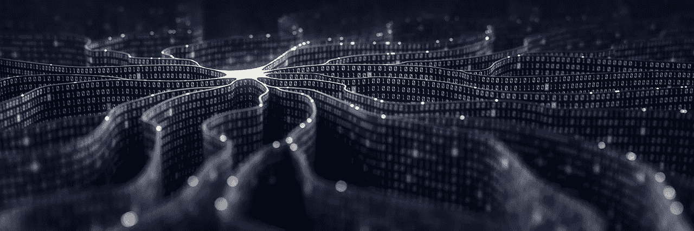
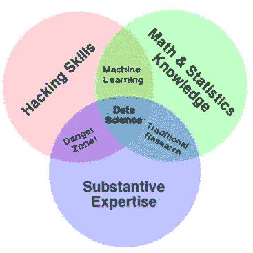

# 科学中的深度学习

> 原文：<https://towardsdatascience.com/deep-learning-in-science-fd614bb3f3ce?source=collection_archive---------16----------------------->

## 对机会和趋势的调查

哥林多前书 10:23

[“The AI revolution in science”, Science Mag, 2017](https://www.sciencemag.org/news/2017/07/ai-revolution-science)

# **概述**

在这篇文章中，我将调查将深度学习(DL)应用于科学和工程应用的机会。我将从对经验模型出现的展望开始，然后简要介绍神经网络的一些显著特征。主要的焦点将涵盖在各种科学领域中应用 DL 的新出现的一般趋势和问题类型。

# **实证模型的兴起**

人类一直在建造东西。但直到最近，我们才开始设计极其复杂的东西:摩天大楼、商用飞机等。为了实现从岩石到工字钢的飞跃，我们建造了模型:简化的，简洁的，世界的代表。通过这种方式，我们可以构建复杂的东西，相信它们会按照我们想要的方式工作，因为我们已经预先对它们进行了建模。这些分析模型取得了巨大的成功:一些方程可以代表我们感兴趣的大多数现象，并允许我们操纵它们为我们所用。

然而，这些解析方程虽然简洁，却极难求解。在许多情况下，即使对于简单的现象，推导这些方程也需要人类多年的集中努力。例如，虽然几个世纪以来人们已经知道了钟摆运动和单透镜设计的近似解决方案，但是仅仅在过去的十年中，对于如此简单的问题( [1](https://www.osapublishing.org/ao/abstract.cfm?uri=ao-57-31-9341) ， [2](https://docs.google.com/viewer?url=http%3A%2F%2Fsbfisica.org.br%2Frbef%2Fpdf%2F070707.pdf) )才获得了闭合形式的解决方案。相反，我们经常使用迭代的数值模型，这些模型通常基于迭代求解的偏微分方程，并慢慢地向某个答案收敛(尽管通常没有理论保证答案是正确的)。

Numerical Models

在过去的几十年里，另一种模型开始流行起来:经验模型。纯粹由数据驱动，它们的上升可归因于 3 个主要因素:分析/数值模型未能捕捉某些领域的现象，如生物学、心理学、经济学和医学；大量数据的快速增长；统计学和计算机科学的进步提高了这些模型的性能。

经验模型不同于它们的分析/数值模型，因为它们明确地对世界不做任何假设。相反，他们试图在数据中找到模式，简单地对呈现给他们的数据进行“曲线拟合”。这些差异带来了微妙的危险，因为不充分或有偏见的数据集将创建看似有效但无法准确捕捉现实的经验模型。事实上，经验模型永远不能真正代表现实，只是一种近似。我们用结果来证明经验模型的合理性，但我们永远不能仅仅因为它似乎有效就相信它。验证模型并在适当的上下文中使用它需要更深入的领域专业知识。

因此，这些实证模型的兴起是由软件和在线科技公司推动的就不足为奇了，因为整个行业都建立在收集数据的基础上。随着这些公司在范围和规模上的增长，他们引导新兴的人工智能领域专注于对他们来说重要的问题:推荐系统、图像分类、文本处理。然而，最近这种经验模型，特别是深度学习模型，在各个科学领域中的流行和使用已经爆炸。在接下来的章节中，我们将考察科学领域中数字逻辑的认识论模式。

# **为什么要深度学习？**

深度学习是由许多层组成的神经网络的术语，显然是一种经验模型。但是为什么要深度学习呢？为什么不是另一个经验模型家族，比如在 90 年代被大量研究和描述的支持向量机？有几个原因可以解释为什么深度学习，从经验模型的大家庭中，已经上升到顶端并统治了这个领域。

之前，我讨论了经验模型出现的驱动因素之一是数据的快速增长。但是隐含的假设是*更多的数据意味着更好的性能*。事实证明，这并不总是正确的。

模型性能和数据之间的关系取决于模型容量(模型可以逼近的函数族)和模型偏差(模型对基础数据做出的先验假设)。例如，线性回归具有非常高的模型偏差，因为它假设基础数据是近似线性的，这限制了它的模型容量。相反，神经网络可以逼近任何实函数(通过通用逼近定理)。根据经验，我们发现神经网络在大型数据集上的伸缩性非常好(尽管神经网络仍然稀疏的理论依据，见[这里](https://arxiv.org/pdf/1608.08225.pdf)和[这里](https://arxiv.org/abs/1605.06444))。需要注意的是，深度学习的优势只在非常大的数据集上。在“小数据”领域中，不清楚哪种模型类型更好，为了让模型表现良好，您很可能必须使用某种形式的领域专业知识和特性工程。

Model Performance with respect to Dataset Size

神经网络的另一个重要特征是它们能够接受原始的、非结构化的数据作为输入。这种数据类型包括图像、音频、视频等。人们可以很容易地想象，今天网上的大多数数据都是这种非结构化的形式，只有通过大量的人工努力，这些数据才能转换成机器可读的形式。在这些领域，人类专家确定相关特征，将数据塑造成设计矩阵，并提供经验模型。但是神经网络可以接受原始数据，并在没有任何人类指导的情况下，自己学习它们的相关特征！我们将在后面看到，这种接受非结构化数据的能力也允许多种多样的神经架构，从而开启了广泛的潜在应用。

# 科学中的深度学习

## 三大支柱

建模有 3 个主要支柱:数据、计算和算法。计算通常不是科学应用的限制因素——事实上，深度学习经常被使用，因为与需要求解偏耦合微分方程的数值方法相比，它的计算效率非常高。按需云计算的兴起(以及专用硬件的增长趋势)意味着计算也非常便宜。这也有助于科学数据集通常比在线应用程序使用的大规模数据集(数百万到数十亿个示例)小得多(数百到数千个示例)，这意味着需要的计算资源少得多。最后，学习理论和推理模型的改进，如深度学习本身，导致了标准化架构的创建，这些架构工作良好，可以开箱即用，例如 Keras 中的简单 CNN。

这些支柱隐含着重心:利用所有三个支柱的专业知识。遗憾的是，DL 在很多非计算机科学的研究群体中扎根还需要相当长的时间。一个强大的驱动因素是存在严重的市场失衡:科技公司(几乎每个行业)都渴望获得自己的内部 DL 专业知识，可以支付比传统学术路线高得多的费用。

然而，这种情况正在慢慢改变，因为许多职业科学家开始在职业生涯中期改变关注点，而且随着对 DL 的兴趣日益增长，理解 DL 的学生数量慢慢增加，尽管从大学挖走专门研究人工智能的教授的竞争激烈。深度学习开源框架(如 Tensorflow 和 Pytorch)的爆炸式增长，通过 Coursera、EdX 等大规模开放在线课程(MOOC)甚至 Medium 等资源(如 [TDS 团队](https://medium.com/u/7e12c71dfa81?source=post_page-----fd614bb3f3ce--------------------------------))的在线学习增长，都有助于人工智能领域真正的开源在线教育。大型科技公司意识到需要帮助外部培养人才，如谷歌开发人员的 ML 速成班和微软的人工智能学校，也起到了帮助作用。所有这些因素都导致了数字图书馆慢慢进入科学应用。

> “数据是可防御的屏障，而不是算法”——吴恩达

## 描述不同领域的数字图书馆采用率

限制因素，尤其是在科学应用中，是数据。这就是为什么对经验模型最有经验的领域(如生物信息学、基因组学、高能物理学)也是拥有最多开源大规模数据集的领域。相反，最容易被深度学习颠覆的领域是那些目前缺乏清晰的标准化开源基准数据集，并且难以获得大量高质量数据的领域(例如，工业设计的机械属性，纳米材料属性，保险和医疗保健)。传统开源基准数据集，如 ImageNet、Cifar-10、Youtube 10M 等。有助于推动深度学习架构的基本创新——对于特定领域的数据集，可以预期类似的效果。

数据的结构也很重要。例如，对乳房 x 光照片中的恶性和良性肿瘤进行分类很容易转化为图像分类或分割问题。反过来，如何预测化学分子和物种的属性更困难——我们如何以一种模型可以理解的方式来表示这些分子？一个化学计量公式就够了吗？是否应该包括晶体群，合成条件，量子力学描述等。？确定如何将分子“指纹化”以传入机器学习模型是一个更加困难的问题，这比简单地传入矩阵需要更多的领域专业知识。深度学习在每个领域的采用率将受到数据可以被表示为传统数据结构的难易程度的影响，但反过来，这也代表了开发新模型的机会，这些模型可以在复杂的领域特定数据中进行本机读取。影响采用的其他因素包括从数值模型中获取数据的难度以及此类数值模型的可信度，缺乏领域专业知识的机器学习专家的准入门槛有多高，等等。

早期采用深度学习的领域的另一个标志是，他们优先考虑推理而不是解释，认为一些不确定性是可以接受的，并接受偶尔出错。如果我们的目标是优化材料设计或加速物理模拟，我们可能不会关心我们是如何实现的，甚至不会关心答案是否有一点错误，只要它足够接近并且比我们之前拥有的更好。但如果我们控制和设计国家电网，或提供医疗诊断，那么我们可能会更加谨慎。机器学习特别适合回答某些类型的问题，而不太适合回答其他类型的问题:理解不同科学领域的问题规范和设计约束将缓和经验模型所发挥的作用，并可能为新的模型公式开辟机会。

最后，“后采用者”领域的一个特殊特征是它们有孤立的数据。私人患者数据和电网数据就是很好的例子。在这些领域中，第一步是鼓励就如何开发现实且可公开的基准数据集进行对话，以便该领域开展工作并跟踪进展。大规模、开源、基准数据集非常重要，因为它们推动该领域在公共数据集上以开放的方式开发新的方法，加速创新和知识共享。建立数据匿名、数据共享和数据报告的约定也很重要。[联合学习](https://ai.google/research/pubs/pub45648)的新发展是开发算法保证以确保安全、隐私优先的数据共享的重要的第一步。在数据高度孤岛化的领域，人们还应该预料到，拥有数据访问特权的群体将比没有数据访问特权的群体拥有更大的优势。

如您所见，在检查不同科学领域的数字图书馆采用率时，要考虑的最重要的特征之一是数据。特别是，数量、多样性和我所说的“可采纳性”，即数据对 DL 架构的服从程度，是至关重要的因素。随着各种学科的科学数据爆炸式增长，许多领域目前正在经历所谓的 [ImageNet 时刻](https://thegradient.pub/nlp-imagenet/)。

## 深度学习和科学哲学

深度学习已经展示了惊人的自主学习功能的能力，并且在某些情况下，摧毁了某些领域几十年的专家工作。这可能自然会导致一些担忧，即深度学习可能会使科学家的工作自动化。至少在不久的将来，这是不可能的，原因有几个。首先，深度学习不是解释性的，科学(可以说)是一门机械学科。深度学习可以作为发展理论的辅助手段，但它本身还不能发展任何想法。其次，深度学习的许多进步都是为了增强或改善收集或可视化数据的能力，但解释这一科学方法中最重要的部分仍然是人类的领域。最后，深度学习迄今为止一直是网络技术人员的领域；谷歌、脸书等公司面临的问题推动了数字图书馆的发展。科学问题与科技公司面临的问题有不同的成功标准、数据类型和问题。将需要新颖的架构和方法来满足这些需求，并且它们将需要由那些真正理解潜在问题的人来精心制作。事实上，制作考虑物理约束的神经网络模型，例如通过损失函数定制，是一个不断发展的研究领域。

或许最适用的建议是:*跟随数据*。如果你有将深度学习应用于特定领域的专业知识，那么就寻找能够让你获得大量数据的合作者。相反，如果你坐在计算资源或大型未使用的数据集上，寻找在深度学习方面有良好记录的人，甚至更好，鼓励这些领域的内部培训。您也可以创建自己的数据！挖掘[旧实验室笔记本](https://www.nature.com/articles/nature17439)、[研究论文](https://www.nature.com/articles/s41524-017-0045-8#Sec7)，甚至花几周时间生成自己的数据，都是利用实验室资产的独特方式。最优秀的研究团队将在深度学习这一特定科学领域积累内部专业知识，并获得稳定的新数据。

[Data Science requires domain expertise](https://www.youtube.com/watch?v=-Ba2Gq13dBI)

## **理科 DL 通用问题模板**

基于[我将 DL 应用于各种科学应用的经验](https://charlesxjyang.github.io/)，我注意到许多问题描述都属于类似的模板。我概述了这些案例研究中常见的几个通用问题模板。每个模板中包括几个遵循该模板的已出版作品。如果你有一个符合这些模板之一的科学问题，那么它不仅最有可能被深度学习破坏，而且已经存在一套众所周知和充分理解的技术可以采用。

**拟合和优化:**我们要么得到 1)现有的非常慢的数值模型，例如有限元法、流体动力学、粒子物理碰撞模拟器等。或者 2)不能用传统方法(例如基因组学)表征的非常大的数据集。我们的任务是一个连续的两步过程。首先，我们希望能够创建一个能够很好地表示数值模型或底层数据集的模型。这是一个标准的监督学习问题，我们应用深度学习来加快现有的数值方法，或者理解极其复杂的数据，并根据给定的数据进行推理。通常，我们的问题的自然下一步是优化一些成本函数，这可以通过数值求解器(如梯度下降或进化算法)或生成模型来完成。生成模型很好，因为只需要构建一个模型，而不是同时构建一个推理模型和一个优化器。这也可以被视为一个逆向设计问题，其中一次性学习是可取的。

这是我在工作中观察到的最常见的问题模板。任何时候你想为一些期望的属性找到最佳的设计，这个模板是合适的。虽然最终目标是一次性的逆向设计，但拟合和优化是目前研究得最多的范式，因为代理 DL 模型可以很容易地取代计算昂贵的数值模型。[谷歌的 DeepMind 团队使用神经网络进行推理和梯度下降进行优化的组合](https://deepmind.com/blog/article/alphafold)来预测蛋白质折叠构型，并使用 AlphaFold 模型击败了其他团队的表现。[刘等人。艾尔。使用神经网络进行纳米光子学的逆向设计](https://pubs.acs.org/doi/10.1021/acsphotonics.7b01377)，使用两步训练程序找到具有给定透射光谱的纳米结构。在这项工作中，逆向设计是在没有拟合和优化框架的情况下完成的，但使用了聪明的神经网络架构和训练程序，展示了 DL 专业知识和技术如何改进传统的代理模型思想。

作为拟合和优化的子集，也有一些情况下，我们只想加速数值模型，例如[密度泛函计算](https://pubs.acs.org/doi/10.1021/acs.jctc.8b00636) ns、[多尺度物理模型](https://arxiv.org/abs/1705.02355)、[混沌系统](https://arxiv.org/pdf/1710.07313.pdf)等。，以加速不同理论的模拟或加速理论预测来验证实验数据。

**去噪:**我们给出了一个要测量的系统，但是物理测量结果由所需信号和噪声组成，很多时候，从我们的测量结果中消除噪声是一个难题。也有可能我们正在校准我们的测量设备，或者理解测量对人类来说太难了(例如超光谱数据)。在任何情况下，都需要有一个既定的、真实的、金标准的案例来与传统的测量方法进行比较。对于这个问题，有三个主要部分需要考虑:什么是噪声数据，什么是去噪数据，以及如何获得去噪数据作为标签；如何提出问题，即有监督的、无监督的、半监督的；以及如何衡量去噪性能。一个类似的场景是，当我们得到两个不同的数值模型/模拟时，其中一个是快速且不准确的，而另一个是缓慢且准确的，我们希望拥有后者的准确性和前者的速度。

例如，Schawinski 等人。艾尔。在瑞士联邦理工学院，苏黎世使用甘斯去噪星系图像。为了训练 GAN，他们使用了人工退化的图像，并表明 GAN 能够比传统技术更好地恢复原始图像。他们混合使用了几种传统和新技术来测量去噪性能。在相反的长度尺度上，[瑞文森等人。艾尔。使用全卷积神经网络(CNN)自动编码器型架构来恢复仅强度细胞测量的相位](https://www.nature.com/articles/lsa2017141)。为了获得一个“黄金标准”的真相标签，他们使用了 8 个不同样本到传感器高度的测量值来恢复相位，并用作 CNN 的标签。更一般地说，CNN 用于恢复以前需要多次测量才能获得的信号的一部分。

**Actor-Models:** 我们有一个与其环境交互的代理，我们希望这个代理学习一些策略来最大化一些成本函数，例如控制商业 HVAC 系统，调节电网能源供应，用显微镜跟踪移动的生物样本等。在许多情况下，这样的问题实际上可以被转化为先前的问题模板之一，例如，预测不久的将来的值和基于领域专业知识应用已知的分析策略、对样本去噪而不是学习更好的策略等。由于这种强化学习(RL)类型的问题比监督学习困难得多，所以结合基于我们对系统的理解开发的简单启发式策略使用推理模型通常是有意义的，因为这种系统中的不确定性较少。问题结构严重影响问题的难度以及所用模型的类型——对于这种参与者-模型类型的问题，通常更简单的方法是将这些问题转化为更简单的问题模板，例如回归/分类。

作为将政策问题转化为回归问题的一个例子，艾尔。使用深度学习在活细胞显微术中自动聚焦显微镜。然而，他们没有使用非常复杂的 RL 方法，而是简单地使用 CNN 来预测给定输入图像的正确显微镜参数。这样的 CNN 可以用于每几秒钟更新一次显微镜焦点，而不需要 RL。令人印象深刻的是，这样一个模型比一组人类实验者显示出更少的差异。

魏等人也将 RL 应用于暖通空调系统。艾尔。最大限度降低建筑用电成本。建筑物 HVAC 被建模为马尔可夫决策过程(MDP)和用于 Q 值估计的神经网络。与基于规则的模型相比，RL 算法表现出显著的成本节约。事实上， [RL 目前是一种快速发展的电网建模方法](https://ieeexplore.ieee.org/stamp/stamp.jsp?tp=&arnumber=8468674)，它通常结合使用 MDP、Q-learning 和传统的电力系统经济/物理模型，以最大限度地减少能源使用和经济成本。

# “传统 DL 问题”与科学问题的重要区别

上述模板提供了科学问题和传统深度学习问题类型之间的有用映射，并有助于识别文献中关于哪些问题容易转化为经验建模方法的当前趋势。然而，强调深度学习问题的传统开发(通常由互联网公司推动)和科学领域的开发之间的差异也很重要。

也许最明显的区别是科学领域处理的数据集要小得多。获取数据通常受到计算或进行高通量实验的能力的限制。数据一般不会简单地漂浮在虚无缥缈的互联网上，随时可以被抓取；它必须使用昂贵的计算机生成或使用可重复的实验记录。虽然现代 DL 研究通常专注于如何帮助超大型模型在更大的数据集上学习，例如[罗伯塔](https://arxiv.org/abs/1907.11692)，但我们需要对样本高效模型进行更多研究。

令人欣慰的是，我们也更加了解我们的投入和目标之间的关系。人类几个世纪以来的知识没有白费！在许多情况下，我们知道输入和输出之间关系的特定约束，或者输出的特定形式，例如能量守恒，在多输出模型中加强元素之间的已知关系。主要的困难是如何在模型本身中有效地传达或编码我们的先验知识，这本身就是一个重要而活跃的研究子领域。

许多从事“传统”深度学习问题的科学家和工程师，无论是在工业界还是在学术界，都经常抱怨神经网络的训练和推理时间太长。但对于科学界来说，深度学习作为一种随机训练模型，比传统的迭代、数值模型(如有限元、密度泛函理论等)快很多个数量级。还需要注意的是，神经网络的推理和训练时间在未来只会减少，因为 NVIDIA 和 Intel 等公司在创建专用硬件以加速神经网络操作(如矩阵累加)方面投入了大量精力。传统的数值方法肯定不是这样，在大多数情况下，传统的数值方法将运行时优化推到了最大可能，这是几十年来人们投入精力寻找更有效、科学合理的算法的结果。

我计划继续更新传统 DL 问题和科学问题之间的差异列表。希望这将作为 DL 进步和科学需求不匹配的领域的指南，并有助于激励针对科学需求的 DL 研究的进一步研究。

# 新的前进方向

深度学习领域目前被科技行业的担忧所主导:他们大量投资计算基础设施的能力，拥有大型专有数据集，最重要的是，吸引人才的巨额资金，已经将科学界的担忧边缘化。令人惊讶的是，G [oogle 在 NeurIPS 2018](https://www.acemap.info/ConferenceStatistics/MainPage?conf_name=NIPS&conf_year=2018) 上发表了最多的论文，并且在论文数量排名前十的机构中，有 3 家是盈利性公司。此外，在社交媒体互动的大规模数据集上训练的非常成功的模型的使用导致了对隐私、偏见、道德以及这种技术对我们民主的影响的越来越多的担忧。

但与我们在新闻中看到的相反，除了搜索推荐、新闻提要算法和面部识别之外，人工智能还有其他用途。我们可以使用人工智能来加速科学模拟，以发现新材料来对抗不断增加的碳排放，改善药物输送和癌症治疗，并更好地了解我们周围的世界。有许多重要的人工智能用例缺乏许多(但不是全部)科技行业追求科学进步的棘手和道德模糊的问题。

要做到这一点，需要新一代的双语科学家，他们精通科学和机器学习。事实上，这种需求已经在某些领域得到了认可，比如高能物理。关于人工智能和人工智能有许多浮夸的说法——但可以毫不夸张地说，深度学习已经[彻底改变了我们做科学的方式](https://www.quantamagazine.org/how-artificial-intelligence-is-changing-science-20190311/)。但这首先需要科学家熟练使用这种新工具。

# **结论**

深度学习系统在玩棋盘游戏、驾驶汽车和识别图像方面表现出的类似人类的能力产生了令人难以置信的兴奋。但这些进步是由基于网络的科技公司推动的，这些公司对与其收入流相关的特定问题子集感兴趣。深度学习有大量的机会应用于科学和工程中更基本的问题。利用深度学习，我们可以提高对宇宙中星系的理解，翻译基因组序列，并为一个不断进化(更热)的世界确定下一代材料。我的希望是，随着我们教育第一代深度学习科学家，也许他们中的一些人可能会决定使用他们独特的技能来更好地了解他们周围的自然世界。

我最近开始了一个关于机器学习和人工智能在科学领域和工程问题中的应用的免费通讯(ml4sci)。你可以在[*ml4sci.substack.com*](http://ml4sci.substack.com/)*上找到。请随意发表建议的文章或主题，如果你真的喜欢你所看到的，请订阅！*