# 深度学习在威斯康星州乳腺癌诊断中的应用

> 原文：<https://towardsdatascience.com/deep-learning-in-winonsin-breast-cancer-diagnosis-6bab13838abd?source=collection_archive---------9----------------------->

## 面向医疗保健的深度学习方法


# 1.介绍

机器学习方法长期以来一直用于医疗诊断[1]。威斯康星州乳腺癌数据库(WBCD)数据集[2]已被广泛用于研究实验。

大多数出版物集中于传统的机器学习方法，如决策树和基于决策树的集成方法[5]。

最近有监督的深度学习方法开始受到关注。例如，Stahl [3]和 Geekette [4]将这种方法应用于 WBCD 数据集[2]，使用从乳腺肿块的细针抽吸(FNA)的数字化图像计算的特征值进行乳腺癌诊断。这些特征描述了图像中出现的细胞核的特征。

Stahl [3]使用了具有衍生特征(例如，平均值、标准误差等)的 WBCD 数据集。)并实验了三种深度神经元网络:1、2、3 个隐层 30 个神经元，没有任何数据预处理。Geekette [4]只使用了最初识别的具有中心和尺度等预处理的特征，但没有提供数据预处理或使用的神经元网络架构的详细信息。

本文提出了一种新的监督深度学习模型，用于使用公共开源库分析相同的 WBCD 数据集[2]进行乳腺癌诊断。新的监督深度学习模型继承了 Stahl [3]和 Geekette [4]实验的方法的优点。具体来说，与[4]类似，新方法使用最初识别的特征[2]，使用中心和尺度对数据进行预处理，并将乳腺癌诊断问题视为 2 类分类问题。与[3]一样，新方法采用多个(三个)隐层的深层神经元网络。

## 1.1 问题陈述

给定从来自患者的乳房肿块的 FNA 的数字化图像计算的特征(即，特征向量)的列表(详见 2.1 节)，问题是如何诊断(确定)患者是否患有乳腺癌。

类似于 Stahl [3]和 Geekette [4]的实践，在本文中，该问题被视为 2 类(B- *良性、* M- *恶性*)分类问题。

解决这种分类问题的策略是利用一种新的深度学习模型，该模型具有多个隐藏和丢弃层(详见 2.3 节)。新的深度学习模型的输入是从 FNA 的数字化图像计算的特征值，并且来自该模型的输出是两个识别的分类诊断类别 B 或 m

## 1.2 指标

与 Geekette [4]采用的评估方法类似，预测准确性被用作本文中的主要评估指标。

具体来说， [Keras 二进制准确性指标 API](https://keras.io/metrics/) 用于计算 WBCD 诊断二进制分类问题的所有预测的平均准确率，如下所示:

*平均准确率=* ( *m / n* ) * 100%
其中 ***n*** 为测试样本总数， ***m*** 为匹配测试用标记响应的预测总数。

# 2.分析

本节首先探索和分析数据集，以确定数据预处理需求，然后描述深度学习模型和相关技术。

## 2.1 探索数据

本文中使用的数据集是公共的 [WBCD 数据集](https://archive.ics.uci.edu/ml/machine-learning-databases/breast-cancer-wisconsin/breast- cancer-wisconsin.data)【2】。如 WBCD 数据集[1]中所述，为每个细胞核计算了以下特征，并将用作新的深度学习模型的输入:

*   团块厚度
*   细胞大小的均匀性
*   细胞形状的均匀性
*   边缘粘连
*   单一上皮细胞大小
*   裸核
*   平淡的染色质
*   正常核仁
*   有丝分裂

以下代码用于获取数据集的统计摘要:

```
import pandas as pdheaders = ["ID","CT","UCSize","UCShape","MA","SECSize","BN","BC","NN","Mitoses","Diagnosis"]
data = pd.read_csv('breast-cancer-wisconsin.csv', na_values='?',    
         header=None, index_col=['ID'], names = headers) 
data = data.reset_index(drop=True)
data = data.fillna(0)
data.describe()
```

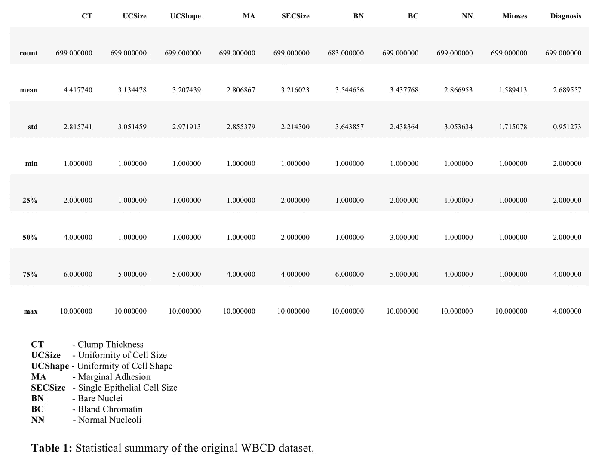

观察到数据集存在以下问题:

*   缺失数据
*   小数据集大小
*   各种范围的数据值
*   不平衡数据
*   扭曲的数据

数据集的一个常见问题是缺少数据，WBCD 数据集也不例外。具体来说，如表 1 所示，有 16 个裸核条目缺失(标记为？在原始 WBCD 数据集中)。

WBCD 数据集[2]仅包含 699 个样本，在将数据集划分为训练和测试子集后，对于深度学习来说太小了。

不同特征的特征值范围是不同的。平均特征值从大约 1.5 变化到 4.5(关于特征值的各种范围的可视化，参见第 2.2 节)。

不同标签的数据样本总数不平衡。事实上，标记为 B 的数据样本总数(458)几乎是标记为 M 的数据样本总数(241)的两倍(参见第 2.2 节了解这些数字的可视化)。

与数据集相关的另一个常见问题是偏斜度(详见第 2.2 节)。

第 2.2 节提供了这些数据集问题的可视化，第 3.1 节描述了这些数据集问题的解决方案。

## 2.2 可视化数据

本节通过数据可视化展示了第 2.1 节中描述的一些数据集问题。

图 1 使用以下代码显示了不同特性的各种平均值范围:

```
import seaborn as sns
data_mean = data.describe().loc['mean']
data_mean.plot(kind='bar', figsize=(14,6))
```

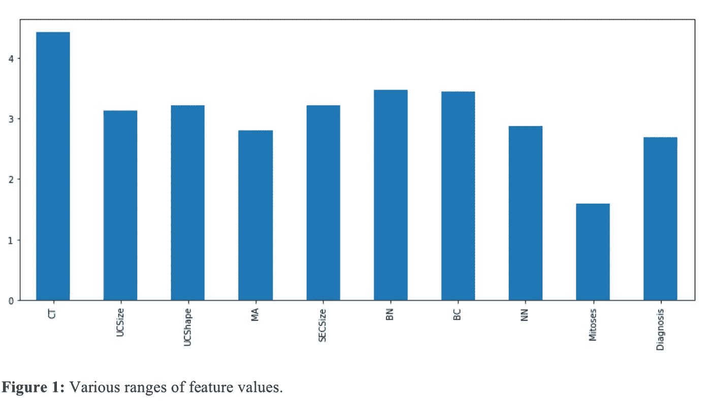

为了直观显示不平衡的数据集问题，图 2 使用以下代码显示了标记为 B 和 M 的样本总数:

```
data_B = data[data['Diagnosis'] == 2]
data_M = data[data['Diagnosis'] == 4]
B_M_data = {'B': [data_B.shape[0]], 'M': [data_M.shape[0]]}
B_M_df = pd.DataFrame(data=B_M_data)
B_M_df.plot(kind='bar', figsize=(10,4))
```

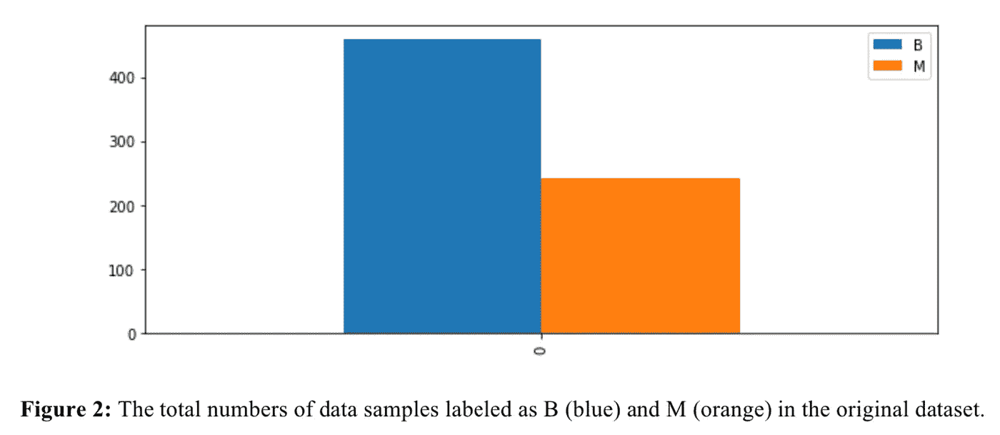

为了直观显示数据偏斜问题，图 3 显示了数据预处理后 Pandas 生成的数据集散点图矩阵(详情见第 3.1 节):

```
diagnosis = data['Diagnosis']
features = data.drop(['Diagnosis'], axis = 1)
pd.plotting.scatter_matrix(features, alpha = 0.3, figsize = (14,8), diagonal = 'kde');
```

从图中可以看出，数据集明显向右倾斜。

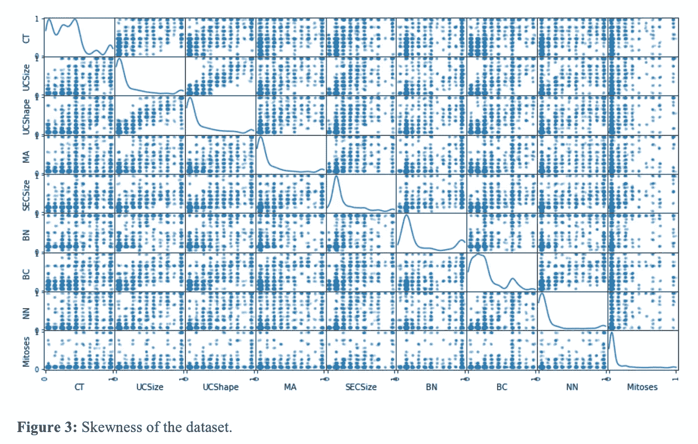

## 2.3 深度学习模型

如前所述，在本文中，乳腺癌诊断问题被视为 2 类(*良性*或*恶性*)分类问题。

一种新的监督深度学习模型用于分类。新的深度学习模型的架构如图 4 所示。

这种新的监督深度学习模型继承了 Stahl [3]和 Geekette [4]实验的方法的优点。

具体来说，与[4]类似，新方法使用最初识别的特征[2]，使用中心和尺度对数据进行预处理(详见 3.1 节)，并将乳腺癌诊断问题视为 2 类(*良性*或*恶性*)分类问题。

与[3]一样，新方法采用多个(三个)隐层的深层神经元网络。

此外，数据集的不平衡和偏斜问题也作为数据预处理的一部分进行处理。

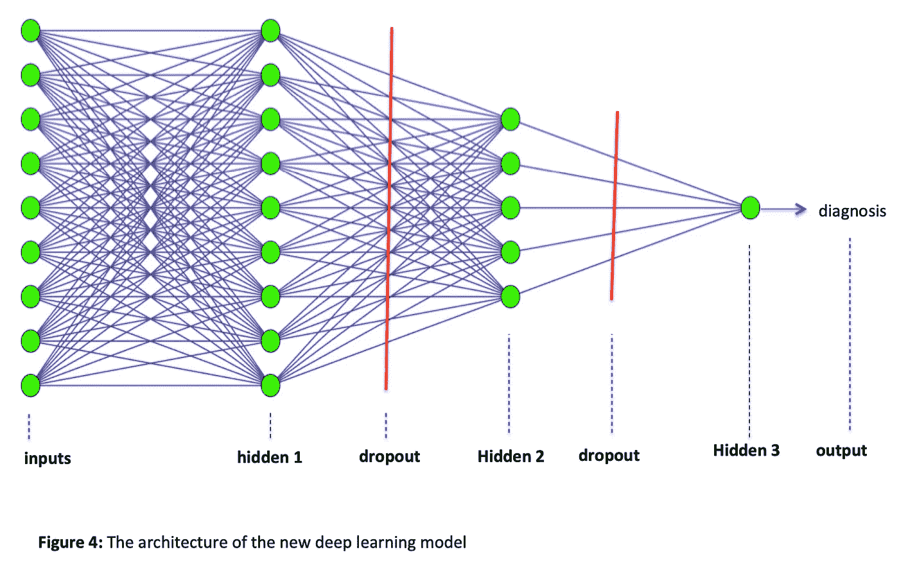

如图 4 所示，新的深度学习模型的输入是从 FNA 的数字化图像计算的特征值，模型的输出是两个识别的分类诊断类 B ( *良性*)或 M ( *恶性*)。

第一个隐层用 9 个神经元，最后一个隐层用 1 个神经元分别匹配输入特征数和输出类别数。中间的隐藏层的大小(5 个神经元)是第一个和最后一个隐藏层的大小的中间。

此外，在隐藏层之间引入了辍学率为 50%的脱落层，以避免过拟合，并潜在地提高新的深度学习模型在准确性方面的性能。

公共整流线性单元(ReLU)激活功能 *relu* 用于隐藏层 1 和 2。广泛使用的 *sigmoid* 激活函数被用在最终隐藏层 3 中，以产生(0，1)范围内的连续输出。阈值 0.5 固有地用于从连续输出产生二进制诊断输出。

以下损失函数、优化器和度量函数用于训练新的深度学习网络模型:

*   **损失函数:**二元交叉熵
*   **优化器功能:** Adam(自适应力矩估计)
*   **度量函数:**准确度

选择二元交叉熵损失函数是因为 WBCD 分类是二元分类问题。

选择精度而不是二进制精度度量函数是因为精度度量函数支持模型定型中的精度历史，但二进制精度度量函数不支持。

选择 Adam 优化器函数是因为它是用于训练深度学习模型的随机梯度下降(SGD)的替代优化算法。

关于新的深度学习网络架构的更多信息在第 3.2 节中提供。

## 2.4 基准

新的监督深度学习模型的结果将与应用具有默认设置的随机森林分类器[6]的开源 scikit-learn 开箱即用实现的结果进行比较，以测量相对性能(详细信息请参见第 3 部分)。

# 3.方法学

在这一节中，首先描述数据预处理的方法，然后提供端到端的实现细节。

## 3.1 数据预处理

在本文中，丢失的数据条目简单地用 0 替换，原因如下。缺失条目的数量(总共 16 个)相对较小，因此用 0 替换它们不会对数据集的统计数据模式产生显著影响。

如 2.1 节所述，具有不同标签的数据样本的总数是不平衡的。这种不平衡的数据问题通过生成标记为 M 的新数据样本来解决。具体而言，通过向标记为 M 的现有数据样本引入正态分布随机噪声，标记为 M 的 241 个数据样本的集合被加倍(482)。如图 5 所示，标记为 M 的所得新数据样本集合与标记为 b 的数据样本集合相当平衡

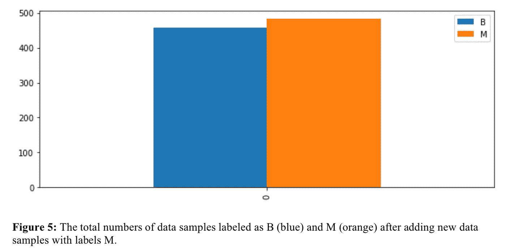

如 2.1 节所述，原始数据集仅包含 699 个样本。本文通过生成如下新数据样本解决了这个小数据量问题。

首先，从标记为 M 的数据样本中分离标记为 B 的数据样本。然后，通过引入正态分布随机噪声，将标记为 M 的数据样本集加倍。最后，类似于扩展标记为 M 的数据样本集，通过引入正态分布随机噪声，新的组合数据集加倍。

通过使用 Numpy 随机数生成库*Numpy . random . normal*(*mean，sigma，features.shap* e)生成与给定数据集具有相同特征维数的正态分布随机数的数组来实现噪声生成，其中*表示* = 0，标准差 *sigma* = 0.1。之后，将生成的随机数数组逐个元素地添加到给定的数据集中，以形成新的数据集。

WBCD 数据集[2]中最后一列“诊断/类别”中的值在本文中用作训练新深度学习模型的标签。通过将新生成的特征值阵列与来自给定数据集的“诊断/类别”列组合成新的数据集，这些标签被重新用来标记新生成的数据集中的相应样本(特征向量)。

数据集扩展后，最终的新数据集总共包含 1，880 个样本，用于模型训练和测试。

作为一种常见的做法，对于每个特征，特征值被缩放到[0，1]的范围内用于深度学习，如下所示:

(*值-最小值* ) / ( *最大值-最小值*)

通过对特征值求平方根来处理所识别的数据偏斜问题。这是通过 Numpy API 实现的，如下所示:

*Value = Numpy.sqrt(Value)*

图 6 显示了对数据集应用平方根变换的结果。

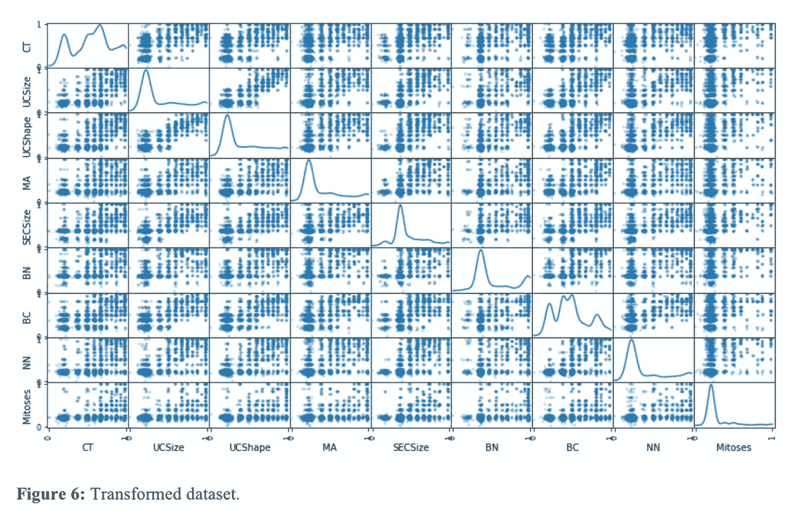

## 3.2 端到端实施

以下常见开源库用于实现数据预处理和新的深度学习模型:

*   Numpy
*   熊猫
*   scikit-lean
*   克拉斯
*   matplotlib

本节的其余部分描述了具体的实现细节。

**3.2.1 加载数据**

作为实现的第一步，使用 Pandas API 加载数据集 csv 文件(有关代码，请参见 2.1 节)。

缺失数据问题在数据加载中分两步处理。首先是丢失的数据问号“？”换成了*楠*。然后那些 *NaN* 值用 0 填充。

**3.2.2 增补数据**

为了解决数据不平衡和小数据集大小的问题，给定一个数据集，定义以下函数，通过引入正态分布随机噪声来生成相同维数的新数据集。

```
def generateData(data1): 
    # make a copy of data 
    data2 = data1.copy()
    # separate labels from features
    diagnosis2 = data2['Diagnosis'] # labels
    features2 = data2.drop(['Diagnosis'], axis = 1)
    features2_headers =  
   ["CT","UCSize","UCShape","MA","SECSize","BN","BC","NN","Mitoses"] mean, sigma = 0, 0.1
    # creating a noise with the same dimension as the dataset
    noise = np.random.normal(mean, sigma, features2.shape)
    features2 = features2.apply(pd.to_numeric, errors='ignore')
    features2_with_noise = features2.add(pd.DataFrame(noise, columns = features2_headers), fill_value=0) 
    data2 = pd.concat([features2_with_noise,  
                       pd.DataFrame(diagnosis2)], axis = 1) return data2
```

上面的数据集生成函数被如下调用，以将新生成的数据集与给定的数据集组合。

```
new_data = generateData(data)
data = data.append(new_data, ignore_index=True)
```

**3.2.3 缩放数据集**

如前所述，不同特征的值具有不同的范围，并且这些值的大部分在[0，1]的范围之外。然而，新的深度学习模型要求输入值在[0，1]的范围内，以获得更好的性能。为此，数据集的值被缩放到[0，1]的范围内，如下所示:

```
from sklearn.preprocessing import MinMaxScalerscaler = MinMaxScaler()
numerical =["Diagnosis","CT","UCSize","UCShape","MA","SECSize","BN","BC","NN","Mitoses"] 
data[numerical] = scaler.fit_transform(data[numerical])
```

**3.2.4 处理数据集偏斜度**

如前所述，数据集偏斜问题是通过将要素从标注中分离出来，然后仅对要素值应用平方根变换来处理的。这是通过以下方式实现的:

```
diagnosis = data[‘Diagnosis’]
features = data.drop([‘Diagnosis’], axis = 1) 
sqrt_features = features.copy()
for feature_name in sqrt_features.columns:
    sqrt_features[feature_name] = 
        np.sqrt(sqrt_features[feature_name]) 
features = pd.DataFrame(sqrt_features)
```

**3.2.5 将数据集分割成训练和测试子集**

如前所述，数据集分为两部分:75%用于模型训练，25%用于模型测试:

```
from sklearn.model_selection import train_test_split# Shuffle and split the data into training and testing subsets
X_train, X_test, y_train, y_test = train_test_split(features,   
    diagnosis, test_size=0.25, random_state=42)
```

**3.2.6 重新格式化数据集**

拆分数据集后，必须按如下方式重新索引生成的数据子集，以避免数据集键不匹配问题:

```
X_train = X_train.reset_index(drop=True) 
X_test = X_test.reset_index(drop=True) 
y_train = y_train.reset_index(drop=True) 
y_test = y_test.reset_index(drop=True)
```

那么产生的 Pandas 数据帧必须转换成 Numpy 数组，如下所示，因为 Pandas 数据帧不受 Keras API 支持。

```
X_train = X_train.values 
y_train = y_train.values 
X_test = X_test.values 
y_test = y_test.values
```

**3.2.7 基准测试**

随机森林分类器的 scikit-learn 开箱即用实现用于生成基准预测结果以进行比较，如下所示:

```
from sklearn.ensemble import RandomForestClassifier 

rfc = RandomForestClassifier()
rfc.fit(X_train, y_train)
score = rfc.score(X_test, y_test)
```

**3.2.8 实施新的深度学习模型**

流行的开源 Keras 深度学习库[7]用于实现新的深度学习模型。首先，可以定义一个可重用的函数来创建新的模型实例:

```
from keras.layers import Dense
from keras.layers import Dropout 
from keras.models import Sequential import keras
import keras.utils
from keras import utils as np_utilsdef createModel():
    model = Sequential()
    model.add(Dense(9, activation='relu', input_dim=9))   
    model.add(Dropout(0.5))
    model.add(Dense(5, activation='relu', input_shape=(9,)))   
    model.add(Dropout(0.5))
    model.add(Dense(1, activation='sigmoid', input_shape=(5,))) model.compile(loss='binary_crossentropy', optimizer='Adam', metrics=['accuracy']) return model
```

模型训练执行如下:

```
model = createModel()
model.fit(X_train, y_train, epochs=500, batch_size=32)
```

此外，如下执行 10 重交叉验证，以验证新的深度学习模型的鲁棒性。

```
from sklearn.model_selection import StratifiedKFold # fix random seed for reproducibility
seed = 7
np.random.seed(seed)X = X_train 
Y = y_train# define 10-fold cross validation test harness
kfold = StratifiedKFold(n_splits=10, shuffle=True,random_state=seed) 
cvscores = []
for train, test in kfold.split(X, Y):
    model = createModel()
    model.fit(X[train], Y[train], epochs=500, batch_size=10, 
              verbose=0)
    scores = model.evaluate(X[test], Y[test], verbose=0)
    print("{}: {.2f}".format(model.metrics_names[1], scores[1]*100))
    cvscores.append(scores[1] * 100)print("{.2f} (+/- {.2f})".format(np.mean(cvscores), np.std(cvscores)))
```

最后，按如下方式进行模型测试:

```
score = model.evaluate(X_test, y_test, batch_size=32)
```

GitHub [8]中有一个 Jupyter 笔记本，里面有本文中使用的所有源代码。

## 3.3 改进

本节将讨论不同模型超参数和优化器的准确性影响。

**3.3.1 网络深度**

本文使用了 1，880 个样本的相对较小的数据集。在这种情况下，使用最少三个隐藏层的深度学习网络是合适的，以获得最佳性能。

如下表所示，由于没有足够的数据来训练深度学习模型，因此使用三个以上的隐藏层会对精度性能产生负面影响。

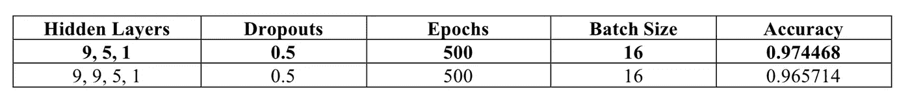

**3.3.2 辍学**

理论上，添加辍学层应该有助于避免过度拟合，从而潜在地提高深度学习模型在准确性方面的性能。然而，根据实验结果，一旦时期的数量为 500 或更多，通过使用 50%速率的丢弃，没有获得显著的性能增益。

如下表所示，在使用退学率时，50%的退学率似乎是一个甜蜜点。例如，在所有其他配置参数固定的情况下，使用 30%的丢弃率产生大约 97.1428%的预测准确度，而使用 50%的丢弃率获得准确度为 97.7143%的预测性能。


**3.3.3 批量**

新的深度学习模型的精度性能对批量大小很敏感。如下表所示，批量大小为 16 似乎效果最好。

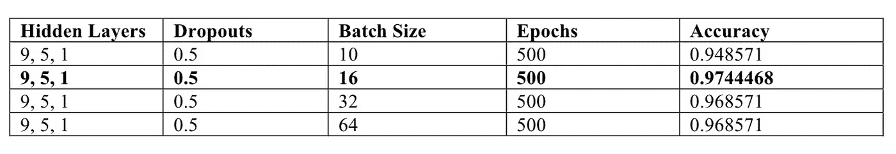

**3.3.4 历元**

实验结果表明，使用 500 个历元足以在有或没有丢失的情况下获得稳定的精度性能。可以减少时期的数量(例如，300)以获得稳定的性能而没有丢失。

**3.3.5 优化器**

如下表所示，Adam 优化器在准确性方面的性能最好。这并不奇怪，因为 Adam 是 SGD 的改进。

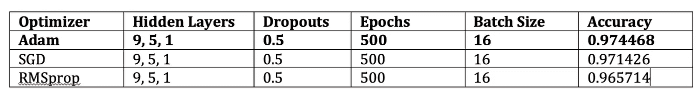

# 4.结果

该部分提供了模型评估和验证结果以及基准测试结果。

## 4.1 模型评估和验证结果

与[4]类似，数据集分为两部分:75%用于训练，其余 25%用于测试。

为了避免不平衡和小数据集大小的问题，本文通过引入正态分布随机噪声，将 699 个样本的原始数据集扩展为 1，880 个样本的新数据集。

如前所述，类似于 Geekette [4]实施的评估方法，预测精度被用作主要评估指标。

为了验证新的深度学习模型在小数据集变化的情况下的鲁棒性，使用 500 个时期和批量大小 16 执行了 10 倍交叉验证，以下是结果:

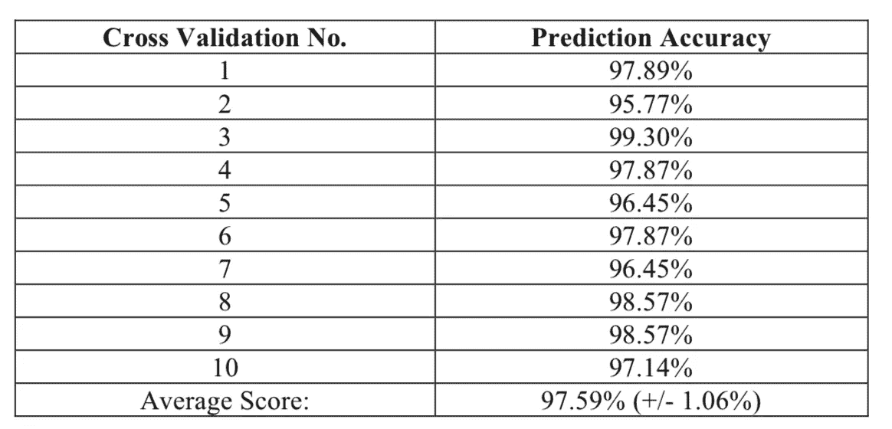

从上表可以看出，在数据集发生变化的情况下，新的深度学习模型的精度性能相当稳定。

## 4.2 基准测试结果

新的监督深度学习模型的预测准确性与应用具有默认设置的随机森林分类器的开源 scikit-learn 开箱即用实现[6]的结果进行比较，以测量相对性能。

下表显示了将 25%测试数据集应用于训练的随机森林分类器和训练的新深度学习模型的比较结果的汇总。

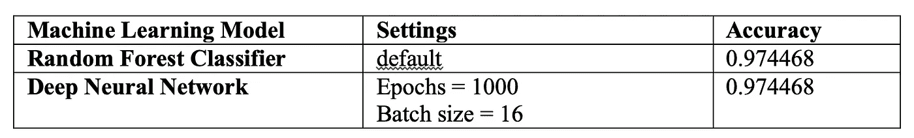

在上表中可以看出，新的深度学习模型的性能在准确性上与随机森林分类器具有竞争力。两者的预测准确率都达到了 97.4468%。

这种新的深度学习模型的性能超过了 Stahl [3]和 Geekette[4]报告的结果。

# 5.结论

本节总结了新的深度学习模型的实现结果以及未来可能的改进。

## 5.1 模型性能可视化

为了验证在将数据集分成两部分(即，75%用于模型训练，25%用于模型测试)的情况下新的监督深度学习模型的精度性能，图 7 示出了新模型在模型训练中的预测精度历史，图 8 示出了新模型在模型训练中的损失历史。

从这些图中可以看出，新模型的精度性能迅速增加并稳定到大约 90%，而损失历史下降并稳定到大约 0.25。

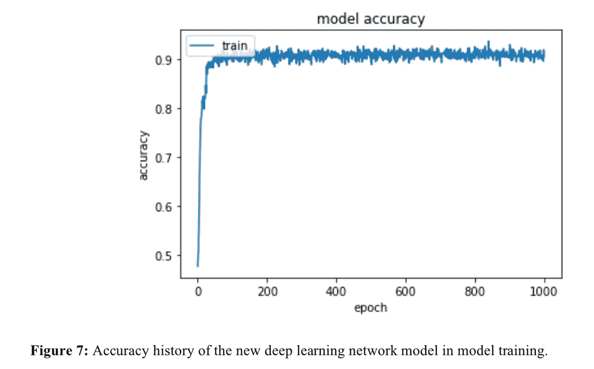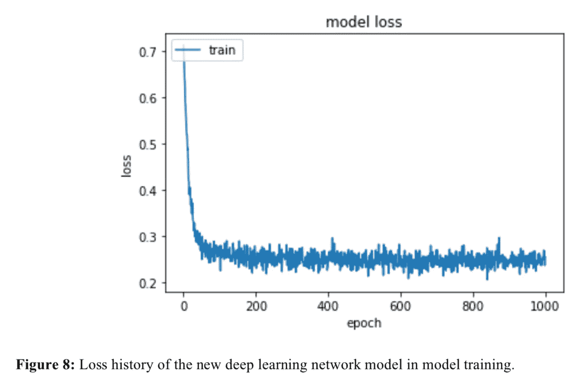

## 5.2 反射

本文提出了一种新的监督深度学习模型，用于 WBCD 数据集的分类[1][2](详见 2.3 节)。

还提出了一种新的数据生成方法，通过在现有数据样本中引入正态分布随机噪声，解决了不平衡数据集问题，并将 699 个样本的原始数据集扩展到 1，880 个样本的新数据集。

具有裸核特征的缺失数据条目被替换为零，然后数据值被缩放到[0，1]的范围内用于深度学习。通过对特征值求平方根，数据集的偏斜问题得到了显著缓解。

实验结果表明，通过使用深度学习(具有 3 个隐藏层)并在最终隐藏层中引入丢弃层和 Sigmoid 激活函数，新的深度学习模型在 WBCD 数据集的分类中与传统的随机森林分类器具有竞争力[1][2]。新的监督深度学习模型的性能是稳健的，并且优于 Stahl [3]和 Geekette[4]报告的性能结果。

新的深度学习模型是用 Python 实现的，使用了著名的开源库，如 Numpy、Pandas、scikit-learn、Keras、Matplotlib 等。Github [8]中提供了 Jupyter 笔记本的源代码。

## 5.3 改进

未来可能的改进之一是识别和实现自动化机制，以识别超参数的最佳组合，例如隐藏层的数量、每个隐藏层中的神经元数量、退出和退出率、激活函数、批量大小、时期等。

本文中的实验结果表明，在像 WSCD 数据集[1][2]这样的简单数据集的情况下，有时使用简单的机器学习模型比更高级的深度学习模型更好。

# **参考文献**

1.  [乳腺癌威斯康星州(诊断)数据集](https://archive.ics.uci.edu/ml/datasets/Breast+Cancer+Wisconsin+(Diagnostic))
2.  [WBCD 数据文件](https://archive.ics.uci.edu/ml/machine-learning-databases/breast-cancer-wisconsin/)
3.  K.Stahl **、**、[威斯康星乳腺癌诊断深度学习](http://www.rpubs.com/kstahl/wdbc_ann)、[、](http://www.rpubs.com/kstahl/wdbc_ann,)2017 年 7 月 17 日
4.  D.Geekette，[乳腺癌数据:机器学习&分析](http://rpubs.com/elena_petrova/breastcancer) [，](http://rpubs.com/elena_petrova/breastcancer,)2016 年 11 月 25 日
5.  C.Nguyen，Y. Wang，H. N. Nguyen，[结合特征选择的随机森林分类器在乳腺癌诊断和预后中的应用](https://www.scirp.org/journal/PaperInformation.aspx?PaperID=31887)，科学研究，第 6 卷第 5 期，2013 年 5 月
6.  [scikit-learn 随机森林分类器](http://scikit- learn.org/stable/modules/generated/sklearn.ensemble.RandomForestClassifier.html)
7.  [Keras:Python 深度学习库](https://keras.io/)
8.  Y.张 [GitHub](https://github.com/yzzhang/machine-learning/tree/master/deep_learning/Multi_Layer_Perceptron/breast-cancer-wisconsin) 中 Jupyter 笔记本源代码

披露声明:2019 首创一。观点是作者个人的观点。除非本帖中另有说明，否则 Capital One 不隶属于所提及的任何公司，也不被这些公司认可。使用或展示的所有商标和其他知识产权是其各自所有者的财产。