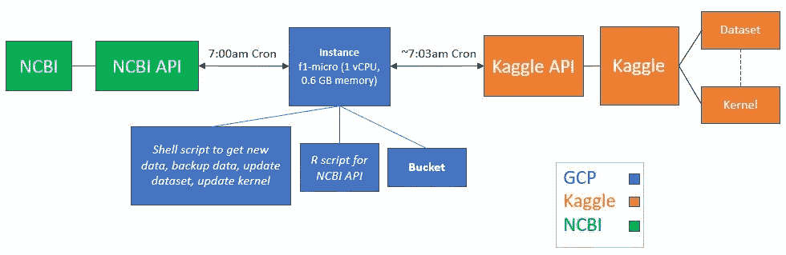
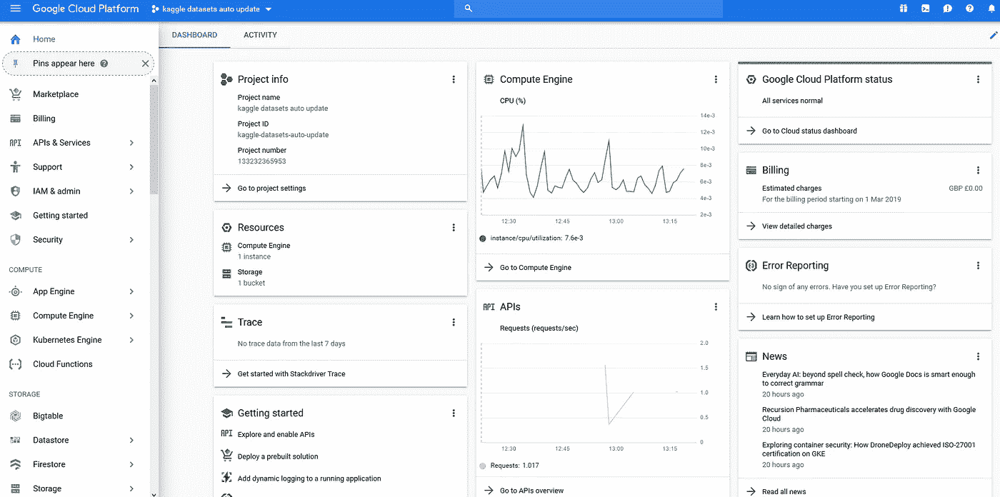
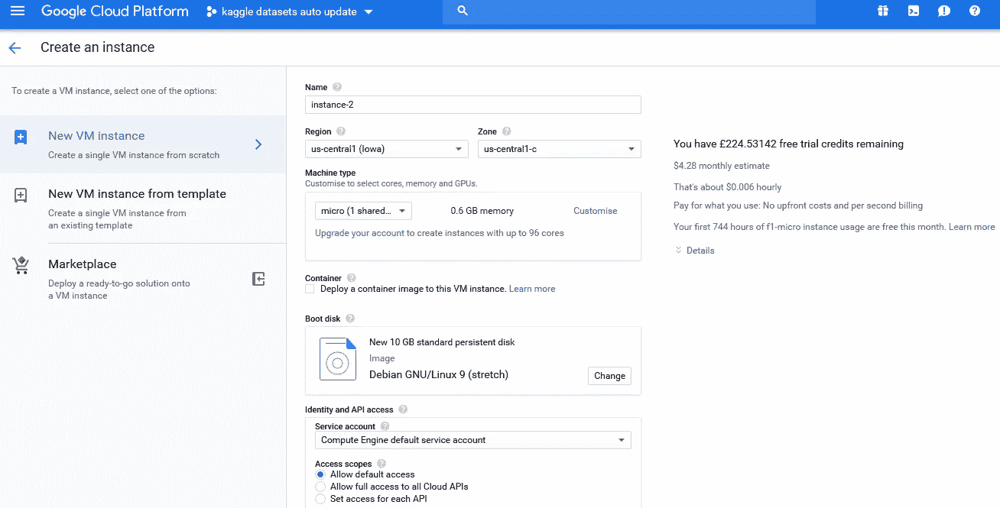
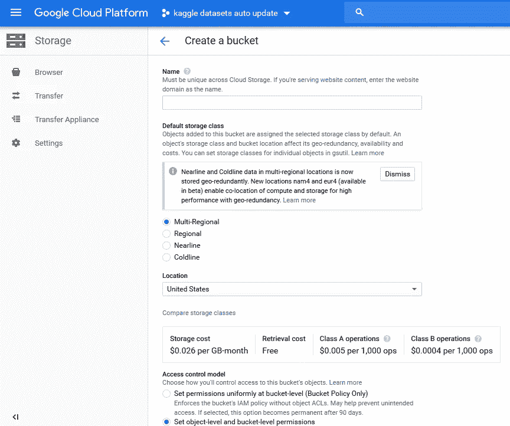
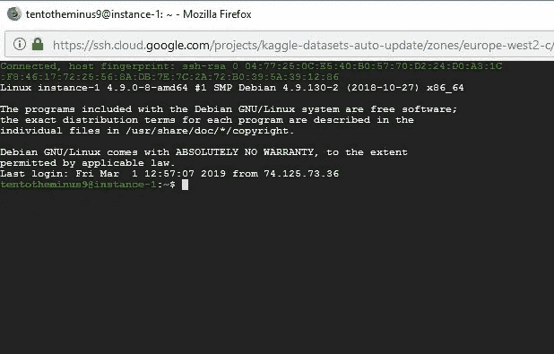
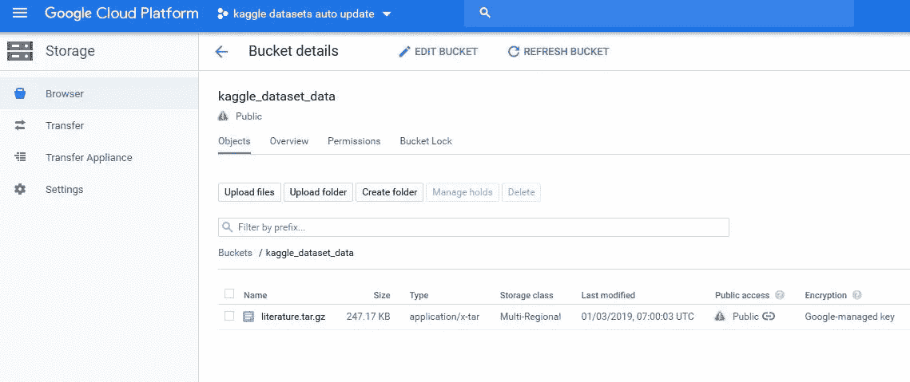
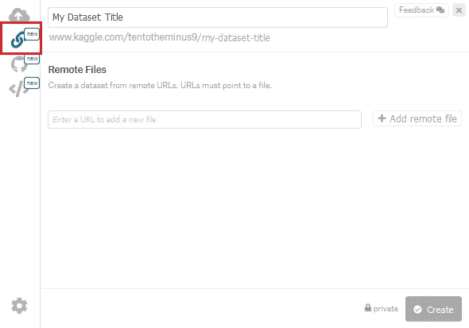
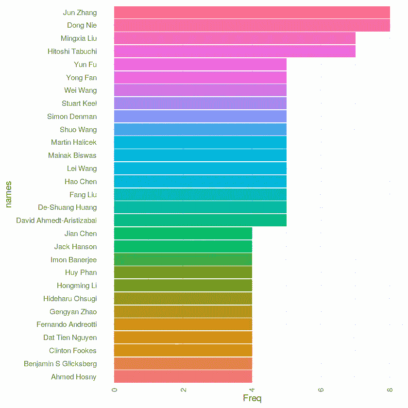

# 用 Kaggle 和 Google 云平台深度学习文献

> 原文：<https://towardsdatascience.com/deep-learning-literature-with-kaggle-and-google-cloud-platform-6d7d93d14997?source=collection_archive---------8----------------------->


*创建自动更新数据集和内核*

我第一次发现 Kaggle 是在大约 4 年前，当时我刚开始进入数据世界的旅程。他们的“巨大”数据集和相关内核帮助我了解了许多现代数据科学工具和技术，从那以后我就迷上了它们。

该平台有几个部分，包括机器学习竞赛、数据集、内核、论坛和课程。数据集部分是我个人最喜欢的，因为它提供了一个广阔的游乐场来探索你能想象到的任何领域的开放数据。然后你可以通过内核(笔记本)分享你的工作，内核是文本、代码和代码输出的混合体。

最近，Kaggle 创建了一个 API，允许从命令行更新数据集和内核。通过使用谷歌云平台(GCP)，我们可以安排这种情况定期发生，提供一个自动更新的“仪表板”。这篇博客文章概述了这个过程。

# 谷歌云平台

GCP 是一种云计算服务，不仅在注册时提供免费积分，还提供完全免费的计算和存储层。当然，付费的话，你也可以旋转巨大的虚拟机集群，更不用说其他几十种功能，包括一些令人惊叹的大数据和机器学习产品。也有其他的云平台，但是考虑到 Kaggle 是一家谷歌公司，Coursera 上有一系列优秀的[课程教授 it 的各个方面，我选择了 GCP 的路线。](https://www.coursera.org/googlecloud)

# 教程目标

内核的这一部分旨在向您展示如何，

1.  创建一个 GCP 帐户
2.  创建虚拟机和存储桶
3.  从 API 获取数据
4.  通过 GCP 在 Kaggle 上创建定期更新的数据集
5.  通过 GCP 在 Kaggle 上创建一个定期更新的内核

# 具体的核心目标

这些年来，我或者和我一起工作的人有几次想要了解科学文献的某个特定领域在做什么。最近，这使我来到了[国家生物技术信息中心(NCBI) API](https://www.ncbi.nlm.nih.gov/home/develop/api/) ，它允许下载科学论文的细节，包括特定日期范围内的完整摘要。这给了我一个想法，使用 R 脚本定期下载这样的细节，给我和我的同事一个过去的概述和现在的快照。一旦剧本写好了，我需要一种自动化的方法，这让我找到了 GCP。最后，我意识到这可能会引起其他人的兴趣，所以决定创建这个帖子来解释这个方法。

如果我没有告诉你 Rachael Tatman 在 dashboarding 上的伟大系列内核，那将是我的失职，这给了我这个项目的灵感。

下面是这个项目的概述，给你一个所有部分如何一起插槽的想法，



# 创建一个谷歌云平台账户

前往 [GCP](https://cloud.google.com/) 并报名。现在，在某个时候，你会被要求建立一个账单账户，这是我最初不愿意做的。基本上，我能想到的就是…*“如果我不小心启动了世界上最大的集群，忘了停用 6 个月，结果破产了怎么办？”*。然而，我随后发现了他们的定价页面，并密切关注了所有免费内容的部分。也就是说，12 个月的 300 美元信用额*加上*一个完全免费的等级。更多详情见[此处](https://cloud.google.com/free/)。此外，随着时间的推移，留意我们账户的**账单**部分，以确保没有任何疯狂的事情发生。

# 创建实例

一旦你进去了，你会看到这样的东西…



一开始这可能有点吓人。我刚刚在 Coursera 上完成了出色的 [GCP 数据工程专业课程，并且只使用了提供的一小部分功能。在这篇文章中，我们将关注要点，即**实例**和**桶**。](https://www.coursera.org/specializations/gcp-data-machine-learning)

一个实例基本上就是 GCP 上的一个虚拟机。在左边的栏上，点击**计算引擎**，然后点击**创建实例**。现在，这就是钱可以进来的地方。从地理区域到 CPU 数量，您可以选择多种不同的方式来设置您的机器。幸运的是，右边有一个成本估算器，它会随着您对选项的操作而更新。



首先，给实例起一个自己选择的名字。其次，选择一个地区(我选择了**美国-中央 1** ，因为它包含在自由层中。并非所有都是如此，因此请查看右侧的定价估计)。第三，从**机种**部分选择了 **micro (1 个共享 vCPU)** 。这(在撰写本文时)由自由层覆盖。

其余的我都默认了。点击**创建**。

# 创建一个桶

接下来，您需要一个地方来存储您的数据，尤其是如果您全天都在关闭实例的话。为此，通过点击左上角的 **Google Cloud Platform** 返回主控制台屏幕，然后从左边的栏中点击**存储**，接着是**创建存储桶**。



给它起一个你自己选择的名字，其他都保持默认，然后点击 **CREATE** 。请注意，默认位置是美国。尽管我在英国，但我离开了这里，因为所有的数据传输都将通过 Kaggle 进行，所以让一切都在同一个国家是有意义的。

# 安装 Kaggle API

现在是时候使用您创建的实例了。回到主控制台，然后点击**计算引擎**查看您的实例。然后，点击 **SSH** 来访问它的 shell。从这一点开始，您可以做任何您通常在 Linux 上做的事情。



# 安装 R

在这一点上，你可能想做你自己的事情。例如，我使用 R 从 NCBI API 获取数据。但是，您可以使用不同的语言和/或不同的 API。

对我来说，我通过键入 **sudo apt-get update** 后跟**sudo apt-get install R-base**来安装 R。为了从 API 中获取数据，我使用了 **RCurl** R 包，在破解了一点 R 代码之后，我意识到我需要安装一些其他的东西…

*   **sudo apt-get 安装资质**
*   **sudo apt-get install lib curl 4-OpenSSL-dev**
*   **sudo apt-get 安装 libxml2-dev**

一旦完成，用 **sudo R** 启动 R，然后键入**install . packages(' RCurl ')**并选择一个合适的镜像。再说一遍，用户网站是有意义的。对包 **jsonlite** 和 **XML** 做同样的操作。用 **q()** 退出 R。它将询问您是否要保存工作区图像。键入 **n** 并按回车键。

然后我用 **nano literature_update 从命令行创建了一个 R 脚本。R**

下面的脚本是我用来从 API 获取最新论文细节的。它使用两个 API 命令。第一个获取给定日期范围内(实际上是从今天算起过去的天数)匹配特定搜索条件的所有论文。在这种情况下，我在最后一天使用术语“深入”和“学习”。这样做的结果是一个 XML 文件，其中包含每张纸的 ID 号。然后脚本遍历这个列表，请求每个 ID 的论文细节。这些细节包括您所期望的一切，比如文章标题、作者细节，甚至是完整的摘要。我将每个文件保存到一个单独的 XML 文件中。

复制并粘贴 R 脚本(或者使用适当的 API 命令编写自己的脚本)，然后保存并退出(CTRL-X，后跟' Y ')。

注意，对于一些 API，比如 Kaggle API，您可能需要指定一个用户名和密钥，或者作为环境变量，或者在一个 JSON 文件中。您选择的 API 将在这方面为您提供指导。NCBI API 没有这样的要求。

```
library('RCurl')
library('jsonlite')
library('XML')search1 = 'deep'
search2 = 'learning'
since = '1' #daysxml_folder = paste('xml_files_', search1, '_', search2, '/', sep = "")
dir.create(file.path(xml_folder), showWarnings = FALSE)#Function to get paper data
get_and_parse = function(id) { data <- getURL(paste("https://eutils.ncbi.nlm.nih.gov/entrez/eutils/efetch.fcgi?db=pubmed&retmode=xml&rettype=abstract&id=", id, sep = ""))
  data <- xmlParse(data) return(data)}#Get the new papers
new_papers <- getURL(paste("https://eutils.ncbi.nlm.nih.gov/entrez/eutils/esearch.fcgi?db=pubmed&term=",
                           search1,
                           "+AND+",
                           search2,
                           "&reldate=",
                           since,
                           "&retmode=json&retmax=10000",
                           sep=""))new_papers_parsed <- fromJSON(new_papers)
new_paper_ids = new_papers_parsed$esearchresult$idlist
l=length(new_paper_ids)if(l==0) {'Nothing published!'} else { paste('Found', l, 'new articles in the last', since, 'days relating to', search1, 'and', search2) }#Get all the papers and save each one to an XML filei=1
while (i<=l) { data_temp = get_and_parse(new_paper_ids[i])
#  saveXML(data_temp, file = paste(xml_folder, new_paper_ids[i], '.xml', sep = ""))
  i=i+1}
```

**注意:**在上面的代码中，我在搜索最近‘1’天的新论文。当我第一次运行这个脚本时，我运行它来搜索最近的 365 天以获得一年的数据，然后将它更改为 1 天以进行定期更新。

# 使用搜索词和您选择的日期范围运行 R 脚本

现在我有了 R 脚本，我需要运行它。我这样做与 **sudo 脚本文学 _ 更新。R**

# 授权访问存储桶

我现在有一堆与我下载的所有文章相对应的 XML 文件，存储在一个专用文件夹中。现在，我想将它们备份到我创建的存储桶中。首先，我需要给这个实例访问 bucket 的权限。用下面的代码来做这件事，

**gcloud 认证登录**

这将带你到一组指令。按照它们提供对 bucket 的访问(您需要从浏览器中复制并粘贴代码)。

# 将 XML 复制到桶中

是时候将 XMLs 复制到桶中了。然而，一次做一个文件是没有意义的。相反，让我们把它们放到一个 tar.gz 文件中并上传。用**tar-zcvf literature.tar.gz XML _ files _ deep _ learning**创建归档文件(你可能有不同的文件夹名)，然后用**gsutil CP literature.tar.gz GS://ka ggle _ dataset _ data/**(用你的 bucket 名)传输到 bucket。

注意 **gsutil** 的使用。这是一个从命令行访问 GCP 存储桶的有用工具。点击了解更多[。](https://cloud.google.com/storage/docs/gsutil)

此时，我们已经准备好使用实例上的数据或桶中的数据来创建 Kaggle 数据集。然而，默认情况下，桶中的数据是不公开的，如果我们想使用 Kaggle 网站来创建它，就需要公开。用**gsutil ACL ch-u all users:R GS://ka ggle _ dataset _ data/literature . tar . gz**更改权限(相应更改桶名和文件名)。

# 准备使用 Kaggle API

Kaggle API 允许您与 Kaggle 进行完全交互，并为我们提供更新数据集和内核所需的一切。更多详细信息，请参见此处的。

首先，我们需要安装 Kaggle API，这需要安装 Python 3。用 **sudo 来安装 python python-dev python 3 python 3-dev**

二、用**wget**[https://bootstrap.pypa.io/get-pip.py然后 **sudo python get-pip.py** 安装 pip](https://bootstrap.pypa.io/get-pip.py)

第三，用 **sudo pip 安装 Kaggle API 安装 kaggle** 。然后，进入你的 Kaggle 账户，点击“创建新的 API 令牌”。下载并打开文件，复制上下文，然后在您的 GCP shell 中键入 **nano kaggle.json** 。在文件中，粘贴内容，然后保存并关闭文件。最后，用 **mkdir 将它移动到所需的文件夹中。kaggle** 然后 **mv kaggle.json。kaggle/** ，并使用 **chmod 600 /home//完成一些权限设置。kaggle/kaggle.json**

还有一件事。我后来在使用 kaggle API 时遇到了一个错误，特别是 *ImportError:没有名为 ordered_dict* 的模块。经过一番搜索，运行下面的代码修复了这个问题…**sudo pip install-U requests**

# 从 XML tar 文件创建一个数据集

此时，你有一个选择。如果您希望 Kaggle 进行更新，请从 bucket 中进行。如果您的数据非常大和/或您计划在大部分时间停用实例，则此选项是最佳选择。如果这是你的要求，从 GCP 控制台，转到**存储**，然后点击你的桶。你应该看到你新上传的 tar.gz 文件和“公共访问”列应设置为“公共”。在单词“Public”旁边，您应该会看到一个链接符号。右键单击并选择**复制链接位置**(或您选择的浏览器中的等效物)。



接下来，在 Kaggle 中，转到**数据集**，然后是**创建新数据集**。给它一个标题，并选择“链接”符号(下面用红色突出显示)。粘贴你的 GCP 桶文件的地址，点击**添加远程文件**。



一旦数据集被创建，转到**设置**并选择您选择的更新频率。

对我来说，假设实例在空闲层，我的数据很小，我将使用 API 从实例存储进行更新(注意，Bucket 指令对于备份数据和文件仍然很有用)。要做到这一点，请忘记上面从 Kaggle 网站创建数据集的说明。相反，从 GCP shell 中，首先用 **kaggle 数据集 init -p /path/to/dataset** 创建一个新的 Kaggle 数据集。这将在相应的目录中创建一个元数据 JSON 文件。转到这个目录，并编辑文件。您将看到 slug 和 title 的默认值。将它们分别更改为您选择的目录名和标题。然后，退出并使用 **chmod 777 file_name** 更改您将要上传的 tar.gz 文件的权限，然后返回到您的主目录并键入**ka ggle datasets create-p/path/to/dataset**。

您应该会得到消息*您的私有数据集正在被创建。请在…* 检查进度。

在我的项目中，

*   **mkdir 深度学习 _ 文学**
*   **mv literature.tar.gz 深度学习 _ 文学**
*   **kaggle 数据集 init -p 深度学习 _ 文献/**
*   **kaggle 数据集创建-p 深度学习 _ 文献/**

接下来，转到 Kaggle 并检查数据集是否已经创建。用你认为合适的标题、副标题、背景图片等来调整它。

# 如你所愿创建一个内核分析

我们现在有了一个使用 GCP 数据的数据集。此时，只需创建一个内核来分析您希望的数据。在 Kaggle 的内核中(下面的链接)，我有一些从 XML 文件中提取关键数据并绘制图表的代码。

# 自动化流程

如果您选择让 Kaggle 从您的 bucket 更新，那么您需要担心的就是更新 bucket 和您的内核。如果使用 API 从实例存储中更新数据集，也需要处理这个问题。

我的方法是将所有这些放入一个 shell 脚本中，如下所示。这有三个部分。首先，脚本运行获取最新深度学习文章的 R 脚本。然后，它创建一个 tar.gz 文件，并将其复制到 bucket(用于备份或 Kaggle 自动更新)以及实例上的一个文件夹中。它还在 bucket 上设置文件的权限。

接下来，它等待 15s，然后用**ka ggle datasets version-p ~/deep _ learning _ literature-m“通过来自 Google Cloud 的 API 更新”**来更新数据集。

最后，它等待 60 秒(以允许数据集得到更新)，然后使用 **kaggle 内核拉 tentotheminus 9/deep-learning-literature-and-GCP-tutorial-m**进行内核更新，然后 **kaggle 内核推**(更改文件夹、存储桶、数据集和内核的名称以匹配您的名称)。

这是完整的脚本。用 **nano update_kaggle.sh** 或类似的创建一个合适的文件。

```
#!/usr/bin/env bashsudo Rscript literature_update.R
tar -zcvf literature.tar.gz xml_files_deep_learning
gsutil cp literature.tar.gz gs://kaggle_dataset_data/
gsutil acl ch -u AllUsers:R gs://kaggle_dataset_data/literature.tar.gz
cp literature.tar.gz deep_learning_literature/ sleep 15skaggle datasets version -p ~/deep_learning_literature -m "Updated via API from Google Cloud"sleep 60skaggle kernels pull tentotheminus9/deep-learning-literature-and-gcp-tutorial -m
kaggle kernels push
```

好了，现在是最后一步。我需要告诉我的实例定期触发上面的脚本。首先，用**chmod+x literature _ bucket . sh**(或者随便你的脚本叫什么)使脚本可执行。然后，我们使用 **cron** 来设置计时(cron 是 Linux 中调度作业的工具)。

通过键入 **EDITOR="nano" crontab -e** 创建一个 cron 作业。在打开的文件中，以分钟、小时和天的格式设置计时。可能需要一段时间才能搞清楚，所以我推荐[这个在线工具](https://crontab.guru/)来帮忙。

下面是我的 cron 文件。开始时有一些设置，然后是每天早上 7 点触发我的 shell 脚本的命令，

```
#!/usr/bin/env bashSHELL=/bin/sh
PATH=PATH=/usr/local/sbin:/usr/local/bin:/usr/sbin:/usr/bin:/sbin:/bin:/home/tentotheminus9/0 7 * * * 1-literature_bucket_update.sh
```

当然，您可以(也应该)首先测试您的脚本。用**做这个。/update_kaggle.sh** (或者随便你怎么称呼)。

仅此而已。一切正常，每天早上下载新论文的细节，备份数据，更新 Kaggle 数据集，然后相应地更新内核。

# 未来的改进

根据 Rachael Tatman 的第五本笔记本，第一个可能改进的地方是错误检查。我一直在研究 XML 验证，但是还没有完全理解。到目前为止，NCBI XML 文件看起来设置得很好，我还没有遇到任何错误。

第二个方面是不仅安排 GCP 上脚本的触发，而且安排实例的加速和减速，每天都有一个实例启动脚本重新安装所有内容。从我目前所读到的来看，这种调度实现起来有点棘手，但我会看看将来能做些什么。这当然会为更大规模的资源节省很多钱。

# 内核

看完整的 Kaggle 内核[这里](https://www.kaggle.com/tentotheminus9/deep-learning-literature-and-gcp-tutorial?utm_medium=blog&utm_source=medium&utm_campaign=tentotheminus-medium)。第一部分是这篇文章的重复，第二部分展示了数据集的一些可视化。例如，下面是最常见的深度学习论文作者的细分…



希望这篇帖子有用。谢谢！