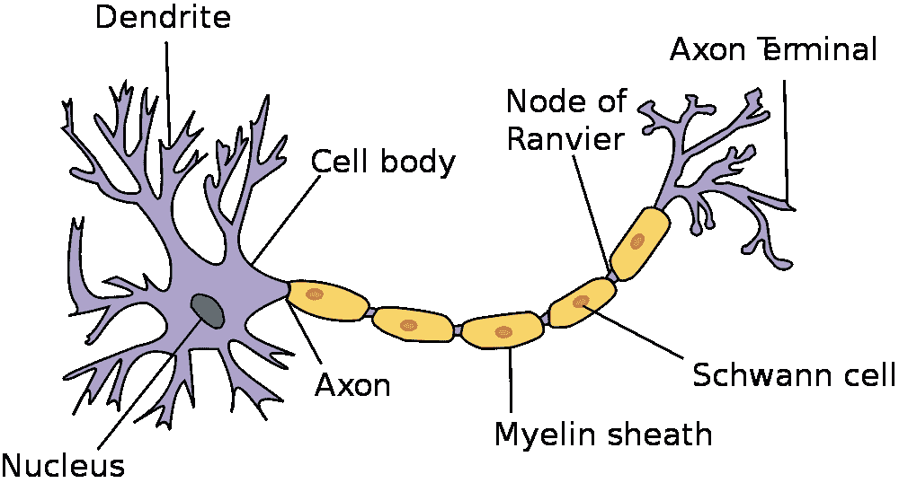
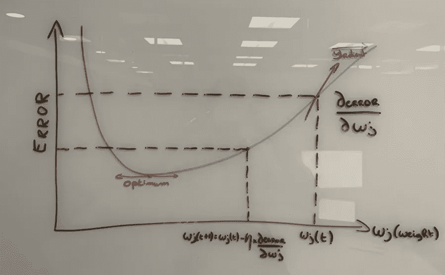
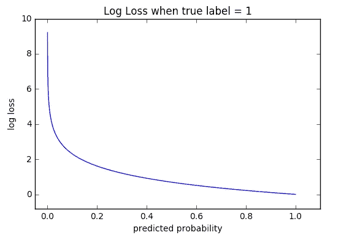
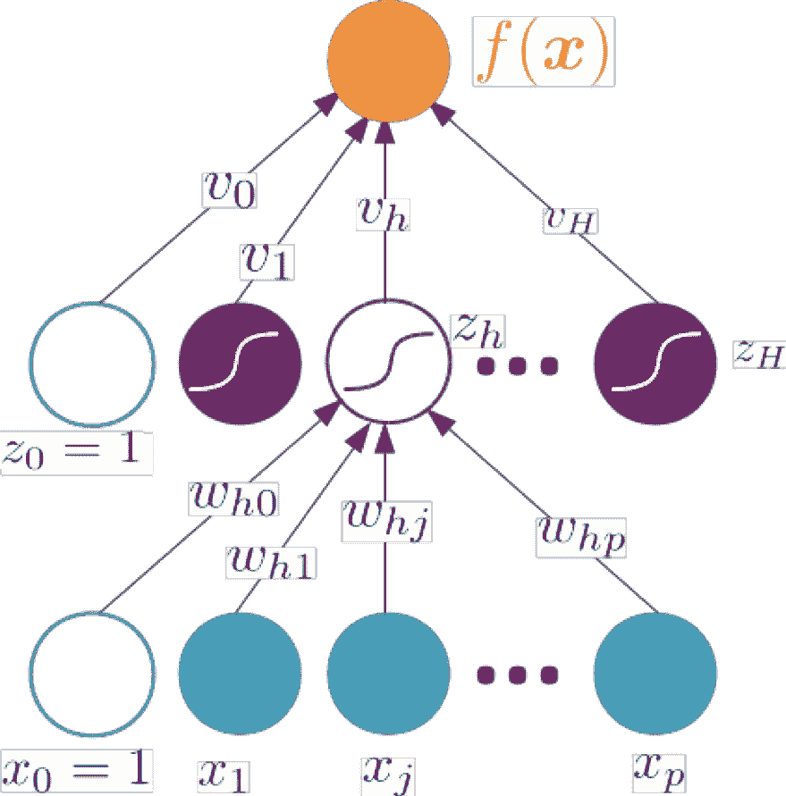
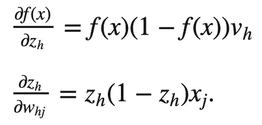

# 神经网络背后的数学

> 原文：<https://towardsdatascience.com/deep-learning-neural-network-and-python-part-1-3-4bbc64c106d6?source=collection_archive---------32----------------------->

## Python 开发者进一步挖掘人工智能和深度学习背后的科学的完整指南

理解人工神经网络并将其应用于实际案例的完整文章。本指南可用作数据科学面试的准备。

Photo by [Nastya Dulhiier](https://unsplash.com/@dulgier?utm_source=medium&utm_medium=referral) on [Unsplash](https://unsplash.com?utm_source=medium&utm_medium=referral)

开始前的一些要求和信息:

*   对数学和统计学有很好的理解会更好。
*   对于初学者来说，阅读理解的实时性可以达到 20 到 25 分钟。
*   如果需要，在文章的末尾有一个词汇表。

祝你阅读愉快…

神经网络是目前非常流行的机器学习领域……从语音识别到图像搜索，通过自动驾驶汽车和 AlphaGo，最近人工智能的成功，其中许多都依赖于人工神经网络，更为人所知的是深度学习的神秘名称。

本文将分为三个部分。第一部分将从数学和统计学的角度来阐述神经网络的意义。

下一个是使用 **TensorFlow** 包创建神经网络的操作模式，以轻松处理图像检测的基本情况。最后一个将是使用深度学习和神经网络解决一个金融案例并预测市场变化的例子。

## 简单回顾一下…

回到 50 年代，人工神经网络的历史和像弗兰克·罗森布拉特这样的心理学家专注于理解人类大脑。最初，它们被设计成对信息处理进行数学建模，类似于在哺乳动物皮层中发现的生物神经网络。今天，他们的自然现实主义是无关紧要的，相反，他们在模拟复杂和非线性关系方面的有效性使他们取得了成功。

Neuron description — Source: “Anatomy and Physiology” by the US National Cancer Institute’s Surveillance, Epidemiology and End Results (SEER) Program. Image free to use & share under [Creative Commons licence](https://commons.wikimedia.org/wiki/File:Neuron.svg).

大多数情况下，神经网络只不过是一种建立参数模型的方法，其决策函数是显式的。与线性回归等其他参数算法不同，它们可以轻松创建复杂的非线性模型。

## 感知器的架构

让我们平稳地开始，感知器，这种由单层组成的神经网络，是由前面引用的罗森布拉特发明的。

感知器由第一层单元(或神经元)组成，允许用户“读取”数据:每个单元对应一个输入变量。我们可以添加一个始终使能的偏置单元(始终传输 1)。这些单元被连接到单个输出单元，该输出单元接收连接到它的单元的总和，对于 p 个变量 x1，x2，…，xp，该输出单元由连接权重决定；输出单元接收初始权重(w0)和权重之和(w1 至 wp)乘以它们的变量(x1 至 xp)。然后，输出单元将**激活功能**应用于该事件。

感知器通过由下式定义的决策函数 f 来预测:

该函数具有显式形式；它确实是一个参数模型。

Image by Author

## 必须使用哪个激活功能？

> 在回归的情况下，没有必要转换作为输入接收的加权和。激活函数是身份函数；它归还了它全部被分享的东西。

在**二元分类**的情况下，用户可以使用这种类型的阈值函数:

与逻辑回归的情况一样，我们也可以使用 **sigmoid 函数**来预测属于正类的概率:

在**多层分类**的情况下，用户将不得不改变感知器的架构。它将使用尽可能多的类，而不是使用单一的输出单元。这些单元中的每一个都将连接到所有的输入设备。因此，剩余的将是 k. (p + 1)个连接权重，其中 k 是类的数量。

然后可用作激活功能 **Softmax** 。这是 sigmoid 方程的推广，也可以写成:

如果类 k 的输出比其他类足够重要，则其激活将接近 1(而激活其他类将接近 0)。我们认为这是一种类似于支持向量机算法的工作方式，这将使训练更容易理解。

现在让我们来看看如何训练一个感知器:)

## 训练感知器

首先想到的问题是:如何确定连接权重？

为了训练一个感知器，我们将寻求最小化训练数据集的预测误差。我们可以明确地做到这一点，就像线性回归的最小二乘法一样。

神经网络应该是灵活的，这意味着，它们根据接收到的信号不断适应。所以，让我们假设我们的 n 个观察值 x(1)，x(2)…，x(n)不是同时被观察到的，而是依次被观察到的。

因此，神经网络是通过称为在线学习的算法来训练的，这与我们迄今为止看到的通过批量学习来训练的模型相反。一个中间的解决方案是考虑逐步执行观察，称为小批量学习。

根据前面的说法，我们可以假设感知器的训练是一个**迭代过程**。在每次观察之后，用户将调整连接的权重(w1 到 wp ),以减少此时(T0)感知器的预测误差。为了解决这个问题，我们将使用梯度算法:梯度为我们提供函数(在我们的例子中，误差函数)更大变化的方向。为了找到最小值，用户必须向梯度的相反方向移动。(当函数局部最小化时，其梯度为 0。)

Image by Authors

用户将开始随机选择连接权重的初始值(w0(0) 0，w1(0)到 wp(0))。然后，在每次观察(x(i)，y(i))之后，用户将对每个权重应用出现在图上的以下更新规则。

我们可以对数据集进行多次迭代。通常，我们选择迭代，或者直到算法收敛(梯度足够接近 0)，或者更常见的是，迭代固定次数。

η超参数是神经网络的一个因子，叫做学习率。

> 一些经验法则:
> 
> 如果η很大，我们就离最佳值越来越远。如果这已经接近最优值，我们可能会超过我们的目标，wj (t + 1)会超过它的最优值。算法可能会发散，这意味着远离最优解。
> 
> 否则，如果 wj(t)远离其最优值且η较低；该算法将需要大量的时间来收敛。
> 
> 所以，选择学习的速度很关键。

## 如何定义误差函数？

在回归的情况下，我们将选择平方误差(作为线性回归)。误差函数定义如下:

在分类的情况下，我们将选择交叉熵。在二进制情况下，交叉熵由下式定义:

When y = 0, the cross-entropy is even higher than f (x) is close to 1\. Conversely, when y = 1, the cross-entropy is more significant as the prediction is close to 0.

交叉熵比平方误差方法更难区分，但是在一些计算之后，我们可以确定连接权重更新规则可以简化为:

对于交叉熵的多类版本也是如此。

## 深度学习来了

感知器本质上是一个线性模型。他的建模能力必然是有限的，这是 1970 年初科学界某种觉醒的根源。在 1969 年关于这个主题的一本著名的书中，数学家和教育家西蒙·派珀特和认知科学家马文·明斯基甚至提到他们的直觉，扩展多层感知机是无用的……历史会伤害他们的架构！

> 如何创建这样的架构？
> 
> 我们将在输入层和输出层之间创建一个隐藏层(见上图)。一层中的每个神经元都与其上一层的所有神经元相连。我们称之为多层感知器或“MLP”。

让我们以一个只有一个隐藏层的感知器为例。隐藏层的神经元数 h 的输出 zh 是通过将神经元的激活函数应用于输入的线性组合而获得的:

然后通过将输出神经元的激活函数应用于隐藏层输出的线性组合来接收输出(我知道这听起来很奇怪):

假设我们使用逻辑函数σ : u ↦ 1/(1+e-u)作为所有神经元的激活函数，那么:

我们都可以断定它是一个参数模型(我们可以把决策函数显式地写成输入变量的函数)，但它根本不是线性的！

在这些层中，这个参数模型比隐藏层和神经元有更多的设置(连接权重)。我们包含的参数越多，观察所需的时间就越长，以避免过度训练，深度神经网络通常需要大量数据来提高模型精度。

Multi-Layer Perceptron with one hidden layer.

为了提高效率，我们经常使用激活函数、中间层函数。双曲正切函数将输入信号的线性组合转换为-1 和 1 之间的数字，而不是 0 和 1 之间的数字。

可以设计各种类型的架构，这只是一个例子。在下面的例子中，所有的连接都是从较低层到较高层，但事实并非如此。这种没有到下层的反馈回路的概念被称为前馈架构。

## 通用逼近定理

Cybenko 在 1989 年的一个结果(由 Hornik 1991 改进)告诉我们，定义在ℝ上的每一个连续函数 f 可以由单个隐层形成的神经网络以任意精度逼近(如果在该层中使用足够数量的神经元)。

这是一个非常令人鼓舞的结果:我们现在可以对任何函数建模了！然而，这一结果要通过实践来调节:在许多情况下，这个隐藏层中所需的神经元数量是巨大的，这使得具有一个隐藏层的神经网络无效。

解决方案是将隐藏层堆叠起来，创建现在所谓的深度神经网络。**这就是深度学习露脸了！**

可以通过假设每个隐藏层的输出是表示数据的另一种方式来解释多层神经网络。多层神经网络的优势在于学习“良好”表示的能力。诸如最后隐藏层和输出之间的线性模型(感知器)的表示可能是有效的。

## 反向传播

至于感知器，我们将使用基于梯度的迭代算法。出于计算目的，我们将使用反向传播的思想，该思想在 20 世纪 60 年代首次提出(在神经网络领域之外)，并由 Rumelhart、Hinton 和 Williams 1986 在 connectionist 中推广。

这个概念是通过链式法则定理来划分误差:

在位于隐藏层的网络中，基于权重 whj 的误差 E 的偏导数可以写成:

最后两项很容易计算，因为逻辑函数σ的导数是 u↦σ(u)(1-σ(u))u':

因此，可以通过求解误差相对于决策函数的偏导数和输出(在该示例中为单层中的 f 或 z)相对于先前层(在该示例中为 x 或 z)的偏导数来计算误差相对于下层权重的偏导数。

因此，更新权重可以通过交替前向阶段(或上行链路)和后向阶段(或下行链路)来完成，在前向阶段中，中间层的输出被更新，在后向阶段中，相对于层的权重的误差梯度可以根据相对于上层的权重的误差梯度来计算。更新权重是在下降阶段的时候(在已经计算了必要的梯度之后)。

## MLP 面临的主要挑战

反向传播算法允许学习多层神经网络，对于多层神经网络，不知道显式地优化模型参数。不幸的是，这种算法有几个限制，我们必须小心处理。这就是神经网络在 2006 年重新流行的原因，当时 Hinton 工作，并结合现代计算机的计算能力，帮助克服了一些困难。它目前仍是不断发展的领域！

## 小心局部最小值

不幸的是，在多层神经元网络中使用的误差函数的导数通常条件较差。这意味着，如果我们稍微扰乱一下算法的初始条件，结果就会不同。实际上，它表明误差函数比预期的要复杂一些。

> 梯度等于零并不意味着最优！

因此，多层神经网络的误差函数允许大量的局部极小值，也就是说，在其邻域内是最优的点。这些点位于井中。这些点不是全局最小值，但是梯度算法可以在这样的区域中保持“停滞”。

The gradient algorithm can get stuck in the right well, and only detect the local minimum (green) rather than the global minimum (orange). Image by Authors.

连接权重的初始化、变量的标准化、学习速度的选择以及激活函数都会影响多层神经网络找到合理最小值的能力。使用学习算法、小批量或自适应学习速度可以部分克服这个问题。

## 梯度不稳定性

在多层架构中，当您从网络的输出到输入沿着隐藏层向下时，梯度往往越来越小。这意味着较低层的神经元比较高层的学习慢得多。我们称之为，梯度消失现象。

相反，梯度也可能在较低层中取相当大的值，即所谓的爆炸梯度。

重要的是梯度是不稳定的。这种不稳定性与较低层的梯度是反向传播中较高层的产物这一事实有关。

## 浸透

饱和是一种现象，当大多数网络逻辑激活神经元的输出为 0 或 1 时(对于双曲正切激活为-1 和+1)，即当它们接收输入的信号的加权和过大时(绝对值)。这意味着连接权重太大。此时，输入数据的微小变化对输出几乎不会产生影响，网络可以不学习(或者非常慢)。此外，一个网络经常在过度学习的情况下饱和…

可以用来避免过度训练的策略之一是正规化。是的，至于线性回归！我们甚至使用与正则化岭回归相同的方法:l2 范数连接权重。检查这个标准使得控制重量的绝对值成为可能，避免加权预激活量过大。在神经网络的世界中，这种技术被称为权重衰减。

## 第一部分概述。

感知器基于线性变量组合制作参数学习模型。

感知器产生二元分类(激活函数是逻辑函数)或多类分类(激活函数是 softmax 函数)的学习回归模型(激活函数是身份)。

感知器通过梯度算法对其权重进行迭代更新来驱动。相同的权重更新规则适用于回归、二元分类或多类分类的情况。

在多层神经网络(前馈)中堆叠感知器允许模拟任意复杂的函数。这就是赋予深度神经网络预测能力目前使他们成功的原因。

这些网络的驱动受到反向传播的影响。警告，这个算法不一定收敛，也不一定到最优解！

参数(即连接权重)越多，在没有过度学习风险的情况下，数据学习这些参数的值所需的时间就越长。

除了这里介绍的神经网络架构，还有许多其他的神经网络架构，用于建模特定类型的数据(图像、声音、时间相关性……)。

## 词汇表

**激活函数:**在神经网络中，激活函数负责将来自节点的总加权输入转换为该输入的节点激活或输出。

**感知器:**在机器学习中，**感知器**是一种用于二进制分类器监督学习的算法。

**变量:**变量是一个在数学问题或实验中可能发生变化的量。通常，我们用一个字母代表一个变量。字母 x、y 和 z 是用于变量的通用符号。