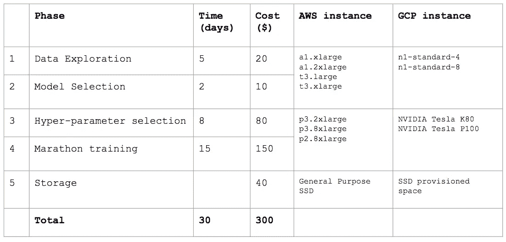
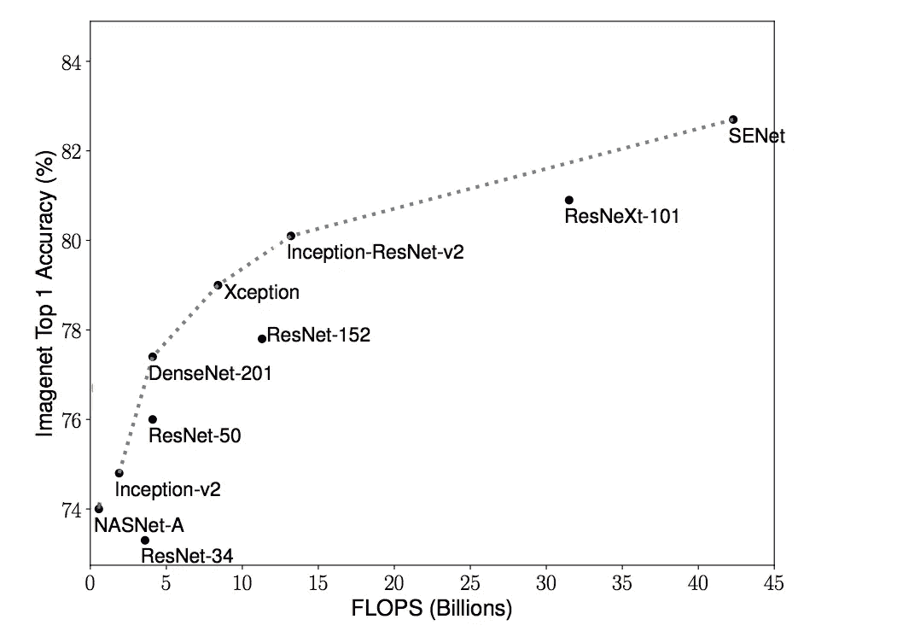
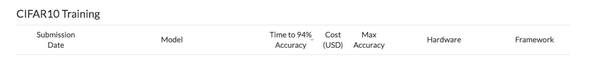
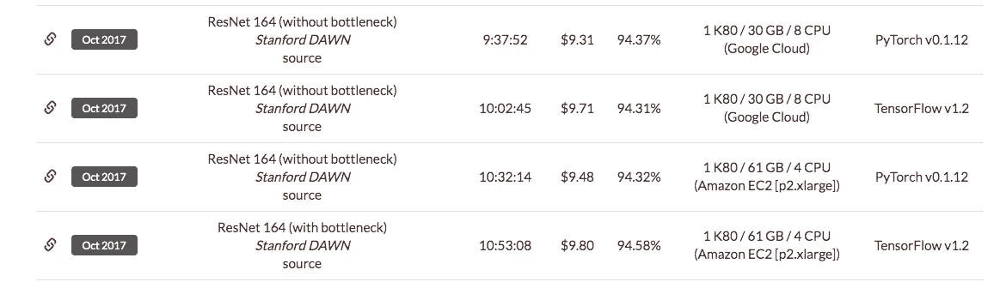
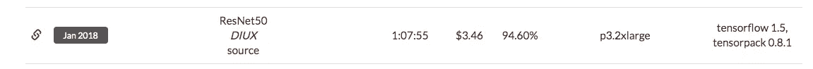
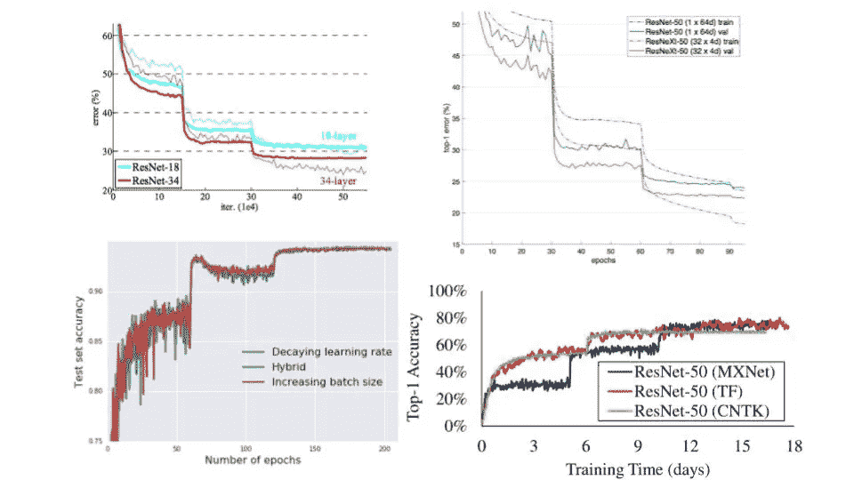

# 预算上的深度学习

> 原文：<https://towardsdatascience.com/deep-learning-on-a-budget-d414c2e89132?source=collection_archive---------15----------------------->

## 经济高效的模型培训技巧

[12]

# 介绍

## 为什么？

有许多文章和课程致力于最新的 ML/AI 研究，旨在训练更大的模型和实现更高的分类精度。这对研究和学术界以及推动人工智能的极限都非常重要。然而，这些并不是真正为从他们的第一个主要人工智能项目开始的贫困学生实践者或寻求为他们的酷革命想法建立 MVP 的有意识的企业家量身定制的。

## 什么？

在这项工作中，我采用预算方法进行模型训练，并尝试回答以下问题:

> 完成一个真实世界的人工智能项目的最低实际成本是多少？

我为此选择的问题是图像分类问题。这篇文章记录了我所遵循的过程和从每个步骤中学到的关键预算经验。

## 摘要

**答案大约是 300 美元→** 这是使用云计算训练一个性能良好的计算机视觉模型所需的费用。顺便说一句(或者不是)，这也是谷歌给予的信用额度，作为开始使用谷歌云平台(GCP)[【1】](https://cloud.google.com/free/)的奖励。

预算细目如下。最右边的两列列出了 AWS 和 GCP 最适合这个任务的实例。成本是这些列中列出的实例的平均值。目前，这两家云提供商在成本上没有太大的差距。

当然，根据问题的复杂性和数据的大小，所有这些步骤可能会有所不同。但是根据我的经验，对于大多数初始项目或 MVP，总成本的变化不会超过 2 倍。

每个阶段的详细讨论如下。

# 1 >数据探索

当处理一个新的数据集和 ML 问题时，首先要做的是理解数据，或者用 A. Karpathy 的话说——“与数据融为一体。”[【2】](http://karpathy.github.io/2019/04/25/recipe/)

在这个阶段，从业者做的事情有很大的差异，但是有一些共同的组成部分:

**A >理解输入格式，开发一些管道来处理数据**。我发现，在处理新的数据集时，这一步通常比计划的要花更多的时间。然而，如果做得好，这将在整个项目生命周期中节省大量的时间和精力。

**B >** ***看着*每一类的一些随机图像**而*看着*我们真的试图在心里回答这样的问题:CNN 可以用什么特征来区分输出类？这些特征的规模有多大？灯光的变化有多大？对象在图像中的居中程度如何？—这些问题的答案将决定我们的预处理流程和模型架构。

**C >** 掌握**训练样本跨类分布**。这将告诉我们我们的训练数据有多倾斜或平衡。如果数据是有偏差的，正如在任何真实世界的应用程序中经常出现的情况，我们将不得不在训练/测试过程中采取适当的步骤。

> 预算技巧

> 这个阶段可能会很耗时，并且会涉及一些脚本/笔记预订工作。此外，这些步骤通常不会从 GPU 或多核 CPU 中受益。根据预算，为此阶段选择一个轻量级云实例。我试图模仿我的 macbook 配置——2 到 4 个英特尔酷睿处理器和几百 GB 的固态硬盘。
> 
> 汇总表中列出的 AWS/GCP 的示例配置的价格在 0.10 美元/小时到 0.20 美元/小时之间，对于类似的实例类型，GCP 比 AWS 略具成本效益。每小时约 0.10 美元，一天的使用费用约为 1 美元。这是项目中使用的最便宜的实例。在这里做最大量的开发。

# 2 >型号选择

该过程的第二步是迁移学习，即找到文献中最相关的简历论文，并尝试根据手头的任务调整其网络架构。

用于对象分类的网络架构有数百种，arXiv[【3】](https://arxiv.org/)上每月还会增加一些。在 ImageNet 上，人们很容易被诱惑使用吹捧最佳准确性的最新模型。然而，在预算有限的情况下，这可能不是最好的主意。或者别的什么。

在下图中(借用并简化自[【4】](https://arxiv.org/pdf/1905.11946.pdf))，一些众所周知的模型的分类准确性与其复杂性相对照。FLOPS 在这里代表浮点运算的数量，表示模型的复杂性。

与复杂度较低的模型相比，更复杂的模型需要更长的训练时间。图中最右边的模型通常需要几周时间在一个 GPU 实例上训练，而左边的模型可以在几天内训练完成。

> 预算技巧

> 在任何探索性项目中，都会有相当多的迭代来找出正确的超参数并微调数据预处理管道。因此，非常希望有一个可以在几个小时内训练和验证的模型。
> 
> 当您浏览文献时，您可能会注意到大多数网络体系结构都有几种不同程度的复杂性和性能。在做预算的时候，选择这些架构中最简单的一种。
> 
> 对于图像分类问题，我的 goto 网络架构是
> 
> 1 >盗梦空间-第二版
> 
> 2> ResNet-50
> 
> 这两种架构在性能和复杂性之间提供了很好的平衡。此外，它们是非常受欢迎的模型，在所有 DL 框架中都有很好的本地实现，比如 TF 和 PyTorch。此外，有大量关于他们的教程和博客可以帮助快速入门。

# 3 >超参数调谐

在处理预算时，快速选择正确的超参数集并减少迭代次数至关重要。以下是需要重点关注的三大超参数:

**A >小批量:**小批量应该足够大，以保持 GPU 充分利用，但不能更大。

**B >学习率:**选择最佳的学习率通常是一个有用的练习。然而，在预算有限的情况下进行机器学习变得更加重要。非常低的学习率会浪费宝贵的时间和金钱。

**C >可训练层数&输入图像大小:**在迁移学习期间，通常网络的初始层被冻结，梯度下降仅应用于最后几层的权重。训练时间直接取决于未冻结重量的数量。当训练数据集很小时，通常没有取消冻结许多层的选项。然而，当训练数据集很大时，灵活地改变可训练层的数量可以改进训练时间。

今天，大多数网络无需任何修改就可以处理不同大小的图像。这给了我们一种独特的能力，可以在训练的不同阶段修改输入图像的大小。一般来说，我们希望保持图像尺寸较小，以加快处理速度，同时确保分类所需的特征清晰可辨。

# 3 >马拉松训练

GPU 是训练 CNN 的唯一明智的方法。所有云服务都提供了一系列 GPU 实例选项。这些实例因 GPU 的数量和每个 GPU 的容量而异。找出正确的 GPU 实例是影响项目时间和预算的最关键决策之一。

在这篇文章中，只讨论了单个 GPU 实例——可能会在另一篇文章中讨论多个 GPU 实例。令人惊讶的是，没有一家云提供商公布他们各种 GPU 实例的性能比较数据。我找到的最好的参考资料来自斯坦福的一个叫斯坦福黎明的小组。[【5】](https://dawn.cs.stanford.edu/benchmark/v1/CIFAR10/train.html)

Training Time and Cost Comparison [[4]](https://dawn.cs.stanford.edu/benchmark/v1/CIFAR10/train.html)

从上面可以看出，ResNet164 在单个实例 K80 GPU (K80 是 AWS 和 GCP 上最便宜的 GPU 实例)上训练需要大约 10 个小时，运行完整模型的成本大约为 10 美元。为了调整大多数超参数，我们可能会运行大约一半的时间。

给定与 CIFAR10 相同大小的问题，在 K80 实例上，大多数实验应该在 5–10 小时内完成。

> 预算提示

> 在这种成本结构下，我们应该能够以 20 X 10 美元= 200 美元的成本运行大约 20 个完整的实验。在实践中，我们可能会运行 20 个持续时间很短的实验——可能是 1-10 个时期，以及大约 10 -15 个持续时间更长的实验。
> 
> 请注意，这是最佳情况时间。在实践中，会有很多时候 GPU 处于空闲状态，会有修改代码或者我们正在绘制结果或者调试模型的时候。这应该会给流程增加大约 20%的开销。

## 知道什么时候停下来

这是大多数深度学习课程经常忽略的话题。每个人都会告诉深度神经网络需要很长时间来训练，这是真的。然而，知道在培训过程中会发生什么是很好的。以下是来自 4 个不同来源的 ResNet 的一些变体的训练曲线。

Top Left: Original ResNet paper from Microsoft Research [[8]](https://arxiv.org/pdf/1512.03385.pdf) .Top Right: Facebook Research implementation of ResNeXt in Torch [[9]](https://github.com/facebookresearch/ResNeXt). Bottom Left: Google Brain paper from ICLR 2018 in which increasingly bigger batch sizes are used [[10]](https://arxiv.org/pdf/1711.00489.pdf). Bottom right: Training Benchmarks for DNNs maintained by University of Toronto and MSR [[11]](http://tbd-suite.ai/).

一个令人惊讶的观察结果是，所有上述训练曲线都精确地显示了两个肘或准确性的大跳跃。还要注意，上面的两条训练曲线是在 CIFAR10 数据集上，而另外两条是在 ImageNet1K 数据集上。此外，请注意，性能跳跃通常发生在网络似乎已经饱和并且在 20–30 个时期内没有学到任何东西的稳定期之后！

> 预算技巧

> 漫长的训练时间和学习曲线的阶跃性质导致了在预算上迭代模型时的难题。解决这个问题的关键是(此处未证实的)假设，即在最初几个时期表现良好的超参数似乎在更高的时期也表现良好。这意味着，对于超参数调优，我们可以将自己限制在少数几个时期，比如 10-20 个。当我们最终确定超参数时，我们可以训练大量的纪元(100 -200)。

# 关于存储的一个说明

AWS 和 GCP 上有许多存储选项。AWS 免费提供 30GB 的 EBS 和 5GB 的 EFS 存储。额外存储的价格为 0.1 美元/GB 月至 0.3 美元/GB 月。GCP 将固态硬盘的价格定为每月 0.17 美元。对于大多数初始应用，几百 GB 的存储应该足够了。

如果我们使用不同的实例进行数据探索和建模，则有可能在这些阶段使用一个公共的 SSD 卷。详情请参见[【11】](https://n2ws.com/blog/how-to-guides/connect-aws-ebs-volume-another-instance)。

# 关键要点

对于任何在云中启动真实世界人工智能项目的人来说，基础设施的成本应该大致在几百美元的范围内。有助于提高效率的关键因素包括:

*   使用成本较低的实例进行数据探索和管道开发。
*   选择牺牲一点点性能来显著改善训练时间的型号。
*   在试验超参数时，在几个时期后停止训练。
*   当训练饱和时，知道在训练时从模型中期望什么，以便更好地估计。

## 参考

[1]谷歌云平台，[https://cloud.google.com/free/](https://cloud.google.com/free/)

[2]A .卡帕西，一种训练神经网络的方法，【http://karpathy.github.io/2019/04/25/recipe/】T2。

[3]康乃尔大学，ArXiv，【https://arxiv.org/ 

[4] M. Tan，Q.V. Le，EfficientNet:重新思考卷积神经网络的模型缩放， [ICML 2019](https://arxiv.org/pdf/1905.11946.pdf) 。

[5]斯坦福道恩，[https://DAWN . cs . Stanford . edu/benchmark/v1/cifar 10/train . html](https://dawn.cs.stanford.edu/benchmark/v1/CIFAR10/train.html)

[6] AWS 定价[https://aws.amazon.com/ec2/pricing/on-demand/](https://aws.amazon.com/ec2/pricing/on-demand/)

[7]https://cloud.google.com/compute/vm-instance-pricing GCP 定价

[8]何国光，张，任，孙，深度残差学习在图像识别中的应用， [CVPR 2016](http://openaccess.thecvf.com/content_cvpr_2016/papers/He_Deep_Residual_Learning_CVPR_2016_paper.pdf)

[9]谢，吉希克，多拉尔，涂，何，深度神经网络的聚合残差变换， [CVPR 2017](https://arxiv.org/abs/1611.05431)

[10] S.L. Smith，P.J. Kindermans，C. Ying，Q.V. Le，不要衰减学习率，增加批量， [ICLR 2018](https://arxiv.org/abs/1711.00489)

[11][https://n2ws . com/blog/how-to-guides/connect-AWS-EBS-volume-another-instance](https://n2ws.com/blog/how-to-guides/connect-aws-ebs-volume-another-instance)

[12] [1820796](https://pixabay.com/users/1820796-1820796/?utm_source=link-attribution&utm_medium=referral&utm_campaign=image&utm_content=2070384) ，形象没钱， [Pixabay](https://pixabay.com/?utm_source=link-attribution&utm_medium=referral&utm_campaign=image&utm_content=2070384)