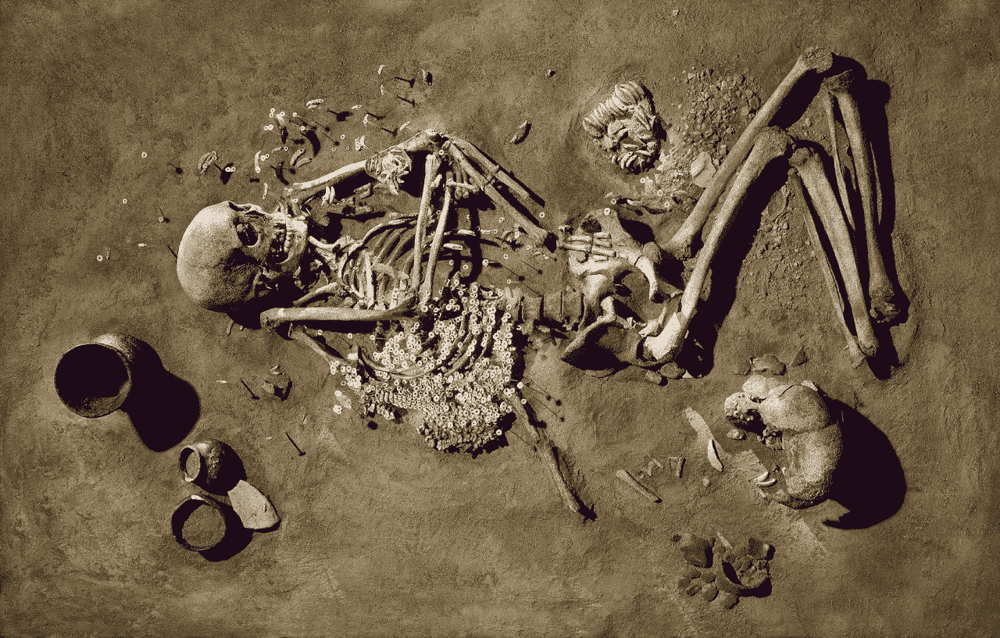
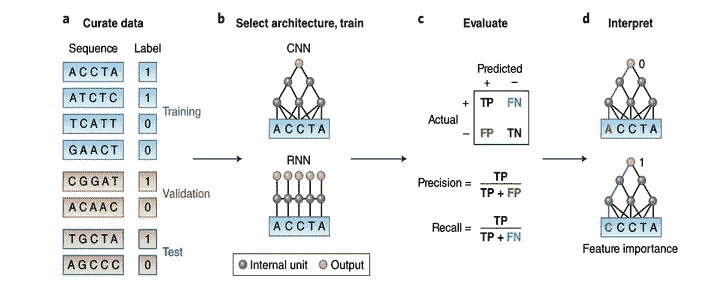
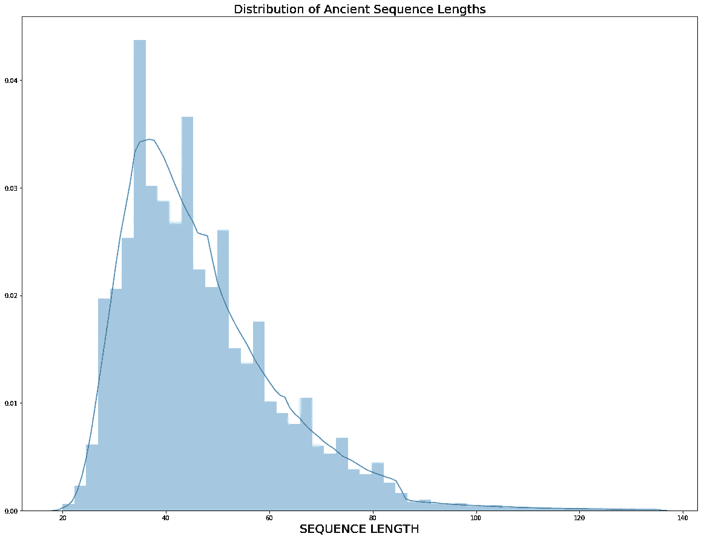
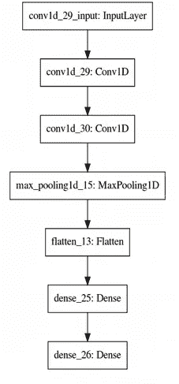
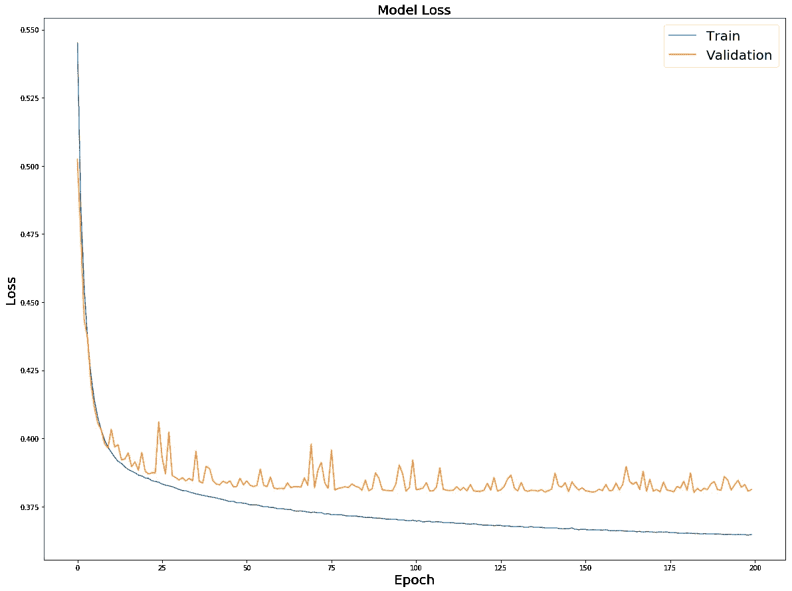
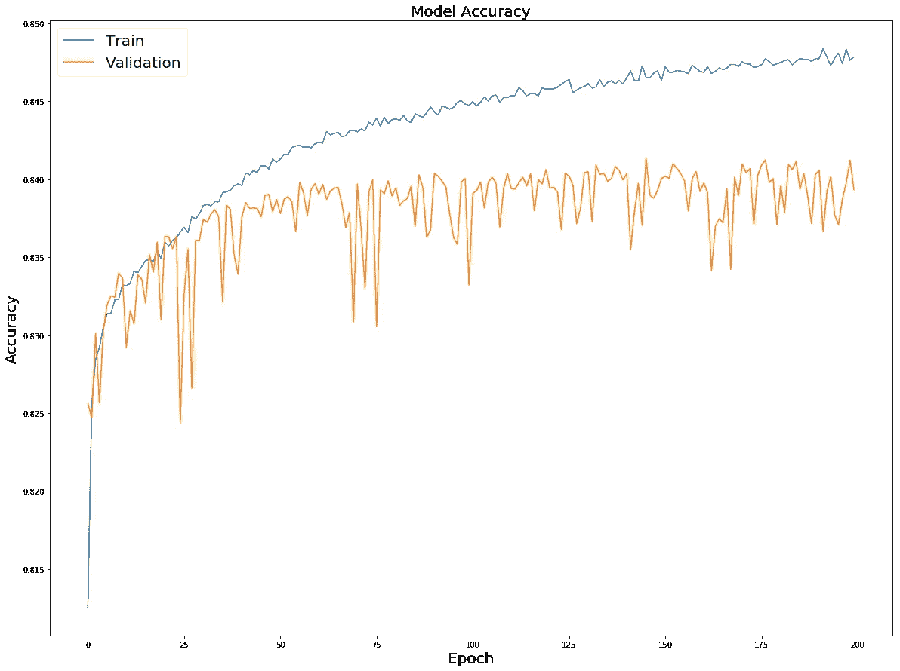
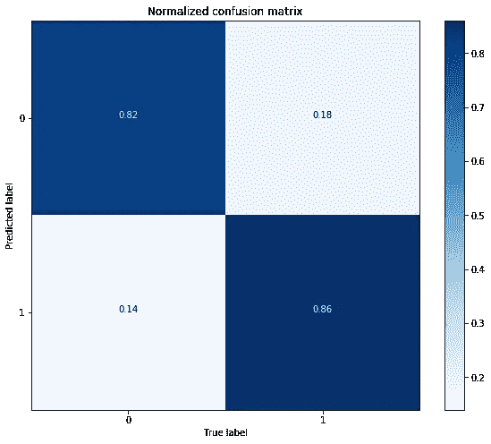
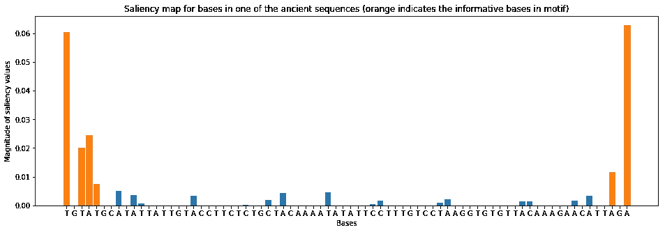

# 对古代 DNA 的深度学习

> 原文：<https://towardsdatascience.com/deep-learning-on-ancient-dna-df042dc3c73d?source=collection_archive---------3----------------------->

## [生命科学的深度学习](https://towardsdatascience.com/tagged/dl-for-life-sciences)

## 用深度学习重构人类的过去

[Image source](https://www.welt.de/wissenschaft/article120803982/Jaeger-Sammler-und-Bauern-lebten-lange-zusammen.html#cs-Vorfahren-in-Europa-2.jpg)

远古 DNA 太迷人了！随着目前在[下一代测序(NGS)](https://en.wikipedia.org/wiki/DNA_sequencing) 方面的进展，我们可以从古代骨骼中提取 DNA，对其进行测序，**通过各种类型的统计和[群体遗传学](https://en.wikipedia.org/wiki/Population_genetics)分析了解过去的很多事情**。

然而，**现代污染**是古代 DNA 研究领域的一个大问题。古遗传学的创始人斯万特·帕博(Svante Pébo)在他的著名著作[中承认已经对大部分现代 DNA(可能是他自己的)进行了测序，这部著作是关于一具埃及木乃伊的 DNA，从而产生了这个领域。事实上，只看现代和古代的序列，你永远也猜不到哪一个来自过去。因此这方面的研究人员使用先进的统计分析如](https://www.nytimes.com/1985/04/16/science/intact-genetic-material-extracted-from-an-ancient-egyptian-mummy.html) [**脱氨**](https://en.wikipedia.org/wiki/Deamination) **模式**推断，其中 [**mapDamage** 工具](https://ginolhac.github.io/mapDamage/)非常得心应手。然而，脱氨基分析的问题在于，它是基于对数以千计的比对序列进行平均的**，因此，只有当你有一个深度测序的(需要大量古老的 DNA)样本和一个参考基因组，才能将序列与并不总是可用的基因组进行比对。**

**这正是我们可以利用机器和深度学习的力量来检测古代和现代序列中典型的 DNA 基序的地方。**

# **基因组的深度学习**

**由于 DNA 序列本质上是一个**“生物文本”**，它可以使用来自[自然语言处理](https://en.wikipedia.org/wiki/Natural_language_processing)或[时间序列](https://en.wikipedia.org/wiki/Time_series)数据分析的方法进行分析。人工神经网络(ann)在这两个领域都得到了广泛的应用，在基因组学方面也表现出了最先进的性能。例如，卷积神经网络(CNN)是功能基因组学的工作马，参见 [Argenmueller 等人的优秀综述，分子系统生物学(2016) 12，878](http://msb.embopress.org/content/12/7/878) ，其中它们以高精度检测**转录因子结合位点和剪接位点**。对于用于基因组学的 CNN 的实际实施，我推荐来自[邹等人*Nature Genetics***51**，pages 12–18(2019)](https://www.nature.com/articles/s41588-018-0295-5)的精彩的“基因组学中深度学习的初级读本”。论文中的下图描述了基因组学中典型的深度学习工作流程。**

****

**CNN for Genomics from Zou et al. *Nature Genetics* **51**, pages12–18 (2019)**

**在这里，我展示了如何构建一个基于卷积神经网络(CNN)的分类器，用于在不映射到参考基因组的情况下，对 DNA 序列**的古代状态**进行**逐序列预测。但是让我们先来看看古代的 DNA 序列。****

# **查看古代 DNA 序列**

**出于演示的目的，我将使用尼安德特人基因组的[草案，这是早在 2010 年的低覆盖率测序工作。该文件是 DNA 序列与人类基因组 hg18 的比对(bam-file ),但它不一定是比对，我们同样可以使用原始序列(fastq-file)。我们可以使用方便的 **pysam** 模块读取 Python 中的序列，并绘制出序列长度的分布。](http://genome.ucsc.edu/Neandertal/)**

****

**很明显，DNA 序列长度的范围很广，从大约 20 个核苷酸(nt)到 140 个 nt 长的序列(用生物信息学术语来说)。这是一个已知的事实，它告诉我们古老的 **DNA 被降解**，即随着时间的推移，它被分解成小片段。因此，一个序列的长度对于推断它是否是古代的非常有用，越短，它是古代的可能性就越高。然而，在这次分析中，我特别感兴趣的是**古老的 DNA 基序**，不管序列有多长。因此，我将对**等长的现代和古代序列**进行分析，并将序列长度信息作为令人愉快的奖励，除了古代模式信息之外，每个人都可以使用它。由于我将使用现代法国 DNA 样本，该样本在 2010 年被测序，读取长度等于 76 nt，我将只选择 76 nt 长的尼安德特人序列，然后选择等量的现代序列来训练我的 CNN。**

**总的来说，我们有将近 50 万次阅读，其中 50%是古代的。为简单起见，我只选择了前 10 条染色体的读数。与来自 canonical MNIST 和 CIFAR10 机器学习数据集的大约 60 000 个例子相比，这个数据量确实很大，这些数据集广泛用于使用 CNN 进行图像识别。**

# **为 CNN 准备基因组数据**

**接下来，我们将执行所有一维 CNN 步骤的标准，如序列的一键编码，并将数据分成训练和测试子集。这里我将遵循来自[邹等人*自然遗传学* **51** 第 12–18 页(2019)](https://www.nature.com/articles/s41588-018-0295-5) 的协议:**

**现在运行 CNN 的一切都准备好了，让我们开始吧！**

# **构建并运行 1D CNN 分类器**

**最后，是时候开始训练一个简单的二元(古代与非古代)1D CNN 分类器了。我将创建一个简单的单块 [VGG 式架构](https://medium.com/@sidereal/cnns-architectures-lenet-alexnet-vgg-googlenet-resnet-and-more-666091488df5)，它有两个卷积层，后跟一个 Max 池层。我还将应用小 L1 规范权重正规化，以防止过度拟合。**

****

**VGG-like architecture of 1D CNN classifier**

**训练是在我的 4 核笔记本电脑上对大约 300，00 0 个古代和现代序列进行的，耗时大约 5 个小时。让我们来看看损耗和精度曲线是如何表现的:**

********

**该模型明显过度拟合，但在验证数据集(约 100 000 个序列)上仍达到令人印象深刻的 84%的准确度。验证曲线的振荡行为对于 L1 范数正则化是典型的。为了使它更稳定，辍学是更可取的，我们也可以增加批量大小或降低学习率。现在让我们对具有大约 133 000 个序列的维持测试数据集执行模型的最终评估:**

****

**模型的最终评估再次显示了 **84%的准确率**的古状态预测。混淆矩阵证实了这个数字。CNN 的解读呢？显著性图是一种展示 CNN 特征重要性的优雅方法，即哪些核苷酸对于预测每个序列的古代状态最具信息性:**

****

**我们清楚地看到**古代与非古代的信号似乎来自序列**的末端。这很有意义，因为众所周知，古代序列的末端暴露于脱氨基作用，从而导致**与所有其他取代的均匀分布频率的零假设相比，**读数末端 C/T 和 G/A 多态性的频率增加。这就是 mapDamage 捕捉到的。然而，与 mapDamage 相反，我们能够检测到这种隐藏的脱氨基模式，而无需将古代序列与参考基因组进行比较。此外，我们现在有一个模型，可以预测每次读取的“古代或非古代”，而 mapDamage 通过对数千次读取进行平均来使用统计推断。**

**通常，提取大量古代 DNA 是非常困难的，所以每次读取都很重要。换句话说，我们无法计算大量读取的统计数据，但我们希望每个有价值的读取都有一个古老的状态。此外，对**古代微生物组**(源于古代微生物而非人类/动物宿主的读数)的分析经常会发现 [**古代病毒**](https://www.nature.com/articles/s41586-018-0097-z) ，它们通常具有十几个与非常短的病毒基因组对齐的读数。在这种情况下，由于**缺乏统计能力**，使用 mapDamage 进行脱氨分析极其困难。**

# **摘要**

**在这里我展示了深度学习对于古代 DNA 研究领域的重要性。我展示了如何创建一个简单的卷积神经网络(CNN)分类器，在没有参考基因组的情况下，对每个 DNA 序列的古代和非古代状态进行分类。我希望你会发现这篇文章很有用，并受到启发，为令人兴奋的古代 DNA 研究领域开发深度学习。在 twitter @NikolayOskolkov 上关注我，并在我的 github 上查看完整的 [Jupyter 笔记本](https://github.com/NikolayOskolkov/DeepLearningAncientDNA)。**