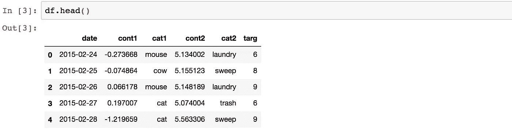
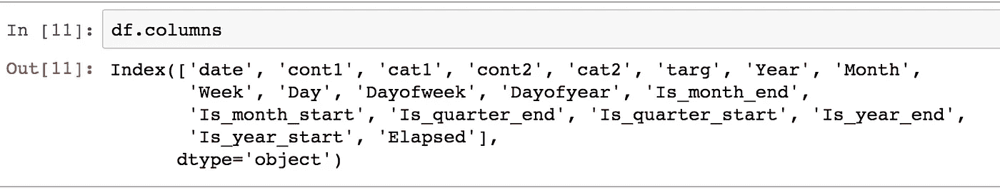
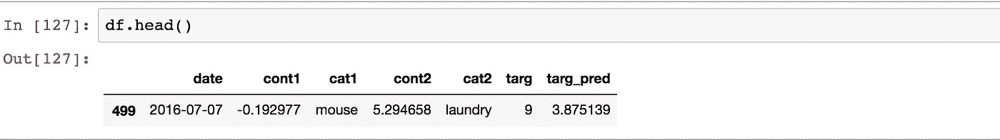

# PyTorch 在数据帧上的深度学习

> 原文：<https://towardsdatascience.com/deep-learning-on-dataframes-with-pytorch-66b21be54ef6?source=collection_archive---------9----------------------->

这篇文章的目标是提出一个框架，可以让你使用 PyTorch 和 Pandas 在任何数据框架上进行深度学习预测。通过*任何*数据帧，我的意思是:分类特征、连续特征、日期时间特征、回归、二进制分类或多分类的任何组合。

我可能会涉及到幕后发生的一些技术问题，但大多数情况下，这只是一个框架讨论，而不是技术讨论。如果你想进一步挖掘，我建议在深度学习中开设 fast.ai 课程——如果你只是想在不看引擎盖的情况下进行预测，fast.ai 库是一个很好的地方，可以用很少的开发时间快速有效地运行这些模型。

```
**import** pandas **as** pd
**import** numpy **as** np
**import** re
**from** pandas.api.types **import** is_string_dtype, is_numeric_dtype
**import** warnings
**from** pdb **import** set_trace**from** torch **import** nn, optim, as_tensor
**from** torch.utils.data **import** Dataset, DataLoader
**import** torch.nn.functional **as** F
**from** torch.nn.init **import** ***import** sklearn
**from** sklearn_pandas **import** DataFrameMapper
**from** sklearn.preprocessing **import** LabelEncoder, Imputer, StandardScaler
```

我们将只使用一个虚构的数据帧，它具有分类特征、连续特征和一个日期时间特征。

```
rng = pd.date_range('2015-02-24', periods=500, freq='D')
df = pd.DataFrame({'date': rng, 
                   'cont1' : np.random.randn(**len**(rng)), 
                   'cat1': [np.random.choice([
                            'cat','dog','mouse','cow']) 
                               **for** _ **in** **range**(**len**(rng))], 
                   'cont2' : 0.5 * np.random.randn(**len**(rng))+5, 
                   'cat2': [np.random.choice([
                            'laundry','trash','mop','sweep']) 
                               **for** _ **in** **range**(**len**(rng))], 
                   'targ' : np.random.randint(low=1, high=10,
                                              size=**len**(rng))})
```



Sample dataframe

我只是假设我们想要使用所有的数据进行训练，然后预测数据集的最后一天，并检查我们做得如何。对于您的情况，这可能是预测上一周、上一月、上一年的数据，但这里我们将只使用最后一天的数据。

```
max_date = max(df.date).strftime(format='%Y-%m-%d')
test_human_readable = df.loc[df.date ==
                       pd.to_datetime(max_date, 
                       format='%Y-%m-%d'),:].copy()
```

我将数据帧(只有一行数据)称为`test_human_readable`，因为我们将对数据集进行一些转换，这将使人眼几乎无法理解，所以我喜欢现在提取我的测试集，稍后当我预测时，我会将预测附加到该数据帧，我实际上可以看到所有的特征，因为它们是从开始+预测和实际的。

现在我们将为数据的预处理建立一些帮助函数。

```
**def** add_datepart(df, fldname, drop=**True**, time=**False**, errors="raise"):
    "Create many new columns based on datetime column."
    fld = df[fldname]
    fld_dtype = fld.dtype
    **if** isinstance(fld_dtype, pd.core.dtypes.dtypes.DatetimeTZDtype):
        fld_dtype = np.datetime64
    **if** **not** np.issubdtype(fld_dtype, np.datetime64):
        df[fldname] = fld = pd.to_datetime(fld,
                      infer_datetime_format=**True**, errors=errors)
    targ_pre = re.sub('[Dd]ate$', '', fldname)
    attr = ['Year', 'Month', 'Week', 'Day', 'Dayofweek','Dayofyear',
            'Is_month_end', 'Is_month_start', 'Is_quarter_end',
            'Is_quarter_start', 'Is_year_end', 'Is_year_start']
    **if** time: attr = attr + ['Hour', 'Minute', 'Second']
    **for** n **in** attr: df[targ_pre + n] = getattr(fld.dt, n.lower())
    df[targ_pre + 'Elapsed'] = fld.astype(np.int64) // 10 ** 9
    **if** drop: df.drop(fldname, axis=1, inplace=**True**)**def** train_cats(df, cat_vars):
    # numercalize/categoricalize
    **for** name, col **in** df.items(): 
        **if** name **in** cat_vars:
            df[name] = col.cat.codes + 1
    df = pd.get_dummies(df, dummy_na=**True**)
    **return** df**def** scale_vars(df, mapper):
    warnings.filterwarnings('ignore',
             category=sklearn.exceptions.DataConversionWarning)
    **if** mapper **is** **None**:
        map_f = [([n],StandardScaler()) **for** n **in** df.columns **if** is_numeric_dtype(df[n])]
        mapper = DataFrameMapper(map_f).fit(df)
    df[mapper.transformed_names_] = mapper.transform(df)
    **return** mapper**def** proc_df(df, cat_vars, cont_vars, y_fld=**None**, do_scale=**False**,
           mapper=**None**, na_dict=**None**):
    "Preprorocess the train, valid, test sets to numericalize,
     fillmissing, and normalize."
    ignore_flds=[]
    skip_flds=[]
    # set the dependent variable name and concatenate the cat and
    # cont
    dep_var = y_fld
    df = df[cat_vars + cont_vars + [dep_var]].copy()
    df[dep_var] = df[dep_var].astype(int)
    df = df.copy()
    ignored_flds = df.loc[:, ignore_flds]
    y = df[y_fld].values
    # deal with skip fields
    skip_flds += [y_fld]
    df.drop(skip_flds, axis=1, inplace=**True**)
    # initialize the na dictionary
    **if** na_dict **is** **None**: na_dict = {}
    **else**: na_dict = na_dict.copy()
    na_dict_initial = na_dict.copy()
    # fill missing
    **for** name, col **in** df.items(): 
        **if** is_numeric_dtype(col):
            **if** pd.isnull(col).sum():
                df[name+'_na'] = pd.isnull(col)
                filler = col.median()
                df[name] = col.fillna(filler)
                na_dict[name] = filler
    # keep track of which entries are missing and possibly use them
    # in the model
    **if** len(na_dict_initial.keys()) > 0:
        df.drop([a + '_na' **for** a **in** list(set(na_dict.keys()) -
        set(na_dict_initial.keys()))], axis=1, inplace=**True**)
    # normalize
    **if** do_scale: mapper = scale_vars(df, mapper)
    res = [df, y, na_dict]
    # keep track of how things were normalized
    **if** do_scale: res = res + [mapper]
    **return** res
```

太好了。因此，现在我们希望将新的 datetime 特性添加到我们的数据帧中，规范化连续数据，并对分类特性进行分类(将它们更改为代表其类别的数字)。

```
add_datepart(df, 'date', drop=**False**)
```

`add_datepart`是一个就地操作，所以现在我们的 dataframe 有更多的列来表示列`date`的不同方面。我还没有删除`date`列，因为我想很快用它来创建我的训练、有效和测试数据帧。



columns of df

现在让我们定义哪些列是分类的，哪些是连续的。

```
cat_vars = ['cat1', 'cat2', 'Year', 'Month','Week', 'Day',
            'Dayofweek', 'Dayofyear', 'Is_month_end',
            'Is_month_start', 'Is_quarter_end', 'Is_quarter_start',
            'Is_year_end', 'Is_year_start', 'Elapsed']cont_vars = ['cont1', 'cont2']
```

我想*对我所有的 cat 特性进行分类*，但我也想确保它们对我的训练、有效和测试数据帧进行了相同的分类。这意味着，如果在我的训练数据中`cow`被映射到`2`，我不希望`cow`被映射到我的有效或测试数据中的其他数据。所以我现在就做这个操作，然后拆分我的数据集。

```
**for** v **in** cat_vars: df[v] = df[v].astype('category').cat.as_ordered()
df = train_cats(df, cat_vars)
```

该模型将使用嵌入来处理分类特征，因此我们需要预先计算嵌入大小，以便稍后在模型中进行初始化。fast.ai 的杰瑞米·霍华德建议使用最小 50 和类基数的一半。

> 这又是一个应该在将数据集分解成训练、有效、测试之前**完成的操作。**

```
**for** v **in** cat_vars: df[v] = df[v].astype('category').cat.as_ordered()
cat_sz = [(c, len(df[c].cat.categories)+1) **for** c **in** cat_vars]
emb_szs = [(c, min(50, (c+1)//2)) **for** _,c **in** cat_sz]
```

如果您首先分解数据集，然后检查嵌入大小，您可能会得到错误:*运行时错误:索引超出范围:试图访问 11 行表中的索引 12。*这是因为嵌入大小的计算没有考虑一些偶然被排除在训练数据之外的类别。

```
train = df.loc[df.date < pd.to_datetime('2016-01-01', 
               format='%Y-%m-%d'),:].copy()
valid = df.loc[(df.date >= pd.to_datetime('2016-01-01', 
               format='%Y-%m-%d')) **&**
               (df.date < pd.to_datetime(max_date, 
               format='%Y-%m-%d')),:].copy()
test = df.loc[df.date == pd.to_datetime(max_date, 
               format='%Y-%m-%d'),:].copy()train = train.drop(columns='date')
valid = valid.drop(columns='date')
test = test.drop(columns='date')
```

所以我相当随意地选择了我的验证集。这不是一种好的做法，在您的生产环境中，您应该测试不同的集合，并尝试将它们紧密映射到测试集合，但在这种情况下，我只是采用了 2016 年 1 月之后的所有内容。

```
**for** v **in** cat_vars: train[v] =
                   train[v].astype('category').cat.as_ordered()
**for** v **in** cont_vars: train[v] = train[v].astype('float32')
**for** v **in** cat_vars: valid[v] =
                   valid[v].astype('category').cat.as_ordered()
**for** v **in** cont_vars: valid[v] = valid[v].astype('float32')
**for** v **in** cat_vars: test[v] = 
                   test[v].astype('category').cat.as_ordered()
**for** v **in** cont_vars: test[v] = test[v].astype('float32')
```

我们希望将分类特征与连续特征分开传递给我们的模型，这样猫可以首先通过嵌入，然后通过线性、relu、batchnorm、dropout 以及 conts。

```
**class** ColumnarDataset(Dataset):
    """Dataset class for column dataset.
    Args:
       cats (list of str): List of the name of columns contain
                           categorical variables.
       conts (list of str): List of the name of columns which 
                           contain continuous variables.
       y (Tensor, optional): Target variables.
       is_reg (bool): If the task is regression, set ``True``, 
                      otherwise (classification) ``False``.
       is_multi (bool): If the task is multi-label classification, 
                        set ``True``.
    """
    **def** __init__(**self**, df, cat_flds, y, is_reg, is_multi):
        df_cat = df[cat_flds]
        df_cont = df.drop(cat_flds, axis=1)

        cats = [c.values for n,c in df_cat.items()]
        conts = [c.values for n,c in df_cont.items()]

        n = len(cats[0]) **if** cats **else** len(conts[0])
        self.cats = np.stack(cats, 1).astype(np.int64)   
                           **if** cats **else** np.zeros((n,1))
        self.conts = np.stack(conts, 1).astype(np.float32) 
                           **if** conts **else** np.zeros((n,1))
        self.y = np.zeros((n,1)) **if** y **is** **None** **else** y
        **if** is_reg: self.y =  self.y[:,**None**]
        self.is_reg = is_reg
        self.is_multi = is_multi **def** __len__(**self**): **return** **len**(self.y) **def** __getitem__(**self**, idx):
        **return** [self.cats[idx], self.conts[idx], self.y[idx]]
```

正如您在这个类中看到的，__getitem__ 正在为那个`idx`值检索一个 cats、conts 和 target 的列表。

归一化和预处理每个数据集。

```
dep_var = 'targ'
df, y, nas, mapper = proc_df(train, cat_vars, cont_vars, dep_var, 
                             do_scale=**True**)
df_val, y_val, nas, mapper = proc_df(valid, cat_vars, cont_vars, 
                                     dep_var, do_scale=**True**, 
                                     mapper=mapper, na_dict=nas)
df_test, y_test, nas, mapper = proc_df(test, cat_vars, cont_vars, 
                                       dep_var, do_scale=**True**)
```

初始化每个 dataset 对象并创建 dataloader 对象。

```
trn_ds = ColumnarDataset(df, cat_vars, y,is_reg=**True**,is_multi=**False**)
val_ds = ColumnarDataset(df_val, cat_vars, 
                         y_val,is_reg=**True**,is_multi=**False**)
test_ds = ColumnarDataset(df_test, cat_vars, 
                         y_test,is_reg=**True**,is_multi=**False**)bs = 64
train_dl = DataLoader(trn_ds, bs, shuffle=**True**)
val_dl = DataLoader(val_ds, bs, shuffle=**False**)
test_dl = DataLoader(test_ds, len(df_test), shuffle=**False**)
```

定义模型。

```
**class** MixedInputModel(nn.Module):
    """Model able to handle inputs consisting of both categorical and continuous variables.
    Args:
       emb_szs (list of int): List of embedding size
       n_cont (int): Number of continuous variables in inputs
       emb_drop (float): Dropout applied to the output of embedding
       out_sz (int): Size of model's output.
       szs (list of int): List of hidden variables sizes
       drops (list of float): List of dropout applied to hidden 
                              variables
       y_range (list of float): Min and max of `y`. 
                                y_range[0] = min, y_range[1] = max.
       use_bn (bool): If use BatchNorm, set ``True``
       is_reg (bool): If regression, set ``True``
       is_multi (bool): If multi-label classification, set ``True``
    """
    **def** __init__(**self**, emb_szs, n_cont, emb_drop, out_sz, szs, 
                 drops, y_range=**None**, use_bn=**False**, is_reg=**True**, 
                 is_multi=**False**):
        **super**().__init__()
        **for** i,(c,s) **in** enumerate(emb_szs): **assert** c > 1, 
            f"cardinality must be >=2, got emb_szs[{i}]: ({c},{s})"
        **if** is_reg==**False** and is_multi==**False**: **assert** out_sz >= 2, 
            "For classification with out_sz=1, use is_multi=True"
        self.embs = nn.ModuleList([nn.Embedding(c, s) 
                                      **for** c,s **in** emb_szs])
        **for** emb **in** self.embs: emb_init(emb)
        n_emb = sum(e.embedding_dim **for** e **in** self.embs)
        self.n_emb, self.n_cont=n_emb, n_cont

        szs = [n_emb+n_cont] + szs
        self.lins = nn.ModuleList([
            nn.Linear(szs[i], szs[i+1]) **for** i **in** **range**(**len**(szs)-1)])
        self.bns = nn.ModuleList([
            nn.BatchNorm1d(sz) **for** sz **in** szs[1:]])
        **for** o **in** self.lins: kaiming_normal_(o.weight.data)
        self.outp = nn.Linear(szs[-1], out_sz)
        kaiming_normal_(self.outp.weight.data) self.emb_drop = nn.Dropout(emb_drop)
        self.drops = nn.ModuleList([nn.Dropout(drop) 
                                        **for** drop **in** drops])
        self.bn = nn.BatchNorm1d(n_cont)
        self.use_bn,self.y_range = use_bn,y_range
        self.is_reg = is_reg
        self.is_multi = is_multi **def** forward(**self**, x_cat, x_cont):
        **if** self.n_emb != 0:
            x = [e(x_cat[:,i]) **for** i,e **in** enumerate(self.embs)]
            x = torch.cat(x, 1)
            x = self.emb_drop(x)
        **if** self.n_cont != 0:
            x2 = self.bn(x_cont)
            x = torch.cat([x, x2], 1) **if** self.n_emb != 0 **else** x2
        **for** l,d,b **in** zip(self.lins, self.drops, self.bns):
            x = F.relu(l(x))
            **if** self.use_bn: x = b(x)
            x = d(x)
        x = self.outp(x)
        **if** **not** self.is_reg:
            **if** self.is_multi:
                x = torch.sigmoid(x)
            **else**:
                x = F.log_softmax(x, dim=1)
        **elif** self.y_range:
            x = torch.sigmoid(x)
            x = x*(self.y_range[1] - self.y_range[0])
            x = x+self.y_range[0]
        **return** x**def** emb_init(x):
    x = x.weight.data
    sc = 2/(x.size(1)+1)
    x.uniform_(-sc,sc)
```

初始化模型。我们正在对`targ`列执行回归任务。

```
model = MixedInputModel(emb_szs, 
                        n_cont=**len**(df.columns)-**len**(cat_vars), 
                        emb_drop = 0.04, out_sz = 1, 
                        szs = [1000,500], drops = [0.001,0.01], 
                        y_range=(0,np.max(y)), use_bn=**True**, 
                        is_reg=**True**, is_multi=**False**)
```

我们现在准备训练模型。

```
**def** train_model(model, train_dl, val_dl, n_epochs=1, lr=5e-2):
        "Run training loops."
        epochs = n_epochs
        opt = optim.SGD(model.parameters(), lr=lr)
        loss_func = nn.MSELoss()
        **try**:
            **for** epoch **in** range(epochs):
                model.train()
                **for** xb1, xb2, yb **in** train_dl:
                    preds = model(xb1, xb2)
                    loss = loss_func(preds, yb.float())

                    loss.backward()
                    opt.step()
                    opt.zero_grad()

                model.eval()
                **with** torch.no_grad():
                    loss_val = sum(loss_func(model(xv1, xv2), 
                                             yv.float()) 
                                   **for** xv1, xv2, yv **in** val_dl)
                print(epoch, loss_val / len(val_dl))
        **except** Exception **as** e:
            exception = e
            **raise**
```

最后，我们可以通过测试集进行训练和预测。

```
train_model(model, train_dl, val_dl, n_epochs=500, lr=5e-2)**def** predict_test(model, test_dl):
    "Returns predictions over test_df."
    model.eval()
    preds = [model(xv1, xv2) **for** xv1, xv2, _ **in** test_dl][0]
    targs = [yv **for** _, _, yv **in** test_dl][0]
    test_human_readable['targ_pred'] = preds.data.detach().numpy()
    **return** torch.argmax(preds, dim=1).data.detach().numpy(), 
           test_human_readablepreds, df = predict_test(model, test_dl)
```



Test set with prediction

所以，理想情况下，你可以拿着熊猫的任何数据框，运行这段代码，得到一个不错的预测输出。但这有望让您更深入地剖析这个过程，尝试一些建模变化或任何您感兴趣的东西。


玩得开心！