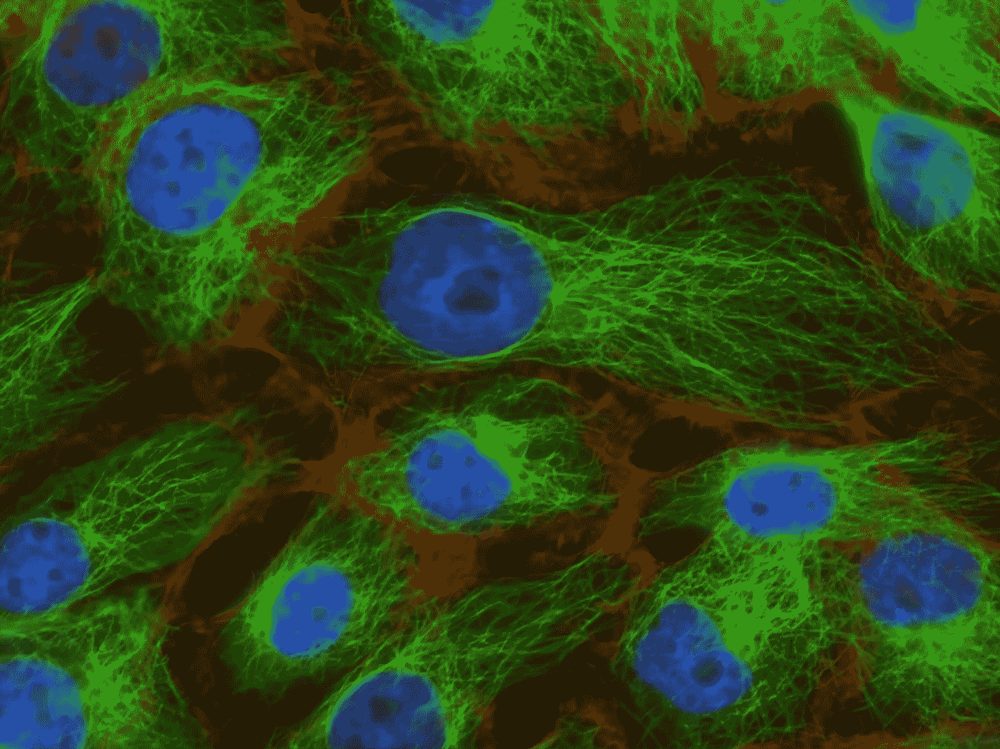
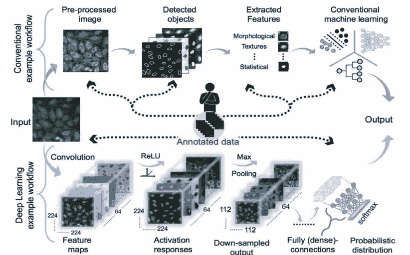
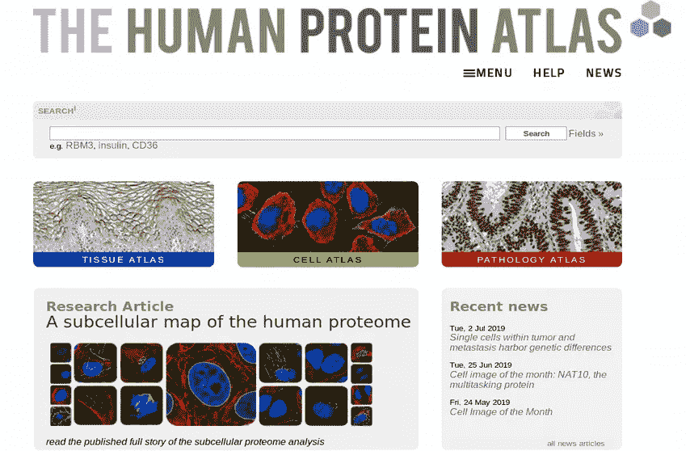
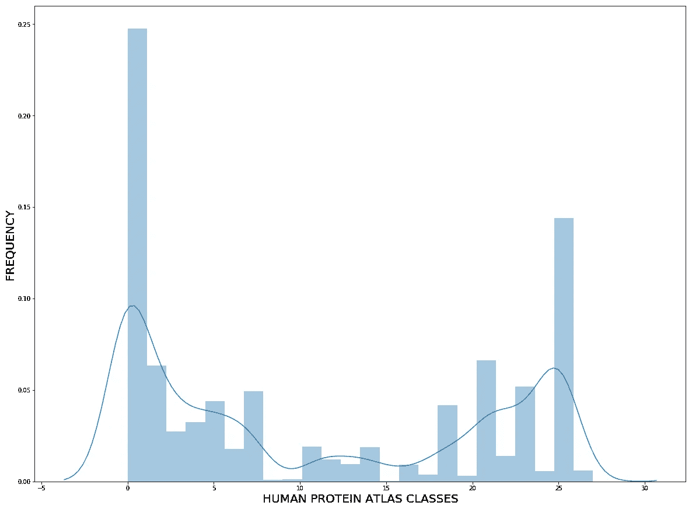
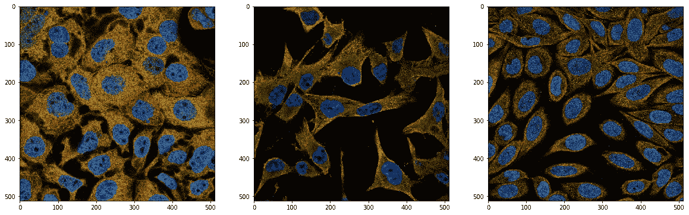
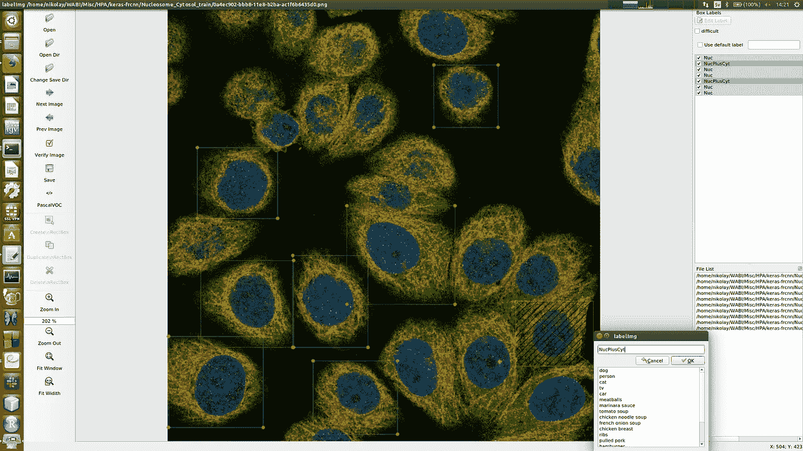
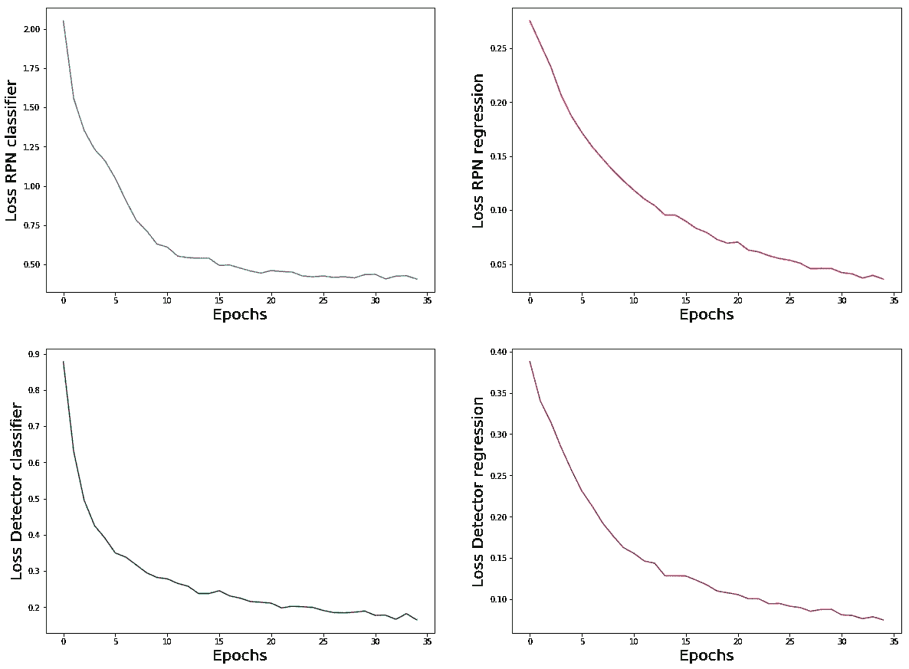
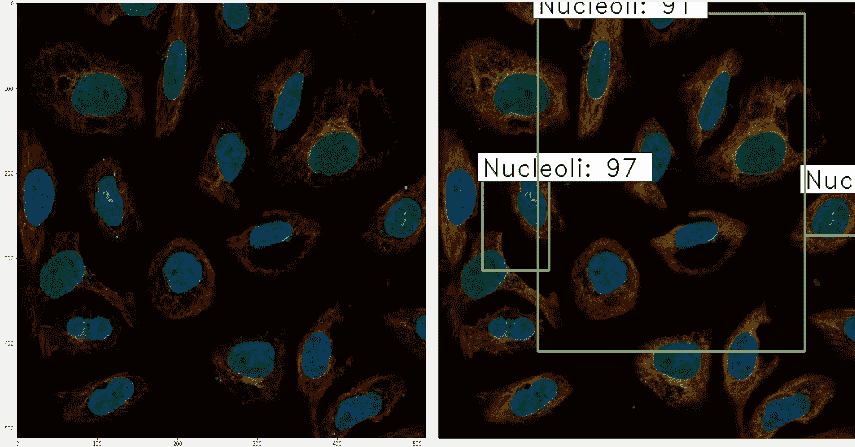
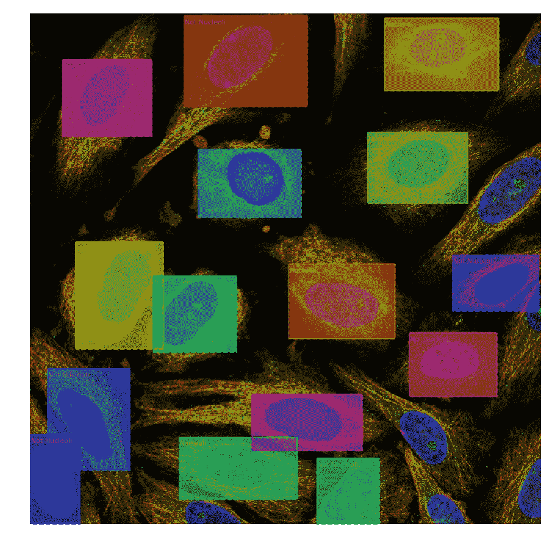
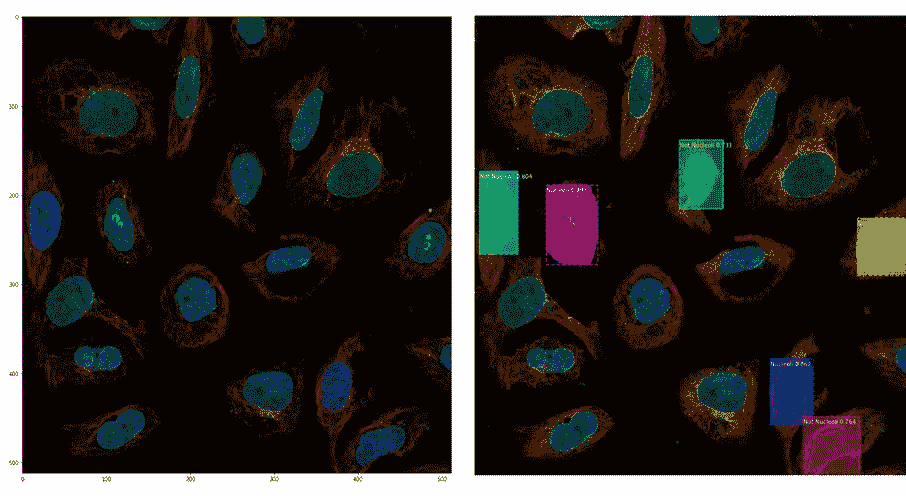

# 显微成像的深度学习

> 原文：<https://towardsdatascience.com/deep-learning-on-microscopy-imaging-865b521ec47c?source=collection_archive---------6----------------------->

## [生命科学的深度学习](https://towardsdatascience.com/tagged/dl-for-life-sciences)

## 用深度学习检测好、坏、丑细胞

[Image source](https://unsplash.com/photos/W2OVh2w2Kpo)

这是系列**生命科学深度学习**的第五篇文章。在之前的帖子中，我展示了如何将[深度学习用于古代 DNA](/deep-learning-on-ancient-dna-df042dc3c73d) [、深度学习用于单细胞生物学](/deep-learning-for-single-cell-biology-935d45064438) [、深度学习用于数据整合](/deep-learning-for-data-integration-46d51601f781)和[深度学习用于临床诊断](/deep-learning-for-clinical-diagnostics-ca7bc254e5ac)。今天我们将讨论深度学习在生命科学中的主要应用之一，即用于显微图像分析的**计算机视觉**。

**自动化** [荧光显微镜](https://en.wikipedia.org/wiki/Fluorescence_microscope)是生命科学显微镜成像的一匹工作马，可生成[数百万张细胞图像](https://www.ebi.ac.uk/bioimage-archive/)。**卷积神经网络(CNN)**擅长学习成像数据的空间结构，并通过**自动特征提取**优于传统的机器学习方法。

Conventional vs. Deep Learning workflow from A. Gupta et al., Cytometry **95**, 366–380 (2019)

虽然每个图像一个类别的图像分类(也称为猫对狗)目前是一项相当琐碎的任务，但高效的 [**多标签分类**](https://en.wikipedia.org/wiki/Multi-label_classification) 和 [**对象检测**](https://en.wikipedia.org/wiki/Object_detection) 是目前正在开发新一代 CNN 的更具挑战性的问题。

这里我将描述如何使用[**fast-RCNN**](https://github.com/kbardool/keras-frcnn)和[**Mask-RCNN**](https://github.com/matterport/Mask_RCNN)**人工神经网络从[人类蛋白质图谱](https://www.proteinatlas.org/)的荧光显微图像上**检测细胞类型**。**

# **图像与数字数据**

**谈到图像分析，我通常想知道**为什么深度学习优于(与其他机器学习和统计分析相比)** **处理图像而不太成功地应用于数字数据？**的确，与各种生物医学[下一代测序【NGS】](https://en.wikipedia.org/wiki/DNA_sequencing)**组学数据**(基因组学、转录组学、蛋白质组学等。)，通常是数字，我并不经常看到神经网络在预测能力方面胜过随机森林，因此我总是建议在深入学习非线性数学之前先从简单的线性模型开始。**

> **为什么深度学习对图像分析这么好？**

**是像 Geoffrey Hinton 所说的那样有大量可用的成像数据，还是在像素强度中有一些非线性的东西，而这些是数字数据中没有的？**仅仅是数据的空间结构吗？****

**你注意到的第一件事是在图像数据上运行深度学习，与在组学数字数据上进行深度学习相比，生活变得更容易。有大量的文献和大量的在线教程可以帮助你。我是杰森·布朗利和阿德里安·罗斯布鲁克的超级粉丝，我去他们的博客，通常能找到我所有问题的答案。相比之下，**在组学数值数据上运行深度学习**(例如 RNA 测序)**你基本上是靠自己。**没有那么多人比你更清楚什么网络架构，激活功能，优化器等等。适合你特定的组学数字数据，所以你真的需要做很多实验。**

# **细胞的显微成像**

**然而，进入显微成像领域，你会发现很多来自社区的支持。一个很好的可用资源是**人类蛋白质图谱，其中提供了显示单细胞中蛋白质的**定位的数字图像数据。******

********

****[Human Protein Atlas (HPA)](https://www.proteinatlas.org/) is a great digital image data resource****

****通过在线游戏使用[公民科学方法对数据进行注释，并在](https://www.scilifelab.se/news/online-gamers-and-artificial-intelligence-to-improve-image-classification/?utm_campaign=nyhetsbrev&utm_medium=email&utm_source=apsis) [Kaggle 竞赛](https://www.kaggle.com/c/human-protein-atlas-image-classification)中用于多标签图像分类。数据可以从[这里](https://www.kaggle.com/c/human-protein-atlas-image-classification/data)下载，它们包括大约 124 000 个训练和大约 47 000 个测试 512x512 PNG 图像，用于 28 个类别，即从 0 到 27 的数字代码，用于表达某种**蛋白质的细胞区室**。重要的是，由于蛋白质可以在细胞的几个地方同时表达，所以在同一张图像上可以出现多个类别。****

********

****观察 HPA 类别的分布，我们可以看到感兴趣的蛋白质最常表达在核质(类别 0)和胞质溶胶(类别 25)中。现在让我们看看 HPA 图像是什么样子的。事实证明，显示 HPA 图像是一项重要的任务，因为它们包含 4 个而不是标准的 3 个 RGB 通道，这些通道突出显示了感兴趣的**蛋白质(绿色通道)**以及三个细胞标志:**微管(红色)、细胞核(蓝色)**和**内质网(黄色)**。在 Python 中合并 4 个通道的一种方法是实现黄色=红色+绿色，并将黄色通道的一半添加到红色通道，另一半添加到绿色通道。****

********

****Sample Human Protein Atlas (HPA) images****

****使用“load_image”功能，我通过合并每个图像 ID 的 4 个通道，生成了一个包含约 31 000 个图像的新训练数据集。****

# ****为细胞检测构建注释****

****现在，在我们学习了如何显示 HPA 图像并合并四个通道之后，是时候使用 fast-RCNN 和 Mask-RCNN 神经网络为细胞类型检测创建注释了。出于演示的目的，我浏览了一些图像，并选择了一些包含在核仁区室(核仁、核仁纤维中心、核斑点、核体)**中表达蛋白质的**细胞和在核仁区室中没有蛋白质表达迹象的**细胞。这样，我的目标是在我的每个训练/测试图像上有 3 个类别(核仁，不是核仁和背景)。接下来，我花了 2 个小时和 [LabelImg](https://github.com/tzutalin/labelImg) 一起为 45 HPA 火车图像的每个单元分配边界框和类别标签，另外 5 个图像被保留作为测试数据集，用于进行预测。******

****

**Manual annotation of cells with [LabelImg](https://github.com/tzutalin/labelImg)**

**LabelImg 以 xml 格式记录单元格批注，其典型结构如下:**

**这里可以看到图像的宽度(512 像素)、高度(512 像素)和深度(3 个通道)，以及一个坐标由边界框 **(xmin，ymin，xmax，ymax)** 和标签“核仁”定义的对象。Faster-RCNN 需要一个特殊的逗号分隔(csv)格式的注释文件。为了准备这样一个 csv 文件，我们需要解析每个图像的 xml 注释:**

**一旦解析了 xml 注释，就差不多完成了，现在已经为训练 fast-RCNN 模型做好了一切准备。**

# **训练更快的 RCNN 用于细胞检测**

**在这里，我跳过解释如何更快-RCNN 的工作，有大量的[文献](https://arxiv.org/abs/1506.01497)进入算法。我只提到，fast-RCNN 使用**区域建议网络(RPN)** ，为执行实际对象检测的**检测器**网络生成区域建议。因此，fast-RCNN 网络的损失函数结合了来自**回归**(用边界框定位细胞)和**分类**(为每个定位细胞分配类别)任务的贡献。更快-RCNN 可以从 https://github.com/kbardool/keras-frcnn[安装。训练更快的 RCNN 模型就像键入:](https://github.com/kbardool/keras-frcnn)**

**这里的“annot.txt”是上一节中创建的注释文件。默认情况下，Faster-RCNN 使用来自 [ResNet50](https://github.com/fchollet/deep-learning-models/releases/download/v0.2/resnet50_weights_tf_dim_ordering_tf_kernels.h5) 的权重进行迁移学习。在具有 4 个 CPU 内核的我的笔记本电脑上，在具有 322 个带注释的核仁和 306 个非核仁类的 **45 幅图像上训练更快的 RCNN**每个时期花费了大约 6 个小时，所以我只设法等待了 35 个时期。学习曲线似乎表明分类任务达到饱和，而回归(定位细胞)仍远未达到平稳状态。**

****

**要使用 fast-RCNN 对测试集进行预测，我们只需键入:**

**这里的“test”是包含来自测试数据集的图像的文件夹。让我们展示一个测试图像，以检查该模型在检测核仁中表达蛋白质的细胞(核仁类)和核仁中不表达蛋白质的细胞(非核仁类)方面有多成功:**

****

**Original image (left) and the image after Faster-RCNN object detection was applied (right)**

**这里，左边是原始的测试图像。**两个细胞在中间**明显含有亮绿色斑点，这些是**核仁**，由于感兴趣的蛋白质在这些区域显示出强烈的表达，所以它们是可见的，所以这两个细胞应该属于核仁类。其余的细胞似乎没有核仁区域表达的蛋白质，因此它们应该属于非核仁类。右边是由经过训练的 fast-RCNN 模型放置的具有边界框和类别标签的测试图像。这里我们可以看到,**模型正确地检测到了在核仁区域具有可见绿色斑点的两个细胞**,而第三个边界框似乎是假阳性预测，不清楚模型以高置信度(91%的概率)检测到了什么:边界框包括多个细胞，尽管模型贴上了“核仁”类别标签，但我们没有观察到边界框内具有可见核仁的细胞。**

**这张图片展示了我对使用**fast-RCNN 进行细胞检测的总体印象:它在细胞定位方面并不总是完美的**，尽管更多的训练可能会改善它。让我们看看 Mask-RCNN 能否让它变得更好。**

# **用于细胞检测的训练掩模-RCNN**

**Mask-RCNN(以及 Faster-RCNN)属于人工神经网络的 **RCNN 家族**，与其他家族，即 YOLO 和 SSD 相比，其以更高的物体检测精度而闻名，我在此不做介绍。除了对象检测，Mask-RCNN 还允许**对象分割**，但是我们在这里不打算使用它。Mask-RCNN 可以从 https://github.com/matterport/Mask_RCNN 的[安装。虽然 **Faster-RCNN 非常容易运行**(它基本上只需要准备好注释文件)，但是 **Mask-RCNN 需要更多的编码**，所以请在](https://github.com/matterport/Mask_RCNN) [my github](https://github.com/NikolayOskolkov/DeepLearningMicroscopyImaging) 上查看完整的 Jupyter 笔记本以了解更多细节。在这里，我解释工作流程的关键步骤，它基本上遵循[这个优秀的教程](https://machinelearningmastery.com/how-to-train-an-object-detection-model-with-keras/)。Mask-RCNN 的特点是数据由一个**数据集**对象处理，该对象用于将数据输入 Mask-RCNN 进行训练和测试。**

**在这里，我们的目标是对象检测而不是分割，因此我们将把包围盒视为遮罩，所以“load_mask”函数将加载实际上的包围盒坐标。我们可以使用 Mask-RCNN 中方便的“display_instances”函数显示一个随机的带注释的训练图像:**

****

**Annotated image prepared for training with Mask-RCNN**

**现在一切都为训练 Mask-RCNN 模型做好了准备。我们将使用迁移学习，并从 [COCO](http://cocodataset.org/#home) 数据集上的预训练对象检测 Mask-RCNN 模型的[权重](https://github.com/matterport/Mask_RCNN/releases/download/v2.0/mask_rcnn_coco.h5)开始。**

**训练 **Mask-RCNN 比 Faster-RCNN** 快得多，在我的 4 个 CPU 内核的笔记本电脑上，一个历元只花了 2 个小时(比 Faster-RCNN 快了 3 倍)，在仅仅 5 个历元之后，我就停止了训练，因为测试数据集上的对象检测结果已经非常令人满意。这里为了比较，我呈现了原始测试图像(左)和由训练的 Mask-RCNN 模型放置的图像以及高置信度(超过 70%概率)的边界框和类别标签。**

****

**Original image (left) and the image after Mask-RCNN object detection was applied (right)**

**我们观察到细胞定位的准确性有了惊人的提高，所有的边界框似乎都完美地包围了细胞。一个细胞似乎有一个错误的标签“核仁”，尽管在细胞核内没有观察到明显的绿色斑点。也许这个模型会从更多的训练中受益。总体而言， **Mask-RCNN 与更快的 RCNN** 相比，在细胞检测方面表现出显著的改进。**

**这种经过训练的 Mask-RCNN 模型现在可以用于图像的**高通量扫描**用于**特殊细胞形态**(在这种特殊情况下，蛋白质在核仁区域表达)**而无需视觉检查**。**

# **摘要**

**在这篇文章中，我们了解到**自动显微镜** **产生了** **大量的数字图像数据**，非常适合深度学习分析。**检测细胞形态**是一项具有挑战性的任务，尽管有大量的文献和模型可用。我们使用来自人类蛋白质图谱(HPA)的多类带注释的图像测试了 fast-RCNN 和 Mask-RCNN 对象检测模型。 **Mask-RCNN 在细胞类型检测的质量和速度上都优于 fast-RCNN。****

**像往常一样，如果你在生命科学中有特别喜欢的领域，想在深度学习框架中解决，请在评论中告诉我。在 Medium [关注我，在 Twitter @ NikolayOskolkov](https://medium.com/u/8570b484f56c?source=post_page-----865b521ec47c--------------------------------)关注我，在 Linkedin 连接[，在我的](http://linkedin.com/in/nikolay-oskolkov-abb321186) [github](https://github.com/NikolayOskolkov/DeepLearningMicroscopyImaging) 上查看这篇文章的代码。我计划写下一篇关于**进化科学的深度学习**的帖子，敬请关注。**