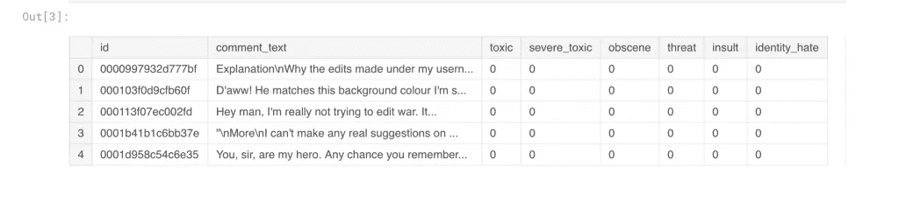
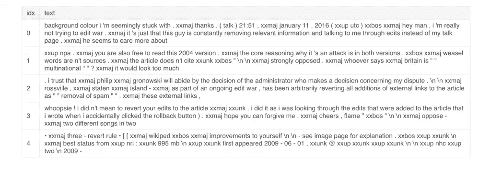
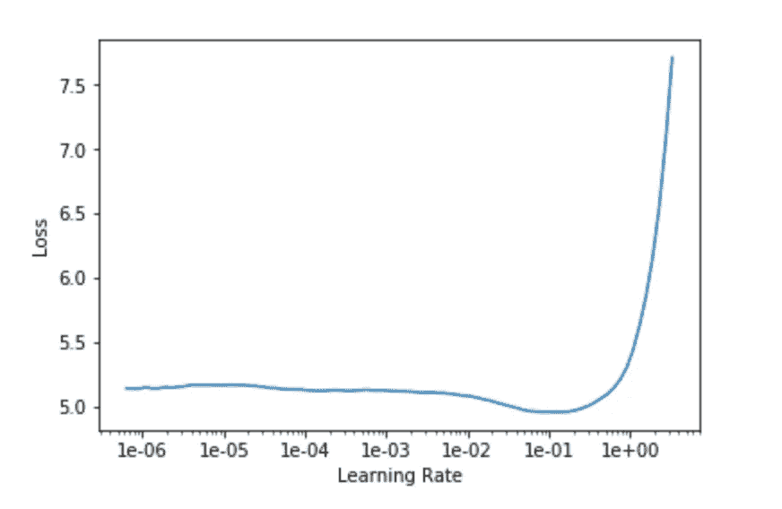
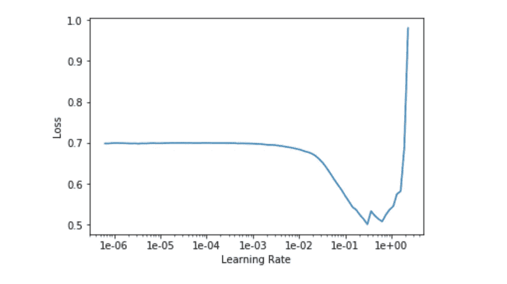
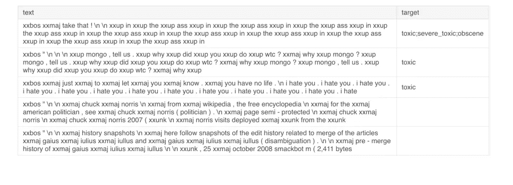
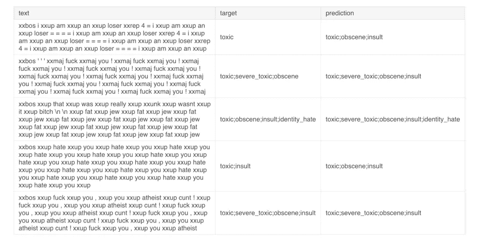
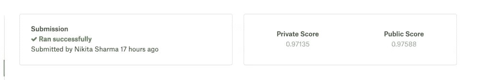

# 基于 FastAi 的多标签文本分类深度学习

> 原文：<https://towardsdatascience.com/deep-learning-on-multi-label-text-classification-with-fastai-d5495d66ed88?source=collection_archive---------16----------------------->

## 预测与文本数据集关联的多个目标值。

Photo by [Murat Onder](https://unsplash.com/@muratodr?utm_source=unsplash&utm_medium=referral&utm_content=creditCopyText) on [Unsplash](/s/photos/text?utm_source=unsplash&utm_medium=referral&utm_content=creditCopyText)

多标签分类有多个与数据集相关联的目标值。这里我们是预测每一类的概率，而不是预测单个类。

在这篇文章中，我将解释关于 fastai 的多标签文本分类问题。在这里，我们使用了[毒性评论分类挑战](https://www.kaggle.com/c/jigsaw-toxic-comment-classification-challenge)来解释 FastAi 如何处理多标签问题。

# 让我们看看数据

让我们来看看数据的概述，了解每个特性的数据类型，从而了解特性的重要性。
对于这个问题，我们有 6 个标签类，即:6 种不同毒性如下:

*   有毒的
*   严重 _ 有毒
*   猥亵的
*   威胁
*   侮辱
*   身份 _ 仇恨

我们必须创建一个模型来预测每条评论的每种毒性的概率。

# 加载和分析数据

快速人工智能期望数据作为*数据束*被加载，然后快速人工智能*学习者*可以将这些数据用于模型。这里，我们将首先用我们训练数据集创建数据簇。

# 用特定领域的数据拟合深度学习模型

首先，我们将用不带目标值的训练数据来拟合我们的模型，以便我们的模型更好地了解我们的数据。

# 使用分类标签重新拟合模型

在这里，我们将用我们的目标值重新拟合我们的模型，并调整我们的模型以获得更准确的结果。

让我们预测目标值，并与原始目标值进行比较。

# 获得预测

让我们获得预测，并创建提交文件以在 Kaggle 中提交它。

# 所有的代码

这个任务的所有代码都可以在 Kaggle 内核中找到:

*   [FastAi 的多标签分类问题](https://www.kaggle.com/nikkisharma536/fastai-toxic)

*原载于 2019 年 7 月 21 日*[*https://confusedcoders.com*](https://confusedcoders.com/random/deep-learning-on-multi-label-text-classification-with-fastai)*。*