# 尼安德特人基因的深度学习

> 原文：<https://towardsdatascience.com/deep-learning-on-neanderthal-genes-ad1478cf37e7?source=collection_archive---------9----------------------->

## [生命科学的深度学习](https://towardsdatascience.com/tagged/dl-for-life-sciences)

## 利用深度学习检测尼安德特人祖先的区域

Image licence from [iStock](https://www.istockphoto.com)

这是我的专栏 [**生命科学深度学习**](https://towardsdatascience.com/tagged/dl-for-life-sciences) 的第七篇文章，在这里我给出了深度学习如何能够**已经**应用于计算生物学、遗传学和生物信息学的具体例子。在之前的帖子中，我演示了如何使用深度学习进行[古 DNA](/deep-learning-on-ancient-dna-df042dc3c73d) 、[单细胞生物学](/deep-learning-for-single-cell-biology-935d45064438)、[组学数据整合](/deep-learning-for-data-integration-46d51601f781)、[临床诊断](/deep-learning-for-clinical-diagnostics-ca7bc254e5ac)和[显微成像](/deep-learning-on-microscopy-imaging-865b521ec47c)。今天，我们将深入到令人兴奋的**人类进化史**中，并了解到直接从[**【NLP】**](https://en.wikipedia.org/wiki/Natural_language_processing)中借用方法论，并将其应用于人类群体遗传学，以推断现代人类基因组中 [**尼安德特人基因渗入**](https://en.wikipedia.org/wiki/Interbreeding_between_archaic_and_modern_humans) 的区域。

# 简史:走出非洲

当现代人类的祖先在大约 5 万- 7 万年前从非洲迁徙出去时，他们遇到了当时居住在欧洲和亚洲的两个古人类群体:T2 人、尼安德特人、T4 人和丹尼索瓦人。我们知道现代人与尼安德特人和丹尼索瓦人杂交，因为有证据表明他们的 DNA 存在于非非洲血统的现代人的基因组中。人类进化史上这些伟大的基因进步之所以成为可能，是因为[尼安德特人](https://science.sciencemag.org/content/328/5979/710)和[丹尼索瓦人](https://www.eva.mpg.de/genetics/genome-projects/denisova/index.html)的基因组分别在 2010 年和 2012 年被[斯万特·帕博](https://en.wikipedia.org/wiki/Svante_P%C3%A4%C3%A4bo)小组测序。

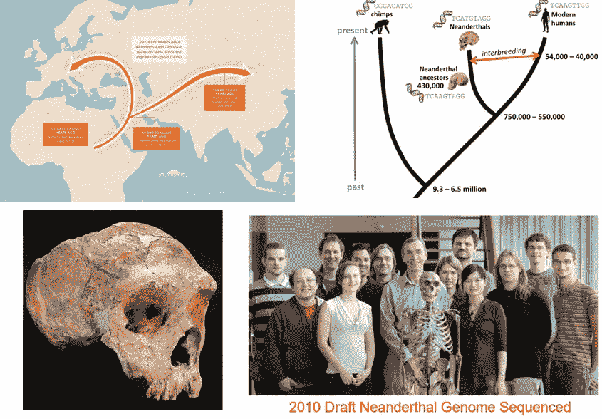

有一些人试图推断从尼安德特人和丹尼索瓦人那里继承的 DNA 片段的确切位置。他们利用了各种基因组学资源，如 [1000 基因组项目](https://en.wikipedia.org/wiki/1000_Genomes_Project)，并计算了非非洲基因组与[高质量尼安德特人基因组](https://www.nature.com/articles/nature12886)的局部相似性以及与非洲基因组的差异的不同度量(下图)。

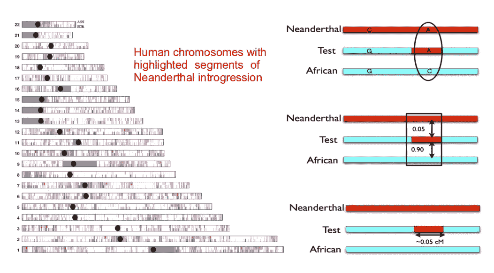

[S* / S’ statistics](https://science.sciencemag.org/content/343/6174/1017.long) and [Conditional Random Field (CRF)](https://www.nature.com/articles/nature12961) were applied to detect Neanderthal introgression

这些相似性度量(**汇总统计**)尽管是可解释的和有效的，但却导致了信息的丢失，因为它们试图以单个数字捕获一段 DNA，而没有考虑核苷酸本身的有序序列。[其他尝试](https://journals.plos.org/plosgenetics/article?id=10.1371/journal.pgen.1007641)使用**隐马尔可夫模型(HMM)** 扫描尼安德特人的基因组渗入，这是一个**无记忆**模型，再次没有考虑沿着 DNA 序列的核苷酸之间的**长程相关性**。这就是深度学习处理**原始基因组序列**并利用**通过 [RNNs / LSTMs](https://en.wikipedia.org/wiki/Long_short-term_memory) 和 [CNNs](https://en.wikipedia.org/wiki/Convolutional_neural_network) 跨越基因组的核苷酸连接**的长期记忆的能力可以带来难以置信的好处的地方。

# 深度学习对于古代基因组学的潜力

目前，深度学习在进化生物学中基本上被**忽略**，尽管它在处理基因组数据方面具有巨大的潜力，而基因组数据是当前进化科学和古代 DNA 研究领域的主要数据源之一。[最近的尝试](https://bmcbioinformatics.biomedcentral.com/articles/10.1186/s12859-019-2927-x)利用**模拟基因组数据**尽管有真实基因组数据的可用性，这些数据通常具有已被充分理解的生物学功能的注释区域。深度学习非常适合研究基因组学和古代基因组学，因为一个基因组实际上是一个大数据。为了实现这一点，只需考虑将 3*10⁹核苷酸长基因组切割成 1000 个核苷酸的片段，这带来了用于深度学习的 3*10⁶训练样本，前提是可以为每个 DNA 片段计算出注释(标签)。这是大量的训练数据！

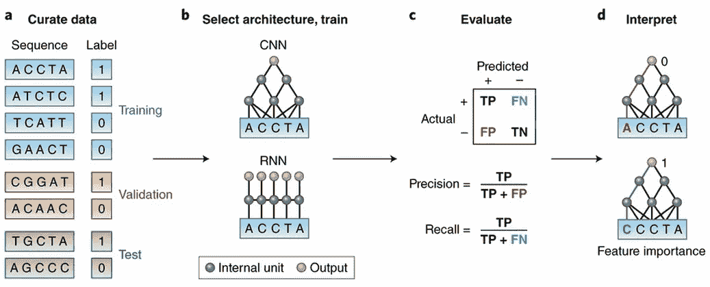

Deep Learning for Genomics from Zou et al. *Nature Genetics* **51**, pages12–18 (2019)

我在之前的[帖子](/deep-learning-on-ancient-dna-df042dc3c73d)中演示了如何用这个想法来区分古代和现代的 DNA 序列。在那里，我使用了 1D 卷积神经网络(CNN)和序列的的**一热编码表示。在这里，我将展示另一种方法来表示输入到深度学习中的 DNA 序列。请看下图左图，这就是我们通常所说的文字。然而，这并不是基因组学的人所说的文本。他们所指的文本显示在右边。 **DNA 序列是文本！这看起来很无聊，但随着时间的推移，你会开始看清事情的来龙去脉。如果我告诉你**我在那里看到一个基因**呢？如果我告诉你，我看到一个基因与二型糖尿病(T2D)紧密相连，我们很可能从尼安德特人那里继承了这个基因，会怎么样？****

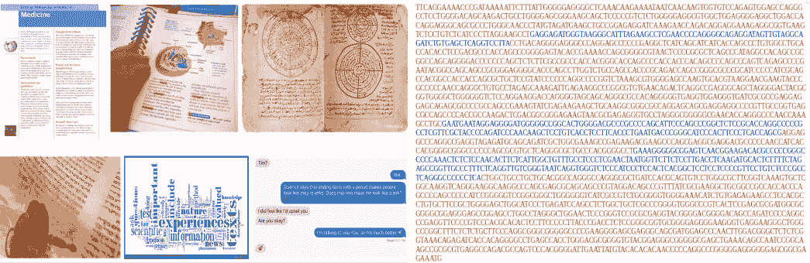

What people usually mean by text (left), vs. what bioinformaticians mean by text (right), SLC16A11 gene

现在，如果 DNA 序列是一个文本，我们可以将自然语言处理(NLP)的所有工具应用于这样的文本。然而，**DNA 文本中的句子在哪里，单词在哪里？**如果我们要预测一串 DNA 序列(这串可以被认为是一段文字)是否是从尼安德特人那里继承来的，那么这串 DNA 序列中的一个可以被认为是文字的**句子**，一个 [**k-mer**](https://en.wikipedia.org/wiki/K-mer) (子序列)可以被认为是一个**单词**。

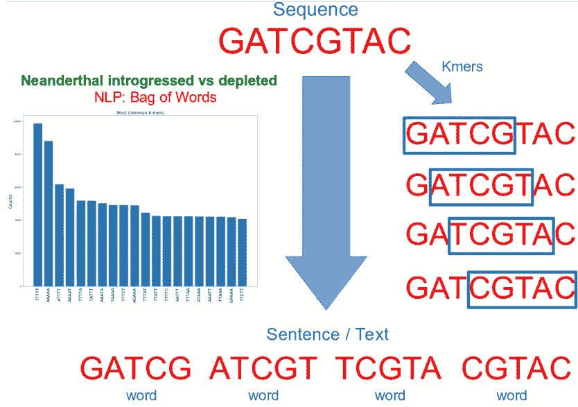

DNA sequence is a sentence that can be split into k-mers, space-delimited k-mers can be seen as words

一旦我们将 DNA 序列转换成空格分隔的 k-mers /单词，我们就完成了。现在，我们可以转向先进的 NLP 技术，并使用例如简单的 [**单词袋**](https://en.wikipedia.org/wiki/Bag-of-words_model) 模型来比较从尼安德特人继承的序列和枯竭的古代祖先的序列之间的**单词/ k-mers** 的频率。

# 为情感分析准备序列

现在让我们演示如何**实际**使用机器/深度学习和自然语言处理(NLP)来识别现代人类基因组中尼安德特人基因渗入的区域。这里我将公式化以下问题来解决:

> 给我看一段你的 DNA，我会预测它有多大可能是从尼安德特人那里遗传的

作为训练数据集，我们将使用来自 [Vernot 和 Akey 的尼安德特人渗入的候选区域的坐标，Science 2016](https://science.sciencemag.org/content/352/6282/235) 使用来自 **1000 基因组项目**的欧洲人和亚洲人的 S *-统计数据确定，数据可以从这里下载[*https://drive . Google . com/drive/folders/0 B9 PC 7 _ zitmcvwu P6 bwtxc 2 xjvkk*](https://drive.google.com/drive/folders/0B9Pc7_zItMCVWUp6bWtXc2xJVkk)。我们使用渐渗单倍型文件*ll . callseteur . Mr _ 0.99 . neand _ calls _ by _ hap . bed . merged . by _ chr . bed*并只选择唯一坐标，因此我们最终得到了现代欧洲人尼安德特人祖先的 **83 601** 区域。让我们读一下坐标，看看尼安德特人渗入区域的长度分布。

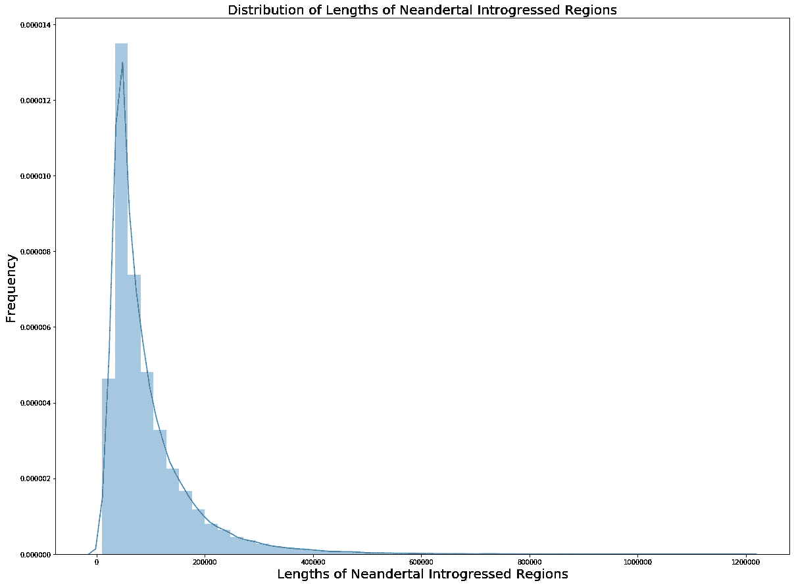

我们可以看到，尼安德特人渐渗片段的长度从 10 kbp 到 1.2 Mbp 不等，平均值约为 100 kbp。现在我们将使用这些坐标并从 hg19 版本的人类参考基因组中提取实际序列，该参考基因组具有 fasta 文件格式，可从[*http://hgdownload.cse.ucsc.edu/goldenPath/hg19/bigZips/*](http://hgdownload.cse.ucsc.edu/goldenPath/hg19/bigZips/)*下载。*我们当然可以使用 Python 进行序列提取，但是使用基于 C++的 [**samtools**](http://www.htslib.org/doc/samtools.html) 会快得多。

现在我们要用尼安德特人渗入坐标之外的坐标建立一个熊猫数据框架。为此，我们将随机绘制与同一条染色体上的渐渗区长度相同的 DNA 片段，并检查这些片段是否与任何渐渗区相交。这样，我们构建了两组不重叠的坐标:渐渗区和耗尽区。

一旦建立了包含耗尽尼安德特人祖先区域的数据框架，我们就可以使用 **samtools** 再次从 hg19 fasta 中提取对应于耗尽片段的实际 DNA 序列，这里为了简洁起见我跳过这一步，但是查看 [github](https://github.com/NikolayOskolkov/DeepLearningNeanderthalIntrogression) 上的完整 Jupyter 笔记本来查看细节。仔细观察提取的渐渗和耗尽序列，我们可以注意到相当多的含 N-核苷酸的序列。这是基因组学中缺失的数据，即测序技术没有解决的位置**。为了不让缺失的数据影响我们的分析，我省略了包含至少一个 N-核苷酸的序列，这可以在 BioPython 中有效地完成:**

**现在数据准备好输入到 NLP 分析中。让我们继续进行简单的**单词袋**模型，即观察尼安德特人渐渗序列与耗尽序列之间 k-mers 的**频率**的差异。**

# **情感分析:渐渗与耗尽**

**我们首先将两个 fasta 文件中的序列格式化为文本，用空格分隔的 k-mers 作为单词。由于我的笔记本电脑的内存限制，我只读取了每个序列的前 10，000 个核苷酸，然后我使用了函数 **getKmers** 将每个序列分成 k-mers，并以空格分隔的方式合并 k-mers，所以最后，我有了一个句子列表，每个句子代表一个单词/ k-mers 列表。**

**现在，我们可以使用 Python 中的 **Counter** 类进行有效的单词计数，轻松地可视化尼安德特人渐渗和耗尽序列中的 k-mer 频率。**

**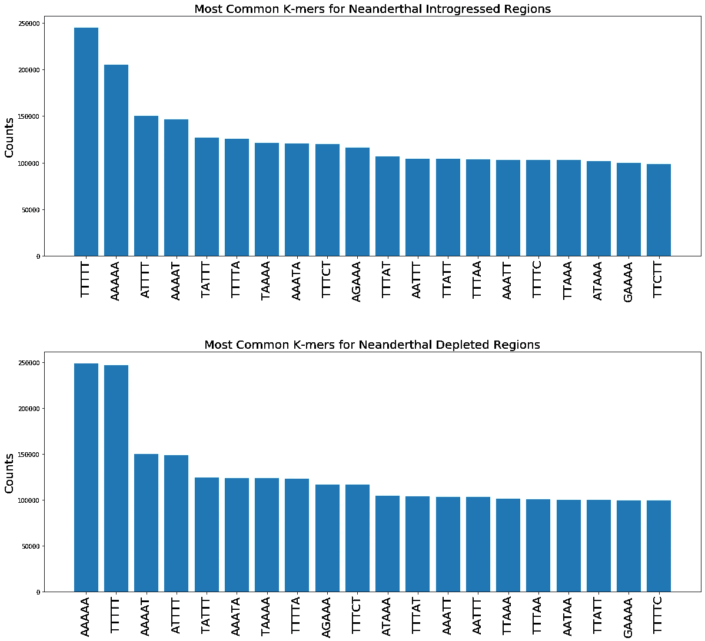**

**尽管富含 A 和 T 的 k-mer 似乎在尼安德特人的渐渗区和耗尽区都最常见，但我们观察到两种情况下 k-mer 计数的**微小差异**，这可能表明渐渗区和耗尽区序列中的**非相同** k-mer 组成。接下来，我们使用 **CountVectorizer** 类将单词/ k-mer 编码为整数，该类简单地构建文本的**词汇表**(唯一 k-mer 的数量)并计算每个单词/k-mer 在每个句子/序列中的出现次数。**

**在我们将数据集分成训练和测试子集之后，我们定义了具有随机梯度下降(SGD)优化器+动量和 L1 权重正则化器的前馈神经网络。**

**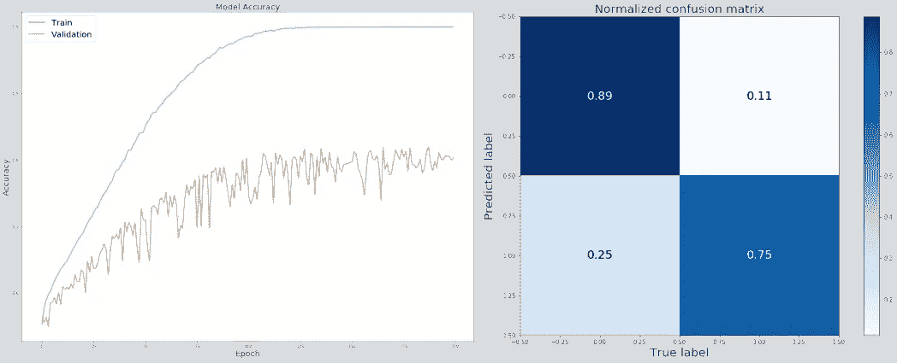**

**MLP Accuracy training curve (left) and confusion matrix of evaluation on test data set (right)**

**该模型在对尼安德特人渐渗与耗尽起源序列进行分类的测试数据集上达到了 82.2% 的准确度。与逻辑回归、支持向量机(SVM)或朴素贝叶斯分类器等线性模型相比，这显然是一个更好的结果，然而，出乎意料的是，随机森林分类器在相同的测试数据集上达到了更高的准确度 **84.5%** 。显示随机森林模型的特征重要性，我们观察到诸如 **AAAAA** 、 **CAAAA** 、 **CATTT** 和 **TTTTT** 的 k-mers 是最具预测性的。我们立即得到一种直觉，即尼安德特人渗入/耗尽区域的预测与 **GC/AT 含量**有关，因为**最具预测性的 k-mers 极其富含 AT**。**

**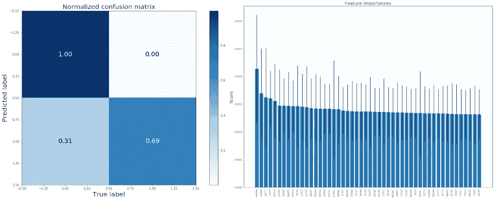**

**Random Forest classifier confusion matrix (left) and feature importances dominated by AT-rich k-mers (right)**

**从随机森林分类器的混淆矩阵(如上)可以清楚地看出，该模型在预测耗尽的尼安德特人祖先片段时具有非常高的准确性，但是在对渗入区域进行分类时表现非常差(比神经网络差)。**

# **预测尼安德特人遗传的基因**

**现在让我们回到从一个给定的 DNA 序列预测它是否是从尼安德特人那里继承来的问题上来。在这里，我将对人类蛋白质编码基因做出这样的预测。让我们在这里[http://genome.ucsc.edu/cgi-bin/hgTables](http://genome.ucsc.edu/cgi-bin/hgTables)下载 hg19 的 RefSeq 基因注释文件，清理它并使用基因的坐标，以便从参考基因组 fasta 文件中提取它们的序列，类似于我们对渐渗和耗尽区域所做的，参见 [github](https://github.com/NikolayOskolkov/DeepLearningNeanderthalIntrogression) 上 Jupyter 笔记本中的详细信息。我们再次通过 k-mers 的空格分隔连接来构建**基因文本**。**

**接下来，我们将使用经过训练的随机森林分类器来生成先前转换为文本的基因序列的预测。因此，用 CountVectorizer 将基因文本转换成整数。**

**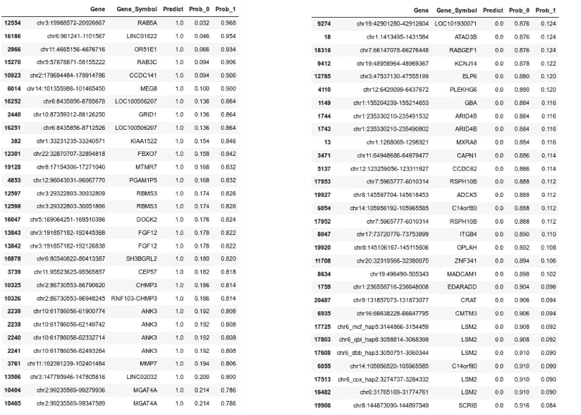**

**Genes predicted to have high (left) and low (right) probability to be inherited from Neanderthals**

**这样，对于每个基因，我们生成一个概率(Prob_1 ),它是从尼安德特人遗传的，并且是一个本地人类基因(Prob_0)。我们可以很容易的显示出最高 Prob_1(最低 Prob_0)和最高 Prob_0(最低 Prob_1)的基因，请看上面的基因列表。值得注意的是，在大约 22000 个蛋白质编码基因中，只有 477 个基因被预测含有尼安德特人的 DNA。这是一个非常有趣的观察，我们稍后将再次讨论它。**

# **K-mer /单词嵌入的可视化**

**通过连接 k-mers 产生的基因组文本的词汇可以通过单词嵌入模型 [**Word2Vec**](https://en.wikipedia.org/wiki/Word2vec) 可视化，该模型对单词(在我们的情况下是 k-mers)之间的相似性进行智能猜测。一旦适合我们的数据，Word2Vec 将每个 k-mer 表示为一个 100 维的潜在向量，这些向量可以被视为我们数据的另一种数字表示，可以输入到任何降维技术中进行进一步的研究。在这里，我们将嵌入和可视化 UMAP 和 tSNE 的 k-mers 用于尼安德特人渐渗与枯竭情绪分析。我们可以检测到两个明显的 k-mer 星团。更仔细的观察表明，其中一个似乎富含 AT-丰富的 k-mers，而另一个(较小的一个)主要由富含 GC 的 k-mers 组成。**

**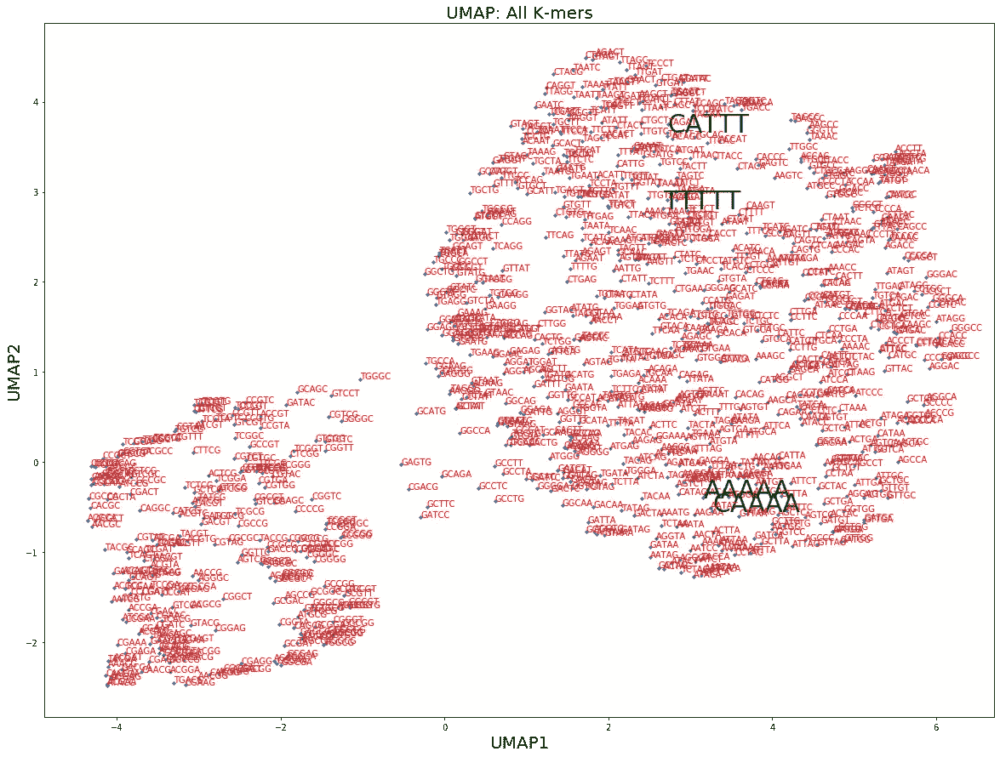****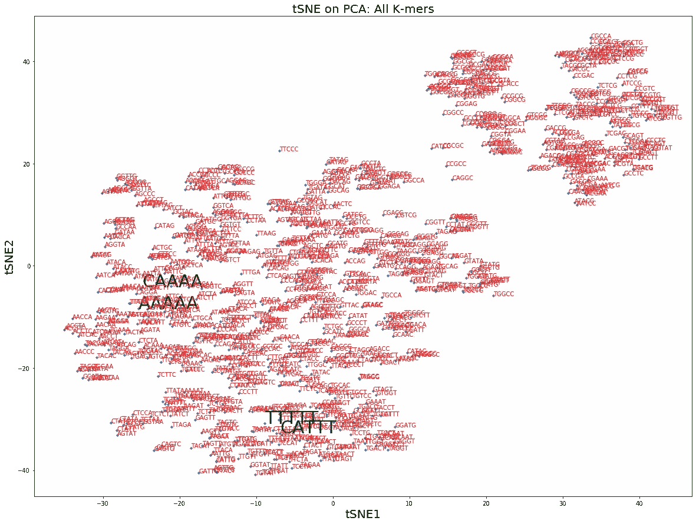**

**根据随机森林分类器，我特别用绿色突出显示了最具预测性的 k-mers，该分类器可以区分尼安德特人渗入序列和耗尽序列。正如所料，它们都属于更大的富含 AT 的集群。这个单词嵌入可视化是 k-mer 句子中存在一些**结构**的又一个证据，它能够预测尼安德特人的祖先，并且与 DNA 富含 GC 和 AT 片段之间的**平衡有关。****

# **进化从基因中消除了尼安德特人的 DNA**

**总结前面几节讨论的一切，我们可以得出结论，我们 DNA 中存在的尼安德特人祖先可疑地与整个基因组中的 GC / AT 含量相关。众所周知[我们的基因富含 GC](https://en.wikipedia.org/wiki/GC-content)，它们的 GC 含量约为 47%,而全基因组的 GC 含量为 41%,这是 GC 含量的巨大差异。**

**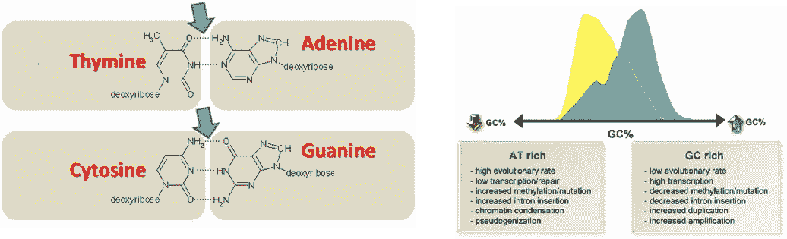**

**Human genes are typically GC-rich which is indicative for absence of Neanderthal ancestry**

**因此，我们可以问，尼安德特人的基因渗入和耗尽区域与基因重叠的程度到底有多大？我们可以用[**bed tools intersects**](https://bedtools.readthedocs.io/en/latest/)快速计算基因与渐渗坐标之间的相交数。然而，由于尼安德特人耗尽区域的坐标是先前随机选择的(我们只要求它们不与渗入坐标重叠)，我们应该重复选择程序多次，以便估计相交的显著性。**

**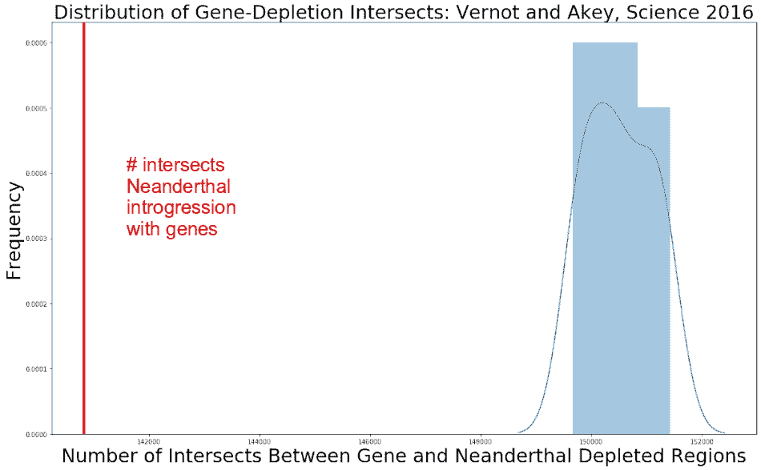**

**我们可以看到，基因和尼安德特人渐渗片段之间的交集数量 **140 821** ，明显低于基因和尼安德特人衰竭区域之间的交集数量。事实上，在 17 个随机抽取的尼安德特人衰竭区域中，没有一个区域的基因相交数小于或等于 140 821，因此我们可以将 p 值计算为 p 值< 1 / 17。我们看到的是，尼安德特人的基因渗入区域主要落在基因之外，这意味着**进化没有优先考虑尼安德特人的祖先，并试图将其从我们基因组中最具功能的元素中推开，这些元素是蛋白质编码基因**。因此，出于一些神秘的原因，与尼安德特人杂交并没有改善我们的健康，进化试图纠正这一点。他们在报纸和杂志上谈论了很多关于现代人和尼安德特人杂交的非常酷的事实，但是他们从来没有提到这对现代人没有好处，不是吗？**

**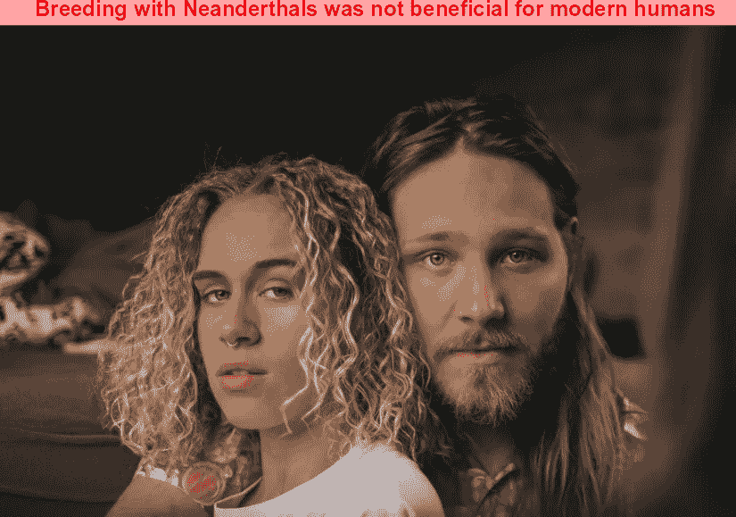**

**[Image source](https://unsplash.com/photos/QDfi_vo9D8Y)**

# **摘要**

**在这篇文章中，我们了解到机器/深度学习和自然语言处理(NLP)在进化生物学和古代 DNA 研究领域的巨大潜力，这一潜力仍然没有被**充分利用**。基因组数据提供了进化生物学中的主要信息源之一，并包含数百万和数十亿的短 DNA 片段，这些片段可以并且应该用深度学习来分析。在这里，我们演示了如何为 NLP 准备基因组数据，并使用**单词包**和**单词嵌入**对其进行分析。我们训练了一个模型，能够预测基因组序列是否是从尼安德特人遗传的。使用该模型，我们构建了可能从尼安德特人继承的基因列表，并发现我们的基因中缺乏古老的祖先，这表明与尼安德特人的杂交是进化的，对现代人类无益。**

**值得一提的是，我目前正在研究各种类型的具有长记忆的神经网络架构，例如 RNNs / LSTMs、CNN/多通道 CNN，并应用于古代基因组学，我将在以后的文章中回到这个主题。**

**像往常一样，请在评论中让我知道你最喜欢的生命科学领域，你希望在深度学习框架中解决的领域。在媒体[关注我，在 Twitter @NikolayOskolkov 关注我，在](https://medium.com/u/8570b484f56c?source=post_page-----ad1478cf37e7--------------------------------) [Linkedin 关注我。完整的 Jupyter 笔记本可以在我的](http://linkedin.com/in/nikolay-oskolkov-abb321186) [github](https://github.com/NikolayOskolkov/DeepLearningNeanderthalIntrogression) 上找到。我计划写下一篇关于**如何用深度学习**及时预测人口规模的帖子，敬请关注。**