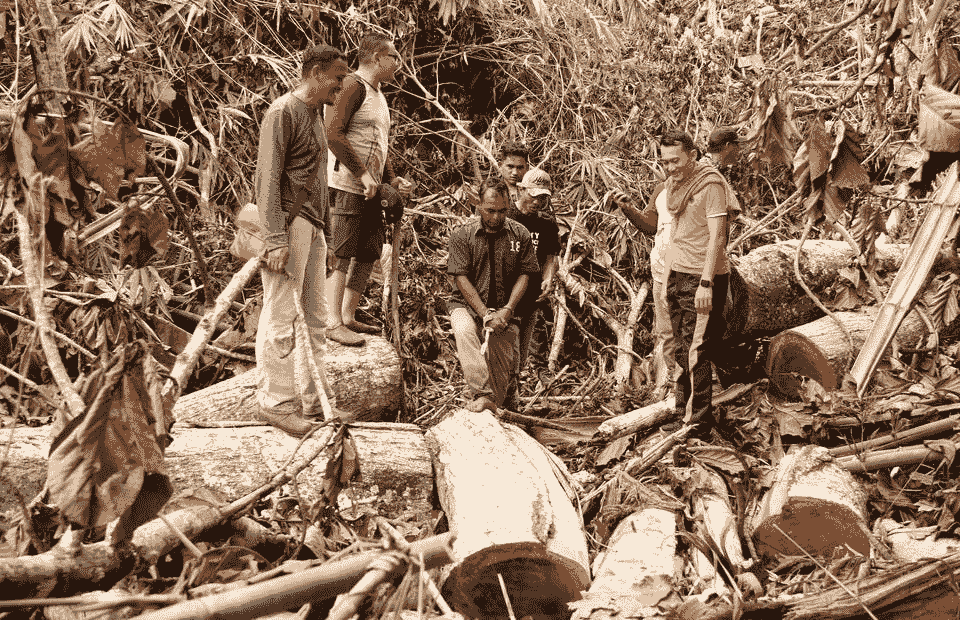
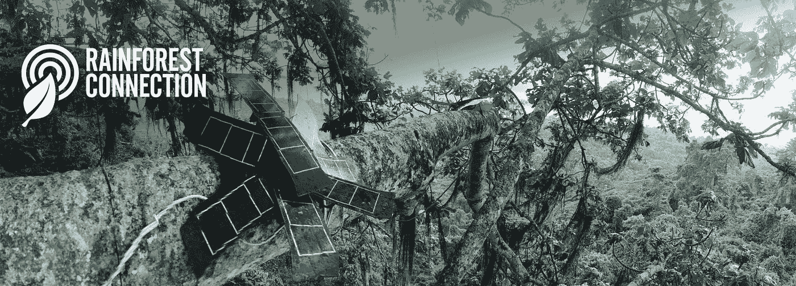
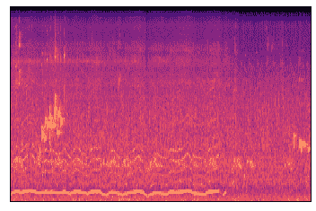
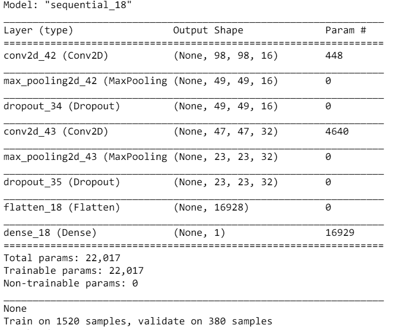
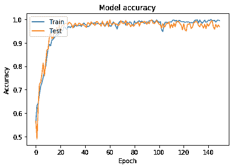
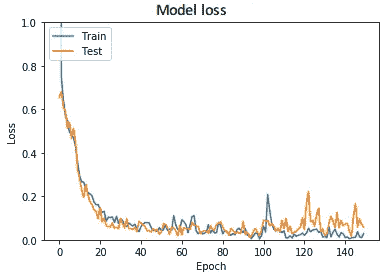
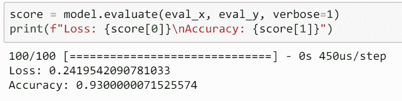

# 深度学习:用 TensorFlow 拯救雨林

> 原文：<https://towardsdatascience.com/deep-learning-saving-rainforests-with-tensorflow-4e906344811a?source=collection_archive---------13----------------------->

森林砍伐占全球碳排放量的近 20%,并造成了数万亿美元的经济损失。随着 80%的亚马逊木材被非法砍伐，迫切需要一种检测和阻止这种行为的解决方案。然而，有一些障碍。鉴于热带雨林的广阔和茂密，护林员根本没有资源或人力来实际监控数千英亩的雨林。

由托弗·怀特领导的一个名为[雨林连接](https://rfcx.org)的非营利组织已经设计出了一个有效且足智多谋的解决方案。旧手机被收集起来，装上太阳能电池板，放在树枝上，听伐木卡车和电锯的声音。一部手机可以探测到一公里外的非法砍伐，保护了 300 多公顷的雨林，防止了 15000 吨二氧化碳的排放——超过了 3000 辆汽车*一年的排放量*。

这背后的检测算法是由谷歌大脑团队开发的深度学习框架 TensorFlow 驱动的。我使用 TensorFlow 开发了一个模型，该模型在检测森林中远处的链锯噪音时至少有 93%的准确性。

# 第一步:获取数据

由于我附近缺少雨林和非法伐木工，我使用了 [scaper](https://scaper.readthedocs.io/en/latest/) 库来模拟雨林的声景。这段代码所做的是将各种链锯噪音(来自 YouTube)叠加在各种雨林噪音(也来自 YouTube)之上，包括雷暴、动物和流水。为了给出可能的链锯噪声的广泛表示，样本在音量和音调上随机变化。

这里有两个例子，第一个没有电锯，第二个有电锯。你能听到吗？

# 第二步:制作图像

虽然视觉深度学习已经有了很大的进步，但听觉深度学习仍然很原始。声谱图是一种声音的直观表示，其中每个频率的出现都是相对于时间绘制的。卷积神经网络非常擅长识别图像中的信号——就像频谱图中的链锯噪音。为了利用 CNN 的力量，我们必须使用 [librosa python 库](https://librosa.github.io/librosa/)将原始音频数据转换成图像格式。

这是一个声谱图示例及其相关的声景。看看你是否能听到一些特征:

The spectogram for the below soundscape

最初的图像是 600x400，但这对于我的 GPU 来说太多了。将图像缩小到 100x100 会产生更快、更准确的结果。有电锯的声景和没有电锯的声景各占一半。

# 步骤 3:训练分类器

这个片段将样本图像分为训练集、测试集和评估集。总共有 2000 个图像，100 个用于评估，其余的 80/20 用于训练/测试。

然后，我们在 2 个 CNN 层和单个密集输出上训练该模型。

2D convolution visualisation— [source](https://www.freecodecamp.org/news/an-intuitive-guide-to-convolutional-neural-networks-260c2de0a050/)

以下是网络摘要:

该网络在 GTX 1660Ti GPU 上训练了大约 2 分钟，超过 200 个时期。结果非常棒——接近 97%的验证准确率和 0.057%的损失，曲线看起来非常健康。

在该网络从未见过的 100 张评估图片上，该模型的得分为 93%！

# 结论

我认为听觉机器学习和物联网设备有巨大的潜力。抛开隐私问题不谈，一个由互联网连接的太阳能麦克风组成的网络运行一个简单的 TensorFlow 模型，可以检测非法偷猎、交通拥堵和未经维护就侵入大片区域的行为。

订阅我的时事通讯，以便在我下次写作时得到通知:)