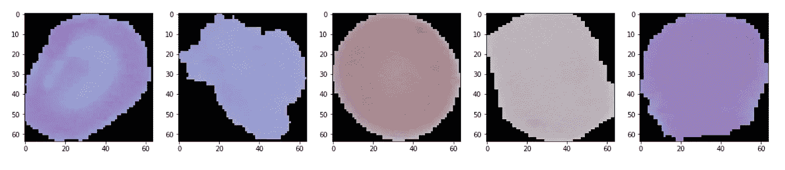

# 在 Kaggle 上使用 CNN 进行深度学习以识别疟疾细胞

> 原文：<https://towardsdatascience.com/deep-learning-to-identify-malaria-cells-using-cnn-on-kaggle-b9a987f55ea5?source=collection_archive---------12----------------------->


Photo by [Kendal James](https://unsplash.com/@hikendal?utm_source=medium&utm_medium=referral) on [Unsplash](https://unsplash.com?utm_source=medium&utm_medium=referral)

深度学习有着广泛的应用，它在医疗保健行业的应用一直让我着迷。作为一名敏锐的学习者和 Kaggle noob，我决定研究疟疾细胞数据集，以获得一些实践经验，并学习如何在 Kaggle 平台上使用卷积神经网络、Keras 和图像。

我喜欢 Kaggle 的一个原因是它以内核和讨论的形式保存了大量的知识。从各种内核和专家那里获取线索和参考资料确实帮助我更好地产生高度准确的结果。一定要看看其他内核，了解他们的方法，以便为您自己的开发和知识建设获得更多的见解。

## 快速来源

1.  **数据集:**[https://www . ka ggle . com/iarunava/cell-images-for-detecting-malaria](https://www.kaggle.com/iarunava/cell-images-for-detecting-malaria)
2.  **Kaggle 笔记本:**[https://www . ka ggle . com/bhanotkaran 22/keras-CNN-data-augmentation](https://www.kaggle.com/bhanotkaran22/keras-cnn-data-augmentation)

# 导入库和数据集

我从导入`numpy`、`pandas`和`matplotlib`开始。我决定使用 Keras 和 Tensorflow backend 来实现 CNN 模型。所以，我从`keras.layers`中导入了一些图层，包括`Convolution2D`、`MaxPooling2D`、`Flatten`、`Dense`、`BatchNormalization`和`Dropout`。我用的是`Sequential`型号。为了处理数据集中的图像，我导入了`os`、`cv2`和`Image`包。

# 导入数据集

在 Kaggle 中，所有数据文件都位于笔记本所在位置的上一级文件夹`input`中。图像在`cell_images`文件夹中。因此，我将数据目录设置为`DATA_DIR`来指向那个位置。为了存储特性，我使用了变量`dataset`，对于标签，我使用了`label`。对于这个项目，我将每个图像的大小设置为 64x64。

```
DATA_DIR = '../input/cell_images/cell_images/'
SIZE = 64
dataset = []
label = []
```

下一步是导入数据。寄生(感染)的细胞图像在`Parasitized`文件夹内，未感染的图像在`Uninfected`文件夹内。

对于这两个文件夹，我遍历了所有扩展名为`png`的文件。

对于被寄生的细胞图像，我使用`cv2.imread()`读取图像，使用`Image.fromarray()`将其从数组转换，并将其大小调整为 64x64。最后，我将它保存到`dataset`变量中，并将每张图片的`0`附加到`label`中。我对未感染的细胞图像重复了相同的过程，但这次将标签设置为`1`。

# 可视化数据

我用 matplotlib 随机绘制了 5 个被寄生和 5 个未被感染的细胞。

## 寄生细胞


Parasitized cells

## 未感染的细胞



Uninfected cells

# 应用 CNN

卷积神经网络是处理图像和进行分类的最有效的神经网络之一。我使用 Keras 创建模型。

## 卷积 2D

这将创建一个卷积核。我设置了一些如下定义的属性:

*   **过滤器:**第一个参数定义层的输出形状。在这种情况下，对于两个层，我都将值保持为`32`。
*   **kernel_size:** 它定义了我们想要使用的沿着图像遍历的窗口的大小。我设置为`3x3`。
*   **input_shape:** 用于定义每张图像的输入尺寸。在这个项目中，我使用 64x64 大小的图像，图像是彩色的，即它们由红色，蓝色和绿色组成。因此通道是 3 个。因此，参数`input_shape`将为`(64, 64, 3)`。我们只需要为第一层定义`input_shape`。
*   **激活:**激活功能在此参数中定义。我使用`relu`作为激活函数，它是整流线性单元。

## MaxPool2D

它用于缩减输出，我使用了以下参数:

*   **pool_size:** 定义了矩阵大小，矩阵大小定义了将被转换为 1 个值的像素值的数量。我使用的值是`2x2`，因此大小为`62x62`的图像将被转换为`31x31`。
*   **data_format:** 描述了在输入中，通道是定义在开头还是结尾。在这种情况下，第三个值用于`(64, 64, 3)`中的通道，我将`data_format`设置为`channels_last`。

## 批量标准化

它将前一个激活函数的输出标准化，我只修改了一个参数:

*   **轴:**定义要归一化的轴。当我使用`channels_last`时，我将值设置为`-1`。

## 拒绝传统社会的人

它随机选择一些值设置为`0`，以防止在模型中过度拟合，我只使用了速率参数:

*   **比率:**要丢弃的输入分数。我把汇率保持为`0.2`。

## 变平

它将完整的 n 维矩阵展平为单个数组。因此，如果它的大小是`64x64x3`，它将被转换成大小为`12,288`的数组。它作为前面致密层的输入。

## 稠密的

它定义了一个密集连接的神经网络层，我定义了以下参数:

*   **激活:**定义了除最后(输出)层外，我设置为`relu`的激活函数。对于最后一个密集层，我设置激活为`sigmoid`。
*   **单位:**定义给定层的神经元个数。我创建了三层，神经元数量分别为 512、256 和 2。

## 本项目中 CNN 模型的结构

我为 CNN 制作了一个`Sequential`模型。

我创建了一个卷积层，然后是一个最大池层。接下来是`BatchNormalization`以标准化来自先前层的输出并应用`Dropout`规则化。然后附加另一组这些层。然后我`Flatten`输出。然后，展平的输出被传递到人工神经网络，该网络包括具有 512、256 和 2 个节点的三个密集层。最后一层是带有激活功能`sigmoid`的输出层。你可以在这里阅读更多关于激活功能[的信息。](/activation-functions-neural-networks-1cbd9f8d91d6)

最后一步是编译模型。优化器是`adam`，这是一个分类问题，我使用损失作为`categorical_crossentropy`，评估指标作为`accuracy`。

# 培训和准确性

我将数据集分成 80%的训练数据和 20%的测试数据。

用`fit`的方法，我用`X_train`和`y_train`训练模型。我使用总时期作为`50`，它基本上是完整数据集的 50 次迭代，批量大小为`64`。我还添加了 0.1 的验证，这样模型在 90%的训练数据上训练，在 10%的训练数据上验证。

> 该模型达到了 95.75%的准确率。

# 数据扩充和准确性改进

数据扩充有助于增加数据集，并在更多不同的数据上训练模型。可供模型学习的数据越多，模型的表现就越好。Keras 提供了一个可以创建这些数据的子包`ImageDataGenerator`。

## 数据扩充

对于训练数据，我通过除以`255`来重新缩放图像，以`0.3`的范围缩放图像，水平翻转图像并旋转`30`的角度。为了测试数据，我只是重新缩放图像。`train_generator`和`test_generator`以`64`的批量创建。

## 计算新精度

然后，我使用`fit_generator`训练分类器，并计算新的准确度。

> 该模型通过数据扩充达到了 96.41%的准确率。

正如我们所看到的，通过数据扩充，我能够提高模型的准确性，同时仍然拥有相同的数据。乍一看，它可能看起来准确性没有增加多少，但在医疗领域，一个百分点的增加真的很有用，可以正确识别更多的患者。

# 结论

在本文中，我讨论了对疟疾细胞图像使用卷积神经网络和数据增强，并实现了 96.41%的测试准确率。

感谢阅读。请分享你的想法、想法和建议。