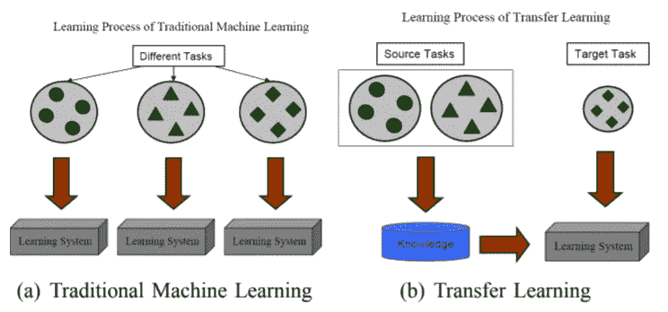
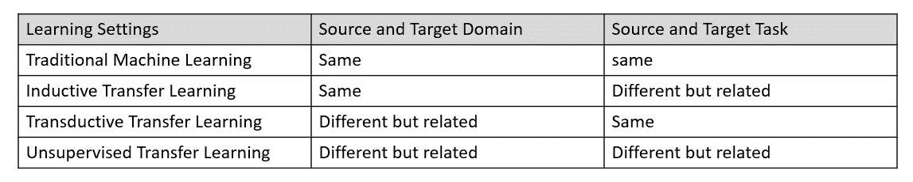
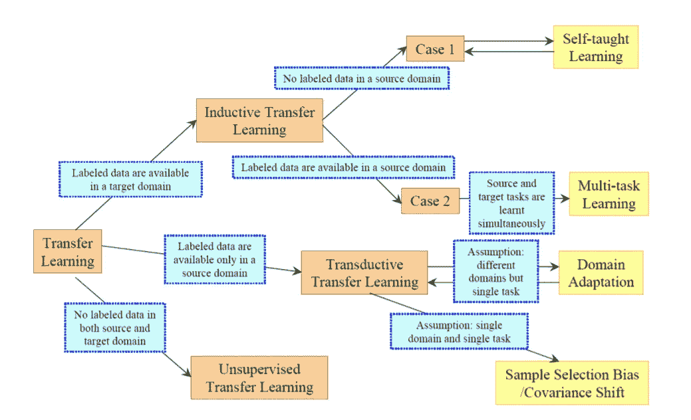

# 使用迁移学习的深度学习

> 原文：<https://towardsdatascience.com/deep-learning-using-transfer-learning-cfbce1578659?source=collection_archive---------11----------------------->

***在本系列文章中，我们将探讨什么是迁移学习，迁移学习的目的是什么。了解实施迁移学习的不同策略。在下一篇文章中，我们将使用 ResNet50 编写代码来应用迁移学习。***

如果你知道如何划船，如何游泳，那么我们可以学习水上漂流吗？

如果你已经学会了基础知识，那么你只需要学习水上漂流的具体知识，划船和游泳的基本概念是你知识基础的一部分。

***我们能否将这种技术应用于机器学习和深度学习？***

但是我们每次都会创建一个新的卷积神经网络(CNN)来识别不同类别的对象。我们有一个 CNN 来识别像狗和猫这样的动物。我们将有一个不同的 CNN 用于识别数字，另一个用于识别服装对象。

***关于机器学习和深度学习的常见假设***

如果训练和测试数据来自相同的特征空间和相同的分布，我们可以重用已经建立的模型，但是当分布改变时，我们需要从头开始重建模型。这就需要我们收集新的训练数据。

重新收集所需的训练数据和重建模型是昂贵的。如果我们减少重新收集训练数据的需要和努力，并且可以使用知识转移或任务域之间的转移学习，会怎么样？

***如果我们有一个 CNN，可以用来学习图像的基本知识，如角、形状、光照，然后稍微调整一下，学习其他类别图像的细节，会怎么样？***

> 欢迎转学习！

***迁移学习的目的是什么？***

> 迁移学习的目的是利用第一个设置中的数据，提取在第二个设置中学习甚至直接进行预测时可能有用的信息

- ***深度学习作者伊恩·古德菲勒、约舒阿·本吉奥和亚伦·库维尔***

# ***迁移学习的动机***

机器学习模型传统上是在这样的假设下开发的，即如果训练和测试数据来自相同的特征空间和相同的分布，则模型将工作良好。

如果特征空间或数据分布发生变化，那么我们就需要建立一个新的模型。每次从头开始开发一个新模型以及每次收集一组新的训练数据都是非常昂贵的。迁移学习减少了回忆大量训练数据的需要和努力。

用于机器学习和深度学习的迁移学习的动机是基于这样一个事实，即人们可以智能地将以前学到的知识应用于不同的任务或领域，这些任务或领域可以用来更快地解决新问题或提供更好的解决方案。

Source: [A Survey on Transfer Learning](https://www.cse.ust.hk/~qyang/Docs/2009/tkde_transfer_learning.pdf)

***迁移学习有哪些重点考虑？***

为了有效地应用迁移学习，我们需要回答三个主要问题

1.  转什么
2.  什么时候转移
3.  怎么转

*   **转移什么** —我们需要了解源任务和目标任务之间有哪些知识是共同的。哪些知识可以从源任务转移到目标任务，从而有助于提高目标任务的绩效
*   **何时迁移或何时不迁移-** 当源域和目标域完全不相关时，我们不应该尝试应用迁移学习。在这种情况下，性能会受到影响。这种迁移称为**负迁移。只有当源域和目标域/任务相关时，我们才应该应用迁移学习**
*   **如何迁移:**当源和目标领域/任务相关时，识别不同的技术来应用迁移学习。我们可以使用归纳迁移学习、直推迁移学习或无监督迁移学习。

***这些不同类型的迁移学习是什么？***

# 不同类型的迁移学习

> **归纳迁移学习-** S **源域和目标域相同但任务不同**

如果我们想让孩子识别水果，那么我们就开始展示不同颜色的苹果，像红苹果、绿苹果、淡黄色苹果等等。我们给孩子看不同种类的苹果，如嘎拉、澳洲青苹、富士苹果等。我们在不同的环境中展示这些苹果，这样孩子在大多数情况下都能识别苹果。同样的逻辑也用于识别不同的水果，如葡萄、橘子、芒果等。这里我们把在学习苹果中获得的知识应用到学习识别其他水果中。我们的源域和目标域与水果的识别相关，但是一个任务涉及识别苹果，一个任务涉及识别芒果。

*   **归纳迁移学习的目标是提高目标预测函数的性能。**
*   **归纳迁移学习需要目标域中的少量标记数据作为训练数据来归纳目标预测函数**
*   **如果源域和目标域都有标记数据，那么我们可以执行多任务迁移学习**
*   **如果源有标记数据，而目标任务没有标记数据，那么我们可以进行自学习迁移学习**

> **直推式迁移学习——不同领域但相似任务的迁移学习**

让我们推断这一学习，现在我们想让孩子学习像椅子、桌子、床等家用物品。孩子将利用所学的水果识别知识来识别家用物品。

孩子可能没有看到足够多的家庭用品，但会使用形状、颜色等知识。学会鉴别水果来鉴别家居物品。

**直推式迁移学习，目标域没有标记数据，而源域有大量标记数据**

直推式迁移学习适用于以下情况

*   源域和目标域之间的特征空间可以不同
*   域之间的特征空间相同，但输入数据的边际概率分布不同。这也被称为域适应。

> **无监督迁移学习**

无监督迁移学习类似于归纳迁移学习，其中目标任务不同于但与源任务相关。源任务和目标任务的域是相同的。我们没有源-目标任务的标记数据

它侧重于解决目标领域中的无监督学习任务，如聚类或维度缩减

Source : [A Survey on Transfer Learning](https://www.cse.ust.hk/~qyang/Docs/2009/tkde_transfer_learning.pdf)

***我能把这些迁移学习策略应用到深度学习中吗？***

与计算机视觉或顺序文本处理或音频处理等机器学习相比，深度学习需要大量的训练数据和训练时间。我们可以保存我们训练好的模型的权重，并分享给其他人使用。我们现在也有预训练模型，广泛用于迁移学习，称为**深度迁移学习。**

**深度迁移学习的常用策略**

*   **使用预训练的模型作为特征提取器**
*   **微调预训练模型**

用于计算机视觉的预训练深度神经网络

*   VGG-16 号
*   [VGG-19](https://keras.io/applications/)
*   [盗梦空间 V3](https://keras.io/applications/)
*   [ResNet-50](https://keras.io/applications/)
*   [异常](https://keras.io/applications/)

用于自然语言处理任务的预训练深度神经网络

*   [手套](https://nlp.stanford.edu/projects/glove/)
*   [Word2Vec](https://www.tensorflow.org/tutorials/representation/word2vec) ，
*   [快速正文](https://fasttext.cc/)
*   伯特

预训练模型可用于预测、特征提取和微调

让我们来了解一下这些策略的细节

## **使用预训练的模型作为特征提取器**

*   为了实现迁移学习，我们删除了预训练模型的最后一个预测层，并用我们自己的预测层替换它们。FC-T1 和 FC_T2 如下所示
*   这些预训练模型的权重被用作特征提取器
*   预训练模型的权重被冻结，并且在训练期间不被更新

## **微调预训练模型**

*   我们可以使用像 VGG-16，VGG-19，Inception V3，ResNet-50，Xception 这样的深度神经网络作为预训练模型
*   为了实现带有微调的迁移学习，我们删除了预训练模型的最后一个预测层，并用我们自己的预测层来替换它们。FC-T1 和 FC_T2 如下所示。
*   网络的初始较低层从预先训练的模型中学习非常一般的特征。为了实现这一点，预训练模型的初始层权重被冻结，并且在训练期间不被更新
*   较高层用于学习特定任务的特征。预训练模型的更高层是可训练的或可微调的
*   用更少的培训时间提高绩效

我们将在下一篇文章中看到使用 [ResNet50](https://github.com/keras-team/keras-applications/blob/master/keras_applications/resnet50.py) 的代码实现。ResNet 是[残网](https://arxiv.org/pdf/1512.03385.pdf)的简称。这是一个 50 层的残余网络。

## 参考资料:

关于迁移学习的调查

[全面的实践指南，帮助您将学习转化为深度学习中的实际应用](/a-comprehensive-hands-on-guide-to-transfer-learning-with-real-world-applications-in-deep-learning-212bf3b2f27a)

[GitHub 用 Python 进行迁移学习](https://github.com/dipanjanS/hands-on-transfer-learning-with-python/blob/master/notebooks/Ch05%20-%20Unleash%20the%20Power%20of%20Transfer%20Learning/CNN%20with%20Transfer%20Learning.ipynb)