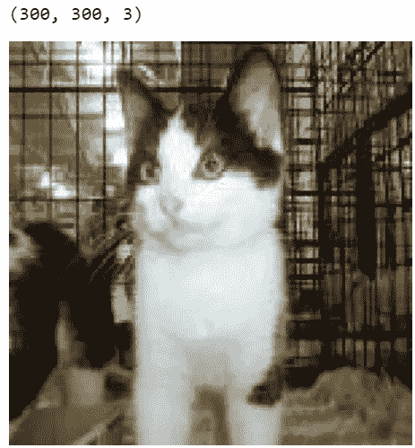
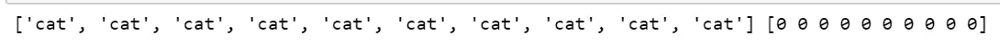
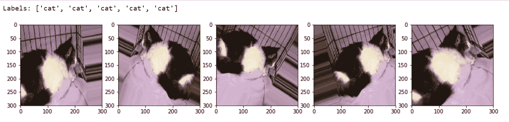
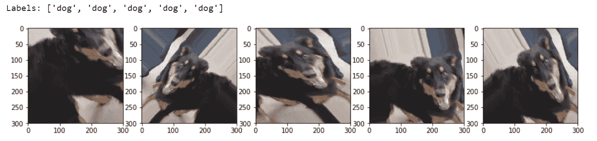
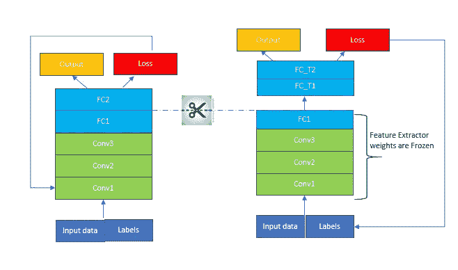
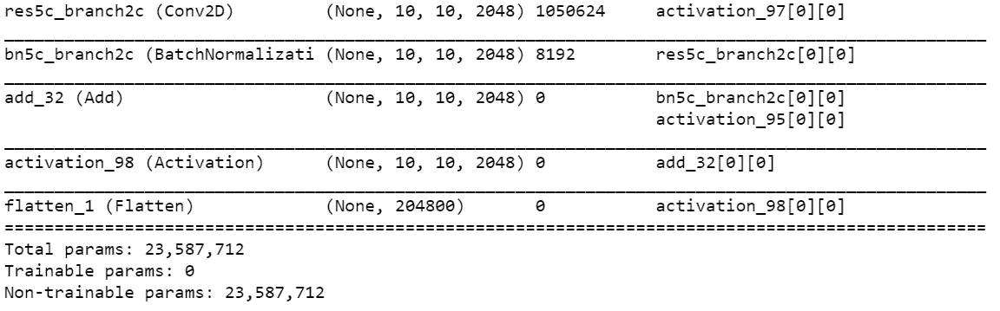
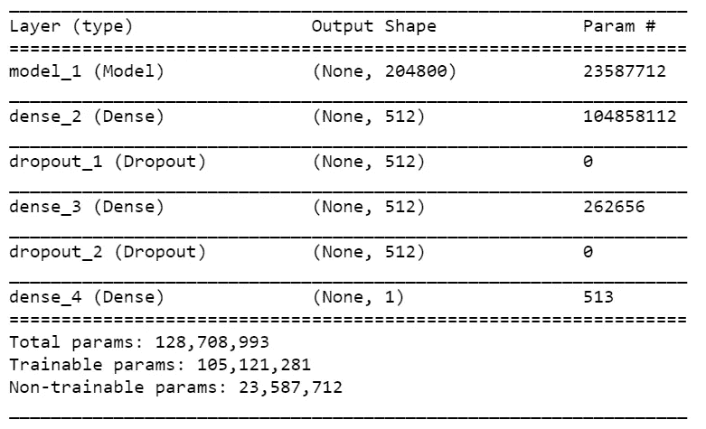
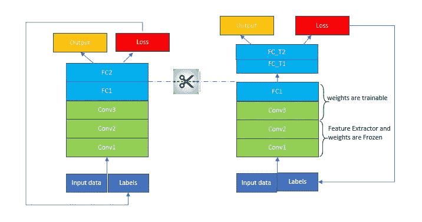
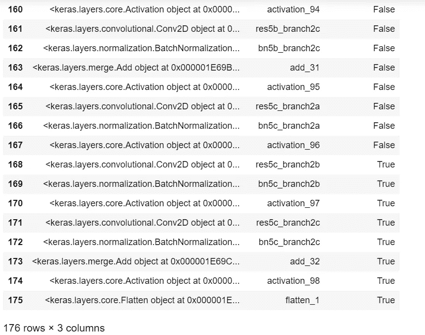
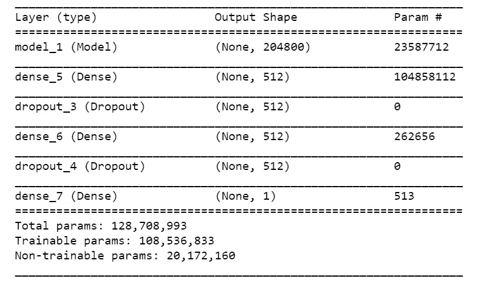

# 使用迁移学习的深度学习-用于 ResNet50 的 Python 代码

> 原文：<https://towardsdatascience.com/deep-learning-using-transfer-learning-python-code-for-resnet50-8acdfb3a2d38?source=collection_archive---------0----------------------->

这是本系列的第二部分，我们将使用 ResNet50 编写应用迁移学习的代码。在这里，我们将使用迁移学习，使用预训练的 ResNet50 模型，然后微调 ResNet50。

[迁移学习概念](https://medium.com/@arshren/deep-learning-using-transfer-learning-cfbce1578659)第一部分

对于代码实现，我们将使用 [ResNet50](https://github.com/keras-team/keras-applications/blob/master/keras_applications/resnet50.py) 。ResNet 是[残网](https://arxiv.org/pdf/1512.03385.pdf)的简称。这是一个 50 层的剩余网络

# ResNet50

当我们向深层神经网络添加更多层时，性能会变得停滞不前或开始下降。这是由于消失梯度问题造成的。当梯度通过深度神经网络反向传播并重复相乘时，这使得梯度非常小，从而导致消失梯度问题。

ResNet 通过使用**标识快捷连接或跳过一层或多层的跳过连接**解决了渐变消失的问题。S **快捷连接将第 N 层的输出连接到第 N+Z 层的输入**

我们将使用[猫狗数据集](https://www.kaggle.com/c/dogs-vs-cats/data)来演示迁移学习使用

*   预训练的 ResNet50 模型作为特征提取器
*   微调预训练模型 ResNet50

# 创建数据集

导入基本库。我们将在需要时导入额外的库

```
import glob
import numpy as np
import pandas as pd
import os
import shutil 
import matplotlib.pyplot as plt
from keras.preprocessing.image import ImageDataGenerator, load_img, img_to_array, array_to_img
%matplotlib inline
```

我已经把所有的猫和狗的图片保存在了 dogs-vs-cats 文件夹中。我们读了猫狗档案。我们有 25003 张猫和狗的图片

```
files = glob.glob('E:\\Data\\Images\\dogs-vs-cats\\*') 

cat_files = [fn for fn in files if 'cat' in fn] 
dog_files = [fn for fn in files if 'dog' in fn] 
len(cat_files), len(dog_files)
```

我在一个较小的数据集上进行训练，因此减少了我的训练、测试和验证数据集的大小。如果您想在所有图像上进行训练，则不需要此步骤。

训练数据集将具有每只猫和狗 1500 张图像，测试数据集将具有每只猫和狗 500 张图像，验证数据集也将具有每只猫和狗 500 张图像

```
cat_train = np.random.choice(cat_files, size=1500, replace=False) 
dog_train = np.random.choice(dog_files, size=1500, replace=False) 
cat_files = list(set(cat_files) — set(cat_train)) 
dog_files = list(set(dog_files) — set(dog_train)) 

cat_val = np.random.choice(cat_files, size=500, replace=False) 
dog_val = np.random.choice(dog_files, size=500, replace=False) 
cat_files = list(set(cat_files) — set(cat_val)) 
dog_files = list(set(dog_files) — set(dog_val)) 

cat_test = np.random.choice(cat_files, size=500, replace=False) 
dog_test = np.random.choice(dog_files, size=500, replace=False) 

print(‘Cat datasets:’, cat_train.shape, cat_val.shape, cat_test.shape) 
print(‘Dog datasets:’, dog_train.shape, dog_val.shape, dog_test.shape)
```

加载训练和验证数据集。我们的图像尺寸将是 300×300 像素

```
**IMG_WIDTH=300
IMG_HEIGHT=300
IMG_DIM = (IMG_WIDTH, IMG_HEIGHT)**train_files = glob.glob(‘E:\\Data\\Images\\dogs-vs-cats\\training_data\\*’)train_imgs = [img_to_array(load_img(img, target_size=IMG_DIM)) for img in train_files]
train_imgs = np.array(train_imgs)
train_labels = [fn.split(‘\\’)[-1].split(‘.’)[0].strip() for fn in train_files]validation_files = glob.glob(‘E:\\Data\\Images\\dogs-vs-cats\\validation_data\\*’)
validation_imgs = [img_to_array(load_img(img, target_size=IMG_DIM)) for img in validation_files]
validation_imgs = np.array(validation_imgs)
validation_labels = [fn.split(‘\\’)[-1].split(‘.’)[0].strip() for fn in validation_files]print(‘Train dataset shape:’, train_imgs.shape, 
 ‘\tValidation dataset shape:’, validation_imgs.shape)
```

现在，每个图像的大小为 300 x 300，并具有红色、绿色和蓝色(RGB)三个通道。

图像的像素值介于 0 和 255 之间。深度神经网络在较小的输入值下工作良好。用 0 到 1 之间的值缩放每个图像。

```
train_imgs_scaled = train_imgs.astype(‘float32’) 
validation_imgs_scaled = validation_imgs.astype(‘float32’) 
train_imgs_scaled /= 255 
validation_imgs_scaled /= 255 

# visualize a sample image 
print(train_imgs[0].shape) 
array_to_img(train_imgs[0]
```



对猫和狗的文本类别标签进行编码

```
# encode text category labels 
from sklearn.preprocessing import LabelEncoder 

le = LabelEncoder() 
le.fit(train_labels) 
train_labels_enc = le.transform(train_labels) 
validation_labels_enc = le.transform(validation_labels) 

print(train_labels[1495:1505], train_labels_enc[1495:1505])
```



## 将数据增强应用于图像

Keras 框架有一个优秀的实用工具，叫做 **ImageDataGenerator。**通过实时数据增强生成批量张量图像数据。

对于我们的训练和验证数据集，我们将使用 zoom_range 参数将图像随机缩放 0.3 倍。我们使用 rotation_range 参数将图像随机旋转 50 度。使用 width_shift_range 和 height_shift_range 参数，以图像宽度或高度的 0.2 倍水平或垂直随机平移图像。使用 shear_range 参数随机应用基于剪切的变换。使用 horizontal_flip 参数随机水平翻转一半的图像。在我们应用任何前面的操作(尤其是旋转或平移)之后，利用 fill_mode 参数为图像填充新的像素。在这种情况下，我们只是用最近的周围像素值填充新像素。

```
train_datagen = ImageDataGenerator(rescale=1./255, zoom_range=0.3, rotation_range=50,
 width_shift_range=0.2, height_shift_range=0.2, shear_range=0.2, 
 horizontal_flip=True, fill_mode=’nearest’)val_datagen = ImageDataGenerator(rescale=1./255)
```

让我们看看一些增强图像是什么样子的。我们将从我们的训练数据集中选取两个样本图像来说明这一点。第一个图像是猫的图像，第二个图像是狗的图像

```
img_id = 2500
cat_generator = train_datagen.flow(train_imgs[img_id:img_id+1], 
 train_labels[img_id:img_id+1], 
 batch_size=1) 
cat = [next(cat_generator) for i in range(0,5)] 
fig, ax = plt.subplots(1,5, figsize=(16, 6))print(‘Labels:’, [item[1][0] for item in cat]) 
l = [ax[i].imshow(cat[i][0][0]) for i in range(0,5)]
```



```
img_id = 4001 
dog_generator = train_datagen.flow(train_imgs[img_id:img_id+1], 
 train_labels[img_id:img_id+1], 
 batch_size=1) 
dog = [next(dog_generator) for i in range(0,5)] 
fig, ax = plt.subplots(1,5, figsize=(15, 6)) 
print(‘Labels:’, [item[1][0] for item in dog]) 
l = [ax[i].imshow(dog[i][0][0]) for i in range(0,5)]
```



对于我们的测试生成器，我们需要将原始测试图像发送给模型进行评估。我们只是在 0 和 1 之间缩放图像像素，并且不应用任何变换。

我们只是将图像增强变换仅应用于我们的训练集图像和验证图像

```
train_generator = train_datagen.flow(train_imgs, train_labels_enc,batch_size=30)val_generator = val_datagen.flow(validation_imgs, validation_labels_enc, batch_size=30)
```

# 使用预训练模型作为特征提取器的迁移学习

我们使用 ResNet50 深度学习模型作为迁移学习的特征提取的预训练模型。

*   为了实现迁移学习，我们将删除预训练 ResNet50 模型的最后一个预测层，并用我们自己的预测层来替换它们。FC-T1 和 FC_T2 如下所示
*   使用 ResNet50 预训练模型的权重作为特征提取器
*   预训练模型的权重被冻结，并且在训练期间不被更新



我们不想加载充当分类器的最后完全连接的层。我们通过使用“ **include_top=False** ”来实现这一点。我们这样做是为了**我们可以在 ResNet50 模型之上添加我们自己的全连接层，用于我们的特定任务分类。**

**我们通过设置可训练为“假”来冻结模型的权重**。这将在训练期间停止对预训练权重的任何更新。我们不希望训练 ResNet 层，因为我们希望利用深度神经网络从以前的数据集(在我们的情况下是“imagenet ”)中训练的知识

```
from keras.applications.resnet50 import ResNet50
from keras.models import Model
import keras**restnet = ResNet50(include_top=False, weights='imagenet', input_shape=(IMG_HEIGHT,IMG_WIDTH,3))**output = restnet.layers[-1].output
output = keras.layers.Flatten()(output)restnet = Model(restnet.input, output=output)for layer in restnet.layers:
    **layer.trainable = False**restnet.summary()
```



ResNet50 with 23, 587,712 frozen weights

现在，我们使用迁移学习，通过添加我们自己的全连接层和使用 sigmoid 激活函数的最终分类器，使用预训练的 ResNet50 来创建我们的模型。

```
from keras.layers import Conv2D, MaxPooling2D, Flatten, Dense, Dropout, InputLayer
from keras.models import Sequential
from keras import optimizersmodel = Sequential()
model.add(restnet)
model.add(Dense(512, activation='relu', input_dim=input_shape))
model.add(Dropout(0.3))
model.add(Dense(512, activation='relu'))
model.add(Dropout(0.3))
model.add(Dense(1, activation='sigmoid'))model.compile(loss='binary_crossentropy',
              optimizer=optimizers.RMSprop(lr=2e-5),
              metrics=['accuracy'])
model.summary()
```



我们看到 ResNet50 的重量是不可训练的，因为我们已经冻结了它们。

我们现在运行这个模型

```
history = model.fit_generator(train_generator, 
                              steps_per_epoch=100, 
                              epochs=100,
                              validation_data=val_generator, 
                              validation_steps=50, 
                              verbose=1)
```

保存训练过的重量

```
model.save(‘cats_dogs_tlearn_img_aug_cnn_restnet50.h5’)
```

# 微调预先训练的模型

*   我们可以使用深度神经网络，如 VGG-16，VGG-19，Inception V3，ResNet-50，Xception 作为预训练模型
*   为了实现带有微调的迁移学习，我们删除了预训练模型的最后一个预测层，并用我们自己的预测层来替换它们。FC-T1 和 FC_T2 如下所示。
*   网络的初始较低层从预先训练的模型中学习非常一般的特征。为了实现这一点，预训练模型的初始层权重被冻结，并且在训练期间不被更新
*   较高层用于学习特定任务的特征。预训练模型的更高层是可训练的或可微调的
*   用更少的培训时间提高绩效



我们已经用图像增强创建了数据集，并且我们已经创建了基本的 ResNet50 模型。

我们现在将使用 ResNet50 通过图像增强来微调迁移学习。我们通过解冻一些最后的卷积块，同时保持最初的早期 conv 块冻结来实现这一点。这将有助于我们使用早期图层学习非常通用的功能。预训练模型的更高层将是可训练的或微调的。

```
restnet.trainable = Trueset_trainable = Falsefor layer in restnet.layers:
    if layer.name in ['res5c_branch2b', 'res5c_branch2c', 'activation_97']:
        set_trainable = True
    if set_trainable:
        layer.trainable = True
    else:
        layer.trainable = Falselayers = [(layer, layer.name, layer.trainable) for layer in restnet.layers]
pd.DataFrame(layers, columns=['Layer Type', 'Layer Name', 'Layer Trainable'])
```



我们看到，我们已经将 ResNet50 的早期层的训练设置为 false，ResNet50 的最后几层现在是可训练的。

我们现在在 ResNet50 上添加我们自己的全连接层和分类器。我们已经从 ResNet50 中移除了最后一个完全连接的层和分类器层

```
from keras.layers import Conv2D, MaxPooling2D, Flatten, Dense, Dropout, InputLayer
from keras.models import Sequential
from keras import optimizersmodel_finetuned = Sequential()
model_finetuned.add(restnet)
model_finetuned.add(Dense(512, activation='relu', input_dim=input_shape))
model_finetuned.add(Dropout(0.3))
model_finetuned.add(Dense(512, activation='relu'))
model_finetuned.add(Dropout(0.3))
model_finetuned.add(Dense(1, activation='sigmoid'))model_finetuned.compile(loss='binary_crossentropy',
              optimizer=optimizers.RMSprop(lr=1e-5),
              metrics=['accuracy'])model_finetuned.summary()
```



我们最终运行了这个模型

```
history_1 = model_finetuned.fit_generator(train_generator, 
                                  steps_per_epoch=100, 
                                  epochs=2,
                                  validation_data=val_generator, 
                                  validation_steps=100, 
                                  verbose=1)
```

保存微调模型的权重

```
model.save(‘cats_dogs_tlearn_finetune_img_aug_restnet50.h5’)
```

## 参考资料:

关于迁移学习的调查

[一份全面的实践指南，旨在将学习转化为深度学习中的实际应用](/a-comprehensive-hands-on-guide-to-transfer-learning-with-real-world-applications-in-deep-learning-212bf3b2f27a)

[GitHub 用 Python 进行实际迁移学习](https://github.com/dipanjanS/hands-on-transfer-learning-with-python/blob/master/notebooks/Ch05%20-%20Unleash%20the%20Power%20of%20Transfer%20Learning/CNN%20with%20Transfer%20Learning.ipynb)