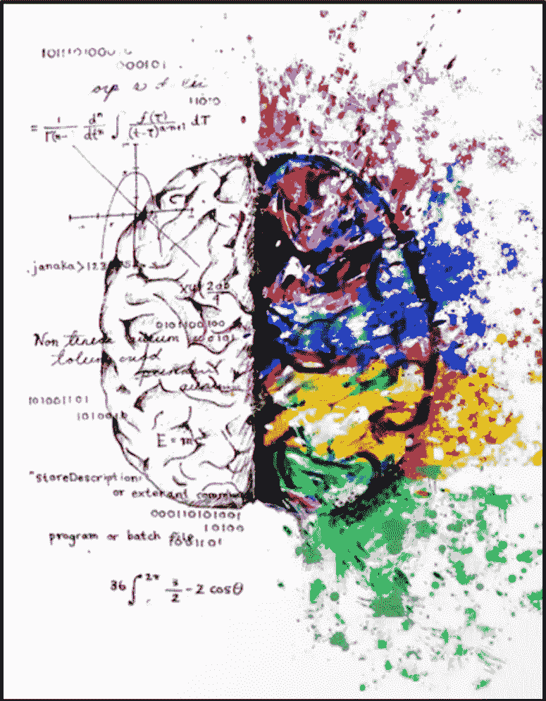
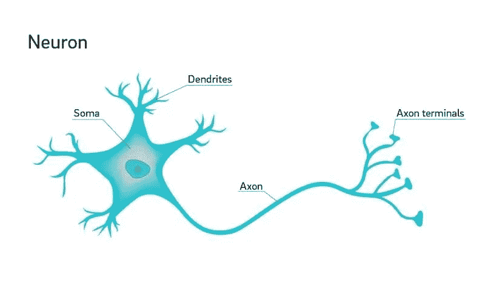
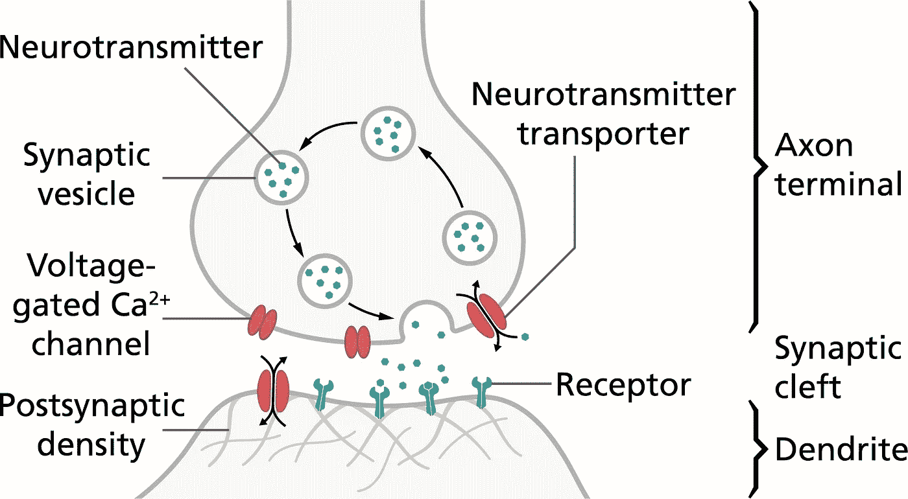
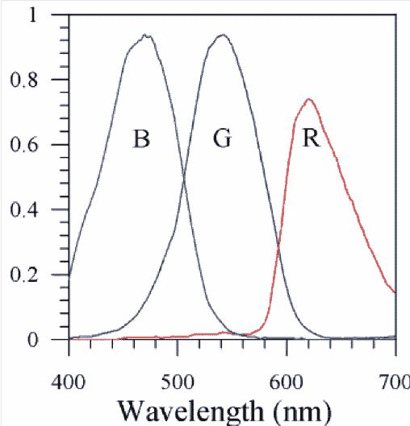
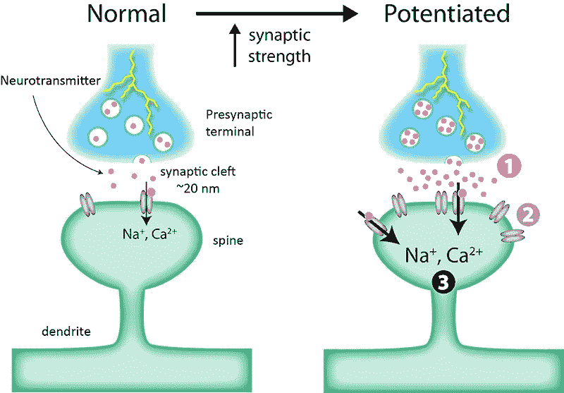
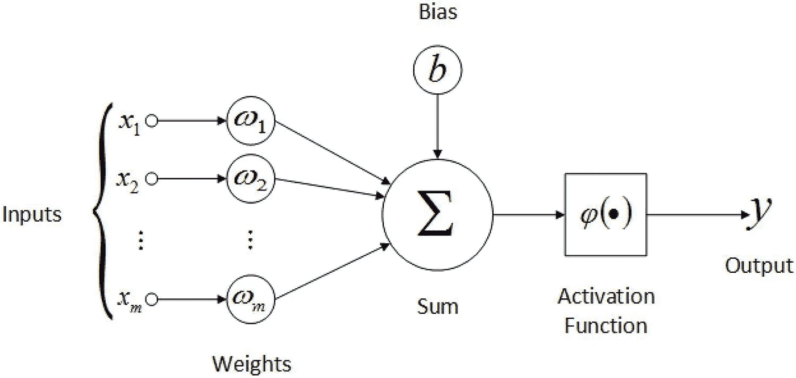
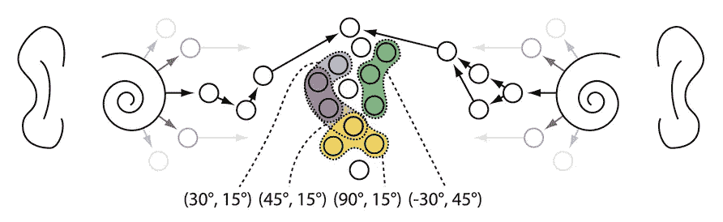
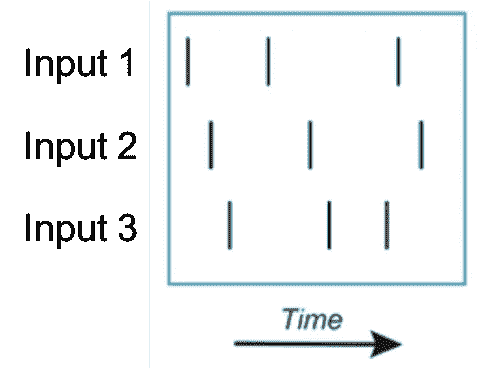

# 深度学习神经元与生物神经元

> 原文：<https://towardsdatascience.com/deep-learning-versus-biological-neurons-floating-point-numbers-spikes-and-neurotransmitters-6eebfa3390e9?source=collection_archive---------6----------------------->

## [内部 AI](https://medium.com/towards-data-science/inside-ai/home)

## 浮点数、尖峰和神经递质

[*Conjoined Dichotomy*](https://society6.com/product/conjoined-dichotomy_print) by [Melting Miltons](https://society6.com/meltingmiltons)

近年来，“深度学习”人工智能模型经常被吹捧为“像大脑一样工作”，因为它们由模仿生物大脑的人工神经元组成。然而，从神经科学家的角度来看，深度学习神经元和生物神经元之间的差异是众多而明显的。在这篇文章中，我们将首先描述生物神经元的一些关键特征，以及如何简化它们以获得深度学习神经元。然后，我们将推测这些差异如何对深度学习网络施加限制，以及朝着更现实的生物神经元模型的移动可能如何推进我们目前所知的人工智能。

# 生物神经元

典型的生物神经元是单独的细胞，每个细胞由细胞主体和从该主体延伸的许多卷须组成。身体，或*体细胞*，拥有维持基本细胞功能和能量处理的机器(例如，含 DNA 的细胞核，以及构建蛋白质和处理糖和氧的细胞器)。卷须有两种类型:*树突*，从其他神经元接收信息并将其带到细胞体，以及*轴突*，将信息从细胞体发送到其他神经元。

从发送神经元到接收神经元的信息传输大致由三个阶段组成。首先，传输神经元产生空间和时间受限的电爆发，或*尖峰*，它沿着神经元的轴突(和轴突分支)从细胞体传播到轴突的末端。发送神经元的轴突末端通过*突触*与接收神经元的树突“连接”。尖峰信号导致传输神经元的突触释放化学物质，或*神经递质*，通过扩散在两个神经元之间进行短距离传播。

接收神经元上的专门受体识别(结合)特定的神经递质，当神经递质分子结合到受体上时，引发许多细胞事件(本文忽略了其中的大部分)。其中一个事件是细胞通道的打开，这引发了另一个电波，这一次通过接收神经元的树突向其细胞体传播(这可能是一种尖峰信号的形式，但通常该波比沿轴突的尖峰信号传输更具空间扩散性——想象一下水被推过管道)。

因此，来自一个神经元的信息可以传递到另一个神经元。当一个神经元从多个传输神经元接收到多个*兴奋性*尖峰时，该电能在神经元的细胞体中积累，如果在短时间内积累了足够的能量，该神经元将产生自己的传出尖峰，并将它们中继给其他神经元。

为了理解将我们从生物神经元带到深度学习神经元的建模，还有三个方面需要讨论。

*   速率编码
*   突触强度
*   兴奋性和抑制性传递

## **码率编码**

只接收少量兴奋性尖峰信号的神经元，即使有，也只会产生和发送少量自己的尖峰信号。如果同一个神经元接收到许多兴奋性尖峰信号，它(通常)也会发出许多自己的尖峰信号。虽然生物神经元中的尖峰具有明显的时间特性，但在深度学习神经元中，时间分辨率是“模糊的”。对于给定的时间单位，深度学习神经元的尖峰活动被表示为尖峰的数量(一个整数)，或者更典型地，平均尖峰率(一个*浮点数*)。

In this contrived example, three neurons in the visual system receive indirect input from one of three groups of color-sensitive cones cells in the eye. Each neuron is therefore maximally responsive to a particular wavelength of light, and spiking activity is reported as the average spike rate (normalized to [0,1]). Thus, the input wavelength is “encoded” by the collective spike rates of the three neurons.

然而，请注意，在生物神经元中，信息是以单个或多个神经元中尖峰脉冲的相对时间来编码的，而不仅仅是以单个神经元的尖峰脉冲速率来编码的。因此，深度学习神经元中不存在这种类型的信息编码和传输。这种影响将在下面进一步讨论。

## **突触强度**

并非所有的尖峰都是相等的。当传播的尖峰到达轴突末端时，最终在接收神经元的树突中产生的电能数量取决于干预突触的*强度*。这种强度反映了许多潜在的生理因素，包括传输神经元中可用于释放的神经递质的量和接收神经元上神经递质受体的数量。

无论如何，在深度学习神经元中，突触强度由单个浮点数表示，更常见的是指突触的*权重*。

## 兴奋性和抑制性神经递质

到目前为止，我们只考虑了兴奋性神经传递。在这种情况下，从发送神经元接收的尖峰增加了接收神经元也将产生尖峰的可能性。这是由于接收神经元上激活的受体的特殊性质。虽然过于简单，但人们可以将神经递质及其受体分为兴奋类和抑制类。当抑制性神经递质与抑制性受体结合时，接收神经元中树突的电能减少而不是增加。一般来说，神经元对兴奋性和抑制性神经递质都有受体，但只能释放(传递)其中一种。在哺乳动物皮层中，兴奋性神经元(在每个尖峰时释放神经递质谷氨酸)比抑制性神经元(在每个尖峰时释放神经递质 GABA)多得多。尽管如此，这些抑制性神经元对于增加接收神经元的信息选择性、关闭神经元从而有助于信息路由以及防止癫痫活动(网络中许多神经元的混沌放电)是重要的。

在深度学习网络中，兴奋性和抑制性神经元(分别只有兴奋性或抑制性神经递质的神经元)之间没有区别。所有神经元的输出活动都大于零，而正是突触模拟了抑制。突触的权重允许为负，在这种情况下，来自传输神经元的输入导致接收神经元的输出减少。

# **深度学习神经元**

如上所述，生物神经元的简化模型可以被组装以形成深度学习模型中的原型神经元。

1.  深度学习神经元从其他神经元接收输入，或*激活*。激活是生物神经元峰值的速率编码表示。
2.  激活被突触权重倍增。这些权重是生物神经元中突触强度的模型，也是抑制性传递的模型，因为权重可能呈现负值。
3.  加权激活相加在一起，模拟发生在生物神经元细胞体中的累积过程。
4.  将偏差项添加到总和中，模拟神经元的一般灵敏度。
5.  最后，总和值由一个激活函数整形，通常是一个限制最小或最大输出值(或两者)的函数，如 sigmoid 函数。这模拟了生物神经元的固有最小尖峰率(零)或最大速率(由于产生尖峰的生理机制的细节)。

# 推进人工智能

## **时间编码**

深度学习依赖于基于速率的编码，其中每个神经元的激活都是一个单一的数值，它模拟了响应给定刺激(无论是来自其他神经元还是来自外部刺激)的平均尖峰率。在网络的单个层内的尖峰率值的集合通常被组织为数字向量，并且该向量被称为在该层的外部刺激的*表示*。

基于速率的神经编码的*表达能力*远低于基于多个神经元上尖峰脉冲之间的相对时间的神经编码(表示)的表达能力。作为生物学中这种类型代码存在的一个简单例子，考虑听觉系统。当声波到达我们的耳朵时，我们的大脑对它们进行处理，以确定产生声音的动物、物体或现象的类型，还可以估计声音来自的方向(*定位*)。确定声音位置的一种方法是基于这样的事实，即来自右边的声音将首先到达右耳，然后到达左耳。靠近右耳和左耳的听觉神经元表现出反映这种声学定时差异的尖峰定时。由于这种时间编码，位于更中间位置(靠近身体中线)的听觉神经元接收来自双耳附近神经元的输入，并对声音的位置具有选择性。

Acoustic information enters the brain via the outer ears, and is transduced to spikes in the auditory nerves by the left and right cochleas (spirals in the image). Perception of azimuth location is partly determined by time-difference-of-arrival of sounds at the ears, which is encoded as timing differences in spikes in auditory neurons in the left versus right side of the brain. Groups of auditory neurons near the midline of body are sensitive to this temporal coding, and respond selectively to the perceived location (azimuth, elevation) of an incoming sound.

更一般地，考虑一个简单的例子，单个神经元从另外两个神经元接收输入，每个神经元发送相同的输入:一个短串 *N* 均匀间隔(在时间上)的兴奋性尖峰超过 100 毫秒。所有其他条件相同，这将在接收神经元中产生一些刻板反应。相反，如果一个输入神经元在(100 毫秒间隔的)第一个 20 毫秒内发送了它的所有尖峰，而另一个输入神经元在最后的 20 毫秒内发送了它的所有尖峰，则接收神经元的响应可能显著不同。因此，即使输入神经元的尖峰率在每个场景中是相同的(10 *N* 尖峰/秒),时间编码也是非常不同的，并且接收神经元的响应也可以是非常不同的。重要的是，*当使用时间码*时，可以存在许多输入-输出组合，即使输入尖峰的数量低、恒定或两者都有。这就是我们所说的更有表现力的编码方案。关于人工智能，与具有相同数量神经元的深度学习模型相比，利用时间编码的模型可以执行更复杂的任务。

Consider a neuron that receives input from one neuron. The image above represents three example spike sequences (spikes are depicted as vertical lines) from the input neuron. Under a rate-based coding model like that of deep learning, the output of the receiving neuron would be the same in each example (because the input would be identical in each case: 3 spikes/time-unit). In the case of a temporal coding, the output could be different for each example, accommodating a more expressive AI model.

除了表达性之外，棘波时序的差异可以允许模型通过模拟生物学的方式进行学习——例如，突触的[棘波时序依赖性可塑性(STDP)](https://en.wikipedia.org/wiki/Spike-timing-dependent_plasticity) 。与深度学习中使用的梯度下降([反向传播](https://medium.com/coinmonks/backpropagation-concept-explained-in-5-levels-of-difficulty-8b220a939db5))方法相比，这种学习可以在本地高效地实现。但是我们将把这个话题留到以后的文章中讨论。

## 抑制神经元

基于我们对生物和深度学习神经元的简单描述，兴奋性和抑制性神经元之间的区别可以被深度学习神经元模仿。也就是说，人们可以简单地通过确保其深度学习等效物在其轴突和其投射到的神经元树突之间的所有突触权重都为负值来模仿生物抑制性神经元。相反，当模仿生物兴奋性神经元时，这种突触应该总是具有正权重。然而，如果简单地要求*所有的*突触都是正值(可能通过在每次训练迭代后对权重应用 ReLU 函数)，并且使用为抑制(兴奋)神经元产生负(正)值的激活函数，那么训练和实现将会更容易。

[技术方面:在任何一种情况下，由于权重的零值梯度等于零，可能会有额外的训练挑战。与*激活*函数中的 ReLU 非线性不同，我们不能依靠随机梯度下降(随机选择的样本批次)将权重值推离零。]

为什么人们会想要抑制神经元呢？为什么不像目前的深度学习模型那样，只在突触层面而不是神经元层面实施抑制？

这并不确定，但一种可能性是，使用显式抑制神经元有助于约束整体参数空间，同时允许促进快速学习的子网络结构的进化或发展。在生物系统中，大脑没有必要能够学习任何输入输出关系，或者执行任何可能的尖峰序列。我们生活在一个有着固定物理法则的世界里，有些物种的个体成员共享许多不需要明确学习的物种内行为特征。限制网络的可能电路连通性和动态活动等同于限制训练方法必须搜索的解决方案空间。鉴于此，一种推进人工智能的方法是使用[神经进化](https://en.wikipedia.org/wiki/Neuroevolution)和[人工生命](https://en.wikipedia.org/wiki/Artificial_life)方法来搜索兴奋性和抑制性神经元的典型子网络结构，这些子网络结构可以在更传统的模型训练中模块化地组装成更大的网络(例如，通过梯度下降的监督学习)。

抑制性神经元的另一个潜在好处，与刚才提到的结构化规范电路的使用有关，是抑制性神经元可以有效地“关闭”大量对给定样本或任务的处理不必要的神经元，从而降低能量需求(假设硬件被设计为利用这种情况)。此外，如果网络结构合理，这可能有助于此类网络中的[信息路由](https://binarycognition.com/portfolio/dynamic-routing-in-neural-networks/)——从概念上讲，将信息从提取信息的神经元携带到使用/根据该信息执行特定子任务的神经元。例如，将低级视觉信息(像素、线或弧)路由到提取对象身份的区域、确定相对对象位置的区域或两者。

## 基于低能耗尖峰的硬件

更大的生物现实主义可以使人工智能受益的另一种方式不是通过扩展基本能力，而是通过更高的能效。人类大脑仅消耗大约 [13 瓦](https://www.scientificamerican.com/article/thinking-hard-calories/)——相当于一个现代的紧凑型荧光灯泡——而提供的认知能力远远超过为移动应用设计的[低能耗 GPU](https://devblogs.nvidia.com/jetson-tx2-delivers-twice-intelligence-edge/)，甚至是在强大的工作站 GPU 上实现的高能耗深度学习模型[。](https://ieeexplore.ieee.org/document/7723730)

即使除了这些节能之外，深度学习神经元没有其他根本性的变化，利用约 1000*亿*神经元和 100–1000*万亿*突触(对[人脑](http://www.human-memory.net/brain_neurons.html)的粗略估计)的能力可能会显著提高人工智能的功能。或者，当前的模型可以以一小部分能源成本运行，使它们可以在边缘轻松实现，因为处理可以在本地完成，而不是将原始数据无线传输到云进行处理(无线传输是一个显著的能源消耗)。

相对于传统的计算硬件，生物神经元的能量效率主要是由于这些神经元的两个特征。首先，生物神经元只传输模拟能量的短脉冲(尖峰),而不是保持代表单个浮点数或整数的许多位。在传统硬件中，这些位需要持续的能量流来维持 0 或 1 状态，除非使用慢得多的存储器类型(非易失性 RAM)。

第二，在生物神经元中，记忆和处理位于同一位置。也就是说，突触强度是网络的长期记忆(递归连接可以维持短期记忆，但那是其他一些帖子的话题)，它们参与了处理(棘波加权和传输)，并且与处理的其他方面(细胞体中的能量积累)非常接近。相比之下，传统硬件定期将位从 RAM 传输到处理器，这是一段相当长的距离和相当大的能量消耗。

许多研究实验室和私人公司正在致力于提供这些好处的新型硬件。前景各不相同，但我们可能会在十年内看到可行的、商业化的基于忆阻器的硬件。应该注意的是，迄今为止，基于[脉冲的算法](https://arxiv.org/abs/1804.08150)在性能上略逊于基于深度学习神经元的算法。然而，一旦相关硬件的可用性变得明显，利用大量神经元的能力以及对基于尖峰信号的算法的研究量的增加，可能会扭转这种状况。

# 结论

在我们看来，深度学习模型和生物大脑之间的相似性近年来被许多媒体文章大大夸大了。尽管如此，神经科学家和许多人工智能研究人员都很清楚这些差异，并正在努力为人工智能模型带来更大的神经现实主义，希望超越我们可能正在走向的[深度学习高原](https://www.technologyreview.com/s/608911/is-ai-riding-a-one-trick-pony/)。

我们已经忽略了生物和深度学习神经元之间的许多其他差异，这些差异可能解释了哺乳动物智能和当前人工智能之间的巨大差异。这些神经元网络的差异也很关键。请关注我们未来关于网络中的“真实”[重现](https://binarycognition.com/2019/02/08/recurrence-in-biological-and-artificial-networks/)、网络[微观和宏观架构](https://binarycognition.com/2019/02/08/network-architectures/)以及其他主题的帖子。