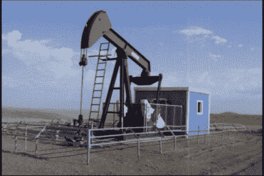
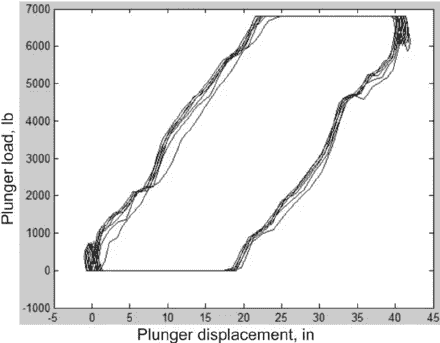
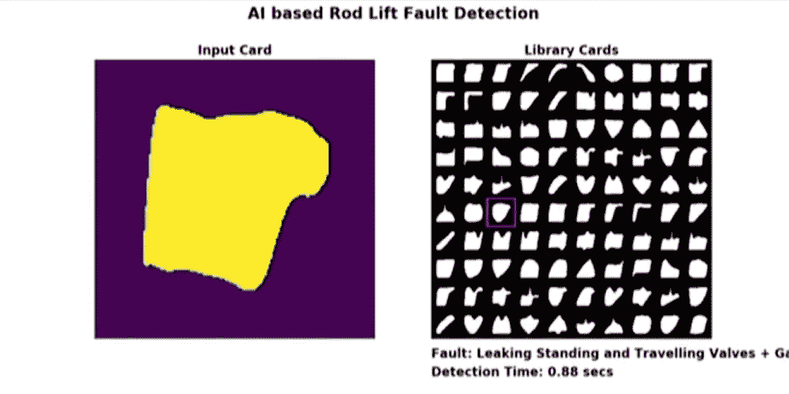
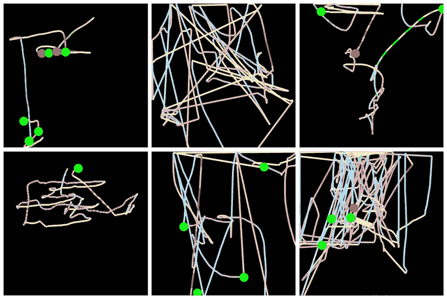

# 非视觉任务的深度学习视觉

> 原文：<https://towardsdatascience.com/deep-learning-vision-non-vision-tasks-a809df74d6f?source=collection_archive---------17----------------------->

## 了解创造性数据处理如何允许将深度学习视觉的全部功能用于非视觉任务。

# 介绍

近年来，深度学习彻底改变了计算机视觉。感谢[转移学习](https://machinelearningmastery.com/transfer-learning-for-deep-learning/)和[惊人的](https://course.fast.ai/)学习资源，任何人都可以在几天甚至几个小时内获得最先进的结果，通过使用预先训练的模型并根据您的领域进行调整。随着深度学习变得商品化，需要的是它在不同领域的创造性应用。

今天，计算机视觉中的深度学习已经在很大程度上解决了视觉对象分类、对象检测和识别。在这些领域，深度神经网络的表现优于人类。

即使你的数据不是可视化的，你仍然可以利用这些视觉深度学习模型的力量，主要是[CNN](https://en.wikipedia.org/wiki/Convolutional_neural_network)。要做到这一点，您必须将非视觉领域的数据转换为图像，然后使用在图像上训练的模型之一来处理您的数据。你会惊讶于这种方法有多么强大！

在这篇文章中，我将展示 3 个公司创造性地使用深度学习的案例，将视觉深度学习模型应用到非视觉领域。在这些情况中的每一个中，非计算机视觉问题都被转换并以这样的方式陈述，以便利用适合于图像分类的深度学习模型的能力。

# 案例 1:石油行业

[游梁泵](https://www.google.com/search?q=beam+pump)常用于石油工业，从地下提取石油和天然气。它们由一台连接在活动横梁上的发动机驱动。游梁将发动机的旋转运动转换为抽油杆的垂直往复运动，抽油杆充当泵并将油输送到地面。

A walking beam pump, also known as pumpjack. [Source](https://commons.wikimedia.org/wiki/File:Pump_jack_animation.gif).

同任何复杂的机械系统一样，游梁式抽油机容易出现故障。为了帮助诊断，测力计被连接到抽油杆上，用于测量抽油杆上的载荷。测量后，绘制出测功机泵卡，显示发动机旋转循环各部分的负载。

An example dynamometer card. [Source](https://www.researchgate.net/profile/Oj_Romero/publication/274264607/figure/fig12/AS:294868048990209@1447313429071/Downhole-dynamometer-card-for-non-anchored-tubing-and-a-rod-string-length-equal-to-4-800.png).

当游梁泵出现问题时，示功图会改变形状。通常会邀请专业技术人员来检查卡，并判断泵的哪个部分出现故障以及需要采取什么措施来修复。这一过程非常耗时，需要非常有限的专业知识才能有效解决。

另一方面，这个过程看起来可以自动化，这就是为什么经典的机器学习系统被尝试但没有取得好的结果，大约 60%的准确率。

将深度学习应用于该领域的公司之一是贝克休斯。在他们的案例中，示功图被转换成图像，然后用作 Imagenet 预训练模型的输入。结果非常令人印象深刻——通过采用一个预训练的模型并用新数据对其进行微调，准确率从 60%上升到 93%。在进一步优化模型训练后，他们能够达到 97%的准确率。

An example of a system deployed by Baker Hughes. On the left, you can see the input image, and on the right is a real-time classification of failure mode. The system runs on a portable device, and classification time is shown in the lower right corner. [Source](https://youtu.be/6_kdEguYwwg?t=1692).

它不仅击败了以前基于经典机器学习的方法，而且公司现在可以更加高效，因为不需要光束泵技术人员花时间来诊断问题。他们可以马上来修理机械故障。

要了解更多信息，您还可以阅读讨论类似方法的论文。

# 案例 2:在线欺诈检测

计算机用户在使用计算机时有独特的模式和习惯。浏览网站时使用鼠标的方式或撰写电子邮件时使用键盘的方式都是独一无二的。

在这种特殊情况下，Splunk 通过使用用户使用计算机鼠标的方式解决了用户分类的问题。如果您的系统可以根据鼠标使用模式唯一识别用户，那么这可以用于欺诈检测。想象以下情况:欺诈者窃取某人的登录名和密码，然后使用它们登录并在网上商店进行购买。他们使用计算机鼠标的方式对他们来说是独一无二的，系统将很容易检测到这种异常情况，防止欺诈性交易的发生，并通知真正的账户所有者。

使用特殊的 Javascript 代码，可以收集所有的鼠标活动。该软件每隔 5-10 毫秒记录一次鼠标活动。因此，每个用户的数据可能是每个用户每页 5000–10000 个数据点。这些数据代表了两个挑战:第一个是每个用户都有大量数据，第二个是每个用户的数据集将包含不同数量的数据点，这不是很方便，因为通常不同长度的序列需要更复杂的深度学习架构。

解决方案是将每个用户在每个网页上的鼠标活动转换成一个单独的图像。在每幅图像中，鼠标移动由一条线表示，该线的颜色对鼠标速度进行编码，左右点击由绿色和红色圆圈表示。这种处理初始数据的方式解决了两个问题:首先，所有图像的大小都相同，其次，现在基于图像的深度学习模型可以与这些数据一起使用。

In each image, mouse movements are represented by a line whose color encodes mouse speed and left and right clicks are represented by green and red circles. [Source](https://www.splunk.com/blog/2017/04/18/deep-learning-with-splunk-and-tensorflow-for-security-catching-the-fraudster-in-neural-networks-with-behavioral-biometrics.html).

Splunk 使用 TensorFlow + Keras 构建了一个深度学习系统，用于对用户进行分类。他们进行了两个实验:

1.  对金融服务网站的用户进行分组分类—访问相似页面的普通客户与非客户。2000 幅图像的相对较小的训练数据集。在训练基于 VGG16 的修改架构仅 2 分钟后，系统能够以超过 80%的准确度识别这两个类别。
2.  用户的个体分类。任务是为一个给定的用户做出一个预测，它是这个用户还是一个模仿者。只有 360 张图像的非常小的训练数据集。基于 VGG16，但进行了修改，以考虑到小数据集并减少过度拟合(可能是丢弃和批量标准化)。经过 3 分钟的训练，准确率达到了大约 78%，考虑到这项任务的挑战性，这是非常令人印象深刻的。

要了解更多信息，请参考描述系统和实验的[全文](https://www.splunk.com/blog/2017/04/18/deep-learning-with-splunk-and-tensorflow-for-security-catching-the-fraudster-in-neural-networks-with-behavioral-biometrics.html)。

# 案例 3:鲸鱼的声学探测

在这个例子中，谷歌使用卷积神经网络来分析音频记录，并在其中检测座头鲸。这对于研究目的是有用的，例如跟踪单个鲸鱼的运动，歌曲的属性，鲸鱼的数量等。有趣的不是目的，而是数据如何被处理以用于卷积神经网络，卷积神经网络需要图像。

将音频数据转换成图像的方法是使用[频谱图](https://en.wikipedia.org/wiki/Spectrogram)。频谱图是音频数据基于频率的特征的可视化表示。

An example of a spectrogram of a male voice saying “nineteenth century”. [Source](https://commons.wikimedia.org/wiki/Category:Voice_spectrograms).

在将音频数据转换为频谱图后，谷歌研究人员使用了一种 [ResNet-50](https://arxiv.org/abs/1512.03385) 架构来训练模型。他们能够实现以下性能:

*   90% [精度](https://en.wikipedia.org/wiki/Precision_and_recall) : 90%被归类为鲸鱼歌曲的音频片段被正确分类
*   回想一下:给定一段鲸鱼歌曲的录音，有 90%的可能会被贴上这样的标签。

这个结果非常令人印象深刻，肯定会对鲸鱼研究人员有所帮助。

让我们把注意力从鲸鱼转移到处理音频数据时你能做什么。创建声谱图时，您可以选择要使用的频率，这取决于您拥有的音频数据的类型。你会希望人类讲话、座头鲸歌曲或工业设备录音使用不同的频率，因为在所有这些情况下，最重要的信息都包含在不同的频带中。您必须使用您的领域知识来选择参数。例如，如果您正在处理人类语音数据，那么您的首选应该是一个[梅尔倒谱](https://en.wikipedia.org/wiki/Mel-frequency_cepstrum)频谱图。

有一些很好的软件包可以处理音频。 [Librosa](https://librosa.github.io/librosa/) 是一个免费的音频分析 Python 库，可以使用 CPU 生成频谱图。如果你在 TensorFlow 中开发，想在 GPU 上做谱图计算，那也是[可能的](https://www.tensorflow.org/api_guides/python/contrib.signal#Computing_spectrograms)。

请参考最初的谷歌人工智能博客[文章](https://ai.googleblog.com/2018/10/acoustic-detection-of-humpback-whales.html)以了解更多关于谷歌如何处理座头鲸数据的信息。

# 结论

总而言之，本文中概述的一般方法遵循两个步骤。首先，找到一种方法将你的数据转换成图像，其次，使用预训练的卷积网络或从头开始训练一个。第一步比第二步更难，这是你必须有创造力的地方，并思考你拥有的数据是否可以转换成图像。我希望我提供的例子能够对解决您的问题有所帮助。如果你有其他的例子或问题，请写在下面的评论里。

# 参考

1.  [面向石油&天然气的物联网——大数据和 ML 的力量(Cloud Next](https://youtu.be/6_kdEguYwwg?t=1692) '18)
2.  [利用人工神经网络预测游梁式抽油机示功图](https://www.knepublishing.com/index.php/KnE-Engineering/article/download/3083/6587)
3.  [Splunk 和 Tensorflow 的安全性:利用行为生物识别技术捕捉欺诈者](https://www.splunk.com/blog/2017/04/18/deep-learning-with-splunk-and-tensorflow-for-security-catching-the-fraudster-in-neural-networks-with-behavioral-biometrics.html)
4.  [使用卷积神经网络对座头鲸进行声学检测](https://ai.googleblog.com/2018/10/acoustic-detection-of-humpback-whales.html)

*原载于我的网站*[*pechyonkin . me*](https://pechyonkin.me/deep-learning-vision-non-vision-tasks/)*。*

*可以在 Twitter 上* [*关注我*](https://twitter.com/max_pechyonkin) *。再来连线一下*[*LinkedIn*](https://www.linkedin.com/in/maxim-pechyonkin-phd/)*。*