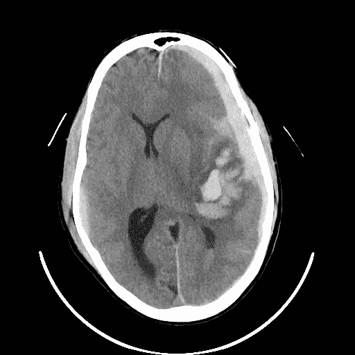
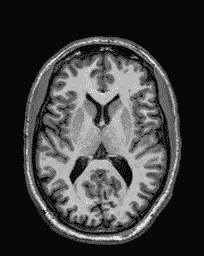
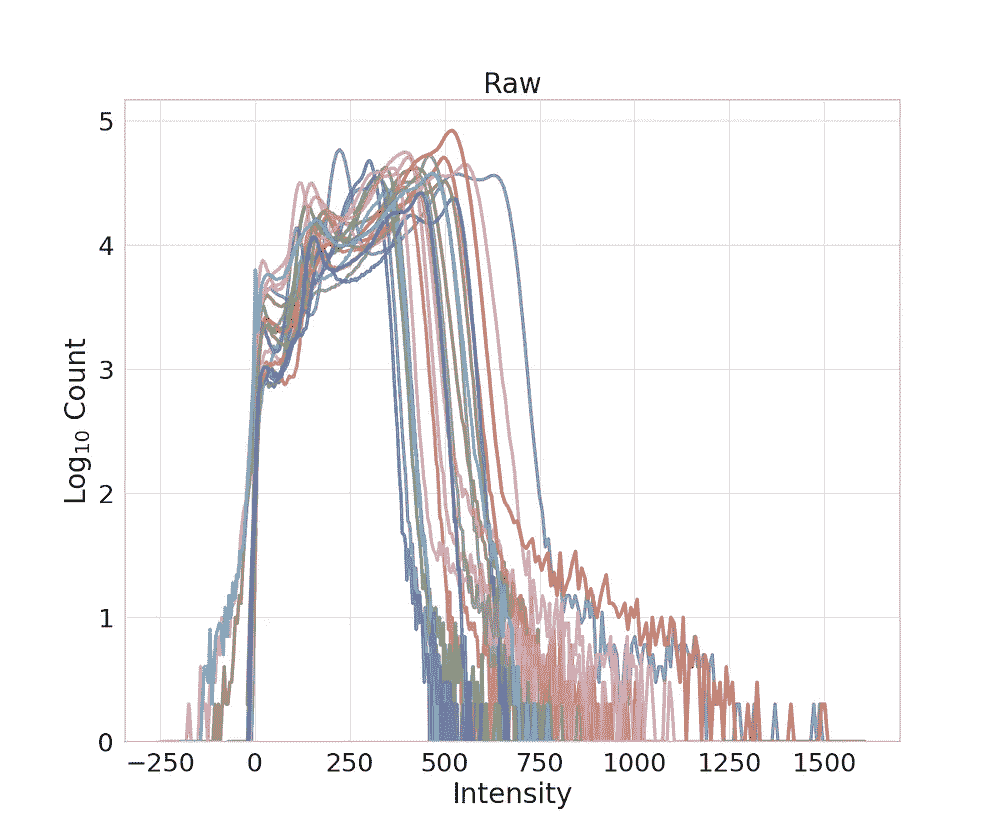
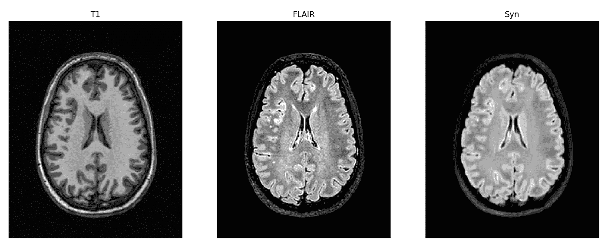

# 利用磁共振和计算机断层扫描图像进行深度学习

> 原文：<https://towardsdatascience.com/deep-learning-with-magnetic-resonance-and-computed-tomography-images-e9f32273dcb5?source=collection_archive---------8----------------------->

## 医学图像的数据、预处理技术和深层网络设计简介

开始将深度学习应用于磁共振(MR)或计算机断层扫描(CT)图像并不简单；寻找合适的数据集、预处理数据以及创建完成工作所需的数据加载器结构是一件痛苦的事情。在这篇文章中，我希望能减轻初来乍到者的痛苦。为此，我将链接到几个免费可用的数据集，回顾一些特定于 MR 和 CT 的常见/必要的预处理技术，并展示如何使用 [fastai](https://github.com/fastai/fastai) 库来加载(结构)MR 图像并为合成任务训练深度神经网络。

# MR 和 CT 图像概述

在我们进入这篇文章的实质内容之前，快速回顾一下我们将要讨论的医学图像以及讨论中的图像类型的一些特点是很有用的。我将只谈论*结构*磁共振图像和(在较小程度上)计算机断层扫描(CT)图像。这两种类型的成像模态都用于观察组织的*结构*；这与分别对血流活动和代谢活动成像的功能性 MR 图像(fMRI)或正电子发射断层扫描(PET)相反。

对于完全不熟悉医学图像的人，请注意*医学图像统计不同于自然图像统计*。例如，乳房 x 光照片看起来一点也不像人类用智能手机拍摄的任何照片。这是显而易见的；然而，我认为在设计网络和处理数据以制作某种机器学习(ML)算法时，记住这一点很重要。这并不是说使用普通的网络或从医学成像以外的领域转移学习是行不通的；这只是说，了解医学成像常见问题的特征将有助于您调试您的算法。我将在下面的预处理部分讨论这些特征的具体例子，并展示减少这些独特问题的影响的方法。

我不打算详细介绍结构磁共振成像的复杂性。关于磁共振更深入的细节，一个很好的起点是[这个网站，](https://www.mriquestions.com/index.html)它深入探讨了与磁共振合作的 ML 从业者所关心的任何话题。我会注意到磁共振扫描仪可以产生许多不同类型的磁共振图像。例如，有 T1 加权、T2 加权、PD 加权、流体衰减反转恢复(FLAIR)等。让事情变得更复杂的是，这些类型的图像还有子类型(例如，T1 加权图像有以下几种类型:MPRAGE、SPGR 等。).根据您的任务，这些信息可能非常有用，因为每种类型和子类型的图像都有其独特的特征。所有这些不同类型图像的原因是因为 MR 扫描仪是灵活的机器，可以根据不同的[脉冲序列](http://mriquestions.com/hellippulse-sequences.html)对其进行编程以收集不同的信息。结果是，所有这些图像不仅仅是冗余信息；它们包含放射科医生(或我们作为图像处理者)关心的关于临床标记的有用和独特的信息。同样，我将在预处理部分讨论更多关于 MR 独特方面的细节。

虽然有对比和非对比 CT，但 CT 扫描仪可以生成的图像种类并不多。模糊地说，CT 扫描仪通过你发射高能光子，其能量是通过光子击中你身体另一侧的探测器计算的。当像这样的图像从各种角度拍摄时，我们可以利用我们对获取图像时的几何形状的了解来将图像重建成 3D 体积。能量的物理表示让我们将发现的强度值映射到一个标准标度，这也简化了我们的生活，在预处理部分中有更多的讨论。我应该注意到，虽然 MR 擅长软组织对比度(例如，辨别大脑中灰质和白质的能力)，但 CT 的软组织对比度有点差。例如，参见 MR 图像和 CT 图像的头部下方扫描，注意灰质(沿着大脑外部)和白质(灰质内部较亮的组织)之间的对比，以及两个图像中大脑中存在的总体噪声水平。



Example of a CT scan (left) and (T1-weighted) MR scan (right) [from the [Qure.ai](http://headctstudy.qure.ai/dataset) and [Kirby 21](https://www.nitrc.org/projects/multimodal/) dataset, respectively]

不总是使用 MR 扫描的一些原因是:1)一些人由于各种原因(例如，没有通路、某些类型的金属植入物等)不能使用。)，2)与 CT 扫描相比，MR 扫描花费相对较长的时间，以及 3)放射科医师对 CT 能够提供的特定测量感兴趣(例如，查看骨骼结构)。现在，我们对数据和一些复杂的成像模式有了基本的了解，让我们来讨论一些数据集。

# 数据集

标记数据对于医学图像来说有些稀疏，因为放射科医生很贵，医院担心诉讼，而研究人员(通常过度)保护他们的数据。因此，在 MR 或 CT 中没有 ImageNet 等效物。然而，根据应用领域的不同，有许多常用的数据集。由于我主要处理脑部 MR 图像，因此我将提供一个易于访问的 MR 和 CT(脑部)图像数据集的小列表，以及项目符号末尾括号中的数据格式:

*   [Brainweb](http://brainweb.bic.mni.mcgill.ca/brainweb/) :具有组织/病变分割的模拟正常和多发性硬化大脑(MINC)
*   [Kirby 21](https://www.nitrc.org/projects/multimodal/) :对一组 21 名健康患者进行两次扫描(NIfTI)
*   [IXI 数据集](https://brain-development.org/ixi-dataset/):一组 600 名健康受试者的扫描(NIfTI)
*   [Qure.ai CT 头部扫描数据](http://headctstudy.qure.ai/dataset):一组 491 个带病理的头部 CT 扫描[无分割，但有放射学报告] (DICOM)

这里有一个*不那么容易*下载(但非常有用)的数据集列表。

*   [BraTS 2018 脑瘤数据](http://braintumorsegmentation.org/):脑瘤患者大集合连同肿瘤分割(mha)
*   [ISBI 2015 多发性硬化挑战数据](https://smart-stats-tools.org/lesion-challenge):20 名多发性硬化(MS)患者的集合【只有 5 名患者进行了病灶分割】(NIfTI)

我没有使用过下面的数据集，但我知道有人使用过，为了完整起见，我将它们包括在内。

*   [绿洲](https://www.oasis-brains.org/#dictionary)
*   [低剂量 CT](https://www.aapm.org/GrandChallenge/LowDoseCT/)
*   [快速磁共振成像](https://fastmri.med.nyu.edu/)
*   [ADNI](http://adni.loni.usc.edu/data-samples/access-data/)

另一个寻找数据集的地方是在 [OpenNeuro](https://openneuro.org) ，这是一个为研究人员提供大脑成像数据集的存储库；据我所知，它主要由功能磁共振成像组成。如果你对磁共振和 CT 脑 T4 图像之外的东西感兴趣，那么很不幸，我不是一个很好的资源。我的第一个猜测是查看此处[列出的“重大挑战”](https://grand-challenge.org/challenges/)，看看是否有可能访问数据。

不要把 lede 埋得太深，但是也许获取上述数据最简单的方法就是通过这个网站。我不确定所有东西都被允许放在那里，这就是为什么我推迟提出这个问题。

# 预处理

使用 MR 和 CT 需要进行大量的数据处理和预处理。我将在下面概述最基本的必需品。

首先要考虑的是如何将图像加载到 python 中。最简单的路线是使用[ni Abel](http://nipy.org/nibabel/)。然后你可以简单地使用

```
import nibabel as nib
data = nib.load('mydata.nii.gz').get_data()
```

获取一个 numpy 数组，其中包含了`mydata.nii.gz`文件中的数据。注意，我将这个 3D 体积的索引称为体素，它是 2D 图像的像素的 3D 等价物。至少对于大脑图像的工作，我建议总是将文件转换成 NIfTI(对应于。nii 或. nii.gz 扩展名)。我发现先把所有东西都转换成 NIfTI 让我的生活更容易，因为我可以假设所有的输入图像都是 NIfTI 类型的。[这里有一个工具](http://nipy.org/nibabel/dicom/dcm2nii_algorithms.html)将 DICOM 转换成 NIfTI，[这里有一个脚本](https://gist.github.com/jcreinhold/a26d6555b0e7aa28b79757f766640dd6)将 MHA 转换成 NIfTI，[这里有一个脚本将 PAR/REC](https://gist.github.com/jcreinhold/fdd701211191450284c5718502eabbd4) 文件转换成 NIfTI。您可能需要处理更多的文件格式，您可以使用其中的一些脚本作为灵感来转换这些文件类型。

我们将首先概述重采样、偏场校正和配准，它们是任何医学图像分析的主要内容。对于这些预处理步骤，我建议使用 ANTs，特别是 ANTsPy(假设您有 python 背景)。ANTs 得到了积极的维护，并拥有可靠的工具来解决所有这些(以及更多)问题。不幸的是，ANTsPy 并不总是容易安装，但我相信人们正在努力解决一些问题，一旦你安装并运行了它，你就可以从 python 中访问 ant 提供的大部分工具。特别是，它支持我将在下面讨论的重采样、偏差场校正和配准预处理步骤。

与自然图像一样，MR 和 CT 图像没有标准的分辨率或标准的图像尺寸。我认为这一事实在 MR 和 ct 中更为重要，必须考虑到最佳 ML 性能。请考虑以下情况:您使用以 1×1×3 毫米分辨率采集的数据来训练 3D 卷积神经网络，然后将 1×1×1 毫米的图像输入到网络中。我认为结果不是最佳的，因为卷积核不会使用相同的空间信息。这是有争议的，我还没有仔细检查这个问题，但是如果你在测试时遇到问题，非标准的解决方案是要记住的。我们可以天真地解决非标准分辨率问题，将图像重新采样到所需的标准分辨率(当然，为了获得最佳质量，使用三次 B 样条)。

对于许多应用，MR 和 CT 通常都需要一个称为*配准*的过程，以便在一组图像中对齐对象，从而进行直接比较。我们为什么要这么做？假设您想学习一个函数，该函数获取一个 MR 图像并输出对 CT 图像的估计。如果您有成对的数据(即来自同一患者的 MR 和 CT 图像)，那么处理这个问题的一个简单方法是学习图像强度之间的体素映射。然而，如果解剖结构没有在图像空间中对齐，那么我们不能以监督的方式学习该图。我们通过配准图像来解决这个问题，实际上，我们在实验部分检查了这个问题。

接下来的两个问题(在接下来的两个段落中描述)是 MR 特有的。首先，由于 MR 图像中的扫描仪，我们有[不均匀的图像强度。由于这种不均匀性不是生物特征，我们通常希望消除它，我们通过一种称为*偏场校正*的过程来实现(我将在实验部分讨论一种解决方案)。](http://johnmuschelli.com/imaging_in_r/inhomogeneity_correction_ms/index.pdf)

MR 的另一个问题是不同 MR 扫描仪的组织强度不一致。虽然 CT 图像有一个标准的强度等级(见[豪恩菲尔德单位](https://en.wikipedia.org/wiki/Hounsfield_scale))，但我们对 MR 图像就没那么幸运了。MR 图像绝对没有*而不是*有标准的尺度，如果不在预处理中考虑，对算法性能的影响会[相当大](https://arxiv.org/pdf/1812.04652.pdf)。请看下面的图像，其中我们绘制了一组 T1 加权 MR 图像的直方图，没有应用任何强度归一化(见标题中带有“Raw”的图像)。这种变化是由于扫描仪造成的影响，而不是由于生物学，这是我们通常关心的事情。



Histograms of image intensities from a cohort of T1-weighted brain images (left: white-matter mean normalized, right: no normalization applied)

有一系列强度标准化技术试图消除这种扫描仪变化(其中一些我已经收集在[这个名为`intensity-normalization`的库](https://github.com/jcreinhold/intensity-normalization)中)。这些技术从非常简单的(例如，简单的[标准化](https://en.wikipedia.org/wiki/Feature_scaling#Standardization)，我将称之为 z 分数标准化)到相当技术性的(例如，[拉威尔](https://github.com/Jfortin1/RAVEL))。对于神经成像，可以在模糊 C 均值(FCM)归一化技术中找到速度和质量的良好组合，该技术基于 T1 加权图像在白质(WM)、灰质和脑脊液之间创建粗略的组织分类分割。WM 分割掩模然后用于计算图像中 WM 的平均值，其被设置为某个用户定义的常数。这种标准化技术似乎总能在大脑图像中产生预期的结果。如果你不是在处理大脑图像，那么你可能想看看 [Nyúl & Udupa 方法](https://www.ncbi.nlm.nih.gov/pubmed/10571928)或者简单的 [z 分数归一化](https://intensity-normalization.readthedocs.io/en/latest/algorithm.html#z-score)。所有这些规范化方法都可以作为命令行接口(或可导入模块)在`intensity-normalization`存储库中获得。

我们要考虑的最后一个预处理步骤是针对大脑图像的。在大脑图像中，我们通常只关心大脑，而不一定关心大脑外部的组织(例如，颅骨、脂肪和大脑周围的皮肤)。此外，这种外来的组织会使学习过程复杂化，并使分类、分割或回归任务出错。为了解决这个问题，我们可以使用颅骨剥离算法来创建大脑的面具，并将背景置零。最简单的方法(在 MR 中)是使用 ROBEX(一种命令行工具),它通常能很好地从图像中提取大脑。我见过它在一些包含大病理或成像伪影的数据上失败过几次，但除此之外，它通常对大多数机器学习任务来说已经足够好了。值得一提的是，我会尽量避免剥离你的数据，因为这只是你的预处理程序中的另一个可能的失败点，但有时它会有很大的帮助。

因为 MR 和 CT 图像不像 JPEG 那样是标准的，所以你的计算机没有一种固有的方式来显示它。如果你想可视化你的数据，看看非 DICOM 图像的 [MIPAV](https://mipav.cit.nih.gov/) 和 DICOM 图像的 [Horos](https://horosproject.org/) 。查看您的数据总是好的，尤其是在预处理之后，这样我们可以验证一切看起来都是合理的。例如，也许注册失败了(这种情况经常发生)，或者也许颅骨剥离失败了(这种情况也经常发生)。如果您将无用的数据通过管道传输到 ML 算法中，您可能会得到无用的输出，并且会浪费大量时间进行不必要的调试。所以善待自己，检查数据。

# 为 MR 或 CT 应用培训深度网络

虽然应用于 MR 和 CT 的深度神经网络越来越多地转向 3D 模型，但 2D 模型取得了很大成功。如果您的 GPU 内存有限，或者您的训练数据非常有限，您可能希望使用 2D 网络来充分发挥网络的性能。如果您使用 3D 网络，在通过网络传递完整图像或补丁时，您将很快遇到内存问题。

如果您决定 2D 网络是您的应用程序要走的路(一个合理的选择)，您将需要找出/设计一个数据加载器来处理这一点。在使用复杂的数据加载器将 3D 图像转换为 2D 图像片或切片一段时间后，我意识到这是一个不必要的负担，使得使用预建的数据加载器/数据增强工具来帮助训练变得更加困难。因此，我对这个问题的建议解决方案是简单地将 3D 体积转换成 2D 图像。因为原始卷是浮点数，所以我选择了支持这种类型的 TIFF 图像格式。这里有一个[命令行脚本](https://gist.github.com/jcreinhold/01daf54a6002de7bd8d58bad78b4022b)，它获取一个 NIfTI 图像的目录，并创建一个相应的 2D TIFF 图像的目录(带有一些选项来创建基于轴的切片，并只从图像的一部分创建切片，以避免背景切片)。

在下一节中，我将构建一个具有 3D 卷积层的深度神经网络。我这样做是为了反对使用 2D 卷积层，因为——一旦您将 3D 体积转换为 TIFF 等 2D 图像——您基本上可以使用任何 2D 架构，将头部替换为适当的应用程序。由于 3D 问题稍微有点棘手，我将在下面深入探讨。

## 实验

******如果你是刚刚来到这篇博文(05/07/20 之后)，请注意 fastai 包已经发生了重大变化，下面的代码可能无法按预期工作。但是，下面的代码示例和一般的实验设置对于学习还是很有用的。值得一提的是，对于未来的深度学习项目，我建议使用 PyTorch 而不是 fastai。如果你想在 PyTorch 中支持 NIfTI，我有一个主动维护的包，其中有工作代码示例和可导入的函数***[](https://github.com/jcreinhold/niftidataset)****。*******

*在本节中，我将概述使用 [pytorch](https://pytorch.org/) 和 [fastai](https://github.com/fastai/fastai) 为 MR-to-MR 合成任务训练 3D 卷积神经网络所需的步骤。如果你只是想看看代码，那么还有一个笔记本，里面包含了大部分实验(不包括预处理)[这里](https://nbviewer.jupyter.org/gist/jcreinhold/78943cdeca1c5fca4a5af5d066bd8a8d)。*

*设置如下:我们将训练一个非常小的 [resnet](https://arxiv.org/abs/1512.03385) 从一个 MR 对比到另一个 MR 对比拍摄整个 3D 体积；我们将学习将 T1 加权图像映射到 FLAIR 图像的变换。这个任务被称为 *MR 图像合成*，我们将该网络称为*合成网络*。这种类型的合成有多种应用，但是这个问题的动机主要是:MR 扫描时间有限，所以不能收集所有的对比。但是我们想要吃蛋糕并且拥有它，我们有时想要那些未收集的对比度用于图像处理目的。因此，我们使用实际收集的数据创建一些假数据，这些假数据将是我们合成网络的结果。*

*在这个实验中，我将分别使用来自 [Kirby 21](https://www.nitrc.org/projects/multimodal/) 数据集的 11 幅和 7 幅图像作为训练和验证。所有图像都被重新采样为 1x1x1 mm，使用 [N4](https://www.ncbi.nlm.nih.gov/pubmed/20378467) 进行偏场校正，并且使用 ANTsPy 将 FLAIR 图像(仿射)配准到 T1 加权图像。查看[这里的](https://github.com/jcreinhold/intensity-normalization/blob/master/intensity_normalization/utilities/preprocess.py)和[这里的](https://github.com/jcreinhold/intensity-normalization/blob/master/intensity_normalization/exec/coregister.py)获取我用来做预处理的实际代码(当[亮度归一化](https://github.com/jcreinhold/intensity-normalization)包和 ANTsPy 一起安装时，这两个都可以作为命令行接口使用)。最后，使用整个图像单独对所有图像进行 [z 分数归一化](https://github.com/jcreinhold/intensity-normalization/blob/master/intensity_normalization/normalize/zscore.py)。*

*既然我们已经在一定程度上激发了这个问题，并讨论了我们将使用的数据，那么让我们来看看代码。下面的代码块定义了一些使用 fastai 的必要结构，具体来说就是使用 [data_block](https://docs.fast.ai/data_block.html) API。*

*Dataloaders classes and functions for NIfTI images in fastai*

*这里没有什么特别要注意的，除了一旦你弄清楚如何设置这些类型的结构，它们是非常方便的(更多细节见[项目列表教程](https://docs.fast.ai/tutorial.itemlist.html))。注意，当前的设置并不支持所有的功能——为了尽可能简单，我把它去掉了——但是它可以完成任务。下面我将展示如何创建训练和验证数据加载器。首先，让我们定义一个预处理转换:*

*Relevant data transforms for our application*

*为什么我要定义这个奇怪的裁剪函数？原因是双重的。第一个原因是颈部在 FLAIR 图像中不存在，但是*在 T1 加权图像中存在。我不希望网络学会将组织归零，所以我只使用与轴面[相对应的轴上 20-80%范围内的数据来删除这部分数据。第二个原因是，我可以将两倍的样本放入一个批次中(这意味着批次大小为 2)。批量较小的原因是，正如我之前提到的，具有大图像的 3D 网络是内存密集型的。为什么没有其他数据增强？不幸的是，pytorch 或 fastai 本身并不支持 3D 变换，所以我不得不加入我自己的 3D 变换，我这样做并不是为了简单。现在让我们使用 fastai 的 data_block API 来创建训练和验证数据加载器:](https://en.wikipedia.org/wiki/Anatomical_plane)**

*Define the dataloader with the data block API in fastai*

*您可以查看[笔记本](https://nbviewer.jupyter.org/gist/jcreinhold/78943cdeca1c5fca4a5af5d066bd8a8d)了解更多细节，但本质上，我将 T1 加权图像放在一个带有`train, valid, test`子目录的目录和一个带有 FLAIR 图像的平行目录中。`get_y_fn`功能抓取与源 T1 加权图像相对应的 FLAIR 图像。查看[这里的](https://docs.fast.ai/data_block.html)以获得对其余命令的更深入的解释。注意，`(tfms,tfms)`意味着我将之前定义的裁剪应用于训练集和验证集。将该转换应用于验证集并不理想，但由于内存限制，这是必需的。现在，让我们创建一些 3D 卷积和残差块层，我们将使用它们来定义我们的模型:*

*Define some custom 3D layers*

*我密切关注 2D 卷积和残差块层的定义，如在 [fastai 知识库](https://github.com/fastai/fastai/blob/master/fastai/layers.py#L94)中所定义的。顺便提一下，我在`conv3d`定义中留下了光谱归一化和权重归一化例程，但是令人失望的是，使用这些方法得到的结果比使用批处理范数时更差(我仍然不确定批处理范数是在激活之前还是之后应用)。现在让我们使用上面的层来定义我们的模型:*

*Define our network*

*这里我刚刚定义了非常小的 resnet 模型。为什么这么少层？我正在使用我的 GPU 在内存中所能容纳的最大网络。创建具有整个 3D 体积的许多通道和剩余连接是 GPU 存储器的负担。另一个可能的有趣之处是，我在最后使用了一个 1x1x1 内核，根据经验，这可以产生更清晰的图像(我认为这是相当标准的)。作为一个注意，我意识到我应该从最后一层移除激活；然而，这不是问题，因为我正在对背景为的图像*进行 z 分数归一化(即，平均减去并除以标准差)。几乎为零的背景占据了图像的绝大部分。因此，z 分数归一化本质上将背景(对应于平均值)置于零，这使得头部的强度大于零。对 ReLU 来说是个好结果。现在让我们来训练这个网络:**

*Training*

*这也很正常。使用均方误差是因为我们希望源 T1 加权图像中的每个体素强度与相应目标 FLAIR 图像的体素强度相匹配。除了使用[单周期](https://sgugger.github.io/the-1cycle-policy.html) [策略](https://arxiv.org/pdf/1803.09820.pdf)之外，我们还使用`lr_find`来帮助我们选择更大的学习速率(如这里的[所述](https://arxiv.org/abs/1506.01186))以进行更快的训练。我总是将我的训练和验证数据收集到一个 CSV 文件中，以查看网络如何融合，尤其是在启动 jupyter 笔记本电脑是一件痛苦的事情的机器上。我选择了 100 个时期，因为我运行了几次，并没有注意到随着时期的增加，性能有了很大的提高。*

*训练完成后，我们将整个图像(在训练或验证中都没有看到)输入到网络中。下图显示了一个例子，其中合成结果是最右边的图像(标题为“Syn”)。*

**

*Example synthesis result with the network defined above (from left to right: the input T1-weighted image, the true FLAIR image, and the synthesized FLAIR image)*

*虽然上图可以有更好的[窗口/级别设置](http://www.upstate.edu/radiology/education/rsna/intro/display.php)以便更好地比较，但我们看到 T1 加权图像确实呈现了真实 FLAIR 图像的许多特征。最值得注意的是，在大脑内部，我们看到白质变得不如灰质明亮，而脑脊液仍然是黑暗的。虽然噪声特征*不*相同，但是在真实的天赋中有一些合成图像中没有捕捉到的亮点。*

*这个结果无论如何都不是最先进的，但有趣的是，我们可以用如此小的数据集、没有数据增强和非常小的网络来学习近似变换。如果有更多的数据、数据扩充和更大的网络，这个网络肯定会更好，但这只是一个简单的教学玩具例子。我应该注意到，除非你有一个特别大的 GPU(与我最后的说法相矛盾)，否则你可能无法用完整的图像来训练这个网络。你可能不得不使用 3D 补丁或 2D 切片(或 2D 补丁)。*

# *结论*

*希望这篇文章为您提供了一个使用 fastai 将深度学习应用于 MR 和 CT 图像的起点。像大多数机器学习任务一样，开始时需要大量特定领域的知识、数据争论和预处理，但一旦掌握了这些，使用 pytorch 和 fastai 训练网络就相当容易了。从这里去哪里？我会从我在数据集部分发布的一个链接中下载一个数据集，并尝试做一些类似于我上面展示的事情，甚至尝试重现我所做的事情。如果你能达到那个阶段，你就能轻松地将深度学习应用于 MR 和 CT 中的其他问题。*

*我应该注意到，人们正在努力创建标准代码库，从中可以将深度学习应用于 MR 和 CT 图像。我知道的两个是 [NiftyNet](http://www.niftynet.io/) 和 [medicaltorch](https://github.com/perone/medicaltorch) 。NiftyNet 抽象掉了大部分的神经网络设计和数据处理，因此用户只需调用一些命令行界面，就可以下载预先训练好的网络，对其进行微调，以及做任何事情。所以如果这对你的需求来说足够好，那就继续吧；这似乎是一个很好的工具，并且有一些预先训练好的网络可用。medicaltorch 在 pytorch 中提供了一些带有医学图像的数据加载器和通用深度学习模型。我还没有广泛的测试，所以我不能评论他们的效用。*

*如果不喜欢 python，R 里有 [neuroconductor](https://neuroconductor.org/) 或者 Julia 里有 [NIfTI.jl](https://github.com/JuliaIO/NIfTI.jl) 和 [Flux.jl](https://fluxml.ai/) 包分别可以读取 NIfTI 图像和构建神经网络。还有无数其他相关的软件包，但这些是我第一个想到的，也是我用过的。*

*最后一点，如果你有幸为 MR 或 CT 创建了一个不错的应用程序，一定要分享你的成果！写一篇论文/博客，放在论坛上，[分享网络权重](https://pytorch.org/docs/master/hub.html)。如果能看到更多的人将深度学习技术应用到这个领域，并在可能的情况下推动该领域的边界，那将是非常棒的。祝你好运。*