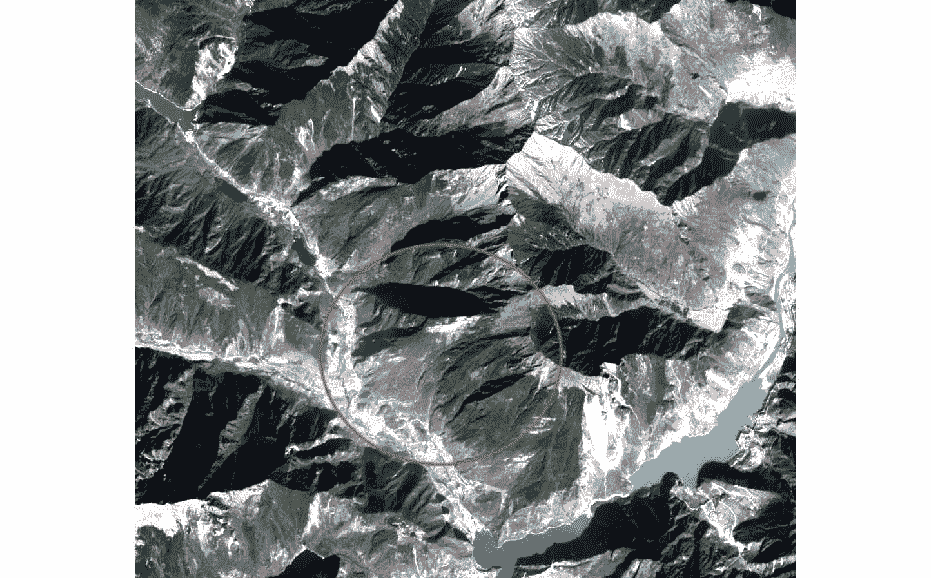
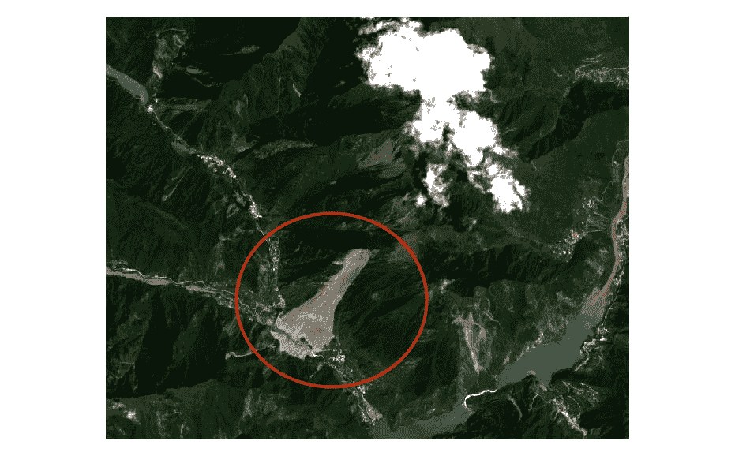
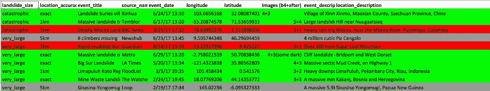
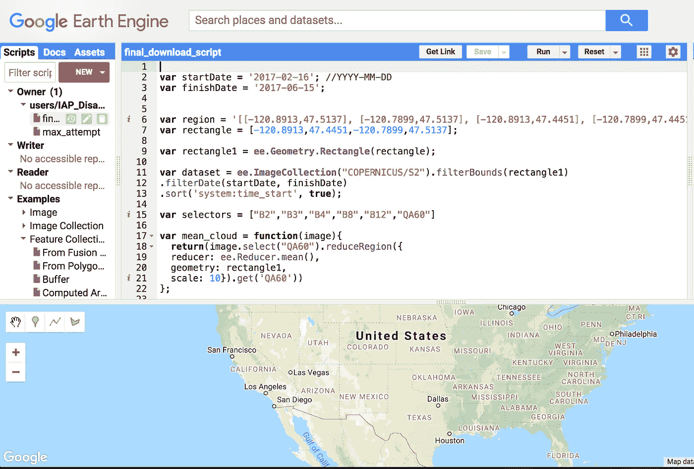
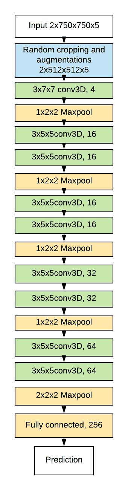
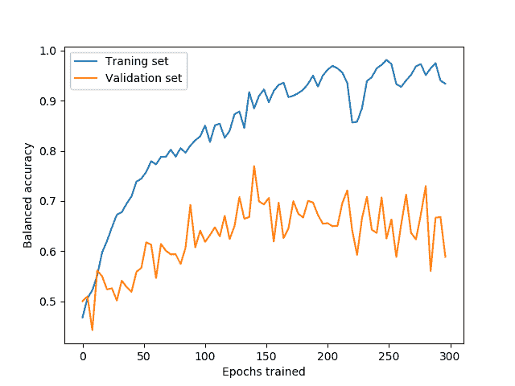
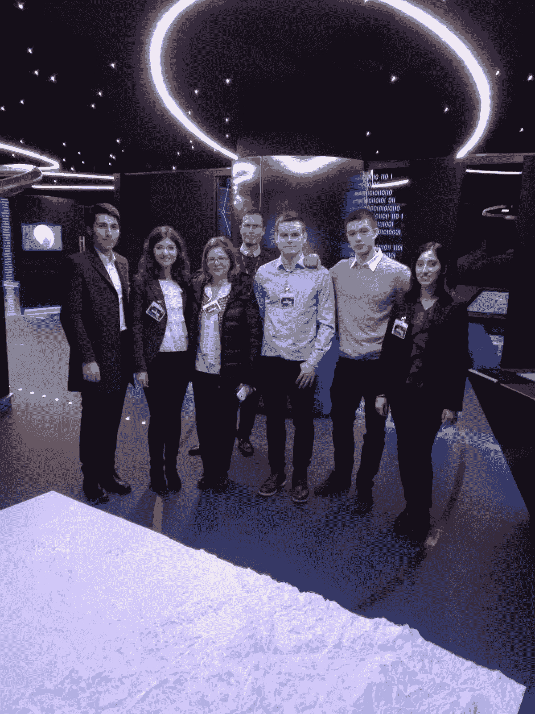

# 利用卫星数据进行深度学习

> 原文：<https://towardsdatascience.com/deep-learning-with-satellite-data-b78b20708de?source=collection_archive---------4----------------------->

*“我们现在正在创造的火箭、卫星、宇宙飞船，
我们正在给宇宙授粉。”——尼尔·杨*

# **概述—卫星数据—数据收集—模型—结果**

**概述**

今年 1 月在意大利贝内文托的桑尼奥大学，我和我的朋友图马斯·奥伊卡里宁(Tuomas Oikarinen)创建了一个(半自动)下载公开图片的管道，并根据数据训练了一个三维卷积神经网络。最终，我们的模型在 Sentinel-2 光学卫星图像上实现了大约 0.65 的平衡精度。我将更详细地介绍结果(以及为什么这个模型实际上是有用的)。在 Silvia Ullo 的指导下，在她的研究生 Maria Pia Del Rosso、Alejandro Sebastianelli 和 Federico Picarillo 的帮助下，我们最终向一个遥感会议提交了一篇论文[1]!

如果你想直接进入代码，这里的是到 Github 库的直接链接。

我将以相对技术性的方式(包括代码)描述如何从 google earth 引擎快速下载一些卫星图像，然后用它们来训练一个 3 维卷积神经网络。

具体来说，我们使用成对的图像(一个滑坡图像，一个相同地理区域但没有滑坡的图像)作为训练示例。然而，这对于涉及使用公共卫星数据作为影像模型的任何情况都是有帮助的。

**卫星数据**

在开始收集数据之前，有必要大致了解一下我们将要使用的卫星图像的类型。最容易处理和广泛提供的最新卫星数据来自哥白尼卫星计划。构成哥白尼计划的卫星被称为[哨兵卫星](https://www.wikiwand.com/en/Copernicus_Programme#/Earth_Observation_missions)。为了观察地面的变化，哨兵 1 号和哨兵 2 号卫星是最有用的。Sentinel-1 提供雷达成像和比 Sentinel-2 更高的分辨率，但也更难使用。与 Sentinel-2 图像相比，你必须对雷达图像进行更多的处理，Sentinel-2 图像基本上适合在裁剪和下载后立即使用。我们最终使用 Sentinel-2 的图像来训练我们的模型。

下面是我们能找到的山体滑坡前后卫星图像的最佳例子。

Before the landslide

After the landslide

我们拥有的绝大多数其他图像对都不那么清晰。即使是这个例子，你也可以看到云层覆盖，光照条件和植被颜色都有很大的不同。此外，我们可以找到的所有自动处理滑坡的不同方法都使用了输入支持向量机的特征，如坡度、土地覆盖、坡向、地形湿度指数等(关于这些方法的论文，见[此处](https://link.springer.com/article/10.1007%2Fs10346-013-0391-7)和[此处](https://www.sciencedirect.com/science/article/pii/S0169555X13004182))。这里我们感兴趣的问题是*一个模型能从少量的光学图像中学到任何关于危险探测的东西吗？*

**数据采集**

给我们的标签来自 [NASA 全球滑坡目录](https://data.nasa.gov/Earth-Science/Global-Landslide-Catalog/h9d8-neg4/data)，记录了 2000 年代初至 2017 年末的滑坡。这是我们必须处理的编辑版本的截屏:

Processed Landslide Catalog

绿色表示好数据，红色表示差数据，灰色表示位置精度太低，无法保证裁剪会捕捉到它。

整个项目的第一个也是最困难的部分是收集标记数据的干净样本。在花了大量时间摆弄 ESA Copernicus SciHub(欧洲航天局用于下载卫星图像的在线用户界面)之后，我们意识到要实现下载过程的自动化是相当困难的。第一个问题是，你不能在网站上的任何地方手动输入坐标，还有一个事实是，你必须下载整个卫星“图像”，在给定的日期，它覆盖了大约三分之一非洲大小的区域。对于每个示例来说，这最终都超过了 7gb；对我们笔记本电脑的存储容量来说太多了。雪上加霜的是，你不得不花半个小时在地理数据处理软件 [SNAP](http://step.esa.int/main/toolboxes/snap/) 中预处理图像(顺便提一下，这也很难自动化)。

相反，我们求助于[谷歌地球引擎](https://code.earthengine.google.com/f1d4022a395f2f2f6a4dd53da2cf3b8e?noload=1)，它可以根据日期、作物进行过滤，显示云密度并提供下载链接，只需点击一个按钮！我们确实花了一段时间来弄清楚如何做到这一点，因为缺乏关于地球引擎的例子/稀疏的文档。[入门指南](https://developers.google.com/earth-engine/)确实给出了你可以期待的 Javascript API 的功能概述，所以我仍然推荐从那里开始。

快速提示:你必须注册成为谷歌地球引擎开发者才能访问我们使用的控制台。幸运的是，这个过程非常简单，你应该很快就能获得批准。按照说明在这里报名[。](https://signup.earthengine.google.com/#!/)

我们的最终(半)自动化流水线是如何结束工作的，如下所示:

1.  在`[cropping_coordinates.py](https://github.com/Yichabod/natural_disaster_pred/blob/master/cropping_coordinates.py)`中输入坐标，计算一个 10 公里见方的坐标。
2.  复制输出并替换 Google Earth 引擎控制台中 javascript 代码顶部的变量([我们使用的 javascript 代码](https://github.com/Yichabod/natural_disaster_pred/blob/master/image_download_script.js))。不要忘记将日期范围更改为您喜欢的日期范围。
3.  单击控制台输出中打印的链接，下载平均云密度小于 100 的图像。

瞧啊。您已经有了预处理过的数据集。

Google Earth Engine Dev Console

(简单的技术说明:对于我们的模型，我们选择对每幅图像使用 12 个可用波段中的 5 个。您可以在 javascript 代码中更改这一点。每个波段捕捉不同的波长光谱，你可以在谷歌地球引擎 Sentinel-2 [数据集描述](https://developers.google.com/earth-engine/datasets/catalog/COPERNICUS_S2)上了解更多信息。

**型号**

Our CNN

对于我们的模型，我们在 Tensorflow 中定义了一个 8 层 CNN(参见这里的代码)。这没什么特别的。我们从 5 层开始，并注意到随着我们增加更多的层，性能略有提高。与你对常规前馈网络的期望相反(参见[这个不错的堆叠交换讨论](https://stats.stackexchange.com/questions/181/how-to-choose-the-number-of-hidden-layers-and-nodes-in-a-feedforward-neural-netw)了解一些背景理论)，对于 CNN 的深度没有共识。你只需要试一试。

因为我们最终处理的是大约 120 的图像对，而不是我们想要的 12，000，所以我们增加了几个扩展来使我们的模型更加健壮。首先我们使用`tf.random_crop`函数随机裁剪图像，然后我们随机翻转和旋转图像的随机部分。我们还尝试在图像中添加随机高斯噪声，但这降低了性能，并真的减慢了训练过程。

**结果**

我们使用了 5 重[交叉验证](https://en.wikipedia.org/wiki/Cross-validation_(statistics))，这样我们可以使用更多的训练数据，并且仍然可以很好地了解我们的模型在评估集上的表现。

Graph of Accuracy over Epochs

仅仅从光学图像中学习一些东西是可能的，而不需要接触一堆私人的陆地特征！然而，很明显，当验证精度稳定在 0.65 左右时，信号很弱。最明显的改进来自更多的训练例子。虽然我们已经穷尽了 NASA 公开的滑坡目录中的好例子，但是应该有很多国家的滑坡目录以及它们的日期、大小和坐标。

我希望你觉得这个指南有用，或者至少有点意思。我当然喜欢研究它，并解释我们研究背后的动机。

Tuomas and I (third and second from the right) at the European Space Agency

再见。

[1] S. L. Ullo，M.S. Langenkamp，T.P. Oikarinen，M.P. Del Rosso，A. Sebastianelli，F. Piccirillo，S. Sica，“使用 Sentinel-2 图像数据使用卷积神经网络进行滑坡地质灾害评估”，*IGARSS 2019–2019 IEEE 国际地球科学与遥感研讨会*，日本横滨，2019 年，第 9646–9649 页。