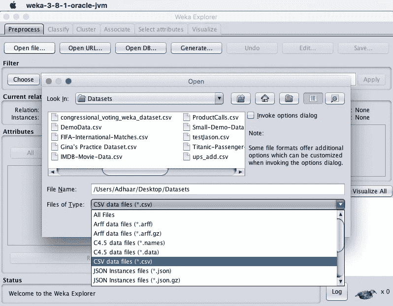
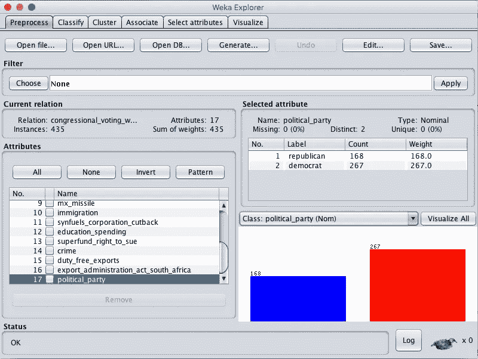
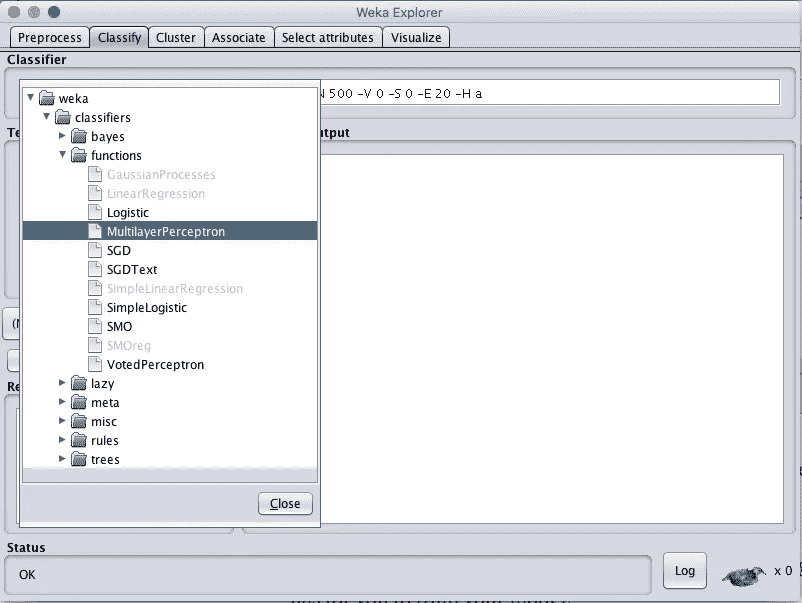
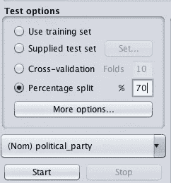
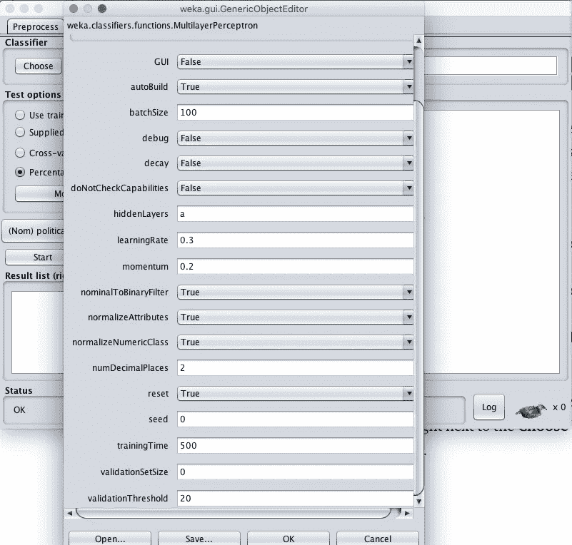
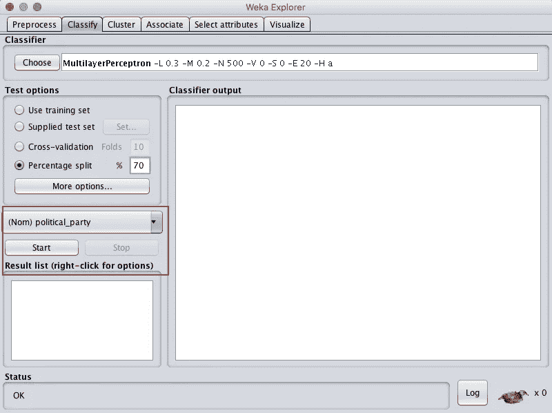
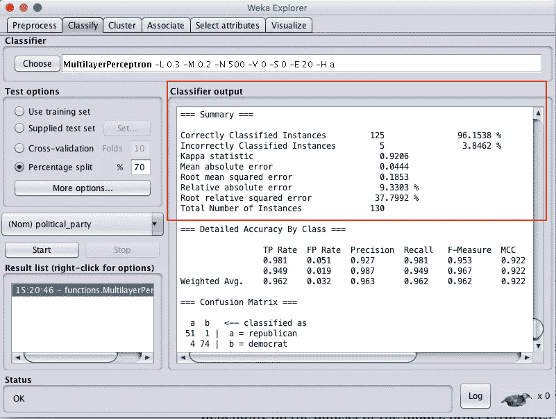

# 使用 CSV 文件和无代码的机器学习(适用于新手)

> 原文：<https://towardsdatascience.com/deep-learning-with-spreadsheets-and-no-code-love-spreadsheet-602e5d039565?source=collection_archive---------18----------------------->

***免责声明*** *:* 这是一个针对机器学习完全初学者，无需任何代码如何入门的帖子。如果你已经知道如何编码和使用机器学习库，你可能不会从中获得太多。

机器学习的核心是函数逼近。给定一组输入变量，机器学习算法试图得出一个可以准确预测输出的函数。

有各种算法来得出这个函数近似值，也称为模型。压力最大的是神经网络，也称为深度学习，这是我们将在本文中讨论的内容。

机器学习过程有三个主要步骤:

1.  **数据源&准备**
2.  **模特培训**
3.  **预测输出**

我们将在本教程中全面介绍前两个步骤，而只简要介绍最后一个步骤。

# 数据源和准备

数据来源、清理和转换是任何机器学习项目中最耗时，也是最有影响力和最重要的部分。垃圾输入和垃圾输出在大多数编程中都成立，但在机器学习中更是如此。

当你读到关于[图像识别误入歧途](https://www.theverge.com/2018/1/12/16882408/google-racist-gorillas-photo-recognition-algorithm-ai)或[医疗保健人工智能无法正常工作](https://www.statnews.com/2018/07/25/ibm-watson-recommended-unsafe-incorrect-treatments/)的新闻报道时，最有可能的是数据问题，无论是没有收集足够的数据还是收集了不代表真实人口的数据。

在现实世界的机器学习项目中，找到你需要的数据，清理它并转换它将花费大量的时间和令人头痛的事情。然而，出于学习的目的，我们可以利用已经为机器学习而管理和组织的数据集:UCI 库(T16)、Kaggle 数据集(T19)和 ML 数据(T21)。

在这篇文章中，我们将使用一个包含 1985 年国会议员对 16 个不同问题的投票的数据集。利用这些选票，我们将尝试预测该成员是民主党人还是共和党人。

数据集可以在 [ML Data](https://www.mldata.io/dataset-details/congressional_voting/) 或 [UCI 库](https://archive.ics.uci.edu/ml/datasets/Congressional+Voting+Records)下载。

选票的值可以是 *y* ， *n* 和*？因此，我们不需要清理任何东西，然而，让我们假设值是 Yes，Y，Y，no，No，？？和空白。然后，我们需要清理不一致的值，并确保所有的是、否和缺失的投票都只与一个值相关。*

# 模特培训

为了训练模型，我们需要了解训练和测试数据的概念。

与演绎或基于规则的方法相比，机器学习是一种估计函数的归纳方法。不是使用逻辑和理论来近似函数，而是将数据提供给算法，并使用数据来得出函数。

如果您要训练您的模型，并使用所有数据测试其准确性，那么该模型将非常准确，因为它没有看到任何新的东西。这就好像你练习了一套 100 道数学题，而你的数学考试正好有这 100 道题。你的考试分数可能会很高。

为了避免这个问题，我们将数据集分成测试集和训练集。我们将使用 70%的数据点来训练模型，另外 30%来测试模型的准确性。这样我们就能更好地了解我们的模型有多精确。

我们可以在开始时进行训练和测试分割，但幸运的是，我们将用于训练模型的软件会为我们做到这一点。

我们将使用一个叫做 Weka 的免费软件。使用 Weka 前需要安装 Java。Weka 可以在这里下载:[https://sourceforge.net/projects/weka/](https://sourceforge.net/projects/weka/)。

**注意:**我将使用 Weka 3–8，因此如果您使用其他版本，可能会有一些变化。

下载数据集并安装 Weka 后，启动它。在主屏幕上点击**打开文件，**转到您下载数据集的文件夹，在**文件类型**下，选择 CSV 文件并打开文件。

打开它后，您将看到所有不同的列，也称为属性及其值，既有可视化的，也有表格形式的。类下拉列表应该被选择到输出属性或我们试图预测的内容。在这种情况下，这是在 267 名民主党人和 168 名共和党人中划分的*政党*属性。

现在我们的数据已经导入，是时候训练我们的模型了。呜！

点击顶部工具栏上的**分类**选项卡。然后点击大**选择右下方的**按钮。弹出的是 Weka 为你训练模型的所有算法列表。

我们将选择*函数下的神经网络算法- >多层感知器。*

现在我们要做两件至关重要的事情:

1.  指定我们要将多少数据用于*训练和测试集*
2.  指定我们希望算法使用的*超参数*的值

*训练和测试集*

在测试选项下，选择**百分比分割**并指定 70%。这意味着我们将使用 70%的数据进行训练，剩下的 30%进行测试。没有确切的方法知道最好的分割应该是什么，这使得机器学习与其他编程相比更像是一种实验。一般标准是使用 65–80%的数据集进行训练。

*高参数*

这也是机器学习的另一个实验领域。超参数(算法的不同变量)因算法而异，改变它们会极大地影响模型的准确性。

超参数对不同算法的意义以及如何找到它们的理想值超出了本教程的范围。你可能需要参加一个机器学习课程，或者看几个关于这些主题的教程来理解它们。

*还有一种被称为 AutoML 的新技术也开始被采用，其中软件程序通过编程在超参数的不同值之间循环，并确定理想值。*

对于本教程，我们将通过试错法，看看哪些超参数值给我们最好的结果。

要选择数值**直接点击**上的**多层感知器-L 0.3 -M 0.2 -N 500 -V 0 -S 0 -E 20 -H 一条**线，紧挨着**选择**按钮。这将弹出一个窗口，如下图所示。

我们今天要修改的两个超级参数是**隐藏层**和**学习率**。这些是指神经网络应该具有的层数和函数中的权重应该更新的因子。

让我们试着用提供的学习率和隐藏层运行，看看我们的结果。确保课程为*政治 _ 政党*并点击**开始。**

运行模型后，您将获得大量结果。这个数据集和实验的关键结果是正确分类的实例的数量，瞧！我们的模型有 96%的准确率。只是提醒一下，根据数据集或模型，其他错误率可能更适用。

由于我们的默认参数的准确性如此之好，我不会用超参数做实验，但你一定要试一试。尝试不同的超参数值、数据集和测试训练分割将使你对什么有效有更好的直觉，并使你成为更好的机器学习实践者。

但就是这样！恭喜你。你只是用一个文件做了深度学习，没有写代码！

现在我们有了模型，有趣的部分是预测国会议员是民主党人还是共和党人，只要知道他们对这些问题的投票方式。

# **预测输出**

首先我们需要保存我们的模型。右键单击左下方窗格中的模型，然后单击**保存模型**并保存您的模型。

要完成其余的预测，你可以在这里阅读更多的。或者被我们张贴另一个教程。

快乐机器学习:)