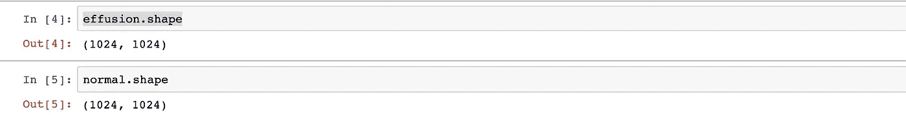
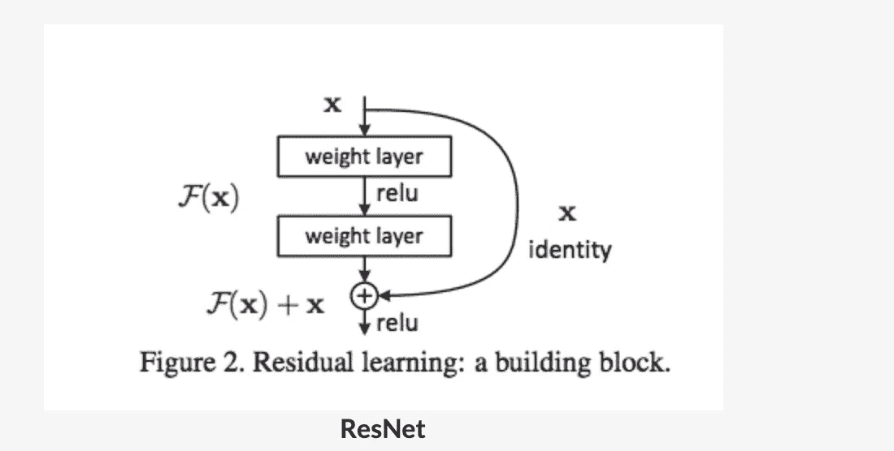
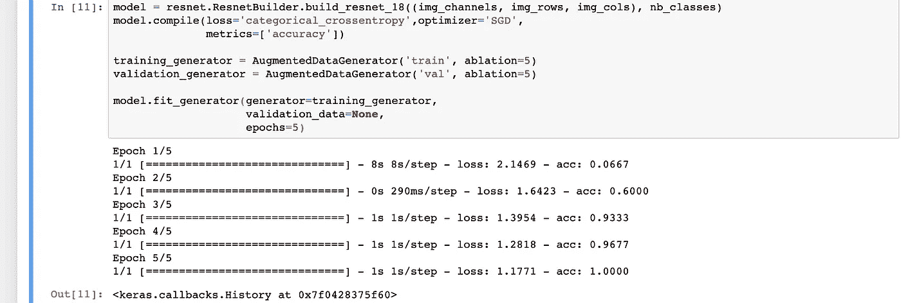
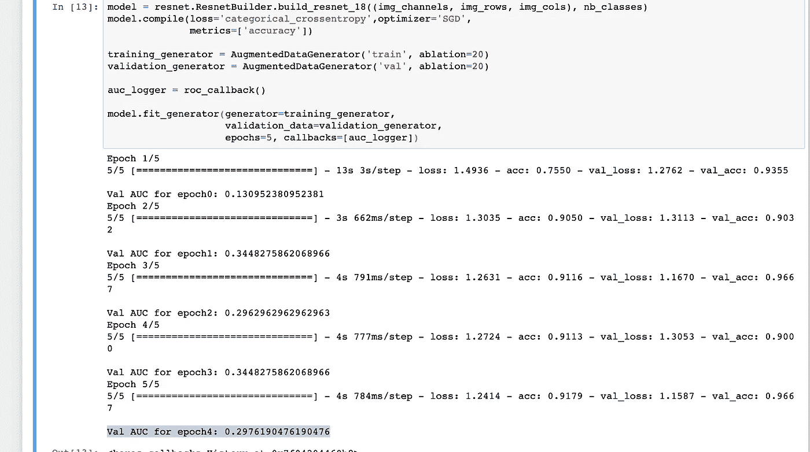
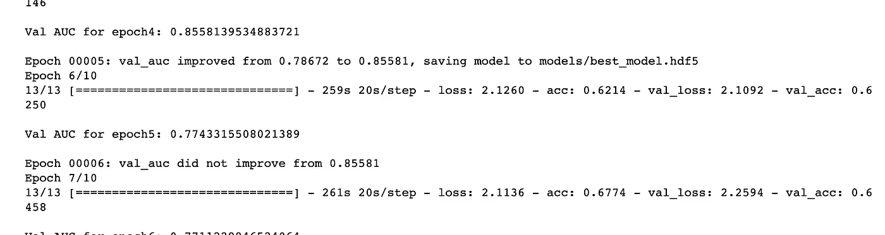
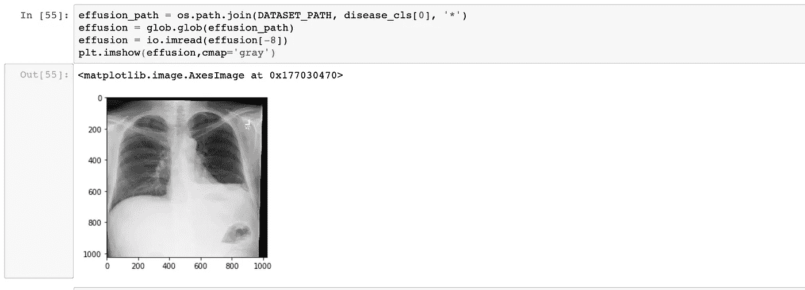
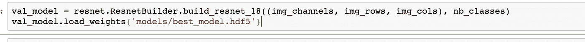
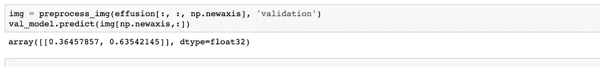

# 用 x 光眼深度学习

> 原文：<https://towardsdatascience.com/deep-learning-with-x-ray-eyes-eae0ac39b85f?source=collection_archive---------20----------------------->

随着每年执行数百万次诊断检查，胸部 X 射线是用于检测许多疾病的重要且可获得的临床成像工具。然而，它们的有用性可能受到解释方面的挑战的限制，这需要对描述复杂的三维器官和疾病过程的二维图像进行快速和彻底的评估。事实上，早期肺癌(T1)或气胸(T3)在胸部 x 光检查中可能会被遗漏，给患者带来严重的不良后果。

深度学习可以有效地用于发现 X 射线中的异常，以检测各种疾病。由于开源图像的可用性，深度学习在医学图像上的应用变得更加容易。我们将使用来自这个 [CXR 数据集](https://www.kaggle.com/murali0861/cxrdata)的 X 射线图像，尽管我们将只使用其中的两个类。

# CXR 数据预处理—增强

现在让我们对 CXR 数据集进行预处理。

1.  x 射线图像的分辨率非常高；图像大小为 1024 像素 x 1024 像素..
2.  x 射线图像是单通道图像，而不是 RGB(三通道图像)。
3.  中心裁剪不应应用于 x 射线图像，以确保图像角落内的异常不会被遗漏。

这就把我们带到了数据预处理的下一个方面——数据扩充。很多时候，我们拥有的**数据量不足以**很好地执行分类任务。在这种情况下，我们执行**数据扩充**。

我们知道**池化**增加了**不变性。**如果图像的左上角有异常迹象，通过合并，我们将能够识别左上角附近的左/右/上/下是否有异常。但是训练数据由类似于 ***翻转、旋转、裁剪、平移、照明、缩放、添加噪声*** 等的数据扩充组成。模型学习所有这些变化。这大大提高了模型的准确性。因此，即使异常出现在图像的任何角落，模型也能够以很高的准确度识别它。

增强由以下模块应用。数据生成器用于增强。

> data gen = imagedata generator(
> feature wise _ center = True，
> feature wise _ STD _ normalization = True，
> rotation_range=10，
> width_shift_range=0，
> height_shift_range=0，
> vertical_flip=False，)

垂直翻转需要设置为“假”。这是因为 CXR 图像有一个自然的方向——从上到下。

# CXR 数据预处理——归一化

规范化使得训练过程更加顺畅。这是一个重要的预处理步骤，我们简单讨论一下。

例如，假设你有一些数据点 x1，x2，x3，…，xn。大多数数据点的值的范围在(比如说) **-10 到 10** 之间，但是少数数据点(比如说 x11 和 x18)的值在 **-900 到 1000** 之间。

现在，在反向传播中，梯度(直接或间接)与导数 f′(x)相关，其中 f 是激活函数。假设您使用的是**乙状窦激活**。在 sigmoid 中，f′(x)在 x=-800 和 x=900 处的值几乎为零，但在 x=-1 和+1 之间是一个小正数。

**Shape of Sigmoid Function**

这使得相对于 X11 和 x18 的梯度下降到几乎为零，因此权重更新不能在正确的方向上发生。虽然 sigmoid 很少用在现代深度学习架构中，但这个问题也会出现在其他激活函数中，并且可以使用归一化来减少。

由于 CXR 图像不是“自然图像”，我们不使用“除以 255”策略。相反，我们采用最大-最小法进行归一化。由于您无法确定每个像素的范围是 0–255，因此您可以使用最小-最大值进行归一化。

> def preprocess_img(img，mode):
> img =(img—img . min())/(img . max()—img . min())
> img = rescale(img，0.25，多通道=True，mode = ' constant ')
> 
> if mode = = ' train ':
> if NP . random . randn()>0:
> img = data gen . random _ transform(img)
> 返回 img

在条件语句“if mode == train”中，使用一个随机数生成器，这样只有一部分图像被转换(而不是所有图像)。

# CXR:网络建设

我们将使用 **resnet** 进行分类。由于 ResNets 在行业中已经变得相当普遍，所以有必要花一些时间来理解其架构的重要元素。先说这里提出的原架构[。ResNet 已经解决的基本问题是，训练*非常深的网络*在计算上是**困难的**——例如，56 层网络的训练精度*比 20 层网络的训练精度*低。顺便说一下，在 ResNets 之前，任何超过 20 层的东西都被称为*非常深。*](https://arxiv.org/pdf/1512.03385.pdf)

现在让我们看看 ResNets 是如何解决这个问题的。考虑上图(来自论文)。假设网络的某个“单元”的输入是 x(该单元有两个权重层)。假设，理想情况下，该单元应该已经学习了某个函数 H(x ),即给定输入 x，该单元应该已经学习产生**期望输出** H(x)。

在正常的神经网络中，这两层(即这个单元)将试图学习函数 H(x)。但雷斯内特尝试了一种不同的技巧。他们认为:让 F(x)表示 H(x)和 x 之间的**残差**，即 F(x)= H(x)——x。他们假设学习残差函数 F(x)比学习 H(x)更容易。在极端情况下，该单元应该简单地让信号通过它(即 H(x)=x 是学习的最佳值)，将残差 F(x)推到零比学习 H(x)更容易。

在 *deep* 网上的实验证明了这个假设确实是真的——如果*学习让信号通过*是要做的最佳事情(即减少损失)，那么单元学习 F(x)= 0；但是，如果要学些有用的东西，这些单元就学会了。这些单元被称为**剩余单元**。

让我们回到我们的项目。我们有以下模型建立过程的输入:一个图像通道，两个不同的类，如“渗出”与“找不到”，以及 256 行和列。

> img _ channels = 1
> img _ rows = 256
> img _ cols = 256
> 
> nb_classes = 2

我们使用数据生成过程来只加载需要的数据，以确保不会超出内存空间限制。

构建模型的基本步骤是:

1.  导入 **resnet，因为我们将使用迁移学习。**
2.  运行扩充数据生成器。
3.  执行消融运行。
4.  符合模型。

# CXR:火车模型

现在，该训练模型了。模型训练的第一步是进行**消融实验**。这样做是为了检查代码是否按预期运行。我们试图用小数据集和较少的时期来运行它，以识别任何潜在的问题。

我们可以从第一次消融中了解一些事实。数据类高度不平衡。“渗出”与“找不到”的比率几乎是 10 (107/1000)。由于大部分数据只属于一个类别，在这种情况下简单的训练将不起作用，因为模型将主要学习和分类大部分数据为“无发现”,从而导致高精度。如果你注意到，大约 90%的数据都是“找不到的”。通过对所有数据进行相同的分类，准确率将达到 90 %,接近我们达到的 96%的准确率。**因此，正确分类“积液”的目标没有实现**。**高精度明显误导了我们，因此我们将使用曲线下面积(AUC)来验证结果。**

# CXR:有 AUC 的火车模型

什么是曲线下面积(AUC)？

AUC-ROC 曲线是在各种阈值设置下对分类问题的性能测量。ROC 是概率曲线，AUC 代表可分性的程度或度量。它告诉我们模型在多大程度上能够区分不同的类。AUC 越高，模型预测 0 为 0 和 1 为 1 的能力越强。以此类推，AUC 越高，该模型在区分患病和未患病患者方面就越好。

AUC vs Accuracy

**关键时刻**

我们观察到精确度很高，大约 0.93 到 0.96。相反，AUC 低得多，为. 29。因为 AUC 低于 0.5，所以模型以相反的顺序工作，将阳性类别识别为阴性类别。

我们在第二轮消融中观察到:

1.  该模型在我们选择的 AUC 指标上表现不佳。
2.  造成这种情况的主要原因是普遍性问题。数据集中的异常案例并不多。这个问题会出现在几乎所有的医学成像问题中，就此而言，会出现在大多数类别不平衡的数据集中。
3.  为了解决这个问题，我们引入了“加权分类交叉熵”。这是一种衡量损失的方法，它将权重应用于不同形式的错误。

# 低患病率的解决方案

低患病率问题的一个常见解决方案是使用**加权交叉熵损失**。损失被修改，使得低流行等级的错误分类比其他等级受到更重的惩罚。

因此，每当模型在异常类别(在本例中为“渗出”)上出错时，我们会通过将损失乘以高权重值来对其进行严厉惩罚。这导致错误分类类别的损失增加，因此由于反向传播而导致的权重变化更大。因此，对错误分类负责的权重的学习曲线更多。

假设“没有发现”是 0 级，“积液”是 1 级。

**bin_weights[0，0]:** 实际类:0，预测类:0，所以没有惩罚，只是正常的**权重 1。**

**bin_weights[1，1]:** 实际类:1，预测类:1，所以没有惩罚，只是正常的**权重为 1。**

出现异常情况时:

**bin_weights[1，0]** —实际类为 1，预测类为 0，**按权重罚 5。**

**bin_weights[0，1]** —实际类为 0，预测类为 1，**按权重罚 5。**

> def w _ category _ cross entropy(y _ true，y_pred，weights):
> nb _ cl = len(weights)
> final _ mask = k . zeros _ like(y _ pred[:，0])
> y _ pred _ max = k . max(y _ pred，axis = 1)
> y _ pred _ max = k . shape(y _ pred)[0]，1)
> y _ pred _ max _ mat
> 
> bin_weights = np.ones((2，2))
> bin_weights[0，1] = 5
> bin_weights[1，0]= 5
> ncce = partial(w _ category _ cross entropy，weights=bin_weights)
> ncce。_ _ name _ _ = ' w _ category _ cross entropy '

# CXR:最后一轮

我们确定了问题的根本原因，并提出了具体的解决方案— **加权分类交叉熵，并开始了我们的最终运行。**

只有当“验证准确性”提高时，我们才保存模型权重。保存模型权重的方法称为**检查点**，使用 **keras 回调调用。**结果清楚地表明 AUC*从 0.19(无重量)显著增加到 0.86(有重量)。*

# 做一个预测

最佳拟合模型用于预测 X 射线图像是“渗出”还是“无发现”

不用于训练或验证数据集 X 射线图像是测试预测的最佳候选。

Test image looks like above

在上述最后运行步骤中，我们重新加载 Resnet 并从最佳拟合权重中加载权重。

Loading weight from best fit model

并使用测试图像作为预测输入。

Prediction of the Test image datapoint

所以根据模型测试图像是一个积液。我们可以清楚地看到这个结果是正确的。

# 结论和下一步措施

我刚刚开始在医学图像上使用 CNN。展望未来，我将扩展模型以预测更多的输出，并尝试提高准确性。欢迎你加入我的 Github 回购项目。我已经在 [google Drive](https://drive.google.com/file/d/197jWrtTZZQ3LHTUAaFEsQiEt2XxkAm6P/view?usp=sharing) 上传了我的训练数据。

让我们一起构建或者你自己尝试一下，然后抢先我一步。无论哪种方式，都要不断学习，不断提升自己。下次见，保持警惕！