# 用于图像和单词标签识别的深度多输入模型迁移学习

> 原文：<https://towardsdatascience.com/deep-multi-input-models-transfer-learning-for-image-and-word-tag-recognition-7ae0462253dc?source=collection_archive---------6----------------------->

## 一种用于图像和文本理解的多模型深度学习方法


随着[深度学习](https://en.wikipedia.org/wiki/Deep_learning)如[卷积神经网络](https://en.wikipedia.org/wiki/Convolutional_neural_network)(即[conv net](https://neurohive.io/en/popular-networks/vgg16/))【1】，[计算机视觉](https://en.wikipedia.org/wiki/Computer_vision)再次成为热门科研课题。现在计算机视觉的一个主要目标是使用机器学习(尤其是深度学习)来训练计算机从数字图像、文本或视频中获得人类级别的理解。

随着它的广泛使用，ConvNet 成为图像识别的事实模型。如[1]所述，一般来说，有两种方法可以将 ConvNet 用于计算机视觉:

*   **从头开始培训新的 ConvNet 模型**
*   **使用** [**转移学习**](https://en.wikipedia.org/wiki/Transfer_learning) **，即使用预先训练好的 ConvNet 模型**

如下图所示，一个 ConvNet 模型由两部分组成:一个*卷积基*和一个全连通*分类器*。

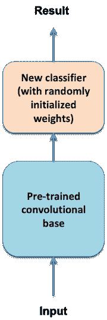

**图 1:**conv net 迁移学习的典型场景。

ConvNet 迁移学习可以进一步细分为三种方法:

*   **方法一:无需图像论证的特征提取**【1】
    这种方法首先使用预先训练的卷积基将新图像转换为数组，例如 Numpy 数组(如果需要，可以将其保存到文件中)，然后使用内存中图像的那些数组表示，使用随机初始化的权重训练单独的新分类模型。
*   **方法二:带图像论证的特征提取**【1】
    该方法以预先训练好的卷积基为输入层建立新的模型，冻结卷积基的权值，最后加入一个新的随机初始化权值的输出分类器。
*   **方法三:微调**【1】
    这种方法不使用整个冻结的预训练卷积基。它允许解冻冻结的预训练卷积基的一些顶层，使得那些解冻的顶层可以与新的完全连接的分类器联合训练。

方法 2 在本文中用于多输入模型迁移学习。

迁移学习背后的主要思想不仅可以用于有监督的 ConvNet，还可以用于其他深度学习算法，例如用于自然语言处理的无监督[单词嵌入](https://en.wikipedia.org/wiki/Word_embedding)模型([NLP](https://en.wikipedia.org/wiki/Natural_language_processing))【4】。

目前流行的预训练单词嵌入模型有两种: [word2vec](https://code.google.com/archive/p/word2vec/) 和[GloVe](https://nlp.stanford.edu/projects/glove/)【3】。像[4]中使用的 [word2vec-keras](https://pypi.org/project/word2vec-keras/) 模型，这些预训练的单词嵌入模型通常与其他有监督的深度学习算法相结合，如文本分类等[递归神经网络](https://en.wikipedia.org/wiki/Recurrent_neural_network)(RNN)[LSTM](https://keras.io/examples/lstm_stateful/)[NLP](https://en.wikipedia.org/wiki/Natural_language_processing)【4】。

ConvNet 模型或 NLP 模型(例如，单词嵌入与 LSTM 的组合)可以单独用于解决计算机视觉和 NLP 中的许多有趣问题。正如本文所示，这些不同类型的模型还可以以各种方式组合起来[1]形成更强大的模型，以解决更具挑战性的问题，如[保险索赔流程自动化](https://nanonets.com/blog/ai-in-insurance/)不仅需要图像识别能力，还需要自然语言(如文本)理解能力。

本文使用 Kaggle 中一个有趣但具有挑战性的数据集，[表征学习中的挑战:多模态学习](https://www.kaggle.com/c/challenges-in-representation-learning-multi-modal-learning/data) [2]，提出了一个新的多输入迁移学习模型，该模型将两个输入模型与一个完全连接的分类层相结合，同时用于图像识别和单词标签识别(见图 2)。

新的多输入模型背后的主要思想是将图像和单词标签识别的问题转化为机器学习分类问题，即确定给定的图像是否与给定的一组单词标签匹配(0-否，1-是)。

# 1.数据准备

在将图像文件和单词标签文件的 Kaggle 数据集[2]下载到本地机器之后，可以使用下面的代码来构建和打乱图像文件名和相关单词标签文件名的列表。在用于训练目的的数据集中有 100，000 个图像文件和 100，000 个相应的单词标签文件。

```
original_dataset_dir = './multi_task_learning/data/ESPGame100k'
base_dataset_dir = './multi_task_learning/data/ESPGame100k_small'original_label_path = original_dataset_dir + '/labels'
original_label_files = [f for f in listdir(original_label_path) if isfile(join(original_label_path, f))]original_image_path = original_dataset_dir + '/thumbnails'
original_image_files = [f for f in listdir(original_image_path) if isfile(join(original_image_path, f))]original_image_files = np.array(original_image_files)
original_label_files = np.array(original_label_files)dataset_size = original_label_files.shape[0]
perm = np.arange(dataset_size)
np.random.shuffle(perm)
original_image_files = original_image_files[perm]
original_label_files = original_label_files[perm]
```

为了在合理的时间内(几个小时)在笔记本电脑上训练新的多输入模型，我随机选择了 2，000 张图像和相应的 2，000 个 word 标记文件用于本文的模型训练:

```
if not os.path.isdir(base_dataset_dir):
    os.mkdir(base_dataset_dir)

small_label_path = os.path.join(base_dataset_dir, 'labels')
small_image_path = os.path.join(base_dataset_dir, 'thumbnails')
if not os.path.isdir(small_label_path):
    os.mkdir(small_label_path)
if not os.path.isdir(small_image_path):
    os.mkdir(small_image_path)for fname in original_label_files[:2000]:
    src = os.path.join(original_label_path, fname)
    dst = os.path.join(small_label_path, fname)
    shutil.copyfile(src, dst)for fname in original_label_files[:2000]:
    img_fname = fname[:-5]
    src = os.path.join(original_image_path, img_fname)
    dst = os.path.join(small_image_path, img_fname)
    shutil.copyfile(src, dst)
```

下面的代码将 2，000 个图像标签文件名和相应的 2，000 个单词标签加载到 Pandas DataFrame 中:

```
label_map = {'label_file' : [], 'word_tags' : []}
for fname in listdir(small_label_path): 
    f = join(small_label_path, fname)
    if isfile(f):
        f = open(f)
        label_map['label_file'].append(fname)
        line = f.read().splitlines()
        label_map['word_tags'].append(line)
label_df = pd.DataFrame(label_map)
label_df.head()
```

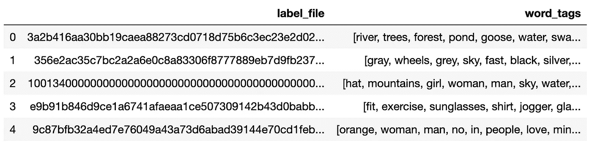

与[4]类似，Jupyter notebook [5]中包含一个文本数据预处理程序，用于执行最少的数据预处理，如删除停用词和数字，以防产生重大差异:

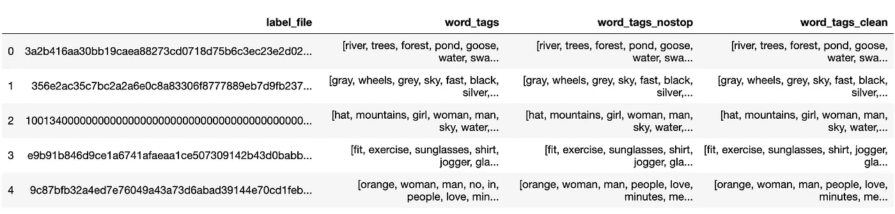

如[4]中所述，文本数据预处理的影响是不显著的，因此在本文中，未经预处理的原始单词标签用于模型训练。

# 2.多输入模型迁移学习体系结构

如下图所示，新的多输入迁移学习模型使用预训练的 ConvNet 模型 [VGG16](https://neurohive.io/en/popular-networks/vgg16/) 来接收和处理图像，并使用新的 NLP 模型(预训练的单词嵌入模型 GloVe 和 Keras LSTM 的组合)来接收和处理单词标签。这两个输入模型首先被合并在一起，然后与完全连接的输出分类模型组合，该完全连接的输出分类模型使用图像识别模型输出和 NLP 模型输出来确定图像和一组单词标签的输入对是否匹配(0-否，1-是)。

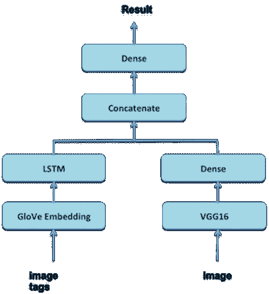

**图 2:** 多输入模型迁移学习的新深度学习模型的架构。

# 3.图像识别中的迁移学习

如图 2 所示，新的多输入迁移学习模型使用预训练的 ConvNet 模型 VGG16 进行图像识别。VGG16 型号已经包含在 Keras 库中。来自[1]的以下代码用于将 VGG16 卷积基与新的全连接分类器相结合，以形成新的图像识别输入模型:

```
from keras.applications import VGG16

image_input = Input(shape=(150, 150, 3), name='image')
vgg16 = VGG16(weights='imagenet',
                  include_top=False,
                  input_shape=(150, 150, 3))(image_input)
x = layers.Flatten()(vgg16) 
x = layers.Dense(256, activation='relu')(x)
```

# 4.面向文本分类的迁移学习

如图 2 所示，新的多输入迁移学习模型使用预训练的单词嵌入模型 GloVe [3]将单词标签转换为紧凑向量。一旦手套数据集[3]被下载到本地机器，来自[1]的以下代码可用于将单词嵌入模型加载到存储器中:

```
glove_dir = './multi_task_learning/data/'embeddings_index = {}
f = open(os.path.join(glove_dir, 'glove.6B.100d.txt'))
for line in f:
    values = line.split()
    word = values[0]
    coefs = np.asarray(values[1:], dtype='float32')
    embeddings_index[word] = coefs
f.close()
```

如图 2 所示，GloVe 单词嵌入与 Keras LSTM 相结合，形成了一个新的预测/识别单词标签的 NLP 输入模型:

```
tag_input = Input(shape=(None,), dtype='int32', name='tag')
embedded_tag = layers.Embedding(max_words, embedding_dim)(tag_input)
encoded_tag = layers.LSTM(512)(embedded_tag)
```

# 5.多输入模型与全连接分类器的结合

一旦创建了新的图像识别输入模型和新的 NLP 输入模型，以下代码可以将它们与新的输出分类器组合成一个多输入迁移学习模型:

```
concatenated = layers.concatenate([x, encoded_tag], axis=-1)
output = layers.Dense(1, activation='sigmoid')(concatenated)model = Model([image_input, tag_input], output)
model.summary()
```

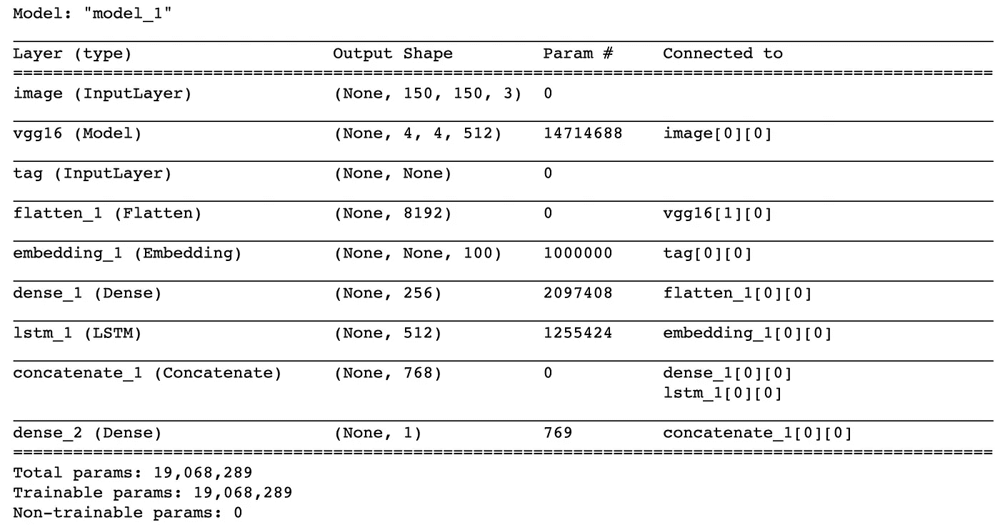

如[1]中所述，预训练的 VGG16 卷积基和手套字嵌入层都必须被冻结，使得这些模型的预训练权重在新的多输入模型训练期间不会被修改:

```
# model.layers[1].trainable = False # freeze VGG16
model.layers[4].set_weights([embedding_matrix])
model.layers[4].trainable = False # freeze GloVe word embedding
```

然而，关于 VGG16 卷积基，有趣的是，我尝试了两种方法(冻结或不冻结)，但在模型训练时间或模型预测结果方面没有看到显著差异。

# 6.多输入模型训练

原始 Kaggle 训练数据集仅包括正确的图像对和相应的单词标签。在本文中，每一个这样的正确对都被标记为 1(匹配)(另请参见下面的代码)。为了创建一个平衡的数据集，除了现有的 2，000 对正确的图像和单词标记之外，下面的代码还创建了 2，000 对不正确的图像和单词标记。为简单起见，这是通过将所选择的 2000 幅图像中的每一幅(比如图像 I)与下一个图像文件的单词标签(即图像 i+1 的单词标签)配对来实现的。

```
import cv2dim = (150, 150)
X_image_train = []
X_tag_train = tag_data
y_train = []

for fname in listdir(small_image_path):
    fpath = os.path.join(small_image_path, fname)
    im = cv2.imread(fpath)
    im_resized = cv2.resize(im, dim, interpolation = cv2.INTER_AREA)
    X_image_train.append(im_resized)
    y_train.append(1)

# add incorrect image and tag pairs
num_negative_samples = len(y_train)
for i in range(num_negative_samples):
    image = X_image_train[i]
    X_image_train.append(image)
    j = (i + 1) % num_negative_samples # get a different tag
    tag = X_tag_train[j]
    X_tag_train = np.append(X_tag_train, tag) 
    y_train.append(0)
```

总共有 4000 对图片和文字标签，2000 对正确，2000 对错误。

每个图像单词标签需要被编码为整数，并且在单词标签可以被单词嵌入模型消费之前，单词标签的每个列表/序列需要被转换为整数值序列。这是通过使用和修改[1]中的代码来实现的:

```
from keras.preprocessing.text import Tokenizer
from keras.preprocessing.sequence import pad_sequencesmaxlen = 100
training_samples = num_of_samples
tag_vocabulary_size = 10000
max_words = tag_vocabulary_size
num_of_samples = label_df.shape[0]tokenizer = Tokenizer(num_words=max_words)
texts = []
for tag_list in label_df_clean['word_tags']:
    texts.append(' '.join(tag_list))
tokenizer.fit_on_texts(texts)
sequences = tokenizer.texts_to_sequences(texts)
word_index = tokenizer.word_index
print('Found {} unique tokens'.format(len(word_index)))
tag_data = pad_sequences(sequences, maxlen=maxlen)
```

得到的图像和单词标签训练数据集被转换成 Numpy 数组并被混洗用于模型训练:

```
X_image_train = np.array(X_image_train)
X_tag_train   = np.array(X_tag_train)
y_train       = np.array(y_train)
perm = np.arange(y_train.shape[0])
np.random.shuffle(perm)
X_image_train = X_image_train[perm]
X_tag_train   = X_tag_train[perm]
y_train       = y_train[perm]
```

新的多输入模型被编译和训练如下，仅具有 30 个时期和 4，000 对平衡的图像和单词标签:

```
model.compile(optimizer='rmsprop', loss='binary_crossentropy', metrics=['acc'])
model.fit([X_image_train, X_tag_train], y_train, epochs=30, batch_size=64)
```

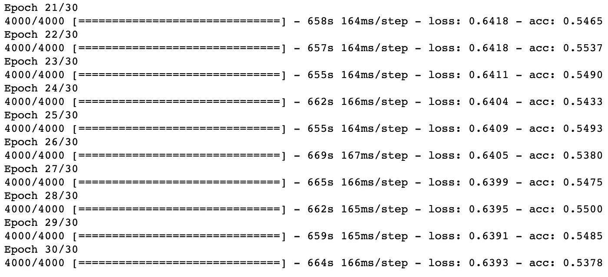

# 7.模型预测法

如下所示,[2]中的私有测试数据集包括 500 个图像，每个图像与两组单词标签相关联:

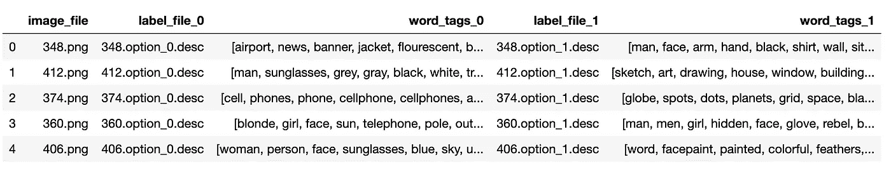

给定测试数据集中的图像，新的多输入迁移学习模型需要能够预测给定的两组单词标签中的哪一组与图像匹配。

以下代码用于将测试图像加载到内存中:

```
dim = (150, 150)
X_image_test = []for fname in listdir(test_image_dir):
    fpath = os.path.join(test_image_dir, fname)
    im = cv2.imread(fpath)
    im_resized = cv2.resize(im, dim, interpolation = cv2.INTER_AREA)
    X_image_test.append(im_resized)
```

测试字标签被转换成如下编码的整数值序列:

```
tokenizer_test = Tokenizer(num_words=max_words)
texts_1 = []
texts_2 = []
texts_all = []
for tag_list in test_image_label_df['word_tags_1']:
    texts_1.append(' '.join(tag_list))
for tag_list in test_image_label_df['word_tags_2']:
    texts_2.append(' '.join(tag_list))
texts_all.extend(texts_1)
texts_all.extend(texts_2)
tokenizer_test.fit_on_texts(texts_all)
sequences_1 = tokenizer_test.texts_to_sequences(texts_1)
sequences_2 = tokenizer_test.texts_to_sequences(texts_2)word_index_test = tokenizer_test.word_index
print('Found {} unique tokens in test'.format(len(word_index_test)))
tag_data_test_1 = pad_sequences(sequences_1, maxlen=maxlen)
tag_data_test_2 = pad_sequences(sequences_2, maxlen=maxlen)
```

然后，生成的图像和单词标签的 Python 数组被转换为 Numpy 数组，并适合训练好的预测模型:

```
X_image_test = np.array(X_image_test)
X_tag_test_1 = np.array(tag_data_test_1)
X_tag_test_2 = np.array(tag_data_test_2)
y_predict_1 = loaded_model.predict([X_image_test, X_tag_test_1])
y_predict_2 = loaded_model.predict([X_image_test, X_tag_test_2])
```

下表显示了前 20 个预测结果:

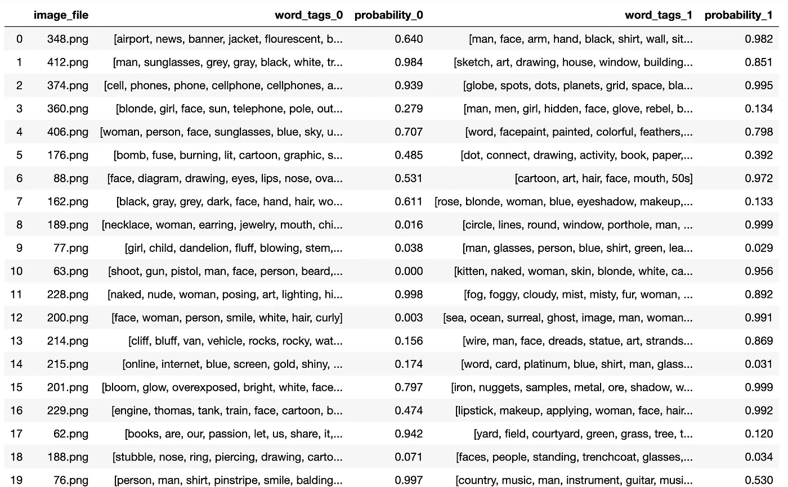

下图是测试数据集中的影像 201.png:

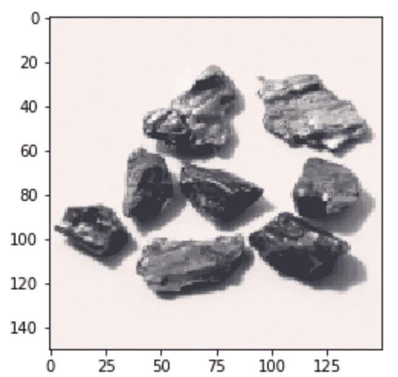

两个相关的单词标签集如下:

```
word-tag-set-0: ['bloom', 'glow', 'overexposed', 'bright', 'white', 'face', 'woman', 'blonde']
word-tag-set-1: ['iron', 'nuggets', 'samples', 'metal', 'ore', 'shadow', 'white', 'grey', 'gray', 'rust', 'shiny']
```

该模型预测:

```
word-tag-set-0: probability of 0.797
word-tag-set-1: probability of 0.999
```

概率较高的 0.999 的答案是:

***['铁'，'金块'，'样本'，'金属'，'矿石'，'阴影'，'白色'，'灰色'，'铁锈'，'闪亮']***

作为另一个正面例子，下面是测试数据集中的影像 76.png:

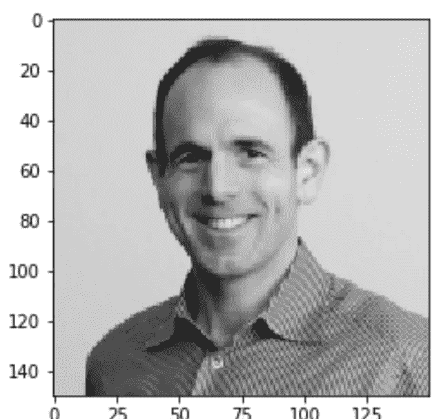

以下是相关的两组单词标签:

```
word-tag-set-0: ['person', 'man', 'shirt', 'pinstripe', 'smile', 'balding', 'grey', 'gray']
word-tag-set-1: ['country', 'music', 'man', 'instrument', 'guitar', 'musician', 'person', 'playing', 'watch', 'striped', 'shirt', 'red', 'glasses']
```

该模型预测:

```
word-tag-set-0: probability of 0.997
word-tag-set-1: probability of 0.530
```

概率较高的 0.997 的答案是:

***['人'，'男人'，'衬衫'，'细条纹'，'微笑'，'谢顶'，'灰色']***

作为一个假阳性示例，以下是测试数据集中的图像 189.png:

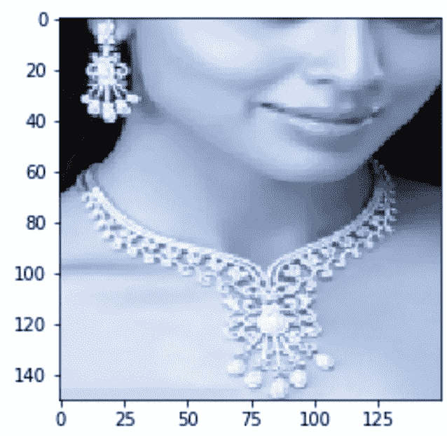

以下是相关的两组单词标签:

```
word-tag-set-0: ['necklace', 'woman', 'earring', 'jewelry', 'mouth', 'chin', 'closeup']
word-tag-set-1: ['circle', 'lines', 'round', 'window', 'porthole', 'man', 'face', 'beard', 'person', 'dark', 'shadow']
```

该模型预测:

```
word-tag-set-0: probability of 0.016
word-tag-set-1: probability of 0.999
```

概率较高的 0.999 的误报答案是:

*['圆'，'线'，'圆'，'窗'，'舷窗'，'人'，'脸'，'胡子'，'人'，'黑暗'，'影子']*

上面的测试结果表明，即使新的多输入迁移学习模型仅用 4000 对图像和单词标签以及 30 个时期来训练，该模型也能够在准确性方面获得相当合理的结果。

然而，由于模型过度拟合，该模型也产生了相当多的假阳性。

# 摘要

本文提出了一种新的多输入深度迁移学习模型，该模型将两个预训练的输入模型(VGG16 和 GloVe & LSTM)与一个新的全连接分类层相结合，用于同时识别图像和单词标签。

新的多输入深度学习方法的关键点是将图像和单词标签识别的问题转化为分类问题，即确定给定的图像是否与给定的一组单词标签匹配(0-否，1-是)。

Kaggle 中具有挑战性的公共数据集[表征学习中的挑战:多模态学习](https://www.kaggle.com/c/challenges-in-representation-learning-multi-modal-learning/data)【2】，用于训练和评估新模型。

模型预测结果表明，新模型在用于演示目的的有限模型训练(只有 30 个时期和 4，000 对图像和单词标签)下表现得相当好。然而，毫不奇怪，由于模型过度拟合，该模型也产生了相当多的假阳性。这个问题可以通过用更多时期和/或更多对图像和单词标签来训练模型来解决。

显然，随机选择的 2000 幅训练图像不足以代表总共 100000 幅可用的训练图像。通过将训练图像的数量从 2，000 个增加到更大的尺寸，如 10，000 个，模型性能将得到显著提高。

Github [5]中提供了一个包含所有源代码的 Jupyter 笔记本。

# 参考

[1] F. Chollet，用 Python 进行深度学习，曼宁出版公司，2018

[2] [表征学习的挑战:多模态学习](https://www.kaggle.com/c/challenges-in-representation-learning-multi-modal-learning/data)

[3] J. Pennington，R. Socher，C.D. Manning， [GloVe:单词表示的全局向量](https://nlp.stanford.edu/projects/glove/)

[4] Y. Zhang，[利用 word2vec-keras 进行自然语言处理的深度学习](/deep-learning-for-natural-language-processing-using-word2vec-keras-d9a240c7bb9d)

[5] Y. Zhang， [Github 中的 Jupyter 笔记本](https://github.com/yzzhang/machine-learning/tree/master/deep_learning/multi_input_transfer_learning)

披露声明:2019 首创一。观点是作者个人的观点。除非本帖中另有说明，否则 Capital One 不隶属于所提及的任何公司，也不被这些公司认可。使用或展示的所有商标和其他知识产权是其各自所有者的财产。