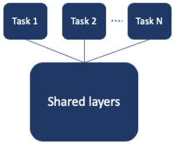

# 深度多任务学习— 3 个经验教训

> 原文：<https://towardsdatascience.com/deep-multi-task-learning-3-lessons-learned-7d0193d71fd6?source=collection_archive---------19----------------------->

在过去的一年里，我和我的团队一直致力于在 [Taboola feed](https://blog.taboola.com/taboola-feed/) 中实现个性化的用户体验。我们使用[多任务学习](http://ruder.io/multi-task) (MTL)来预测同一组输入特征的多个关键性能指标(KPI)，并在 TensorFlow 中实现了一个深度学习(DL)模型来实现这一点。回到我们开始的时候，MTL 对我们来说似乎比现在复杂得多，所以我想分享一些经验教训。

已经有不少关于用 DL 模式实现 MTL 的帖子( [1](https://jg8610.github.io/Multi-Task) 、 [2](https://medium.com/@kajalgupta/multi-task-learning-with-deep-neural-networks-7544f8b7b4e3) 、 [3](https://hanxiao.github.io/2017/07/07/Get-10x-Speedup-in-Tensorflow-Multi-Task-Learning-using-Python-Multiprocessing) )。在这篇文章中，我将分享一些在神经网络(NN)中实现 MTL 时需要考虑的具体问题。我也将提出简单的张量流解决方案来克服所讨论的问题。

## 分享是关怀

我们想从[硬参数共享](http://ruder.io/multi-task/index.html#hardparametersharing)的基本方法开始。硬共享意味着我们有一个共享子网，后面是特定于任务的子网。



在 TensorFlow 中开始使用这种模型的一个简单方法是使用带有多个头部的估算器。因为它看起来和其他神经网络架构没有什么不同，你可能会问自己哪里出错了？

## 第 1 课—组合损失

我们在 MTL 模型中遇到的第一个挑战是为多个任务定义一个损失函数。虽然单个任务有明确定义的损失函数，但多个任务会带来多个损失。

我们尝试的第一件事就是简单地将不同的损失相加。很快我们可以看到，当一个任务收敛到好的结果时，其他的看起来很糟糕。当仔细观察时，我们很容易明白为什么。损失的规模如此不同，以至于一项任务主导了整体损失，而其余的任务没有机会影响共享层的学习过程。

一个快速解决方案是用加权总和代替损失总和，这样所有损失的规模大致相同。然而，这个解决方案涉及到另一个可能需要偶尔调整的超参数。

幸运的是，我们发现了一篇很棒的论文，提出用不确定性来衡量 MTL 的损失。其实现方式是通过学习另一个噪声参数，该参数被整合到每个任务的损失函数中。这允许有多个任务，可能的回归和分类，并使所有损失达到相同的规模。现在我们可以回到简单地总结我们的损失。

我们不仅得到了比加权总和更好的结果，还可以忘记额外的权重超参数。[这里的](https://github.com/yaringal/multi-task-learning-example/blob/master/multi-task-learning-example.ipynb)是本文作者提供的一个 Keras 实现。

## 第 2 课—调整学习率

学习率是[调节神经网络](https://engineering.taboola.com/hitchhikers-guide-hyperparameter-tuning/)的最重要的超参数之一，这是一个普遍的约定。所以我们尝试调整，发现一个学习率看起来非常适合任务 A，另一个非常适合任务 b。选择较高的学习率会导致其中一个任务的[死亡，而使用较低的学习率会导致另一个任务收敛缓慢。那我们能做什么？我们可以为每个“头”(特定于任务的子网)调整一个单独的学习速率，为共享子网调整另一个速率。](https://www.quora.com/What-is-the-dying-ReLU-problem-in-neural-networks)

虽然听起来很复杂，但实际上很简单。通常，在 TensorFlow 中训练神经网络时，您会使用类似以下的内容:

```
optimizer = tf.train.AdamOptimizer(learning_rate).minimize(loss)
```

*AdamOptimizer* 定义如何应用渐变，而 *minimize* 计算并应用渐变。我们可以将*最小化*替换为我们自己的实现，在应用梯度时，我们将对计算图中的每个变量使用适当的学习率:

```
all_variables = shared_vars + a_vars + b_vars
all_gradients = tf.gradients(loss, all_variables)

shared_subnet_gradients = all_gradients[:len(shared_vars)]
a_gradients = all_gradients[len(shared_vars):len(shared_vars + a_vars)]
b_gradients = all_gradients[len(shared_vars + a_vars):]

shared_subnet_optimizer = tf.train.AdamOptimizer(shared_learning_rate)
a_optimizer = tf.train.AdamOptimizer(a_learning_rate)
b_optimizer = tf.train.AdamOptimizer(b_learning_rate)

train_shared_op = shared_subnet_optimizer.apply_gradients(zip(shared_subnet_gradients, shared_vars))
train_a_op = a_optimizer.apply_gradients(zip(a_gradients, a_vars))
train_b_op = b_optimizer.apply_gradients(zip(b_gradients, b_vars))

train_op = tf.group(train_shared_op, train_a_op, train_b_op)
```

顺便说一下，这个技巧实际上对单任务网络也很有用。

## 第 3 课—使用评估作为特征

一旦我们通过了创建一个预测多项任务的神经网络的第一阶段，我们可能会希望使用我们对一项任务的估计作为另一项任务的特征。在向前传球时，这真的很容易。估计是一个张量，所以我们可以像任何其他层的输出一样连接它。但是在 backprop 中会发生什么呢？

假设任务 A 的估计值作为一个特征传递给任务 B。我们可能不想将渐变从任务 B 传播回任务 A，因为我们已经有了一个 A 的标签。
别担心，TensorFlow 的 API 有 [tf.stop_gradient](https://www.tensorflow.org/api_docs/python/tf/stop_gradient) 就是因为这个原因。当计算梯度时，它让你传递一个你希望当作常数的张量列表，这正是我们所需要的。

```
all_gradients = tf.gradients(loss, all_variables, stop_gradients=stop_tensors)
```

同样，这在 MTL 网络中是有用的，但不是唯一的。每当您想用 TensorFlow 计算一个值，并需要假设该值是一个常数时，都可以使用这种技术。例如，当训练生成性对抗网络(GANs)时，你不希望通过对抗例子的生成过程反向推进。

## 那么，下一步是什么？

我们的模型已经启动并运行，Taboola feed 正在被个性化。然而，仍有很大的改进空间，还有许多有趣的架构有待探索。在我们的用例中，预测多个任务也意味着我们基于多个 KPI 做出决策。这可能比使用单一的 KPI 要复杂一些…但这已经是一个全新的话题了。

感谢阅读，希望这篇文章对你有用！