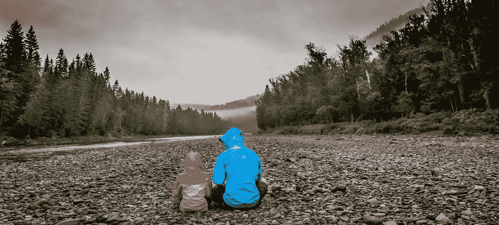
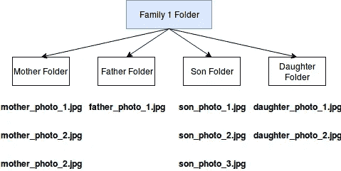
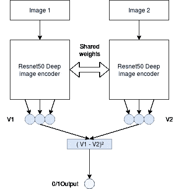
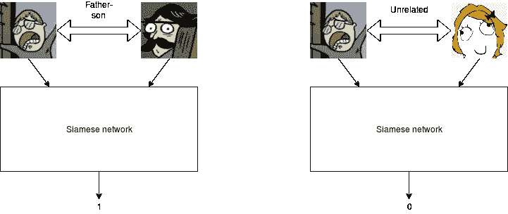
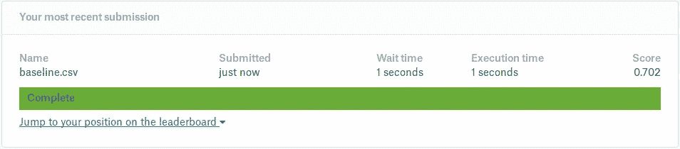
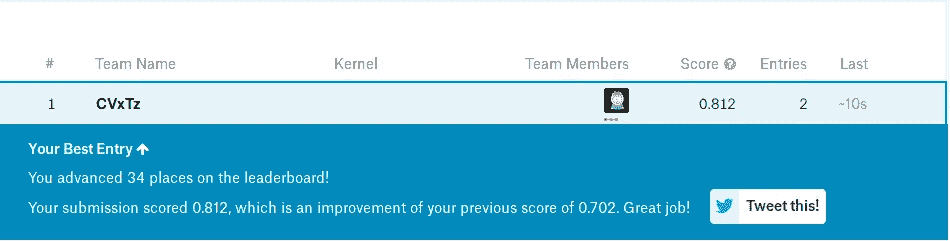
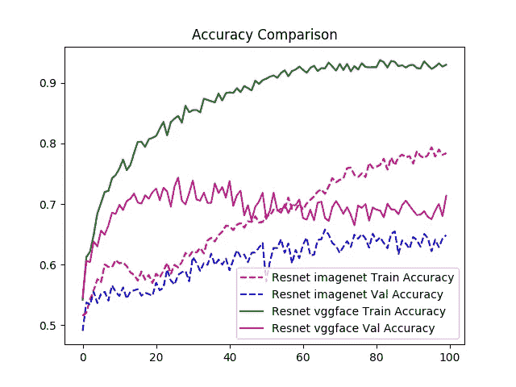

# 基于人脸照片的深度神经网络亲属关系预测

> 原文：<https://towardsdatascience.com/deep-neural-networks-for-kinship-prediction-using-face-photos-f2ad9ab53834?source=collection_archive---------25----------------------->

Photo by [Alex Guillaume](https://unsplash.com/photos/GFhqLXCJ-g8?utm_source=unsplash&utm_medium=referral&utm_content=creditCopyText) on [Unsplash](https://unsplash.com/search/photos/familly?utm_source=unsplash&utm_medium=referral&utm_content=creditCopyText)

给定两个人的面部照片，我们能预测他们是否有血缘关系吗？
这就是我们在本帖中试图通过使用[野外家庭:一个亲属识别基准](https://web.northeastern.edu/smilelab/fiw/)数据集来做的事情，数据集的格式在 Kaggle 上共享:[https://www.kaggle.com/c/recognizing-faces-in-the-wild/data](https://www.kaggle.com/c/recognizing-faces-in-the-wild/data)

我们将探索深度神经网络的有效性，并转移学习技术来训练一个神经网络，该网络将预测两个人是否有血缘关系或是否给定了他们的面部照片。

# 数据集:

我们将使用在 [kaggle](https://www.kaggle.com/c/recognizing-faces-in-the-wild/data) 上共享的野生数据集中的家族。这是同类中规模最大的数据集，其中人脸照片按人分组，然后按家庭分组。

Image organization in the FIW dataset

除了图像文件夹之外，我们还有一个文件，列出了一个家庭中两个人有血缘关系的所有情况，但并不是所有家庭成员都有血缘关系。(就像母亲和父亲，除非我们说的是兰尼斯特😄)

# 型号:

为了解决这个任务，我们将使用一个暹罗网络，它拍摄一对图像，如果照片中的人是相关的，则预测 1，否则预测 0。

Siamese Network

图像编码器应用于每个输入图像，并将它们中的每一个编码成固定长度的向量。两个图像向量之间的差的平方被馈送到完全连接的层，该层然后预测亲属关系的二进制标签。

Example of input/output

# 迁移学习:

我们的解决方案将基于使用两种不同设置的预训练图像编码器:

ImageNet 上的预处理:1400 万张*手动标记图像的数据集，用于分类，如狗、猫、飞机、草莓…*

[vgg face 2](https://github.com/rcmalli/keras-vggface)上的预训练:一个由*330 万张*人脸图像和 9000 多个不同种族、口音、职业和年龄的身份组成的数据集。

预训练技术是有用的，因为它们允许我们将在源任务(这里是图像分类或回归)中学到的表征转移到目标任务，在这种情况下是亲属关系预测。
这有助于减少过度拟合，并实现更快的收敛速度，尤其是在源任务和目标任务有些接近的情况下。

# 结果:

我们将使用准确性和 AUC 分数来评估每个模型的结果。

Resnet50 Imagenet 测试 ROC AUC : **0.70**

Evaluation on the test set through kaggle submission

Resnet50 VGGFACE2 测试 ROC AUC : **0.81**

Evaluation on the test set through kaggle submission

Validation Accuracy Comparison

我们可以看到，即使两种不同设置中的架构是相同的，在 VGGFace2 上预训练的模型[上的结果也要好得多，因为与 Imagenet 相比，它是更接近亲属预测目标任务的源任务。](https://github.com/rcmalli/keras-vggface)

# 结论:

我们展示了我们可以训练一个暹罗网络来预测两个人是否有血缘关系。通过使用迁移学习，我们能够在 AUC ROC 中获得令人鼓舞的结果 **0.81** ，特别是考虑到亲缘关系的任务👪即使对人类来说，预测也很难。

可在 https://github.com/CVxTz/kinship_prediction[获得重现结果的代码](https://github.com/CVxTz/kinship_prediction)

如果你有任何问题，请随意评论。