# Python 中从零开始的深度神经网络

> 原文：<https://towardsdatascience.com/deep-neural-networks-from-scratch-in-python-451f07999373?source=collection_archive---------4----------------------->

在本指南中，我们将构建一个深度神经网络，你想要多少层就有多少层！该网络可应用于二分类的监督学习问题。

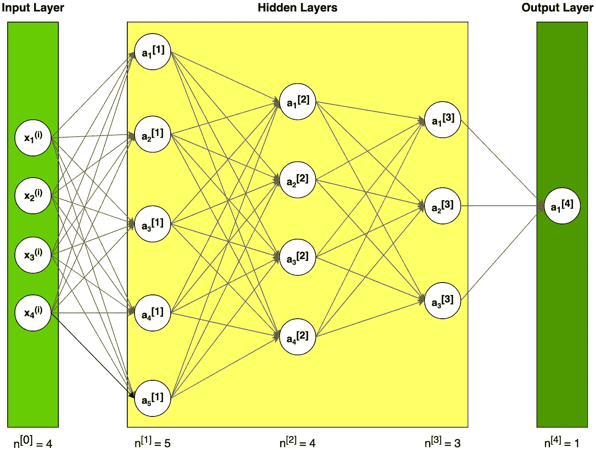

**Figure 1.** Example of neural network architecture

## 注释

上标[ *l* 表示与 *l* ᵗʰ层相关的量。

上标( *i* )表示与 *i* ᵗʰ示例相关的量。

Lowerscript *i* 表示向量的 *i* ᵗʰ条目。

*本文假设读者已经熟悉神经网络的概念。不然我推荐看这个好看的介绍*[*https://towardsdatascience . com/how-to-build-your-own-neural-network-from-scratch-in-python-68998 a08e 4 F6*](/how-to-build-your-own-neural-network-from-scratch-in-python-68998a08e4f6)

## 单个神经元

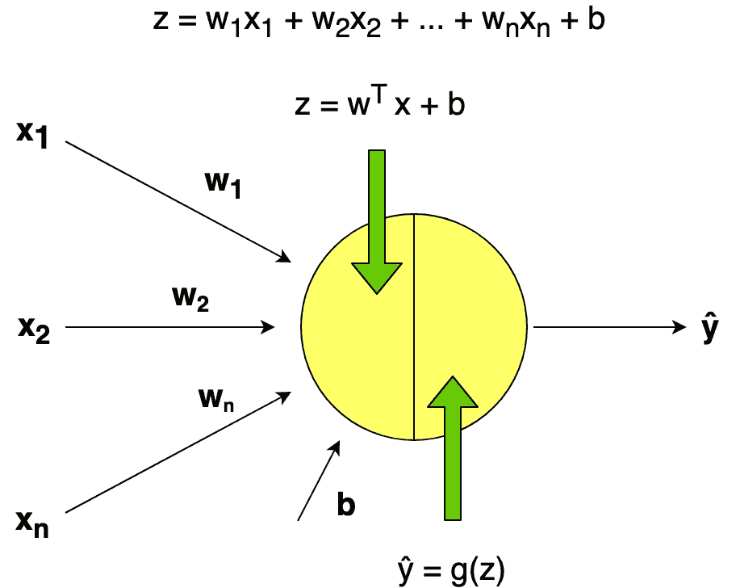

**Figure 2.** Example of single neuron representation

神经元计算一个线性函数(z = Wx + b ),然后是一个激活函数。我们一般说一个神经元的输出是 a = g(Wx + b)其中 g 是激活函数(sigmoid，tanh，ReLU，…)。

## 资料组

让我们假设我们有一个非常大的数据集，其中包含温度、湿度、大气压力和降雨概率等天气数据。

问题陈述:

*   标记为下雨(1)或不下雨(0)的 m_train 天气数据的训练集
*   标记为下雨或不下雨的 m_test 天气数据的测试集
*   每个天气数据包括 x1 =温度，x2 =湿度，x3 =大气压力

机器学习中一个常见的预处理步骤是对数据集进行居中和标准化，这意味着您从每个示例中减去整个 numpy 数组的平均值，然后用整个 numpy 数组的标准偏差除每个示例。

 [## 标准偏差-维基百科

### 随机变量、统计总体、数据集或概率分布的标准偏差是…

en.wikipedia.org](https://en.wikipedia.org/wiki/Standard_deviation) 

# 一般方法(构建我们算法的各个部分)

我们将遵循深度学习方法来构建模型:

1.  定义模型结构(如输入要素的数量)
2.  初始化参数并定义超参数:

*   迭代次数
*   神经网络的层数 L
*   隐藏层的大小
*   学习率α

3.num_iterations 的循环:

*   正向传播(计算电流损耗)
*   计算成本函数
*   反向传播(计算电流梯度)
*   更新参数(使用参数和来自反向投影的梯度)

4.使用训练好的参数来预测标签

## 初始化

更深的 L 层神经网络的初始化更复杂，因为有更多的权重矩阵和偏置向量。我提供下面的表格是为了帮助你保持正确的结构尺寸。

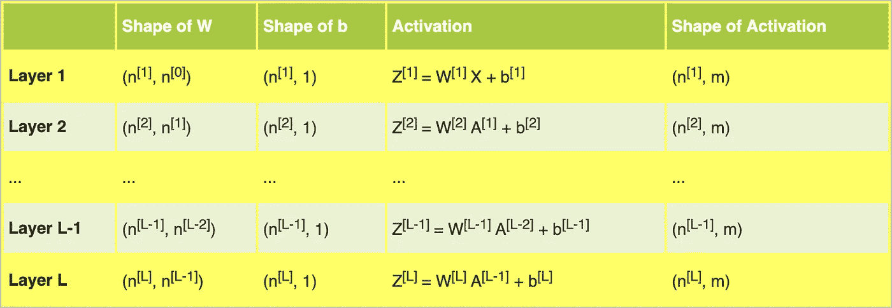

**Table 1.** Dimensions of weight matrix **W,** bias vector **b** andactivation **Z** for layer l

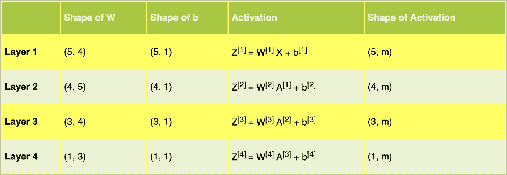

**Table 2.** Dimensions of weight matrix **W,** bias vector **b** andactivation **Z** for the neural network for our example architecture

表 2 帮助我们为图 1 中示例神经网络架构的矩阵准备正确的维度。

**Snippet 1.** Initialization of the parameters

使用小随机数进行参数初始化是一种简单的方法，但它保证了我们的算法有足够好的起点。

请记住:

*   不同的初始化技术，如零，随机，他或泽维尔导致不同的结果
*   随机初始化确保不同的隐藏单元可以学习不同的东西(将所有的权重初始化为零，这样每一层中的每个神经元都将学习相同的东西)
*   不要初始化太大的值

## 激活功能

激活函数使神经网络具有非线性。在我们的例子中，我们将使用 sigmoid 和 ReLU。

Sigmoid 输出一个介于 0 和 1 之间的值，这使它成为二进制分类的一个非常好的选择。如果小于 0.5，可以将输出分类为 0，如果大于 0.5，可以将输出分类为 1。

**Snippet 2.** Sigmoid and ReLU activation functions and their derivatives

在代码片段 2 中，你可以看到激活函数及其导数的矢量化实现([https://en.wikipedia.org/wiki/Derivative](https://en.wikipedia.org/wiki/Derivative))。该代码将用于进一步的计算。

## 正向传播

在正向传播过程中，在层的正向函数中 *l* 你需要知道层中的激活函数是什么(Sigmoid，tanh，ReLU 等。).给定来自前一层的输入信号，我们计算 Z，然后应用选定的激活函数。

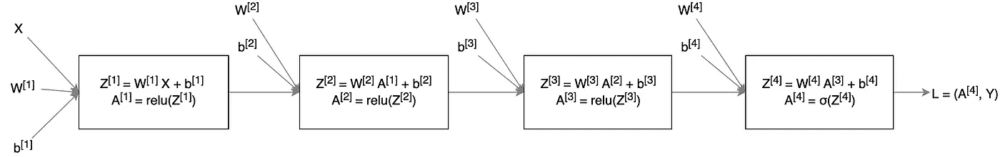

**Figure 3.** Forward propagation for our example neural network

线性正向模块(对所有示例进行矢量化)计算以下等式:

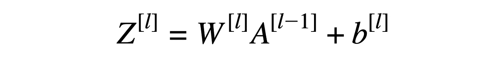

**Equation 1.** Linear forward function

**Snippet 3.** Forward propagation module

我们使用“缓存”(Python 字典，其中包含为特定层计算的 **A** 和 **Z** 值)将向前传播期间计算的变量传递给相应的向后传播步骤。它包含向后传播计算导数的有用值。

## 损失函数

为了监控学习过程，我们需要计算成本函数的值。我们将使用下面的公式来计算成本。

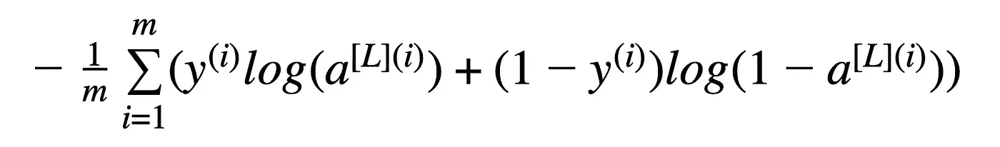

**Equation 2.** Cross-entropy cost

**Snippet 4.** Computation of the cost function

## 反向传播

反向传播用于计算损失函数相对于参数的梯度。这个算法是微积分中已知的“链式法则”的递归使用。

反向传播计算中使用的方程:

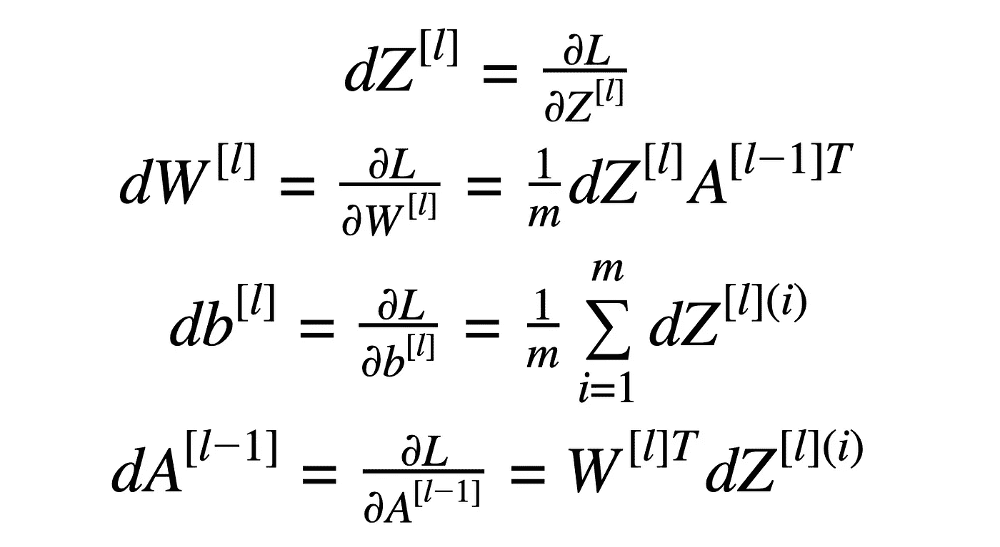

**Equation 3.** Formulas for backward propagation calculation

链式法则是计算复合函数导数的公式。复合函数是由其他函数内部的函数组成的函数。

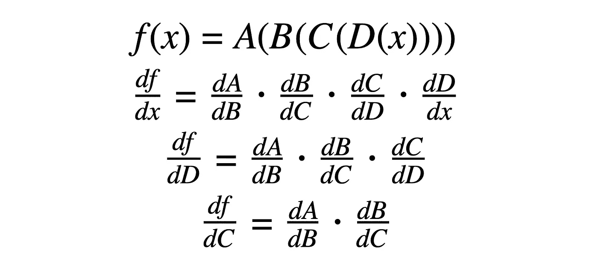

**Equation 4.** Chain rule examples

没有“链式法则”(以方程 5 为例)，很难计算损耗。

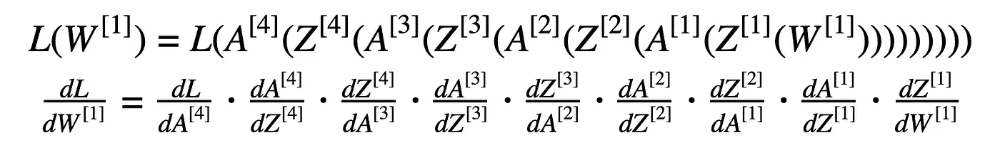

**Equation 5.** Loss function (with substituted data) and its derivative with respect to the first weight.

我们的神经网络模型的反向传播的第一步是从最后一层计算我们的损失函数相对于 Z 的导数。等式 6 包括两个分量，来自等式 2 的损失函数的导数(相对于激活函数)和来自最后一层的激活函数“sigmoid”相对于 Z 的导数。

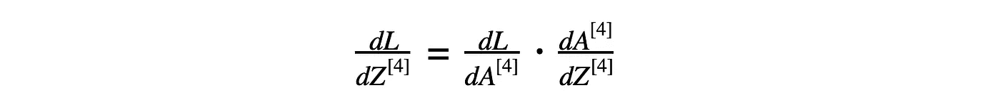

**Equation 6.** The derivative of the loss function with respect to Z from 4ᵗʰ layer

等式 6 的结果可用于计算等式 3 的导数:

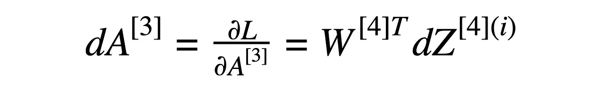

**Equation 7.** The derivative of the loss function with respect to A from 3ᵗʰ layer

损失函数相对于来自第三层的激活函数的导数(等式 7)用于进一步的计算。

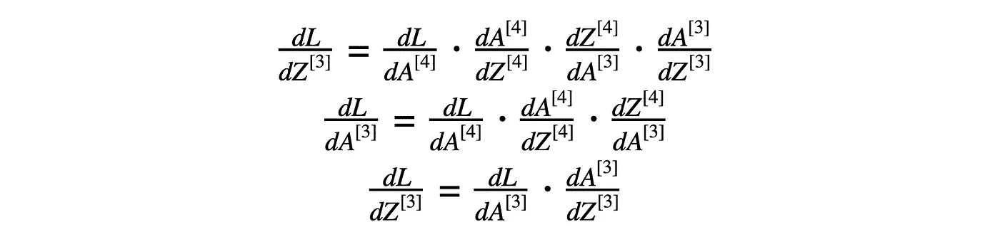

**Equation 8\.** The derivatives for the third layer

等式 7 的结果和来自第三层的激活函数“ReLU”的导数用于计算等式 8 的导数(损失函数相对于 Z 的导数)。接下来，我们对等式 3 进行计算。

我们对等式 9 和 10 进行类似的计算。

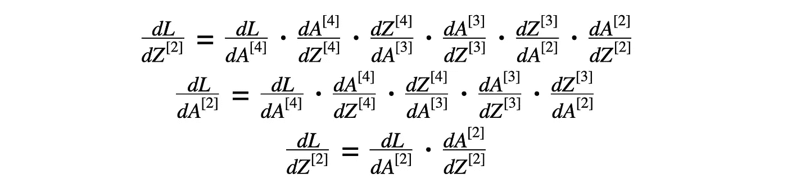

**Equation 9\.** The derivatives for the second layer

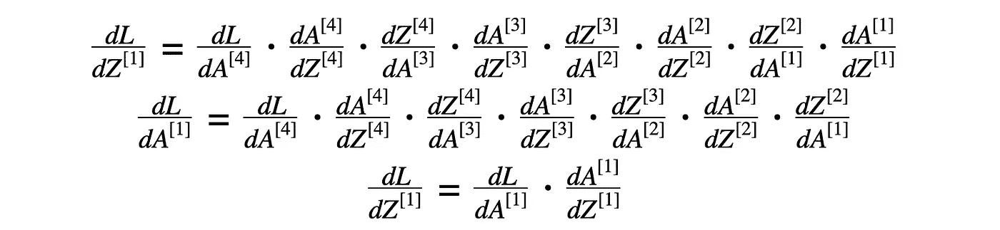

**Equation 10\.** The derivatives for the first layer

总的想法是:

来自 lᵗʰ层的损失函数相对于 z 的导数有助于计算来自 l-1)ᵗʰ层(前一层)的损失函数相对于 a 的导数。然后将结果与激活函数的导数一起使用。

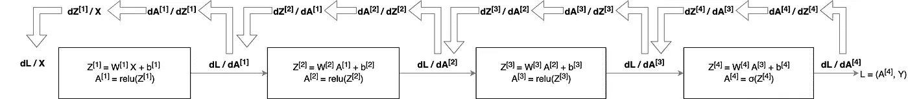

**Figure 4.** Backward propagation for our example neural network

**Snippet 5.** Backward propagation module

## 更新参数

该函数的目标是使用梯度优化来更新模型的参数。

**Snippet 6.** Updating parameters values using gradient descent

## 全模型

神经网络模型的完整实现由片段中提供的方法组成。

**Snippet 7.** The full model of the neural network

为了进行预测，您只需要使用接收到的权重矩阵和一组测试数据运行一个完整的前向传播。

您可以修改**片段 1** 中的 *nn_architecture* 来构建一个具有不同层数和隐藏层大小的神经网络。此外，准备激活函数及其派生函数的正确实现(**片段 2** )。实现的函数可以用来修改**片段 3** 中的*linear _ activation _ forward*方法和**片段 5** 中的*linear _ activation _ backward*方法。

# 进一步的改进

如果训练数据集不够大，您可能会面临“过拟合”问题。这意味着学习过的网络不会归纳出它从未见过的新例子。你可以使用**正则化**方法，比如 **L2 正则化**(它包括适当修改你的
代价函数)或者**丢弃**(它在每次迭代中随机关闭一些神经元)。

我们使用**梯度下降**来更新参数并最小化成本。您可以学习更高级的优化方法，这些方法可以加快学习速度，甚至让您获得更好的成本函数最终值，例如:

*   小批量梯度下降
*   动力
*   Adam 优化器

# 参考资料:

[1][https://www . coursera . org/learn/neural-networks-deep-learning](https://www.coursera.org/learn/neural-networks-deep-learning)

[https://www.coursera.org/learn/deep-neural-network](https://www.coursera.org/learn/deep-neural-network)

[3][https://ml-cheatsheet.readthedocs.io/en/latest/index.html](https://ml-cheatsheet.readthedocs.io/en/latest/index.html)

[4][https://medium . com/forward-artificial-intelligence/one-Lego-at-a-time-explain-the-math-of-how-neural-networks-learn-implementation-from scratch-39144 a1cf 80](https://medium.com/towards-artificial-intelligence/one-lego-at-a-time-explaining-the-math-of-how-neural-networks-learn-with-implementation-from-scratch-39144a1cf80)

[5][https://towards data science . com/gradient-descent-in-a-shell-EAF 8c 18212 f 0](/gradient-descent-in-a-nutshell-eaf8c18212f0)

[6][https://medium . com/datadriveninvestor/math-neural-network-from-scratch-in-python-d6da 9 f 29 ce 65](https://medium.com/datadriveninvestor/math-neural-network-from-scratch-in-python-d6da9f29ce65)

[7][https://towards data science . com/how-to-build-your-own-your-own-neural-network-from scratch-in-python-68998 a08e 4 F6](/how-to-build-your-own-neural-network-from-scratch-in-python-68998a08e4f6)