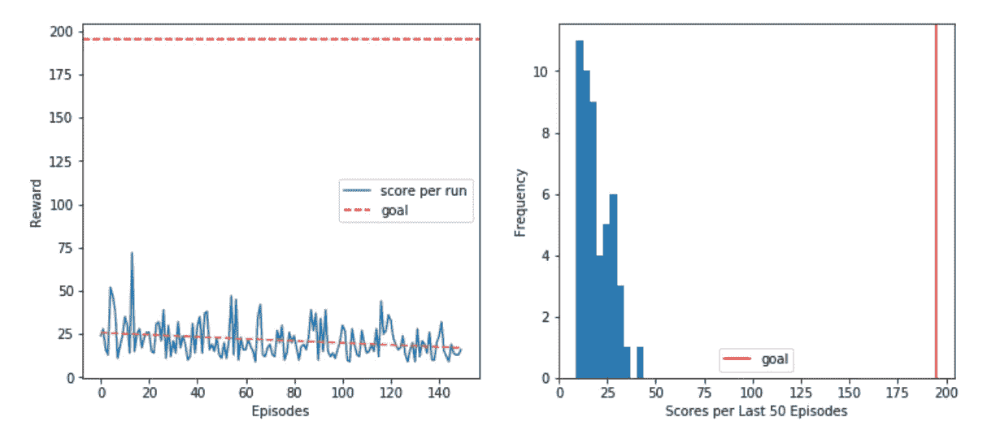
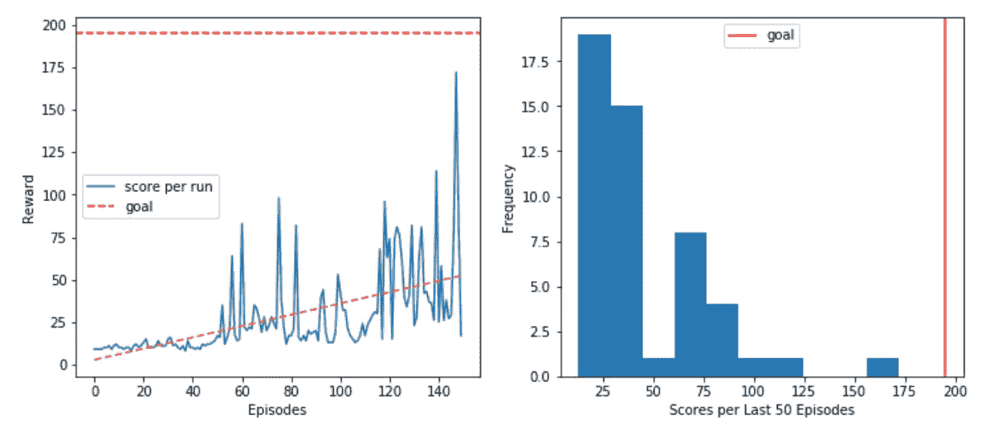
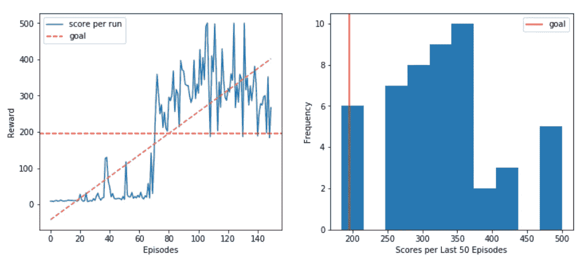
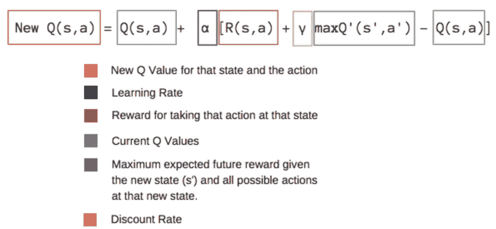
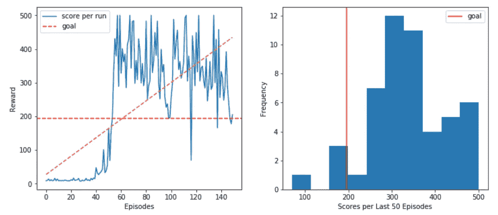
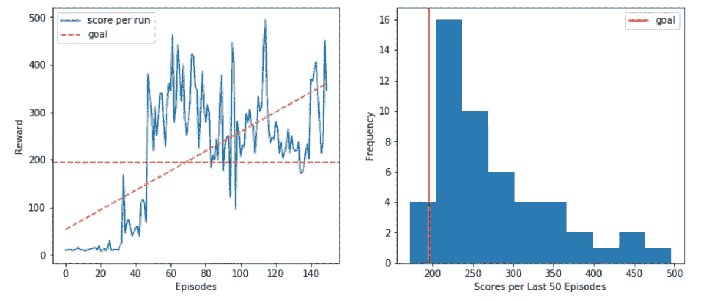

# 用于横竿的深度 Q 学习

> 原文：<https://towardsdatascience.com/deep-q-learning-for-the-cartpole-44d761085c2f?source=collection_archive---------5----------------------->

这篇文章的目的是介绍深度 Q 学习的概念，并用它来解决 OpenAI 健身房的 CartPole 环境。

该员额将由以下部分组成:

1.  开放式人工智能健身房环境介绍
2.  随机基线策略
3.  深度 Q 学习
4.  具有重放记忆的深度 Q 学习
5.  双重深度 Q 学习
6.  软更新

## 环境

[横拉杆环境](https://gym.openai.com/envs/CartPole-v0/)由一根沿无摩擦轨道移动的杆子组成。通过对推车施加+1 或-1 的力来控制该系统。钟摆开始直立，目标是防止它翻倒。状态空间由四个值表示:小车位置、小车速度、磁极角度和磁极尖端的速度。动作空间由两个动作组成:向左移动或向右移动。杆保持直立的每个时间步长提供+1 的奖励。当柱子偏离垂直方向超过 15 度，或者手推车偏离中心超过 2.4 个单位时，该集结束。

下面的单元格绘制了环境中的一组示例帧:

```
# Demonstration
env = gym.envs.make("CartPole-v1")def get_screen():
    ''' Extract one step of the simulation.'''
    screen = env.render(mode='rgb_array').transpose((2, 0, 1))
    screen = np.ascontiguousarray(screen, dtype=np.float32) / 255.
    return torch.from_numpy(screen)# Speify the number of simulation steps
num_steps = 2# Show several steps
for i in range(num_steps):
    clear_output(wait=True)
    env.reset()
    plt.figure()
    plt.imshow(get_screen().cpu().permute(1, 2, 0).numpy(),
               interpolation='none')
    plt.title('CartPole-v0 Environment')
    plt.xticks([])
    plt.yticks([])
    plt.show()
```

根据剧集的数量，输出如下所示:

Untrained Agent

正如我们所看到的，代理还没有经过训练，所以它只能走几步。我们将很快探讨一些能显著提高性能的策略。但是首先，让我们定义绘图函数，它将帮助我们分析结果:

```
def plot_res(values, title=''):   
    ''' Plot the reward curve and histogram of results over time.'''
    # Update the window after each episode
    clear_output(wait=True)

    # Define the figure
    f, ax = plt.subplots(nrows=1, ncols=2, figsize=(12,5))
    f.suptitle(title)
    ax[0].plot(values, label='score per run')
    ax[0].axhline(195, c='red',ls='--', label='goal')
    ax[0].set_xlabel('Episodes')
    ax[0].set_ylabel('Reward')
    x = range(len(values))
    ax[0].legend()
    # Calculate the trend
    try:
        z = np.polyfit(x, values, 1)
        p = np.poly1d(z)
        ax[0].plot(x,p(x),"--", label='trend')
    except:
        print('')

    # Plot the histogram of results
    ax[1].hist(values[-50:])
    ax[1].axvline(195, c='red', label='goal')
    ax[1].set_xlabel('Scores per Last 50 Episodes')
    ax[1].set_ylabel('Frequency')
    ax[1].legend()
    plt.show()
```

最终的剧情由两个支线剧情组成。第一个图显示了代理在一段时间内累积的总奖励，而另一个图显示了代理在过去 50 集的总奖励的直方图。当我们分析我们的策略时，我们会看到一些图表。

## 基线随机模型

在实现任何深度学习方法之前，我写了一个简单的策略，其中动作是从动作空间中随机采样的。这种方法将作为其他策略的基线，并使其更容易理解如何使用开放的人工智能健身房环境与代理合作。

```
def random_search(env, episodes, 
                  title='Random Strategy'):
    """ Random search strategy implementation."""
    final = []
    for episode in range(episodes):
        state = env.reset()
        done = False
        total = 0
        while not done:
            # Sample random actions
            action = env.action_space.sample()
            # Take action and extract results
            next_state, reward, done, _ = env.step(action)
            # Update reward
            total += reward
            if done:
                break
        # Add to the final reward
        final.append(total)
        plot_res(final,title)
    return final
```

一个环境步骤返回几个值，比如`next_state`、`reward`，以及模拟是否为`done`。下图显示了 150 集(模拟运行)的总累积奖励:



Random Strategy

上面的图展示了随机策略。不出所料，用这种方法解决环境问题是不可能的。代理没有从他们的经验中学习。尽管有时很幸运(获得差不多 75 的奖励)，但他们的平均表现低至 10 步。

## 深度 Q 学习

Q-learning 背后的主要思想是我们有一个函数𝑄:𝑆𝑡𝑎𝑡𝑒×𝐴𝑐𝑡𝑖𝑜𝑛→ℝ，它可以告诉代理什么行为会导致什么回报。如果我们知道𝑄的价值，我们就有可能制定一个最大化回报的政策:

𝜋(𝑠)=argmax𝑎 𝑄(𝑠,𝑎)

然而，在现实世界中，我们无法获得全部信息，这就是为什么我们需要想出近似𝑄.的方法一种传统的方法是创建一个查找表，其中𝑄的值在代理的每个动作之后被更新。然而，这种方法很慢，并且不能扩展到大的动作和状态空间。由于神经网络是通用函数逼近器，我将训练一个可以逼近𝑄.的网络

DQL 类的实现包括一个在 PyTorch 中实现的简单神经网络，它有两个主要的方法——预测和更新。网络将代理的状态作为输入，并返回每个动作的𝑄值。代理选择最大𝑄值来执行下一个操作:

```
class DQL():
    ''' Deep Q Neural Network class. '''
    def __init__(self, state_dim, action_dim, hidden_dim=64, lr=0.05):
            self.criterion = torch.nn.MSELoss()
            self.model = torch.nn.Sequential(
                            torch.nn.Linear(state_dim, hidden_dim),
                            torch.nn.LeakyReLU(),
                            torch.nn.Linear(hidden_dim, hidden_dim*2),
                            torch.nn.LeakyReLU(),
                            torch.nn.Linear(hidden_dim*2, action_dim)
                    )
            self.optimizer = torch.optim.Adam(self.model.parameters(), lr)def update(self, state, y):
        """Update the weights of the network given a training sample. """
        y_pred = self.model(torch.Tensor(state))
        loss = self.criterion(y_pred, Variable(torch.Tensor(y)))
        self.optimizer.zero_grad()
        loss.backward()
        self.optimizer.step()def predict(self, state):
        """ Compute Q values for all actions using the DQL. """
        with torch.no_grad():
            return self.model(torch.Tensor(state))
```

q_learning 函数是后面所有算法的主循环。
它有许多参数，即:

- `env`代表我们要解决的开放 Ai 健身房环境(CartPole。)
- `episodes`代表我们想玩的游戏数量。
- `gamma`是一个贴现因子，乘以未来奖励，以抑制这些奖励对代理人的影响。它的目的是让未来的奖励不如眼前的奖励有价值。
- `epsilon`表示随机行动相对于行动者在事件中积累的现有“知识”所告知的行动的比例。这种策略被称为“贪婪搜索策略”在玩游戏之前，代理没有任何经验，因此通常会将 epsilon 设置为较高的值，然后逐渐降低其值。
- `eps_decay`表示代理学习时ε减小的速度。0.99 来自最初的 DQN 论文。

稍后当我们到达相应的代理时，我将解释其他参数。

```
def q_learning(env, model, episodes, gamma=0.9, 
               epsilon=0.3, eps_decay=0.99,
               replay=False, replay_size=20, 
               title = 'DQL', double=False, 
               n_update=10, soft=False):
    """Deep Q Learning algorithm using the DQN. """
    final = []
    memory = []
    for episode in range(episodes):
        if double and not soft:
            # Update target network every n_update steps
            if episode % n_update == 0:
                model.target_update()
        if double and soft:
            model.target_update()

        # Reset state
        state = env.reset()
        done = False
        total = 0

        while not done:
            # Implement greedy search policy
            if random.random() < epsilon:
                action = env.action_space.sample()
            else:
                q_values = model.predict(state)
                action = torch.argmax(q_values).item()

            # Take action and add reward to total
            next_state, reward, done, _ = env.step(action)

            # Update total and memory
            total += reward
            memory.append((state, action, next_state, reward, done))
            q_values = model.predict(state).tolist()

            if done:
                if not replay:
                    q_values[action] = reward
                    # Update network weights
                    model.update(state, q_values)
                breakif replay:
                # Update network weights using replay memory
                model.replay(memory, replay_size, gamma)
            else: 
                # Update network weights using the last step only
                q_values_next = model.predict(next_state)
                q_values[action] = reward + gamma *       torch.max(q_values_next).item()
                model.update(state, q_values)state = next_state

        # Update epsilon
        epsilon = max(epsilon * eps_decay, 0.01)
        final.append(total)
        plot_res(final, title)
    return final
```

最直接的代理基于其最近的观察更新其 Q 值。它没有任何记忆，但它通过首先探索环境，然后逐渐降低其ε值来做出明智的决定。让我们来评估这样一个代理的性能:



Deep Q Learning

上图显示代理的性能有了显著的提高。它达到了 175 步，正如我们之前看到的，这对于一个随机的代理人来说是不可能的。趋势线也是正的，我们可以看到性能随着时间的推移而增加。同时，代理在 150 个纪元后没有成功达到目标线以上，其平均性能仍在 15 步左右，因此有足够的改进空间。

## 重放记忆

一次使用一个样本的𝑄近似不是很有效。上面的图表很好地说明了这一点。与随机代理相比，网络设法实现了更好的性能。然而，它无法到达 195 级台阶的门槛线。我实现了经验重放，以提高网络稳定性，并确保以前的经验不会被丢弃，而是用于培训。

体验回放将代理的体验存储在内存中。成批的经验是从记忆中随机抽取的，并用于训练神经网络。这种学习包括两个阶段——获得经验和更新模型。重放的大小控制了用于网络更新的体验的数量。内存是一个数组，存储代理的状态、奖励和动作，以及动作是否完成游戏和下一个状态。

```
# Expand DQL class with a replay function.
class DQN_replay(DQN):
    def replay(self, memory, size, gamma=0.9):
        """ Add experience replay to the DQN network class. """
        # Make sure the memory is big enough
        if len(memory) >= size:
            states = []
            targets = []
            # Sample a batch of experiences from the agent's memory
            batch = random.sample(memory, size)

            # Extract information from the data
            for state, action, next_state, reward, done in batch:
                states.append(state)
                # Predict q_values
                q_values = self.predict(state).tolist()
                if done:
                    q_values[action] = reward
                else:
                    q_values_next = self.predict(next_state)
                    q_values[action] = reward + gamma * torch.max(q_values_next).item()targets.append(q_values)self.update(states, targets)
```



DQL with Replay

正如预期的那样，与只记住最后一个动作的神经网络相比，具有重放功能的神经网络似乎更加健壮和智能。大约 60 集之后，代理人设法达到了获奖门槛，并保持在这一水平。它还设法获得了可能的最高奖励——500 英镑。

## 双重深度 Q 学习

传统的深度 Q 学习往往会高估回报，导致训练不稳定，质量策略较低。让我们考虑 Q 值的等式:



The Bellman Equation. Source: [Link](https://www.freecodecamp.org/news/an-introduction-to-q-learning-reinforcement-learning-14ac0b4493cc/)

等式的最后一部分是对最大值的估计。这一程序导致系统性高估，从而引入最大化偏差。由于 Q-learning 涉及从估计中学习估计，这样的高估尤其令人担忧。

为了避免这种情况，我将定义一个新的目标网络。Q 值将取自这个新网络，这意味着反映主 DQN 的状态。然而，它没有相同的权重，因为它只在一定数量的集后更新。这个想法在 [Hasselt et al .，2015](https://dl.acm.org/citation.cfm?id=3016191) 中首次提出。
添加目标网络可能会降低训练速度，因为目标网络不会持续更新。然而，随着时间的推移，它应该具有更稳健的性能。

`q_learning`循环中的`n_update`指定更新目标网络的时间间隔。

```
class DQN_double(DQN):
    def __init__(self, state_dim, action_dim, hidden_dim, lr):
        super().__init__(state_dim, action_dim, hidden_dim, lr)
        self.target = copy.deepcopy(self.model)

    def target_predict(self, s):
        ''' Use target network to make predicitons.'''
        with torch.no_grad():
            return self.target(torch.Tensor(s))

    def target_update(self):
        ''' Update target network with the model weights.'''
        self.target.load_state_dict(self.model.state_dict())

    def replay(self, memory, size, gamma=1.0):
        ''' Add experience replay to the DQL network class.'''
        if len(memory) >= size:
            # Sample experiences from the agent's memory
            data = random.sample(memory, size)
            states = []
            targets = []
            # Extract datapoints from the data
            for state, action, next_state, reward, done in data:
                states.append(state)
                q_values = self.predict(state).tolist()
                if done:
                    q_values[action] = reward
                else:
                    # The only difference between the simple replay is in this line
                    # It ensures that next q values are predicted with the target network.
                    q_values_next = self.target_predict(next_state)
                    q_values[action] = reward + gamma * torch.max(q_values_next).item()targets.append(q_values)self.update(states, targets)
```



Double DQL with Replay

双 DQL 重放已经超过了以前的版本，并一直执行 300 步以上。由于动作选择和评估的分离，性能似乎也更加稳定。最后，让我们探索一下对 DQL 代理的最后修改。

## 软目标更新

上面实现的用于更新目标网络的方法在最初的 DQN 论文中介绍过。在本节中，我们将探索另一种完善的更新目标网络权重的方法。我们将在每次运行后使用以下公式递增地更新目标网络，而不是在一定数量的步骤后更新权重:

目标权重=目标权重*(1-τ)+模型权重*τ

其中 0 < TAU < 1

This method of updating the target network is known as “soft target network updates” and was introduced in [Lillicrap 等人，2016](https://arxiv.org/pdf/1509.02971.pdf) 。该方法的实现如下所示:

```
class DQN_double_soft(DQN_double):
    def target_update(self, TAU=0.1):
        ''' Update the targer gradually. '''
        # Extract parameters  
        model_params = self.model.named_parameters()
        target_params = self.target.named_parameters()

        updated_params = dict(target_params)for model_name, model_param in model_params:
            if model_name in target_params:
                # Update parameter
                updated_params[model_name].data.copy_((TAU)*model_param.data + (1-TAU)*target_params[model_param].data)self.target.load_state_dict(updated_params)
```



DDQL with Soft Update

具有软目标更新的网络表现相当好。但是，好像并不比硬权更新好。

这张 gif 图展示了一名训练有素的特工的表现:

Trained Agent

## 结论

经验重放和目标网络的实现显著提高了开放人工智能平台环境下深度 Q 学习代理的性能。对代理的一些其他修改，如决斗网络架构([王等，2015](https://arxiv.org/pdf/1511.06581.pdf) )，可以添加到该实现中，以提高代理的性能。该算法也可推广到其他环境。请随意测试它解决其他任务的能力！

笔记本链接:[https://github . com/ritakurban/Practical-Data-Science/blob/master/DQL _ 卡特波尔. ipynb](https://github.com/ritakurban/Practical-Data-Science/blob/master/DQL_CartPole.ipynb)

## 参考

(1)强化 Q——用 OpenAI Gym 在 Python 中从头学习。(2019).Learndatasci.com。检索于 2019 年 12 月 9 日，来自[https://www . learn data sci . com/tutorials/reinforcement-q-learning-scratch-python-open ai-gym/](https://www.learndatasci.com/tutorials/reinforcement-q-learning-scratch-python-openai-gym/)

(2)帕兹克，a .(2019)。强化学习(DQN)教程。检索自:[https://py torch . org/tutorials/intermediate/reinforcement _ q _ learning . html](https://pytorch.org/tutorials/intermediate/reinforcement_q_learning.html)

(3) Lillicrap，T. P .，Hunt，J. J .，Pritzel，a .，Heess，n .，Erez，t .，Tassa，y .，… & Wierstra，D. (2015)。深度强化学习的连续控制。arXiv 预印本 arXiv:1509.02971。

(4)范·哈瑟尔特(2016 年 3 月出版)。双 q 学习的深度强化学习。在第三十届 AAAI 人工智能会议上。

(5)王，z .，绍尔，t .，赫塞尔，m .，范哈瑟尔特，h .，兰托特，m .，&德弗莱塔斯，N. (2015)。用于深度强化学习的决斗网络架构。arXiv 预印本 arXiv:1511.06581。

(6)双 DQN 实现解决 OpenAI 健身房的横撑 v-0。(2019).中等。检索于 2019 年 12 月 20 日，来自[https://medium . com/@ Leo Simmons/double-dqn-implementation-to-solve-open ai-gyms-cart pole-v-0-df 554 CD 0614d](https://medium.com/@leosimmons/double-dqn-implementation-to-solve-openai-gyms-cartpole-v-0-df554cd0614d)