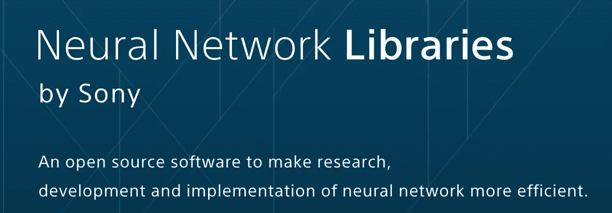

# 利用索尼的 NNabla 实现深度 Q 网络

> 原文：<https://towardsdatascience.com/deep-q-network-implementation-with-sonys-nnabla-490d945deb8e?source=collection_archive---------10----------------------->



# NNABLA 是什么？

索尼发布了[神经网络库](https://nnabla.org)，简称“NNabla”。

NNabla 是设备就绪的，通过有效的内存管理，具有快速的 GPU 训练速度。最有趣的特性是 NNabla 默认允许运行定义和运行定义。例如，定义并运行风格的代码如下所示。

```
# build static graph like tensorflow
x = nn.Variable((2, 3))
out = PF.affine(x, 10)# inference like sess.run
x.d = np.random.random((2, 3))
out.forward()
value = out.d
```

另一方面，由运行定义的样式可以写成这样。

```
with nn.auto_forward():
    x = nn.Variable.from_numpy_array(np.random.random(2, 3))
    out = PF.affine(x, 10)
value = out.d
```

更多示例代码可在[https://github.com/sony/nnabla-examples](https://github.com/sony/nnabla-examples)获得。

# NNABLA 中的深度强化学习

虽然索尼分享了许多监督学习实现，但没有任何深度强化学习(DRL)的例子。如果你曾经尝试过实现你自己的 DRL 代码，你知道有一些在监督学习中很少见到的技巧。

在本帖中，我将向您展示 Deep Q-Network (DQN)的实现，作为 DRL NNA bla 的第一步。完整的实现可在[这里](https://gist.github.com/takuseno/e648c3ebfc03b2f6f19709043b8fc69f)获得。超参数和实现细节遵循最初的 DQN，您可以将此代码用作学术论文的基线。

## q 函数

由于算法的概述在许多其他博客帖子中有解释，我们只关注神经网络部分。这是一个完整的神经网络定义。

我必须解释上面代码中的两个技巧。

## 参数同步(更新目标)

如果熟悉 tensorflow，就知道参数同步可以用`tf.assign`来写。但是，NNabla 目前在图形定义中没有参数赋值。要做到这一点，你必须直接操纵变量。

```
# copy source variable to destination variable
variable_dst.data.copy_from(variable_src.data)
```

`data`属性表示参数的引用。您可以通过该属性访问和操作它们。

由于我通常是一个 tensorflow 程序员，我真的希望`tf.assign`实现这种行为。最终我提交了一个 [pull 请求](https://github.com/sony/nnabla/pull/244)让 NNabla `F.assign`函数。

## 渐变剪辑(序列)

为了避免参数变化太大，在 DQN 中使用了剪辑渐变。实际上，NNabla 有`F.clip_grad_by_norm`功能，但不清楚如何使用，因为关于这方面的文档较少。所以，我实现了如下。

```
grad = 10.0 * variable.grad / np.sqrt(np.sum(variable.g ** 2))
variable.grad = grad
```

`10.0`是超参数尺寸。你也可以像`data`属性一样访问渐变。在更新参数之前，您可以直接裁剪渐变。

# 结论

我用 NNabla 展示了 DQN 的例子，它也展示了你可以用 NNabla 编写你自己的代码。如果你在 GPU 机器上运行全部代码，你可能会注意到它的速度。在大多数情况下，由于良好的内存管理架构，NNabla 是最快的。此外，索尼报告了用 2176 个 GPU 进行最快的 ImageNet 训练。此外，NNabla 提供了简单的 Python APIs，如果你已经在其他库中编写了深度学习算法，你可以在一分钟内编写自己的代码。特别是，NNabla 针对嵌入式设备进行了优化。如果你对边缘深度学习感兴趣，NNabla 将是一个不错的选择。