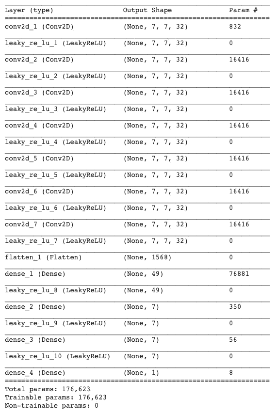
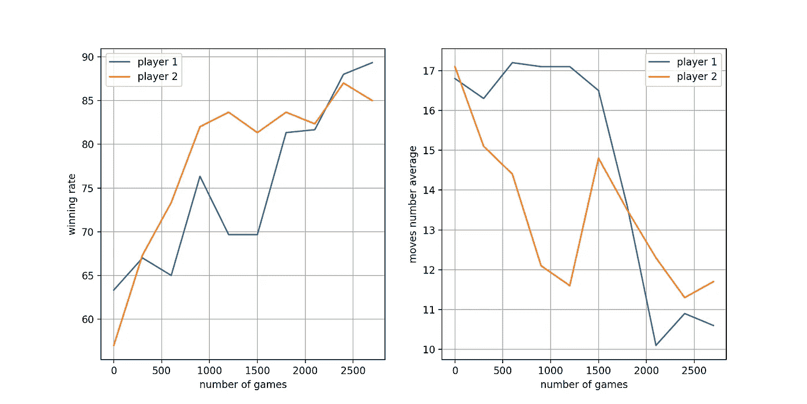
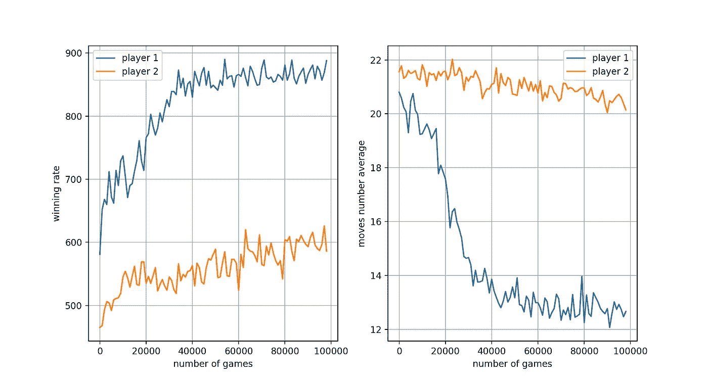
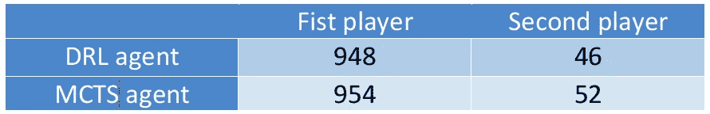

# 使用 Connect 4 进行深度强化学习和蒙特卡罗树搜索

> 原文：<https://towardsdatascience.com/deep-reinforcement-learning-and-monte-carlo-tree-search-with-connect-4-ba22a4713e7a?source=collection_archive---------5----------------------->

在之前的[文章](/reinforcement-learning-and-deep-reinforcement-learning-with-tic-tac-toe-588d09c41dda)中，我写了如何使用 TD(0)算法实现井字游戏的强化学习代理。我实现了两种代理。第一个是表格强化学习代理，这意味着价值函数存储为一个表，该表包含游戏中存在的最佳策略的每个状态的所有值(在算法迭代期间学习)。因为游戏的状态少于 6000 个，所以可以存储所有的值。第二个实现是深度强化学习代理，这意味着我们不是将所有值保存在一个表中，而是训练一个神经网络来预测给定状态的值。这种方法更加通用和鲁棒，因为网络可以学习相似性，如状态空间中的平移或反射。

在这篇文章中，我想更进一步，尝试实现一个学习如何玩游戏 Connect 4 的代理。游戏包含一个 7 列 6 行的棋盘。每个玩家在他的回合中选择一列并从顶部丢一个彩色圆盘到最低的空位。第一个在水平、垂直或对角线上有四个相同颜色的圆盘的人获胜。Connect 4 远比井字游戏复杂，因为它有超过 10 个⁴状态。在这篇文章中，我将描述两种不同的方法。第一种方法是著名的深度 Q 学习算法或 DQL，第二种是蒙特卡罗树搜索(或 MCTS)。

# **深度 Q 学习**

让我们首先定义我们的马尔可夫过程。正如在上一篇文章中，学习过程将是特定于每个玩家的，第一个或第二个，他们之间没有混合。这是因为它们具有不同的状态空间(例如，空棋盘在第一个玩家的状态空间中，而不在第二个玩家的状态空间中):

1.  状态空间是每个玩家看到的所有状态。对于第一个玩家来说，它包括所有具有偶数个盘的板，而对于第二个玩家来说，它包括所有具有奇数个盘的板。
2.  行动空间是玩家可以玩的每一栏的数字 1-7。
3.  赢了奖励 1 分，输了奖励 1 分，平手奖励 0.5 分，否则奖励 0 分。

这里要注意的是，像每一个双人游戏一样，下一个状态不是由所采取的行动决定的，因为它也取决于对手的行动。两种状态之间的转换概率取决于玩家和对手的策略。

学习与初学者对战和学习与职业玩家对战是不一样的，因为转移概率是不同的。我将在文章中进一步讨论后者。

目标是学习 Q 函数:一个将状态-动作对映射到一个值的函数，该值表示每个玩家在特定状态下玩这个动作后将获得的未来奖励的预期平均值(实际上这并不完全正确，因为 Q 函数是在该动作之后的特定策略下定义的，但是 Q 学习算法收敛了最优策略的值)。在我们学习了 Q 函数之后，我们将选择玩使这个值最大化的动作。

q 函数的域包含超过 7*10 个⁴(超过 10 个⁴国家的 7 个可能的动作)，并将它们映射到-1 到 1 之间的数字(奖励范围)。为了表示这个函数，我们将使用 CNN。

CNN 的输入将是一个矩阵 7*7，其中第一行是与动作相对应的一个热点向量，其他 6 行是状态表示，其中 1，-1 和 0 分别是玩家的盘、对手的盘或空点。

下图描述了该网络:

其中第一个卷积层的核选择为 5，其余卷积层的核选择为 4(对我来说选择 4 似乎是合理的，因为玩家需要连续 4 次才能获胜)。

根据 Q 学习算法计算目标:

> *Q(s，a) = Q(s，a)+α(max(Q(s’，a’)+*g*R-Q(s，a))*

其中 Q 是 Q 函数， *s* 是状态， *a* 是动作， *α* 是学习率， *R* 是奖励， *g* 是折扣因子。

关于学习过程的几点注意事项:

1.  我发现有计划的离线学习比在线学习效果更好。离线学习意味着成批的状态-动作对被存储，并且网络在这些成批的状态-动作对上被训练。我用了 300 个游戏的批次。规划意味着每一批都被训练了不止一次，而目标在每个时期都被重新计算。我使用了大约 5 个时期进行批处理。
2.  博弈策略是一个贪婪策略，这意味着选择了探索因子 e。该因子根据所学习的 Q 函数来定义采取随机移动或最优移动的机会。该因子在训练期间下降。开始的时候我想鼓励探索，而后来我想学习和越来越多的优秀选手比赛。然而，偶尔我会增加探索系数，因为以下原因:我发现第一个玩家很快就会知道最好的第一步是在中间走，所以第二个玩家主要(当探索系数很小时)学会如何对付“中间的第一步”，而没有其他选择。为了解决这个问题(以及其他类似的问题),我偶尔会增加探索系数。
3.  在第一次训练尝试中，我使用 ReLu 函数作为激活函数。我发现网络学习得不是很好，因为训练集有很多零标签样本，而 ReLu 函数学习起来很容易输出零。我用 LeakyReLu 函数替换了它，获得了更好的结果。
4.  为了测试代理，我让它对着随机播放器播放了 300 集，测量了胜率。不到 2000 集就达到了 80%以上的成功率，但当我试图对抗它时，我很容易就赢了。后来，我通过让代理与固定代理竞争来测试学习，并测量了胜率。
5.  最后我找到了一个很好的代理人。这不是一个超人的水平，但仍然很难击败它(你可以自己尝试)。
6.  下图显示了 Q 代理在学习过程开始时相对于随机玩家的胜率。它还显示了平均 300 场比赛中每场比赛的平均移动次数。我们可以看到，随着胜率的增加，移动的次数减少，这表明代理人学会了赢，而且赢得很快。

DRL agent

**蒙特卡洛树搜索**

作为一种完全不同的方法，我使用蒙特卡罗树搜索算法或 MCTS 实现了一个代理。

这种算法背后的想法是创建一个博弈树，但不是探索所有可能的博弈，而是只选择最有希望的路线。树中的每个节点存储 2 个值:该节点被访问的次数，以及玩家访问该节点时赢得的胜利数。该算法包含重复多个情节的 4 个步骤。

1.  选择——您从根——状态开始，并选择一个子——移动。我用置信上限(UCB1)来选择一个孩子。对于每个孩子，我计算了表达式: *w/n+ c*sqrt(ln(N)/n)* 其中 *w* 是获胜的次数， *n* 是节点被访问的次数， *N* 是父节点被访问的次数， *c* 是在探索和利用之间平衡的因子。这是 MCTS 最重要的一点。选择最有希望的子节点，探索的机会很小。
2.  展开—当您到达一个节点，其中有尚未访问的子节点时，随机选取一个节点并展开树。
3.  模拟-玩随机模拟，直到游戏结束。
4.  反向传播—反向传播到所有被访问的节点，访问次数增加 1，如果您获胜，获胜次数增加 1。

关于 MCTS 学习过程的几点说明:

1.  代理要比 Q 学习代理多学很多集，但是学的快很多。在我的电脑上(不是很好的一台)，100 多万集要学几个小时。
2.  为了方便起见，每个玩家都有自己的树，尽管两棵树共享相同的信息。我发现这样做更严谨，而且与其他类型的智能体(例如 Q 学习智能体或随机智能体)进行游戏和学习更灵活。
3.  存储一个 100 万集的树需要大约 800MB，并且当代理继续学习时它还在增长。所以它比 CNN 要大得多，CNN 在整个学习过程中保持不变。
4.  下图显示了随着学习的进行，MCTS 代理相对于随机玩家的胜率。

MCTS agent

# **关于代码**

我试图尽可能通用地实现代码。代码包含 4 种类型的类。

1.  游戏类，包含了双人游戏的所有基础知识。特定的游戏类继承自这个类。我实现了 Connect 4 和 Tic-Tac-Toe 类。游戏类声明了所有需要在特定游戏类中实现的功能。
2.  一个 Q 代理类——包含了一个双人游戏代理的所有基本功能。connect 4 Q 学习代理继承自该类。
3.  模型类-包含神经网络模型和所有相关函数。
4.  MCTS 代理类——类似于 Q 代理类，但方法不同

如果你愿意，你可以通过只实现父类的已声明的未实现的函数来使用这个代码作为其他游戏或其他代理的框架。

# **总结**

我们在这篇文章中看到了如何训练代理学习玩 Connect 4。尽管 Connect 4 有比 10⁴更多的可能状态，这意味着可能每一个玩过的游戏都是独一无二的，代理们学会了归纳并玩得很好。Q 代理玩家通过学习不同状态之间的相似性来学习归纳，而 MCTS 代理学习采取最有希望的路径。

我们现在可以尝试让两个代理相互竞争:

从结果中我们可以看到，第一个玩家在大多数情况下都是赢的，也就是说虽然看起来不是那样，但是第一个玩家有很大的优势。

原代码可以在[这里找到](https://github.com/giladariel/Connect4)

感谢您的阅读，如果您发现我的代码中有任何错误，请告诉我，我会修复它，如果您喜欢这篇文章，请鼓掌，如果您有问题，我将非常乐意回答。