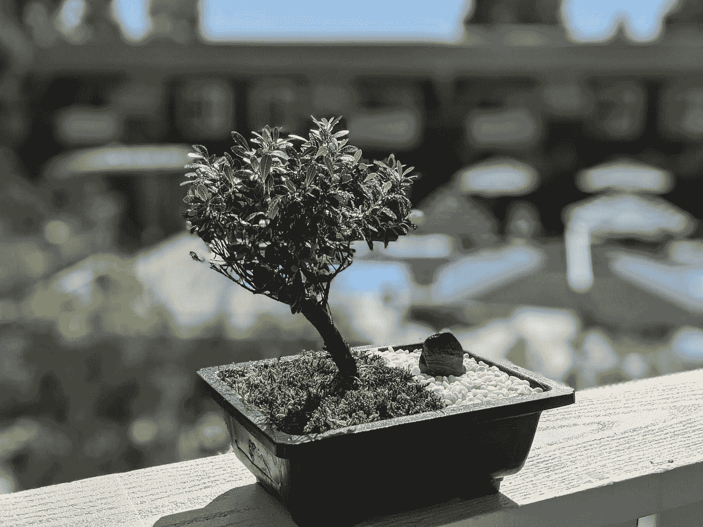
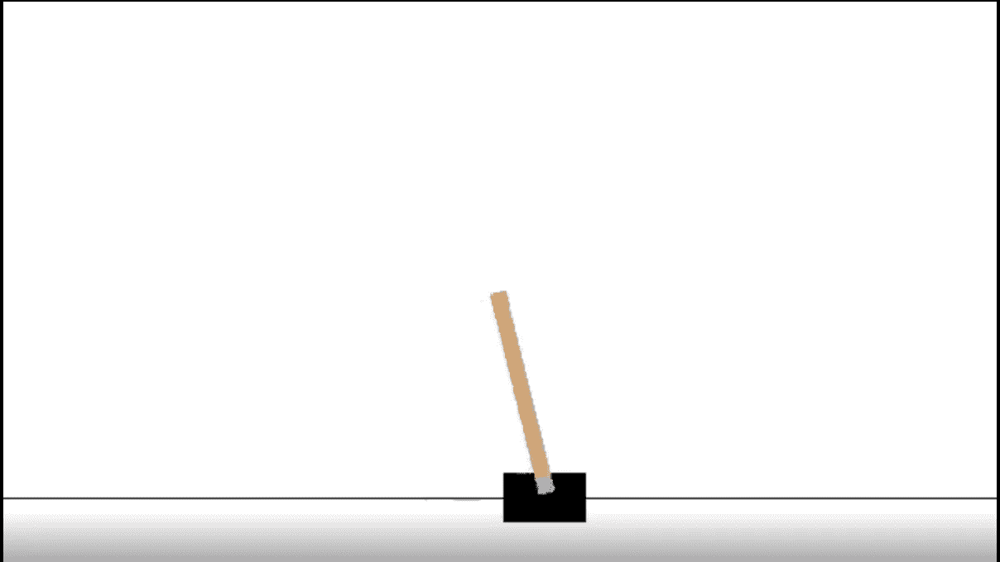
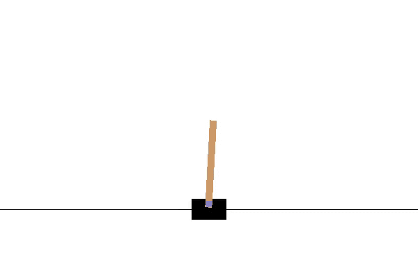
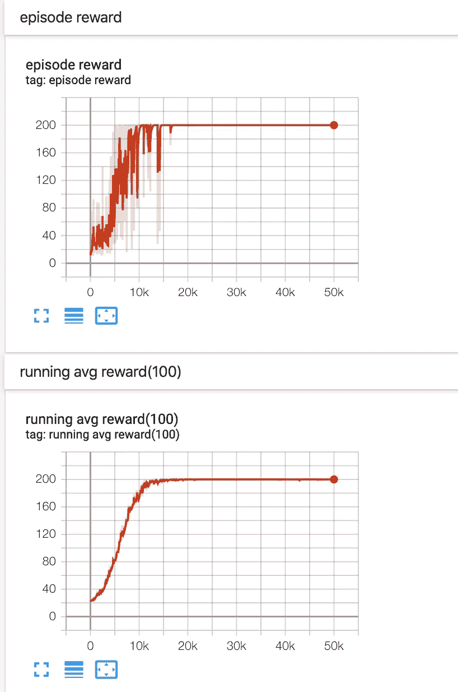

# 深度强化学习:建立一个深度 Q 网络(DQN)来玩钢管舞

> 原文：<https://towardsdatascience.com/deep-reinforcement-learning-build-a-deep-q-network-dqn-to-play-cartpole-with-tensorflow-2-and-gym-8e105744b998?source=collection_archive---------1----------------------->

Photo by the author

在本教程中，我将向您介绍如何训练一个深度 Q-net(DQN)模型来玩掷骰子游戏。我们会用 OpenAI 的健身房和 TensorFlow 2。本文假设您对强化学习和深度学习有所了解。

# 什么是强化学习和 DQN？

让我们从强化学习和 DQN 算法的快速复习开始。强化学习是机器学习的一个领域，它专注于训练**代理**在**环境**中在某些**状态**采取某些**动作**，以最大化**回报**。比方说我想做一个打扑克的机器人(代理)。该机器人将与其他机器人在有筹码和卡片的扑克桌上玩(环境)。这个机器人应该能够根据桌上的牌、手里的牌和其他机器人的下注(状态)来弃牌或下注(行动)。机器人想要最大化它赢得游戏的筹码数量(奖励)。

DQN 是一种强化学习算法，其中建立了一个深度学习模型，以找到代理在每个状态下可以采取的行动。

# 技术定义

RL 的基本术语包括但不限于:**当前状态*【s】*****下一步状态*【s’】*****动作*【a】*****政策*【p】*****奖励*【r】***。**状态-动作-值函数 *(Q(s，a))*** 是一个主体从当前状态开始的期望总报酬，其输出称为 **Q 值**。正如我所说的，我们的目标是在状态*【s】*选择某个动作*【a】*，以最大化回报，或 Q 值。

DQN 是深度学习和强化学习的结合。模型目标是逼近 *Q(s，a)* ，并通过反向传播进行更新。假设 *Q(s，a)* 的近似值为 y(hat ),损失函数为 L，我们有:

预测: ***y(hat) = f(s，θ)***

损耗: ***L(y，y(hat)) = L(Q(s，a)，f(s，θ))***

在反向传播过程中，我们对损失函数求θ的偏导数，以找到使损失最小的θ值。因为这是监督学习，你可能想知道如何找到基本事实 *Q(s，a)。*答案是用贝尔曼方程。

贝尔曼方程: ***Q(s，a)= max(r+Q(s’，a))***

在哪里

***Q(s’，a)= f(s’，θ)*** ，如果 ***s*** 不是**终端状态**(最后一步的状态)

***Q(s '，a) = 0*** ，如果 ***s*** 则为终端状态

我们可以看到，当 ***s*** 为终态时， ***Q(s，a) = r.*** 因为我们是用模型预测 *f(s '，θ)* 来逼近 *Q(s '，a)*的真实值，我们把这个叫做半梯度。正如你可能已经意识到的，使用半梯度的一个问题是，模型更新可能非常不稳定，因为每次模型更新时，真实的目标都会改变。解决方案是创建一个**目标网络**，其中本质上是在特定时间步骤的训练模型的副本，因此目标模型更新不太频繁。

该模型的另一个问题是过度拟合。当我们在每局结束后更新模型时，我们已经潜在地玩了几百步，所以我们本质上是在做批量梯度下降。因为每一批总是包含一个完整游戏的步骤，模型可能无法很好地从中学习。为了解决这个问题，我们创建了一个**体验重放缓冲区**，它存储了几百个游戏的 *(s，s '，a，r)* 值，每次都从中随机选择一批来更新模型。

# 什么是横竿？

[CartPole](https://github.com/openai/gym/wiki/CartPole-v0) 是一种游戏，其中一根杆子通过一个未驱动的关节连接到一辆小车上，小车沿着无摩擦的轨道移动。钟摆开始直立，目标是通过增加和减少小车的速度来防止它倒下。单个状态由 4 个元素组成:小车位置、小车速度、磁极角度和磁极尖端的速度。

要移动杆子有两个动作:向左或向右移动。每走一步(包括终止一步)，它获得+1 奖励。当杆倒下时，游戏结束，即当杆角度大于 12°，或手推车位置大于 2.4°(手推车的中心到达显示器的边缘)。新的健身房版本也有一个长度限制，当剧集长度超过 200 集时就会终止游戏。

# 履行

完整的代码是[这里是](https://github.com/VXU1230/reinforcement_learning)。

## 1.构建 tf.keras 模型类

我们先在 TensorFlow 中实现深度学习神经网络模型 *f(s，θ)* 。在 TF2，急切执行是默认模式，因此我们不再需要先创建操作，然后在会话中运行它们。另外，TF2 在`tf.function()`提供亲笔签名。有两种方法可以实例化一个模型。更简单的方法是通过链接 Keras 层来指定模型的正向传递，并从输入和输出创建模型。然而，为了训练更复杂和定制的模型，我们需要通过子类化 Keras 模型来构建模型类。更多详情，请见[此处](https://www.tensorflow.org/alpha/guide/effective_tf2)。

在 MyModel 类中，我们在`__init__`中定义了所有层，并在`call().`中实现了模型的向前传递。注意，输入形状是【批量大小，状态大小(本例中为 4)】,输出形状是【批量大小，动作数量(本例中为 2)】。本质上，我们向模型提供状态，并输出在每个状态下采取每个动作的值。`call()` 的`@tf.function` 注释支持自动签名和自动控制依赖。

## 2.构建主 DQN 模型类

主 DQN 类是创建、调用和更新深度 Q-net 模型的地方。我们刚刚建立的神经网络模型是深度 Q-net 模型的一部分。

在`__init__()`中，我们定义了梯度下降的动作数量、批量大小和优化器。折扣因子γ是一个介于 0 和 1 之间的值，在下一步乘以 Q 值，因为代理人更不关心遥远未来的回报，而不是眼前的回报。我们还将 MyModel 初始化为实例变量`self.mode`，并创建体验回放缓冲区`self.experience.`，代理不会开始学习，除非缓冲区的大小大于`self.min_experience`，一旦缓冲区达到最大大小`self.max_experience`，它将删除最早的值，为新值腾出空间。

实例方法`predict()`接受单个状态或一批状态作为输入，运行`self.model`的正向传递并返回模型结果(动作的逻辑)。请注意，tf.keras 模型默认将输入识别为批处理，因此我们希望确保输入至少有 2 个维度，即使它是单个状态。

在`train()`中，我们首先随机选择一批 *(s，s’，a，r)* 值，用布尔 *done* 表示当前状态 *(s)* 是否为终止状态。然后我们调用`predict()`来获得下一个状态的值。注意，我们在这里使用复制的目标网络来稳定这些值。接下来，我们从贝尔曼函数中得到地面真值。如前所述，如果 state *(s)* 是终端状态，target *Q(s，a)* 只是奖励 *(r)。*在`tf.GradientTape()`内，我们计算真实目标和预测的均方损失。因为我们没有使用内置的损失函数，所以我们需要使用`tf.one_hot()`手动屏蔽逻辑。一旦我们得到损失张量，我们就可以使用方便的 TensorFlow 内置 ops 来执行反向传播。

RL 中的另一个重要概念是**ε贪婪**。ε是随时间衰减的 0 到 1 之间的值。这个想法是为了平衡探索和开发。当模型在开始时不太精确时，我们希望通过选择随机动作来探索更多，所以我们选择更大的ε。随着我们从玩游戏中收集更多的数据，我们逐渐衰减ε来更多地利用模型。ε-greedy 的实现在`get_action()`。

在`add_experience()`和`copy_weights()`中，我们实现了前面提到的**经验回放缓冲**和**目标网络**技术。每次我们从玩游戏中收集新数据时，我们会将数据添加到缓冲区，同时确保它不会超过定义为`self.max_experiences`的限制。我们将创建 DQN 类的两个实例:一个训练网和一个目标网。当训练网络用于更新权重时，目标网络仅执行两个任务:在下一步骤*Q(s’，a)* 预测值，以供训练网络在`train()`中更新，以及从训练网络复制权重。

## 3.玩游戏

终于可以玩游戏了！

让我们通过向`play_game()`函数传递 5 个参数来开始游戏:健身房预定义的横竿环境、训练网、目标网、epsilon 和重量复制的间隔步数。在函数内部，我们首先重置环境以获得初始状态。然后我们创建一个循环来玩这个游戏，直到它到达终端状态。在循环内，我们ε-greedy 选择一个动作，移动一步，将 *(s，s '，a，r)* 和 *done* 对添加到缓冲区，并训练模型。默认情况下，环境总是为每个时间步长提供+1 的奖励，但为了惩罚模型，我们在完成完整集之前，当奖励达到终止状态时，我们为奖励分配-200。`iter`记录我们在一场比赛中走了多少步，这样我们就可以在每一步`copy_step`将重量复制到目标网。游戏结束后，我们会返还全部奖励。

## 4.制作测试视频

训练完模型后，我们想看看它在横竿游戏中的实际表现。为此，我们简单地将 CartPole 环境包装在`wrappers.Monitor`中，并定义一个保存视频的路径。我们通过充分利用模型来玩游戏，游戏结束后会保存一段视频。

## 5.定义超参数和 Tensorboard 日志，并把一切放在一起

DQN 模型现在已经建立起来了，我们需要做的就是定义我们的超参数，为 Tensorboard 输出日志并训练模型。让我们看看这是如何在`main()`函数中实现的。

我们首先创建了体操侧身环境、训练网和目标网。然后，我们定义超参数和张量流摘要编写器。当前的超参数设置将在 15000 集后产生 200 的集奖励，这是当前 200 集长度内的最高奖励。然而，我们的模型很不稳定，进一步的超参数调整是必要的。

在 for 循环中，我们玩 50000 次游戏，随着玩游戏次数的增加而衰减ε。对于 Tensorboard 可视化，我们还跟踪每个游戏的奖励，以及窗口大小为 100 的运行平均奖励。最后我们通过调用`make_video()`做一个视频，关闭环境。

一旦测试完成，你应该可以在你指定的文件夹中看到这样的视频。

要启动 Tensorboard，只需输入`tensorboard --logdir *log_dir*(the path of your Tensorflow summary writer)`。

在您的终端(Mac)中，您将看到一个带有 Tensorflow 端口的本地主机 IP。点击它，您将能够在 Tensorboard 上查看您的奖励。

# 结论及对未来工作的建议

在本文中，我们了解到:

1.  强化学习和 DQN 算法:
2.  通过在 TF 2 中子类化 tf.keras.Model 来构建定制模型；
3.  用 tf 训练一个 tf.keras.Model。gradient . Tape()；
4.  在包装器中创建视频。监测以检验 DQN 模型；
5.  在 Tensorboard 上显示奖励。

但值得一提的是，由于自举、采样以及值函数逼近带来的不稳定性，DQN 并不能保证收敛。对 DQN 来说，横竿也是一个相对难学的环境。事实上，学习经常失败，上面显示的结果是在多次尝试后取得的。我很幸运地在 50k 个纪元内实现了收敛，但我怀疑这种情况每次都会发生。为了复制它，我强烈建议你至少运行几百万个纪元。

如果想要实现快速学习，可以使用较小的初始ε值，或者以较快的速率衰减。我当前的 epsilon 是 0.99，这意味着在 epsilon 衰减到一个很小的值之前，策略会渲染很长时间的随机动作。然而，ε的小初始值可能由于缺乏探索而导致学习陷入次优。

另一个重要的事实是，DQN 是一种偏离策略的算法，只要满足 [Robbins-Monro 算法](https://en.wikipedia.org/wiki/Stochastic_approximation)并且所有状态和动作已经被访问了无限次，Q 值甚至可以收敛于随机策略。因此，Q 值可能已经收敛，并准备在许多时代后用于预测，即使回报看起来并不完美。

为了使策略收敛，一旦值收敛，我们需要确保策略接近贪婪(ε接近 0)，这可以通过播放足够多的剧集来实现。

为了进一步改进，我鼓励你探索更多的模型结构(更多的层，卷积层，其他激活函数等)。)和超参数设置(目标净复制步长、经验大小、ε衰减值等。).

我希望你能从这篇文章中得到乐趣。:)